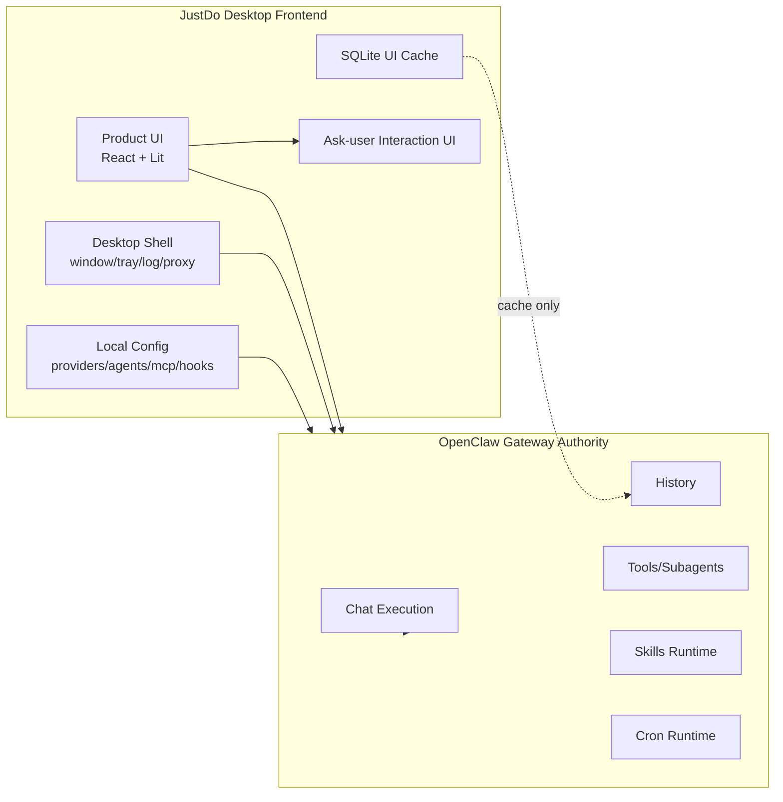
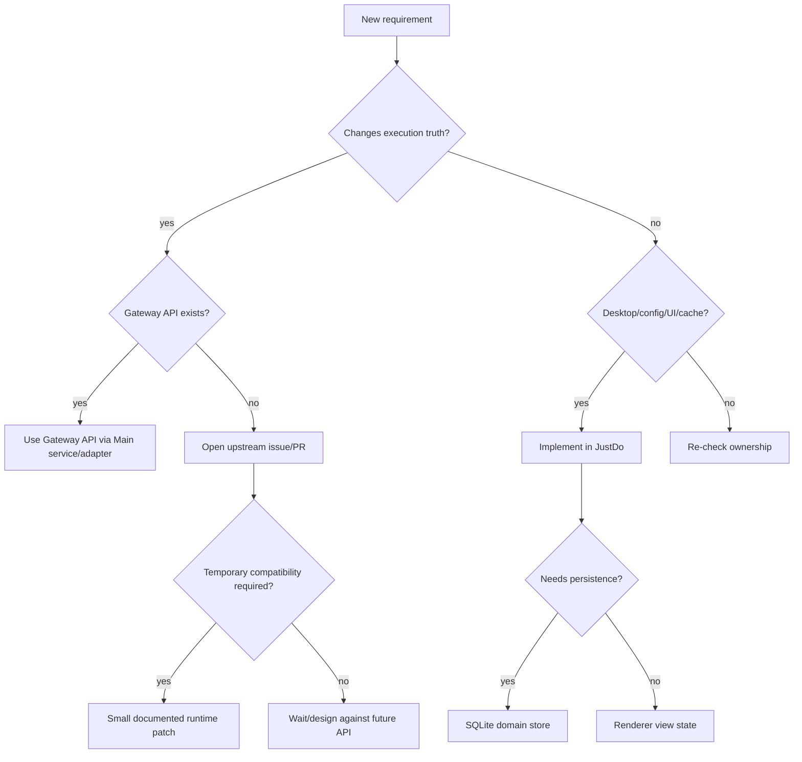

# OpenClaw 桌面前端设计

JustDo 当前定位是 OpenClaw Gateway 的桌面前端，而不是 Gateway 的替代实现。它负责桌面体验、本地配置、ask-user 交互、UI 缓存和插件管理界面。

## 设计目标

- 保留原生桌面体验：窗口、托盘、系统权限、本地文件、日志、代理、打包资源。
- 将 Agent execution、history、skills、cron 等 runtime 能力委派给 Gateway。
- 用 SQLite 保存产品所需的本地状态，而不是复制 Gateway 的执行权威。
- 给 renderer 一个稳定、窄、可审计的 `window.electron` API。

## JustDo 负责

- Electron app lifecycle。
- Main/preload/renderer 进程隔离。
- UI 状态、设置、主题、i18n。
- Cowork 会话列表、分组、pin、cwd、附件 UI。
- Provider、Agent、MCP、Hooks、Skills 管理界面。
- OpenClaw config sync。
- Gateway runtime 下载、安装、启动、停止、状态展示。
- Ask-user interaction UI。
- Local SQLite cache。
- Packaging resources。

## OpenClaw Gateway 负责

- Chat execution。
- Chat history authority。
- Tool execution protocol。
- Subagent lifecycle。
- Skills discovery/config/runtime。
- Cron task execution。
- Slash command runtime capability。

## 当前实现要点

- `<justdo-chat>` 通过 Gateway WebSocket 渲染聊天内容。
- `src/main/engine/openclaw/openclawRuntimeAdapter.ts` 是 Cowork facade 到 Gateway 的 adapter。
- `OpenClawConfigSyncService` 把 JustDo 本地配置同步给 Gateway。
- `CronJobService` 轮询/调用 Gateway cron runtime。
- `OpenClawSkillService` 通过 Gateway skill RPC 管理 skills。

## 不再做的事

- 不维护第二套 Agent 状态机。
- 不把 SQLite transcript 当成执行真相。
- 不在 renderer 中直接调用 Gateway runtime 文件或 marketplace server。
- 不长期 fork OpenClaw runtime 行为。

## 验收标准

- 删除 SQLite message cache 不应破坏 Gateway history。
- Gateway restart 后 UI 能重新取得 engine status 和 session/history 信息。
- Renderer bundle 不导入 Node.js/Electron-only 模块。
- 新增 runtime 差异优先上游修复，JustDo patch 有明确删除条件。

## 设计背景

JustDo 早期承担了较多 runtime 适配和本地状态补偿逻辑。随着 OpenClaw Gateway 能力完善，架构目标已经从“本地重建一部分 Agent runtime”转为“桌面前端 + 本地控制面”。这个变化的价值是：

- 降低 JustDo 和 OpenClaw 行为分叉。
- 减少本地状态机和 Gateway 状态不一致。
- 让 IM、WebChat、Desktop 等入口共享同一个 Gateway truth。
- 让桌面端更专注于系统集成、权限和体验。

## Thin Frontend 的含义

Thin frontend 不等于“没有本地逻辑”。JustDo 仍然有很多本地职责：

- 桌面窗口生命周期。
- 本地缓存和配置。
- 复杂 UI。
- 安全确认。
- Runtime 资源管理。
- Gateway 配置生成。

Thin 的含义是：不复制 Gateway 应该拥有的执行语义。

## 典型边界案例

### 会话标题

JustDo 可以生成和保存 UI 标题，因为标题服务于本地列表体验；但标题不能决定 Gateway session identity。

### 消息搜索

JustDo 可以索引/缓存消息用于搜索；但搜索结果中的消息顺序和内容应能回到 Gateway history 校验。

### Subagent 展示

JustDo 可以做 drawer、badge、菜单；但 subagent 的 parent/child 关系和状态来自 Gateway。

### Skills 页面

JustDo 可以做 marketplace UI、启停按钮、导入目录；但 skill discovery、runtime config 和执行由 Gateway 管理。

### Scheduled Task 页面

JustDo 可以做任务表单、运行历史、手动执行按钮；但 cron trigger 和执行由 Gateway runtime 管理。

## 反模式

- 在 renderer 中根据文本猜测 tool/subagent 状态。
- 为 Gateway message stream 再写一套长期状态机。
- 在 SQLite 中保存“比 Gateway 更可信”的 execution status。
- 为单个 UI 需求 patch 大段 runtime 逻辑。
- 让 Main process 同时实现 Gateway 已经提供的 domain API。

## 决策流程

新增需求时按顺序判断：

1. 这是 execution truth 还是 UI/product metadata？
2. 如果是 execution truth，Gateway 是否已有 API？
3. 如果 Gateway 没有 API，是否应该提 upstream issue/PR？
4. 如果必须本地兼容，能否做小 patch，并写明删除条件？
5. Renderer 是否只需要展示结果？
6. SQLite 保存的是缓存、配置还是权威？

