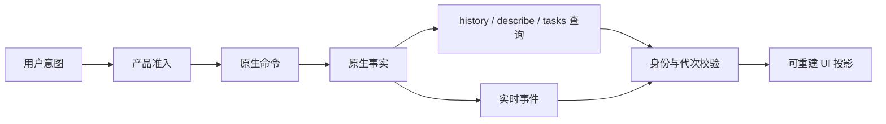

# 薄前端：显示状态如何服从原生事实

“薄前端”是状态所有权约束，不是代码行数目标。Renderer 可以拥有复杂的分页、动画、草稿、搜索和恢复逻辑，但不能根据这些投影重新决定 Agent 执行、消息持久化或工具授权。本页给出实现与评审方法；模块分工见[架构](02-architecture.md)。

## 1. 三类状态的不同寿命

| 状态        | 例子                                             | 消失后如何恢复                 |
| ----------- | ------------------------------------------------ | ------------------------------ |
| 原生事实    | transcript entry、run、task、Goal、progress_card | 查询 Gateway                   |
| 产品事实    | 会话分组、期望权限、readAt、成员关系             | 查询产品 Store                 |
| UI 临时状态 | draft、搜索、展开项、滚动锚点、optimistic tail   | 本地交互重建，不能替代持久记录 |

同一页面展示三种状态是正常的；问题在于把 UI 临时值写回权威层，或在 Main/Redux 中复制另一份原生消息，以掩盖同步错误。

当前聊天使用原生 history 和实时 reducer，Subagent 使用原生 tasks，Goal 使用原生目标加产品续跑阶段，Skill 和 Extension 以原生状态与 inventory 为准，协作消息经原生 `sessions_send`，cron 由原生调度。产品 run receipt、readAt、成员关系及执行快照有独立用户意义，可持久化，但必须明确身份、过期、恢复和删除语义。

## 2. 命令、查询、事件不是同一种确认

命令表达意图，查询返回某个时点的快照，事件描述变化。发送命令成功不等于执行完成；查询结果可能比已收到的 live event 旧；事件可能重复、乱序或遗漏。

因此 reducer 需要 identity/revision/generation，而不是“最后到达覆盖全部”。只要存在异步等待，就要重新确认响应还属于当前会话、运行和请求。

## 3. 一个消息如何从草稿变成历史

用户输入先属于 Composer draft。提交后可产生 optimistic user tail，带本次提交身份；原生接收和历史出现后，reconciler 将它与正式 entry 对齐。不能用文本相等消除所有重复：用户可能故意连续发送相同文字。

Thinking、工具、正文属于同一 turn 的有序 item。原生历史到达时接管对应临时投影，不把每个刷新页重新追加成消息。工具结果未必跟 assistant message 同时持久化，恢复逻辑必须允许填空而不是重排整个 turn。

终态按 run 身份建立 fence。停止确认也进入同一 reducer，即使 aborted stream 丢失仍可结束正确运行；迟到 delta 不得重新打开已停止 turn。

## 4. 界面状态不能代替执行状态

| 容易误判的显示            | 实际应查                                     |
| ------------------------- | -------------------------------------------- |
| 最后一条 assistant 已显示 | 主运行、活动后代与 Goal phase                |
| 某工具卡变红              | 工具结果与 run 是否真正终结                  |
| 点击停止后按钮恢复        | 原生停止确认与未确认操作                     |
| 协作边出现                | delivery state；accepted 不代表业务完成      |
| 计划卡已展示              | 持久 artifact、handoff 与原生 awaitingReview |
| 插件目录存在              | 原生 inventory、eligibility 与操作能力       |

Renderer 可合并这些事实做“任务仍忙”的产品展示，但不能据此实现自己的 required-child join、工具重试器或协作调度器。

## 5. 直连 Gateway 的范围

集中式聊天 client/controller 使用 preload 获取本地连接信息，处理消息 wire、历史和聊天命令。普通 feature 不各建 socket，不持久 token，不导入 Main 模块。

产品命令仍走 preload：会话权限、文件、配置、插件安装、SQLite 与系统操作。聊天直连不是跳过准入的后门；后续 chat.send 同样先经 Main 准备 mode/root 和模型。

Chrome Side Panel 使用产品 app-server，外部网页 guest 使用受控 bridge，两者都不继承桌面聊天 token。不同通道详见[进程模型](03-process-model.md)。

## 6. 异步与生命周期写法

控制器入口持有连接、canonical session、active turn 和取消状态。拆出的 history/recovery/session/compaction/progress 模块接收显式上下文，使用 propertyContext 实时访问器读取当前状态。

错误做法是 `{ ...controllerState }` 创建长期副本，或让领域模块自行拥有第二套 currentSession。请求发起时记录 identity，await 后比较 generation，确认有效再更新。卸载释放订阅和短期资源，但不把后台任务执行一并误杀。

## 7. 性能优化应落在哪层

有界 DOM、工具详情折叠、按帧合批、stream pacer、Markdown 缓存与滚动锚点都属于显示层。不能通过截断 canonical 工具结果、删除原生历史或新增持久 UI 消息副本获得流畅。

历史传输本身有上限时，使用原生 entry 身份补取或分块恢复；“暂未加载”不同于“没有内容”。搜索当前窗口与全历史搜索也需要分别说明范围。

## 8. 典型失败如何呈现

原生查询失败保留最后可信投影并标明刷新失败；没有权威数据时显示不可用，不合成成功。命令结果未知保留可恢复身份，不能清空草稿后悄悄重发。权限应用失败阻止发送，而不是让 UI 临时显示 full 掩盖配置问题。

侧边临时 /btw 聊天有自己内存历史和草稿，关闭后丢弃是产品语义，不应塞回主 transcript。浏览器录制也是发送前的 draft，用户审阅后才成为原生消息附件。

## 9. 审查与测试

先问：这个字段来自哪个 owner、如何重建、什么时候过期？再验证刷新、会话切换、断线、重复事件、终态后迟到、同文重复提交和超大历史。

聊天侧对应 controller/reducer/reconciler tests；产品侧对应 handler/Store tests。若必须增加持久状态，应说明它为何是产品事实，以及删除、迁移和对账方式；“方便 UI”不足以新增 transcript 表。
