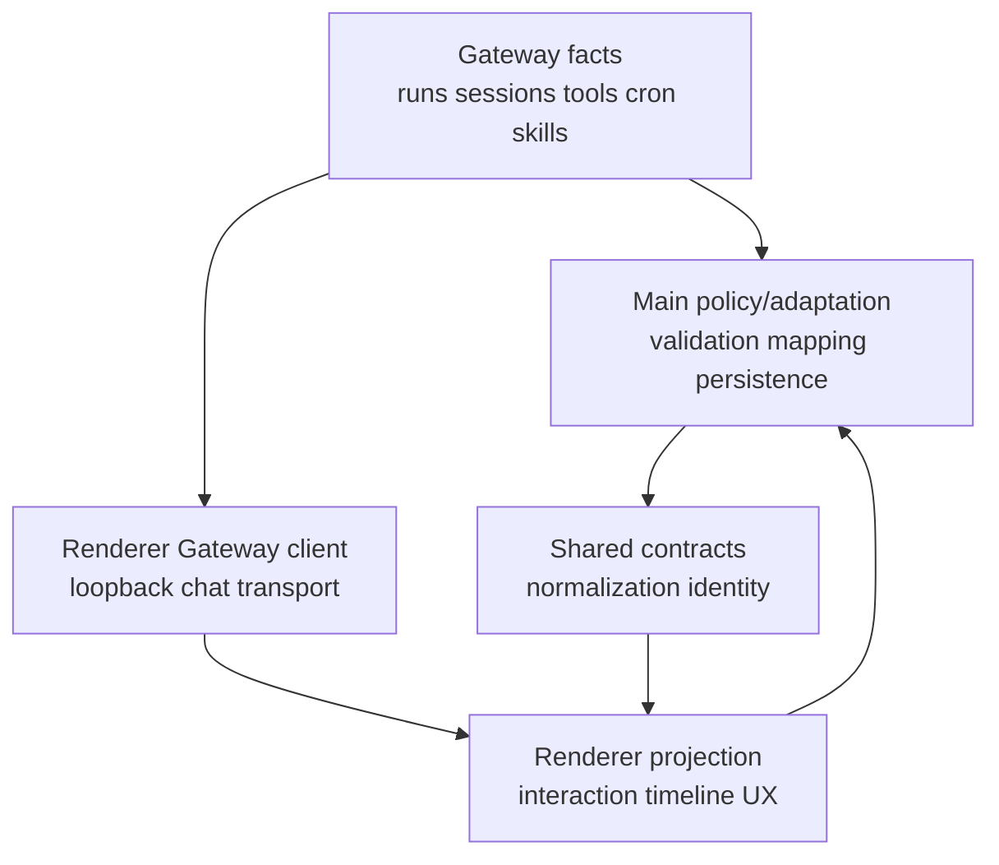
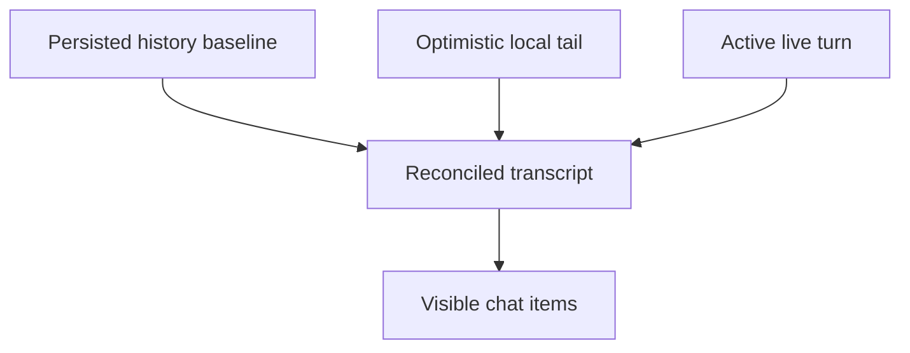

# OpenClaw 薄前端设计

本文描述当前实现中的“薄前端”原则。它不意味着 Renderer 没有复杂逻辑；它意味着 Renderer可以拥有复杂的呈现与交互状态，但不拥有 Agent执行真相、系统权限或与 Gateway竞争的领域模型。

## 1. 目标

- 让 OpenClaw Gateway统一执行/session/tool/cron/plugin语义。
- 让 JustDo专注桌面UX、权限 admission、本地产品数据和跨进程安全。
- 让 Renderer在断线/乱序/分页情况下仍能快速且一致地显示，而不虚构后端状态。
- 降低 upstream升级时重复实现和协议漂移。

## 2. “薄”与“不薄”

Renderer可以很“厚”的部分：timeline reducer、history window、Markdown/Mermaid、滚动调度、optimistic input、搜索、分组、modal、accessibility、theme。

Renderer必须保持“薄”的部分：

- 不执行 tool loop、goal continuation、subagent spawn/join或 cron schedule；
- 不直接读取/修改 OpenClaw config、state、transcript或 SQLite；
- 不自行认定 run terminal、permission active、plugin installed；
- 不保存 Gateway token/API key为普通应用状态；
- 不解析两套不一致的 Gateway wire protocol。

## 3. 责任分层

产品命令必须由 Main/Gateway 确认；聊天 controller 还通过集中式 loopback client 直接订阅 Gateway 并查询历史。Main 转发事件与 Renderer chat wire event 分别在其固定归一层处理，UI 最终由 normalized state 派生。

## 4. 当前实现

### 4.1 会话与消息

SQLite session保存产品元数据，Gateway history保存 transcript。Renderer加载分页 history并在 active turn上叠加 reducer状态；final后 reconciliation使用稳定 identity合并。optimistic user message仅改善即时反馈，收到权威 history后必须去重/回正。

### 4.2 实时流

Main adapter统一处理 chat/agent/tool/lifecycle；shared `messageDomain`分类 session/run admission；Renderer reducer只接受属于当前显示域的 normalized event。sequence回退、foreign run、terminal后delta被拒绝或隔离。

### 4.3 权限

UI显示 ask/auto/full与审批modal，实际 policy由 Main config sync并通过 Gateway active verification。按钮成功状态必须来自 IPC结果，不能在本地先宣告新权限有效。

### 4.4 Plugins/cron/memory

Skills状态来自 Gateway，MCP/Hook配置来自 Main stores并同步，Extension安装来自 CLI/registry，cron定义/run来自 Gateway，result unread来自 SQLite，memory来自 Gateway state/API。页面只是这些权威的投影。

## 5. 典型边界案例

### 5.1 会话标题

标题是产品元数据，JustDo可以请求模型生成并存 SQLite；Gateway无需成为标题权威。但模型调用、provider网络仍经 Main。

### 5.2 消息搜索

搜索可在已加载/缓存timeline本地完成，因为它是显示能力；若声称搜索“全部历史”，则必须通过分页/索引覆盖权威历史，不能只搜当前DOM。

### 5.3 Subagent

Renderer可以展示菜单/抽屉/label；status和parent/run由 Gateway或adapter normalize。不能根据文本“subagent complete”猜状态。

### 5.4 Session progress card

Renderer 通过 Gateway 的 `progressCard.get` 读取 session 级耐久状态，并在 `progressCard.changed` 后按 revision 失效重取；`progress_card` 工具调用在 transcript 中只保留紧凑回执。UI 不从普通 Markdown checklist 推断计划，也不在本地维护第二份步骤状态。只有全部步骤完成时才允许携带 `expectedRevision` 调用 `progressCard.put` 清除，避免覆盖并发更新。

### 5.5 Scheduled result

receipt summary/unread是本地产品能力；完整session仍从 Gateway history解析并复用chat pipeline。删除需 Main清理artifact后才从UI移除。

## 6. 双状态何时合理

允许：权威数据的有界缓存、optimistic待确认状态、显示派生、跨刷新持久化索引。要求每个副本明确 source、identity、失效和 reconciliation。

禁止：两套都能独立产生终态/删除/权限/安装结果的状态机；按文本/时间猜测 identity；把断线当业务失败；永久依赖“最后一个事件”。

## 7. History 与 live 合并规则

1. History提供已持久化基线。
2. Optimistic tail只代表尚未在history出现的本地提交。
3. Active reducer只表示当前run的增量。
4. 使用 session/run/message stable identity去重，而非内容相等。
5. Final触发history reconciliation；history takeover后清相应overlay。
6. 分页窗口加载旧数据不能改变active turn identity或滚动焦点。

## 8. 错误语义

Renderer区分 transport、engine readiness、admission、tool error、run terminal、history unavailable。只有明确 terminal改变任务完成状态。可恢复错误提供重试；危险配置错误fail closed；错误展示不得泄漏secret或原始内部对象。

## 9. 新功能决策

依次询问：

1. 这是执行事实还是显示/产品元数据？
2. Gateway是否已有RPC/event/state？
3. Main是否需要权限、文件、数据库或兼容适配？
4. Renderer需要的是命令、查询、订阅还是纯派生？
5. 缓存如何失效、重连如何恢复、identity是什么？
6. upstream缺能力时能否升级；若需patch，wire contract和移除条件是什么？

## 10. 反模式

- React组件各自打开 Gateway WebSocket或复制 parser；现有直连必须集中在 `GatewayClient`/`ChatController`。
- 重新引入 `cowork_messages`，或把任意产品缓存当完整 transcript 覆盖 Gateway。
- 在 Redux增加未挂载/未消费的“未来状态”。
- 用 timer假完成、用断线假失败、用相同文本去重。
- Renderer直接拼 OpenClaw config或运行 shell。
- 为 upstream已有能力维护长期本地替代实现。

## 11. 验收标准

- 同一事实有且只有一个权威owner。
- 断线、刷新、session切换、历史分页和迟到事件不会串线。
- Renderer无 Node/Electron privileged imports；所有系统能力经最小 preload。
- Gateway payload在 Main/shared 或集中式 Renderer chat gateway 层 normalize，展示组件不依赖未验证 shape。
- optimistic状态可被确认/回滚，缓存有明确失效路径。
- 新 capability gap被记录在 matrix；patch有版本、测试和移除条件。

## 12. 当前代码地图

| 层                  | 关键入口                                                         | 在薄前端中的作用                                            |
| ------------------- | ---------------------------------------------------------------- | ----------------------------------------------------------- |
| Shared admission    | `src/shared/openclaw/messageDomain.ts`、`agentEvent.ts`          | 定义 session/run 域和可传输事件，不依赖 Electron/DOM        |
| Main execution      | `src/main/engine/cowork/coworkEngineRouter.ts`                   | 管理本进程 session 路由与命令入口，不把 engine loop 下放 UI |
| Gateway adapter     | `src/main/engine/openclaw/openclawRuntimeAdapter.ts`             | 连接、RPC、事件归一、history reconcile 和 runtime status    |
| Gateway session RPC | `src/main/engine/gateway/sessionRpc.ts`                          | 隔离具体 method/payload，避免 UI 拼 wire request            |
| History query       | `src/main/openclaw/sessions/openclawHistory.ts`                  | 从 Gateway 历史提取产品需要的查询结果                       |
| Preload API         | `src/main/preload.ts`                                            | 对 Renderer 暴露显式 command/query/subscription allowlist   |
| Transcript state    | `src/renderer/libs/openclaw-chat/model/chat-transcript-state.ts` | 聚合 history、optimistic tail 与 active turn 显示状态       |
| Runtime reducer     | `src/renderer/libs/openclaw-chat/model/agent-event-reducer.ts`   | 将已归一事件还原为 UI timeline，不决定执行终态来源          |
| History projection  | `project-history-timeline.ts`、`history-reconciler.ts`           | 稳定 identity 投影、去重、takeover                          |
| Render pipeline     | `pipeline/build-chat-items.ts`、`pipeline/message-normalizer.ts` | 把领域项变为可渲染 item，处理 display normalization         |

`src/renderer/libs/openclaw-chat/gateway/client.ts` 是生产使用的 loopback WebSocket client，不只是测试抽象。`JustDoChatWrapper` 先通过 preload 取得 Main 管理的 port/token，再由 `ChatController` 连接 Gateway；paged history 优先走 IPC，失败时还会使用认证 REST fallback。它只服务聊天数据面，不能扩展成任意 Renderer 组件的通用 Gateway 客户端。

## 13. Command、Query、Event 的不同语义

薄前端 API 应明确属于三类之一：

| 类型    | 示例                                                 | 成功含义                                                | UI 处理                                                   |
| ------- | ---------------------------------------------------- | ------------------------------------------------------- | --------------------------------------------------------- |
| Command | start/stop session、resolve approval、set permission | Main/Gateway 已接纳并返回明确结果；不必等同整个任务终态 | 按 request single-flight，错误可回滚 optimistic state     |
| Query   | list sessions、paged history、runtime status         | 某个时间点的权威快照                                    | 与本地投影 reconcile，不覆盖更新的 live domain            |
| Event   | agent/tool/lifecycle/progress                        | 某个 session/run 的增量事实                             | 先做 domain/sequence admission，再 reduce；订阅必须可解绑 |

把这三类混在一起会产生典型错误：用事件是否到达判断 command 是否被接纳；用旧 query 覆盖刚收到的 live event；或把按钮本地状态当成 Gateway command 的结果。

## 14. Transcript 的三层模型

### 14.1 Persisted history

通过分页接口取得，负责刷新/重连后可重建的 transcript。`history-window.ts` 控制有界窗口，加载旧页不得改变当前 active run identity。

### 14.2 Optimistic tail

用户提交后立即显示，但其身份必须关联本次 turn；当相同权威 user message 出现在 history 后由 `optimistic-history-tail.ts` 去重。发送失败时要呈现可恢复失败，而不是永久保留一条看似成功的用户消息。

### 14.3 Active live turn

thinking、assistant delta、tool、plan 和 lifecycle 由 reducer 管理。它只接受与当前 domain 匹配的事件；terminal 或 history takeover 后应清理相应 overlay，防止下一 turn 继承旧 tool/thinking。

## 15. 事件准入与乱序处理

每个 runtime event 至少要回答：属于哪个本地 session、哪个 Gateway session、哪个 run、事件类型是什么、是否仍在允许的 sequence/lifecycle 窗口。当前相关约束分布在 shared `messageDomain`、Main adapter 和 Renderer reducer：

- 无法映射 session 的事件不能落入“当前打开的会话”。
- foreign run 的 delta 不得覆盖 active run，即使文本时间更晚。
- terminal 后迟到的同 run delta 不能重新把 UI 变回 running。
- 重连后的 query snapshot 与 live event 必须按 identity/revision 语义合并，不能按数组到达顺序全量替换。
- subagent event 可投影到父会话 UI，但必须保留 child identity，不能冒充 parent assistant message。

## 16. Preload 设计规则

`contextBridge.exposeInMainWorld('electron', …)` 是 Renderer 的唯一特权入口。新增能力时：

1. 在 shared 定义结构化输入、输出和枚举；不要把 `unknown` 一路传到 service。
2. Main IPC handler 对长度、枚举、路径和调用时状态做验证。
3. Preload 只暴露领域方法，不提供通用 `invoke(channel, payload)`。
4. `src/renderer/types/electron.d.ts` 与 preload 保持一致。
5. Event subscription 返回 unsubscribe，并删除包装后的 listener。
6. 除现有 loopback chat 连接所需的受控 Gateway token 外，不新增 credential 暴露；token 不进入普通状态/日志，且不暴露任意 filesystem primitive。

`store.get/set/remove` 是已有通用遗留面，不能把它当作继续扩张任意持久化键的范式；新领域数据优先使用拥有验证和迁移语义的专用 IPC。

## 17. 重连与刷新场景

### 场景 A：Gateway 短暂断线

Transport close 只改变连接/可用性投影。UI 保留已确认 history，不生成业务失败；重连后查询 runtime status/history，并用稳定 identity 补齐缺口。

### 场景 B：用户切换 session 后旧事件到达

订阅可以仍在全局维护，但 reducer 必须按 session domain 更新正确缓存；当前视图不得因“最后到达”而吸收旧 session 事件。

### 场景 C：应用重启时任务曾运行

SQLite 会清理产品 `running` 快照/计时，Gateway runtime status 决定远端是否仍活跃。前端不能仅恢复持久化 boolean；需要 Main 的 reconnect/reconciliation 路径。

### 场景 D：history 页与 live final 同时返回

两者通过 message/run identity 合并。history 成为持久化基线，live overlay 在确认 takeover 后清除；不能简单执行 `setMessages(history)`。

## 18. 失败分类与 UI 行为

| 失败层           | 例子                              | UI 不应做                       | 推荐行为                           |
| ---------------- | --------------------------------- | ------------------------------- | ---------------------------------- |
| Input validation | 空 session、非法 mode、过长 query | 发送到 Gateway 后统一报未知错误 | 就地指出字段，保持表单内容         |
| Admission        | policy 未验证、engine starting    | 假定命令已开始                  | 禁止提交或返回可重试状态           |
| Transport        | WebSocket close/timeout           | 标记任务业务失败                | 显示连接状态并触发 query reconcile |
| Runtime          | tool/model/agent error            | 丢弃已完成 timeline             | 将错误绑定对应 run/tool，保留证据  |
| Persistence      | metadata/receipt 写入失败         | 宣告 pin/read/delete 成功       | 回滚产品 optimistic state并重取    |
| Rendering        | malformed Markdown/Mermaid        | 注入原始 HTML 或让整页崩溃      | 清洗、限制、降级为文本/错误卡      |

## 19. 测试证据

| 不变量                    | 主要测试                                                             |
| ------------------------- | -------------------------------------------------------------------- |
| session/run 域归属        | `src/shared/openclaw/messageDomain.test.ts`、`agentEvent.test.ts`    |
| Gateway lifecycle adapter | `src/main/engine/openclaw/openclawRuntimeAdapter.test.ts`            |
| history/live 合并         | Renderer `chat-controller.test.ts` 与 `history-reconciler.test.ts`   |
| optimistic 去重           | `optimistic-user-message.test.ts`、`optimistic-history-tail.test.ts` |
| 有界历史                  | `history-window.test.ts`、`chunked-message-history.test.ts`          |
| reducer 事件状态          | `agent-event-reducer.test.ts`、`run-activity.test.ts`                |
| scroll/render batching    | `chat-scroll-controller.test.ts`、`stream-render-scheduler.test.ts`  |
| timeline 构建             | `build-chat-items.test.ts`、`project-history-timeline.test.ts`       |

## 20. 维护清单

- 新 Gateway event 是否先进入 shared/Main normalization，而不是组件私有 parser？
- 新 UI cache 能否从 query/history 重建，是否定义上限、identity 与失效？
- command 重复点击、超时返回、late success 是否有 single-flight/幂等策略？
- 新 timeline item 是否同时支持 history 与 live，并在 takeover 后不重复？
- 断线是否被错误映射成 terminal，terminal 是否又可能被迟到 delta 复活？
- preload 是否只增加最小领域方法，handler 是否验证所有不可信输入？
- 测试是否包含 session 切换、乱序、分页、重连与应用重启，而不只有 happy path？
