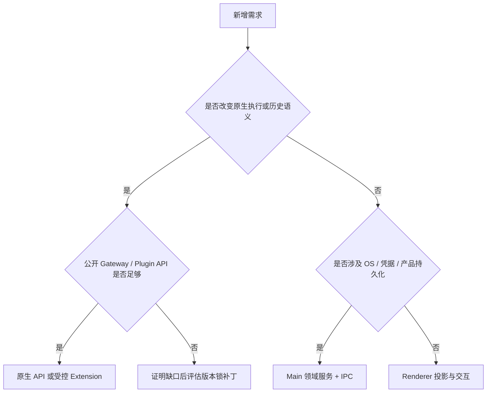

# 新能力的所有权与集成决策

此文件保留历史 plan 名称，正文是当前架构决策手册。它用于审查“功能应该由谁实现”，不重复目录导览，也不把早期迁移计划当作待办。

## 1. 按语义选择 owner

Shared 不是第四个业务 owner，它承载跨进程合约和纯逻辑。Main 也不是所有缺失 Gateway 能力的默认落点；把原生行为重写进 Main 仍然会产生双重权威。

## 2. 已确定的责任矩阵

| 需求                            | 实现位置           | 产品层可增加什么             |
| ------------------------------- | ------------------ | ---------------------------- |
| transcript/history/rewind/reset | OpenClaw           | UI 门禁、导航和可见投影      |
| tool execution、task queue/join | OpenClaw           | 审批交互、子任务状态展示     |
| Goal 内容与预算                 | 原生 session       | 自动续跑协调与等待阶段       |
| 会话分组、固定、未读            | 产品 SQLite        | 完整产品生命周期             |
| 会话 mode/root                  | 原生会话策略       | 产品期望、串行准备和回读     |
| Skill 解析赢家                  | 原生 skills        | 文件导入删除和来源变化说明   |
| Agent 角色文件                  | 原生 agents.files  | 编辑冲突检测与产品档案       |
| peer message                    | 原生 sessions_send | room 成员、轮次准入和回执    |
| cron scheduler                  | OpenClaw           | 编辑器、结果 inbox、删除补偿 |
| 本地文件编辑                    | Main               | 授权 token、版本校验和原子写 |
| timeline、滚动、草稿            | Renderer           | 可重建交互状态               |

## 3. 产品投影允许重复什么

重复身份、状态摘要、回执和索引是为了产品恢复，不是重复执行。例如 session row 保存 status 供列表快速显示，但仍需与原生运行核对；GoalExecutionSnapshot 记录 Main 自动续跑阶段，不能覆盖原生 Goal；结果 receipt 保存 readAt，不能代替 cron run history。

禁止的重复包括：cowork_messages、Main/Redux transcript cache、自建 task scheduler、凭模型文字生成的协作边、从工具输入推断的当前 progress_card。

一份新投影应明确原生 identity、更新条件、过期规则、重连修复及删除语义。没有这些说明的“缓存”很容易成为无法修复的第二事实源。

## 4. 配置管理不等于覆盖全部原生配置

ConfigSync 只管理产品声明拥有的字段，并保留非受管设置及可选 Extension 的显式关闭状态。产品数据库、原生配置和运行时 active 状态是三个阶段；成功返回需要覆盖实际承诺的阶段。

手动助手档案保存经过受管 roster 同步；模型创建使用原生 agents.create/update/files，并在产品层记录准备/完成。这不是两个可任意并发覆盖 roster 的入口，必须共享身份与一致性约束。

MCP 原生发现只补缺失 name，产品 mutation 后不从旧 config 复活已删项。模型 provider rename 必须通过稳定身份解析，不能把名称相似误当同一凭据来源。

## 5. 跨边界事务的四个例子

| 操作           | 本地原子部分                | 外部部分                            | 失败处理                       |
| -------------- | --------------------------- | ----------------------------------- | ------------------------------ |
| Plan 批准      | handoff expected-state 更新 | 文件、session reset、chat admission | 文件摘要与 admitted 回执防重复 |
| Extension 安装 | 安装身份记录                | 暂存、CLI、原生 inventory           | reviewToken、清理与读回        |
| 结果删除       | receipt/tombstone           | 原生 artifact 清理                  | 持久 cleanup 与同步 barrier    |
| 协作任务删除   | room freeze 与进度          | 停止/删除多个原生 session           | 部分失败保留可重试任务         |

不允许把网络调用包在同步 SQLite transaction 里声称全链路原子。需要明确“外部已成功、本地尚未确认”时如何识别，未知结果不能直接重复执行。

## 6. 何时使用 Extension

功能能通过原生 tool、turn hook、session extension、scoped RPC/event 表达时，优先 Extension。它拥有运行时 pending 或原生 policy；Main 桥只承担产品权限、文件/系统能力和 UI。

AskUserQuestion、Plan mode、automation permission、embedded browser、agent-team 和 stt-local-cli 都是不同例子。不能因为都是插件就让它们共享全局 pending、绕过沙盒或每轮强制注入提示词。

Extension 运行于 Gateway 信任域；如果目标是限制恶意第三方代码，仅靠 manifest 或 sidecar 不够，应单独定义进程隔离与凭据边界。

## 7. Patch 引入与升级

必须先证明锁定 pristine 产物缺少所需行为，且 Adapter/config/公开插件 API 不能正确实现。补丁需要精确 anchor、原子写入、当前形态幂等、pristine contract、行为测试与上游移除条件。

历史或部分 JustDo marker 要失败，不编写兼容旧修订的原地转换。编号仅代表当前构建顺序，不是长期能力 ID；唯一清单在[版本 README](../../scripts/patches/v2026.9.2/README.md)。

升级时以新原生能力重新判断 owner。上游已经拥有的 task/history/approval 不能因为旧补丁曾实现过就继续保留。

## 8. 审查一条完整链路

以“新增会话操作”为例：定义产品目标 → 查询是否已有原生 RPC → shared 参数/结果 → Main admission → 原生身份确认 → 领域持久回执 → Renderer 反馈 → 停止/重连/删除。

每层只保留完成自身职责所需的数据。若 UI 必须知道 Node 路径、secret 或运行时内部实现名才能操作，应重新收窄接口。若服务存在但没有注册或消费方，应写成基础设施，不能写成已交付功能。

## 9. 完成标准

代码证据同时包括注册、消费方和失败路径；测试覆盖重复、乱序、取消与部分成功；文档说明权威、恢复及限制。协议测试通过不等于真实模型质量验证，Windows 通过也不等于所有平台沙盒可用。

最终修改应能回答：谁创建身份、谁确认成功、谁保存事实、谁在重启后恢复、谁负责删除。不能回答其中之一，就还没有完成边界设计。
