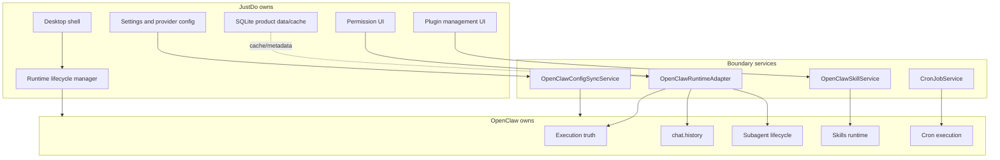
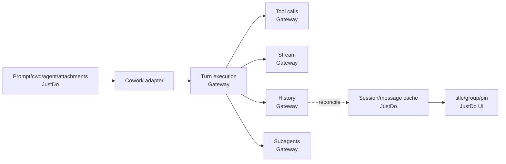
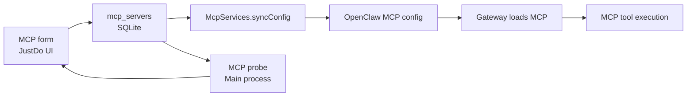

# OpenClaw / JustDo 边界

本文档记录当前职责边界。Thin frontend 改造已经完成，本文不再作为迁移计划使用。

## 职责矩阵

| 能力 | OpenClaw Gateway | JustDo |
| --- | --- | --- |
| Chat turn execution | 权威 | 发起请求、展示状态 |
| Chat history | 权威 | UI cache、搜索、展示 |
| Subagent lifecycle | 权威 | 展示、跳转、历史读取 |
| Skills runtime | 权威 | 管理 UI、本地导入、marketplace adapter |
| MCP runtime config | 读取/执行 | 本地 CRUD、配置同步、探测 |
| Hooks runtime config | 读取/执行 | 本地 CRUD、配置同步 |
| Cron execution | 权威 | 任务 UI、轮询、运行历史展示 |
| Provider config | 使用配置 | 本地配置和同步 |
| Desktop shell | 无 | 权威 |
| SQLite | 无 | 本地产品数据和 UI cache |
| Permissions UI | 请求能力 | 用户确认和响应 |
| Runtime patches | 被 patch 目标 | 小型兼容 shim |



## Gateway 权威数据

- `chat.history`
- tool call stream
- subagent parent/child relation
- skills status/config
- cron runtime state
- slash command capability

## JustDo 本地权威数据

- app settings
- window/theme/language preferences
- provider/API configuration
- agents
- MCP server definitions
- hooks config
- session groups
- local UI list metadata
- imported skill files

## 当前 Runtime Patches

当前 OpenClaw 版本 `v2026.6.11` 的 patch 位于 `scripts/patches/v2026.6.11/`：

- `001-thinking-stream.cjs`
- `002-agent-announce-reasoning-stream.cjs`
- `003-openai-content-reasoning-tags.cjs`
- `004-windows-mcp-package-runner.cjs`
- `005-history-thinking-and-subagent-yield.cjs`
- `006-sessions-yield-active-guard.cjs`

Patch 维护规则见 `scripts/patches/README.md`。

## 新功能判断

新增功能时先判断权威归属：

- 如果影响 execution truth，优先做 OpenClaw Gateway API 或 upstream change。
- 如果影响桌面壳、配置 UI、权限 UI、本地缓存，可以在 JustDo 实现。
- 如果只是弥补 runtime 兼容问题，patch 必须有 remove condition。

## 非目标

- 不删除 SQLite。
- 不删除 Skills/MCP/Hooks UI。
- 不绕过 Gateway 直接实现工具执行。
- 不让 Renderer 拥有本地系统能力。

## 边界判定细则

### Execution Truth

以下属于 execution truth，归 Gateway：

- 一次 chat turn 是否已经开始、暂停、完成或失败。
- Tool call 的真实输入、输出和状态。
- Subagent 是否存在、属于哪个 parent、当前状态是什么。
- Cron run 是否触发、是否成功、关联哪个 Gateway session。
- Skill runtime 是否成功加载以及运行时配置是否生效。

JustDo 可以缓存和展示这些信息，但不能在本地创造一个与 Gateway 冲突的权威结果。

### Product Metadata

以下属于 JustDo product metadata：

- Sidebar 分组、排序、pin。
- 本地主题、语言、窗口设置。
- Provider/API 配置 UI。
- Agent 描述、icon、默认技能组合。
- MCP server 表单内容。
- Hook 启用开关。
- 用户导入 skill 文件。

这些数据可以由 SQLite 权威保存，再同步给 Gateway 使用。

## Cross-boundary Flows

### Cowork Turn



### MCP Server



### Scheduled Task

```text
JustDo owns:
  task editor, run history UI, manual run button

Gateway owns:
  schedule trigger, run execution, delivery behavior

JustDo syncs:
  status polling and session resolution
```

## Handling Missing Gateway Capability

当 UI 需要 Gateway 尚未提供的能力时：

1. 确认是否真的属于 Gateway authority。
2. 搜索是否已有 Gateway API 或事件。
3. 优先提交 OpenClaw upstream issue/PR。
4. 如需临时支持，写 runtime patch。
5. Patch 必须说明 purpose、risk、remove condition。
6. JustDo adapter 只做最小映射，不扩大为长期本地实现。

## Documentation Contract

任何跨边界改动都至少更新一个文档：

- Cowork 执行变化：`04-cowork-system.md`。
- Gateway lifecycle/config：`05-agent-engine.md`。
- Skills/MCP/Hooks：`07-skills-system.md` 或 marketplace 文档。
- Scheduled tasks：`08-scheduled-tasks.md`。
- Chat rendering/history：`15-chat-rendering.md`。
- Runtime patch：`patches/openclaw-patch-guide.md`。
