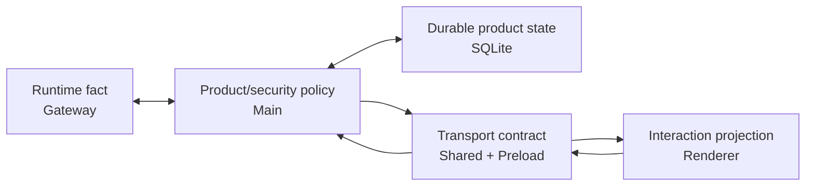

# JustDo / OpenClaw 所有权与边界判定

本文是当前实现的边界操作手册。文件名保留 `plan`，但内容不是未来蓝图：它用于代码审查时判断一项能力应落在 Gateway、Main、SQLite、Shared还是 Renderer。

## 1. 总原则

OpenClaw拥有可跨客户端复用的 Agent runtime事实；JustDo拥有 Electron产品壳、安全 admission、本地产品元数据与显示投影。边界适配应尽可能小、可删除、可验证。

## 2. 职责矩阵

| 能力                      | Gateway          | Main                 | SQLite             | Renderer       |
| ------------------------- | ---------------- | -------------------- | ------------------ | -------------- |
| run/tool/model loop       | 权威             | adapter/forward      | run receipt        | timeline       |
| transcript/history        | 权威             | query/normalize      | 可选显示缓存       | 分页/reconcile |
| session标题/pin/group/cwd | 无需             | IPC/store            | 权威               | 编辑/展示      |
| permission policy         | 执行权威         | 生成/同步/验证       | 用户选择           | 控件/modal     |
| goal                      | session权威      | coordinator/recovery | execution snapshot | card/actions   |
| subagent                  | spawn/status权威 | parent映射/normalize | 无竞争副本         | menu/drawer    |
| cron job/run              | 权威             | mapping/polling      | receipt阅读投影    | 管理/收件箱    |
| Skill runtime             | 权威             | RPC/文件导入         | 无                 | 列表/缺失项    |
| MCP/Hook产品配置          | consume          | store/config sync    | 权威               | CRUD           |
| Extension                 | CLI/runtime      | import/host/config   | 部分配置           | 管理/progress  |
| provider/API key          | consume请求      | 网络/config mapping  | app config         | 设置表单       |
| 文件/OS                   | tool请求         | 权限与执行           | 必要metadata       | 显示/授权意图  |

## 3. Gateway 权威数据

- `chat.send/history` 和 agent/chat/tool/lifecycle event；
- `sessions.list/get/describe/resolve/patch/abort/delete/subscribe`；
- session goal、runtime 状态、`tasks.list/get` 与 task events；
- `cron.*` job和runs；
- `skills.status/update`；
- exec/plugin approvals；
- memory、usage和其他runtime capability。

JustDo可以缓存/映射，但冲突时以可验证 Gateway结果为准。

## 4. JustDo 权威数据

- productName、window/tray/theme/language/shortcut/update状态；
- 本地 session id、标题、pin、group、cwd和导航；
- provider表单与产品默认模型选择；
- MCP/Hook用户记录和Marketplace provider注册；
- result receipt readAt、baseline/catch-up、preview edit grant；
- OS permissions、proxy preference和受管目录事务。

## 5. Cross-boundary flows

### 5.1 Cowork turn

首轮由 Renderer 提交 -> Main 验证 cwd/permission/config -> SQLite 建 session/run receipt -> Gateway `chat.send` -> adapter 绑定 root run 并更新产品终态；Renderer 集中式 chat client 订阅 loopback Gateway 事件并查询 history -> reducer 收敛。后续回合由 chat client 直接提交 Gateway。两条消费路径共享 session/run identity，但 Main 不复制 transcript，也不能各自发起重复 turn。

### 5.2 Permission change

UI选择 -> coordinator串行 -> 保存产品选择 ->生成OpenClaw config/approval snapshot ->必要时restart/reconnect ->读取active policy验证 -> UI确认。中间失败不能允许新turn使用未验证policy。

### 5.3 MCP

UI CRUD -> Main验证并写SQLite -> config sync -> Gateway加载 -> probe/list再次验证。extension提供的MCP只发现，不复制为用户owned row。

### 5.4 Scheduled task

UI/Agent调用native cron -> Gateway保存/调度 -> Main轮询runs -> SQLite upsert receipt/未读 -> UI打开完整session -> Gateway history。删除result必须反向清理Gateway artifact后再删receipt。

## 6. 缺失 Gateway 能力时

优先顺序：

1. 查当前固定版本真实RPC/event/schema与测试。
2. 能升级上游则评估升级。
3. 若只是产品metadata/UX，落在JustDo本地。
4. 若是runtime语义缺口，做版本化patch并定义最窄wire contract。
5. adapter隔离patch差异，shared contract不泄漏bundle内部实现。
6. 增加pristine、patch、集成和consumer测试。
7. 在capability matrix记录owner、证据、patch与移除条件。

禁止仅根据上游文档或旧patch猜测当前 bundle能力。

## 7. Patch 边界

Patch 只适用于必须在 Gateway 内看到完整上下文或需要 host/runtime 联合语义、且 v2026.8.1 没有等价公开能力的缺口。当前例子包括 managed Python 环境、Windows MCP runner、最终 system-prompt replacement、请求 metadata、app-start task epoch 和手动 reindex no-cache。

Patch 不适用于主题、分组、未读、窗口布局、产品标题等纯产品能力，也不应重做 v2026.8.1 已原生提供的 thinking/history、tool directory、task queue/join、approval 或 compaction。每个 patch 必须绑定 `v2026.8.1`，有 manifest、README 和测试；上游等价实现后应删除。

## 8. Execution truth

不要混淆以下信号：

- SQLite `session.status` 是产品快照；
- adapter `isSessionActive` 是当前进程memory；
- Gateway session/runtime是跨重连执行事实；
- chat error是一次消息错误，未必terminal；
- WebSocket close是transport事件；
- subagent running可让父任务在main run结束后仍未完成。

最终判定需用run/session/lifecycle/history组合，而非任一boolean。

## 9. Config ownership

Gateway 拥有活动 session SQLite store；JustDo 不直接读写 runtime session 文件。模型更新使用 `sessions.patch`，历史使用 `chat.history`，受限 detail 使用 runtime bridge RPC。检测到 legacy `sessions.json` 时必须先完成可确认、可回滚且有 receipt 的原生迁移，Gateway 才能启动。JustDo 可生成受管 `openclaw.json` 区域，但必须保留非受管用户配置，并仅清理自己历史写入的字段。

Config sync使用exclusive mutation、last-touched metadata和reload monitor。某字段支持hot reload不代表所有字段支持；restart决策由monitor/service证据决定。

## 10. UI 边界

Renderer可以：缓存、排序、搜索、折叠、主题、乐观显示、可访问交互。Renderer不能：批准未授权动作、删除任意路径、运行命令、写config、生成真实terminal、模拟cron或伪造Skill eligibility。

所有复杂UI状态都必须能从权威query/history加本地产品metadata重建。

## 11. 审查问题

对每个PR回答：

1. 新增事实的owner是谁？
2. 是否已有Gateway capability？使用了哪个method/event？
3. 本地副本是权威、receipt、cache还是optimistic？
4. identity、重连、乱序、重复和失效如何处理？
5. 是否跨越Node/文件/网络/credential边界？Main如何验证？
6. config失败是否会造成旧policy继续admission？
7. patch是否有版本、测试、上游处置和删除条件？
8. 对应架构/feature/matrix是否同步？

## 12. 回归信号

- Renderer出现 `fs/path/electron` import或任意IPC。
- Main adapter 与 Renderer chat client 对同一 Gateway 身份/终态语义解释不一致，或组件绕过两者再写第三套 parser。
- SQLite message/result被描述为完整执行权威。
- UI刷新后状态无法从query恢复。
- config保存成功但未验证active policy仍可提交。
- 新runtime语义只靠时间/文本heuristic。
- patch升级时复制历史目录而没有重新审计upstream。

## 13. 五层所有权判定法

遇到新需求时，先把它拆成事实、策略、持久化、传输和展示五层，而不是把整个功能交给一个目录：

例如“允许某 session 自动执行命令”不是一个 boolean：用户选择由 SQLite 保存，Main 把它映射到 config/approval policy，Gateway 是实际执行权威，Shared/Preload 传递结构化结果，Renderer 只显示已验证的 active mode。

## 14. 代码级责任地图

| 责任                    | 当前代码                                                  | 边界说明                                                   |
| ----------------------- | --------------------------------------------------------- | ---------------------------------------------------------- |
| Main composition        | `src/main/main.ts`                                        | 构造 store/service/adapter，安排启动与清理顺序             |
| Product session routing | `src/main/engine/cowork/coworkEngineRouter.ts`            | 本地 session 到 Gateway session/run 的协调层               |
| Runtime adaptation      | `src/main/engine/openclaw/openclawRuntimeAdapter.ts`      | RPC/event/wire 差异隔离，不持有产品 UI state               |
| Session RPC             | `src/main/engine/gateway/sessionRpc.ts`                   | 具体 Gateway 方法和 payload                                |
| Config projection       | `src/main/openclaw/config/openclawConfigSync.ts`          | 把 JustDo 管理字段投影到 OpenClaw config，并保留非受管字段 |
| Config orchestration    | `openclawConfigSyncService.ts`                            | 串行 mutation、reload/restart/apply 结果                   |
| Gateway lifecycle       | `src/main/openclaw/runtime/openclawEngineManager.ts`      | bundle、进程、port/token、readiness、shutdown              |
| Product persistence     | `src/main/data/sqliteStore.ts` 及领域 stores              | schema、兼容、事务、索引                                   |
| Cross-process API       | `src/main/preload.ts`、`src/renderer/types/electron.d.ts` | 最小 Renderer 能力面                                       |
| UI projection           | `src/renderer/features/`、`libs/openclaw-chat/`           | 交互和可重建显示状态                                       |

## 15. 按领域拆解权威与副本

### 15.1 Session 与 transcript

- SQLite session id 是 JustDo 导航/元数据身份；Gateway session id 是 runtime 身份，两者需显式映射。
- Gateway history 是 transcript 权威；Renderer timeline 是 history + live + optimistic 的投影。
- 不得重新引入 SQLite `cowork_messages` 或其他持久 transcript 副本；消息按需来自 Gateway。
- 删除产品 session 时，必须分别考虑 Gateway session、SQLite metadata、run receipts、preview grants 和当前订阅清理。

### 15.2 Goal 与 subagent

- Goal 存在于 Gateway session 语义，Main coordinator 负责产品续跑策略和用户动作 admission。
- Shared 兼容枚举中的 `usage_limited`、`budget_limited` 读取后归一为 `blocked`，不是当前独立 UI 状态。
- Parent main run 结束不一定意味着任务完成；managed child 仍 running 时 completion 必须等待 join/权威状态。
- Renderer 的 subagent drawer/label 是投影，不能根据 assistant 文本创建 child record。

### 15.3 Cron 与结果收件箱

- Gateway 拥有 job schedule、enabled、delivery、run status 和 session artifact。
- SQLite receipt 只拥有 baseline、readAt、清理状态和便于产品浏览的摘要投影。
- Polling 是同步机制，不是 cron engine；关闭 JustDo 不应改写 Gateway cron 语义。
- 删除 receipt 前先清理对应 artifact，部分失败必须保留可重试 cleanup 状态。

### 15.4 Plugin 家族

- Skill metadata/eligibility/enabled 最终取 Gateway skill API；本地文件 service 只负责用户导入文件。
- MCP/Hook 用户配置由 SQLite 拥有，config sync 投影给 OpenClaw；Extension 自带 MCP discovery 不能被复制成用户 owned row。
- Marketplace provider 是外部目录适配；安装成功最终要由各 kind 的真实 manager/Gateway list 再确认。
- 默认 provider 列表为空，因此 adapter 存在不等于 Marketplace 内容已交付。

### 15.5 Model 与 provider

- 用户 provider 表单是产品配置；Gateway/上游 endpoint 决定实际模型调用。
- 持久模型引用使用 qualified model ref，避免同名模型跨 provider 歧义。
- 内置模型 lifecycle 已有 startup/manual refresh 基础设施，但 login/logout UI 与 handler 尚未交付。

## 16. Config Sync 的受管区域

Config sync 的核心不是“把 JustDo 对象 stringify 到 `openclaw.json`”，而是受管投影：

1. 读取现有配置和 last-touched metadata。
2. 生成本次 JustDo 管理的 agents、models、permissions、browser、plugins 等字段。
3. 保留 Gateway/用户拥有的非受管设置。
4. 在 exclusive mutation 中写入，避免并发设置操作互相覆盖。
5. 根据 reload monitor/字段能力决定热加载或重启。
6. 对权限等高风险配置读取 active runtime policy 再确认。

升级 OpenClaw 时应逐字段检查 schema 和默认值；不能把历史生成结果当作新版本的输入模板，也不能直接复制旧 patch 来维持已经被 upstream 替代的字段。

## 17. 边界事务与部分失败

跨 Gateway 和 SQLite 的操作通常无法获得真正分布式事务，必须定义补偿顺序：

| 操作                  | 首要动作              | 确认动作                     | 部分失败策略                         |
| --------------------- | --------------------- | ---------------------------- | ------------------------------------ |
| 修改 permission       | 保存/同步受管 policy  | 读取 active policy           | 未确认前拒绝新 turn；允许用户重试    |
| 安装 plugin           | 下载/校验/stage       | kind manager 安装并重新 list | finally 清理 stage；不宣告半安装成功 |
| 删除 scheduled result | 清理 Gateway artifact | 删除 SQLite receipt          | cleanup 失败保留 receipt/重试记录    |
| 代理变化              | 应用本地代理          | restart + reconnect Gateway  | 重连失败主动停止不健康 Gateway       |
| 删除 session          | 停止/解绑 runtime     | 清理产品 metadata 和 grants  | 每一步幂等，重试不误删其他 session   |

## 18. Patch 引入门槛

只有同时满足以下条件，才应在固定 OpenClaw runtime 上增加 patch：

- 语义必须在 Gateway 内看到完整上下文或原子生命周期；
- 客户端通过现有 RPC/event 无法可靠实现；
- 升级当前固定版本不可行或 upstream 尚无等价实现；
- patch 可以用明确 input/output/event contract 描述；
- 有 pristine preimage、patch application 和 consumer behavior 测试；
- README/manifest 记录 upstream disposition 与删除条件。

补丁编号是构建顺序，不是功能优先级。`scripts/patches/v2026.8.1/README.md` 是当前九个补丁的权威表；历史目录不能作为新版本补丁源，也不能把旧 marker 当作兼容输入。

## 19. 端到端审查示例

### 示例：新增 Gateway session 字段

1. 确认当前 Gateway RPC/schema 是否已有字段，记录 capability evidence。
2. 在 `sessionRpc`/adapter 解析并归一，未知字段保持兼容。
3. 只有跨进程需要时才加入 shared contract/preload 类型。
4. Renderer 只消费归一字段，定义缺失/旧版本 fallback。
5. 若需要本地查询索引，明确它是 projection，并提供 reconcile/migration。
6. 增加 RPC fixture、adapter、IPC 与 UI 投影测试，更新 matrix 和 session 专题。

### 示例：新增纯 UI 折叠状态

如果折叠只影响当前设备显示，它不需要 Gateway patch。根据是否需跨刷新选择组件 state、Renderer cache 或产品 setting；不能把 UI 偏好写进 runtime session schema。

### 示例：新增危险文件工具

工具执行语义可属于 Gateway，但 Electron 文件 admission、allow-root、用户批准和路径 canonicalization 属于 Main。Renderer 只提交用户意图并展示结构化预览/结果，不能接收通用任意路径读写接口。

## 20. 测试证据与缺口表达

| 边界                    | 现有证据入口                                                                 |
| ----------------------- | ---------------------------------------------------------------------------- |
| Gateway adapter/RPC     | `openclawRuntimeAdapter.test.ts`、`sessionRpc.test.ts`                       |
| Config ownership        | `openclawConfigSyncService.test.ts`、`openclawConfigSync.logout.test.ts`     |
| Goal continuation       | `goalContinuationCoordinator.test.ts`                                        |
| Permission admission    | `sessionPermissionModeCoordinator.test.ts`、approval tests                   |
| History ownership       | Renderer `chat-controller.test.ts`、`history-reconciler.test.ts`             |
| Cron receipt projection | `scheduledTaskResultSyncService.test.ts`、`scheduledTaskResultStore.test.ts` |
| Plugin adapter          | Marketplace、skills、MCP、extension 各自 service tests                       |
| Runtime lifecycle       | engine manager/launcher/reload monitor tests                                 |

没有跨边界集成测试时，应写“单层行为已有测试、组合路径仍是缺口”，而不是用单元测试覆盖率推断端到端已验证。

## 21. Definition of Done

一项跨 JustDo/OpenClaw 边界的能力完成时，至少满足：

- owner、副本类型、identity、过期和重连策略写清楚；
- 当前固定 Gateway 版本的 method/event/schema 有代码或 fixture 证据；
- Main validation、permission、credential 和 cleanup 路径完整；
- preload 类型与 Renderer consumer 均已接入，无通用逃生通道；
- 并发、重复、超时、部分失败和应用重启有明确行为；
- 如使用 patch，具备版本化验证与 upstream 移除条件；
- 架构文档、能力矩阵和相关 feature audit 同步更新。
