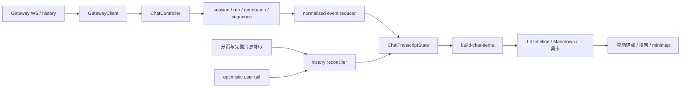
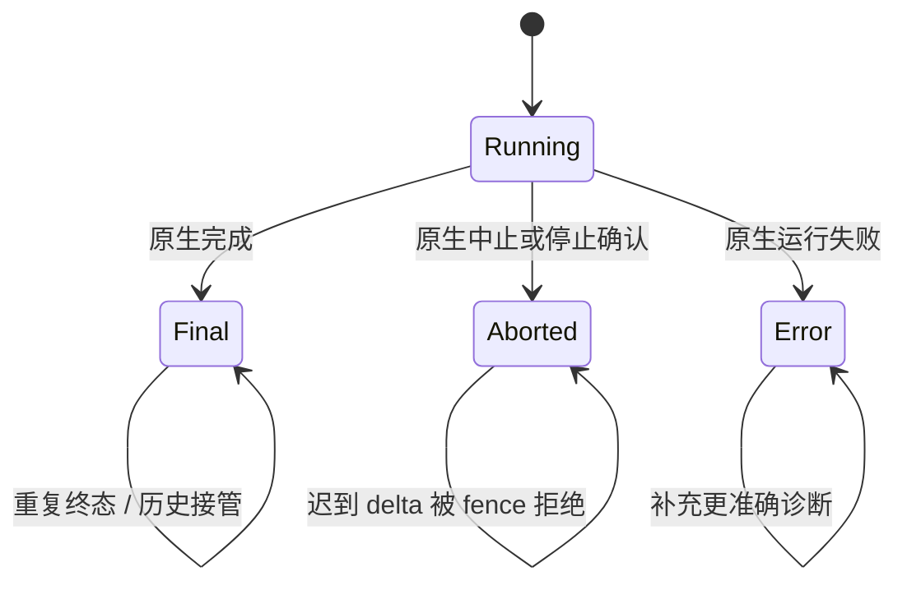

# 聊天渲染：原生历史、实时流与交互投影

聊天由 React 工作区和 Lit `<justdo-chat>` 组合。本文按当前 controller、reducer、history protocol、pipeline 和组件组织，重点解释消息顺序、终态、防重复、恢复及性能，避免把功能迭代记录混入架构正文。

## 1. 从原生事件到屏幕

Main 只提供连接准备、权限、产品生命周期和受限详情读取，不复制 Thinking/Tool/Content。Redux 也不保存 transcript。原生历史丢失时不能用产品消息缓存冒充恢复。

## 2. 控制器和状态归属

ChatController 入口持有连接、canonical session、订阅、transcript 和对外命令。session/history/recovery/compaction/progress 模块通过明确上下文操作；propertyContext 使用实时访问器，await 后不读取拆分时复制的旧状态。

ChatTranscriptState 包含 session key/id、persistedMessages、historySource、historyGeneration、activeTurn、recentRuns、terminalRunIds 和 revision。historySource 只有 gateway 或 optimistic；后者是等待原生接管的暂态，不是另一个历史来源。

| Turn item | 稳定身份与内容                                     | 结束语义                               |
| --------- | -------------------------------------------------- | -------------------------------------- |
| Thinking  | run + item/sequence，reasoning 文本                | completed/failed/cancelled/interrupted |
| Tool      | toolCallId、name、input、output、error             | 单工具状态，不直接决定 run 终态        |
| Content   | 文本段、delta/snapshot/replaceable、preamble owner | completed 或 interrupted               |
| Terminal  | run 对应的中止/错误说明                            | 合并为同一终态行                       |

activeTurn 记录原生 run/session/lifecycle generation 与序列。最近 24 个 run 的详情保留 5 分钟，但 identity-only terminal fence 保留到当前 session projection reset；详情过期不能允许慢到 delta 重新创建已结束运行。

## 3. 事件准入与顺序

连接 generation 防旧 socket，session 身份防切换串消息，run/lifecycle 防旧运行，sequence 防重复和乱序。不能只用时间戳或“当前页面是否忙”判断。

原生 Agent 事件与 Chat 持久消息事件可能交错。reducer 归一化 delta、累计 snapshot 和可替换段，不能把 snapshot 再 append 一遍，也不能用一个全局 latestSeq 拒绝另一个 owner 的缺口恢复。

in-flight recovery snapshot 是稀疏数据，不提升 live event fence。活动 owner 的序列分别跟踪；工具前 preamble、正文和 Thinking 保留独立 item 身份，避免多个段合并成一块再错误排序。

## 4. 历史加载与有界展示

chat-history-protocol 的初始及旧页大小为 250，字符预算 500000。分页使用原生 offset/nextOffset，hasMore=true 时必须有合法 cursor。UI DOM 窗口最多 750 条，每次前后移动 250；这些是传输/展示预算，不是原生历史保留上限。

超大行通过结构化 truncated 标记及原生 entry id 识别，使用 message get 或分块桥补取。当前完整消息请求与分块读取各有独立大小和并发限制，不能从一段“已截断”可见文本猜原文。

工具 input、失败 detail、compaction detail 在有原生身份时受限补取。查询失败应保留已有消息和明确错误，不把 placeholder 当正式空结果永久存入投影。

## 5. Reconciliation 与乐观发送

每次 history 请求携带 session key/id 与 historyGeneration，返回后先拒绝过时结果。合并优先使用原生 transcript identity；文本/时间辅助匹配只用于受控场景，不能合并用户真实重复发送。

optimistic tail 在原生接收前显示用户输入；history 接管后移除对应临时项，避免双份用户消息。实时 active items 可被持久 entry 接管，但 history 窗口缺少某段不代表它从原生消失，不应清空仍有效的 live 数据。

历史插入导致数组下标变化时，滚动窗口按首个可见 entry 身份重定位；不能按旧 index 滚到另一条消息。搜索定位和分支切点也依赖原生身份。

## 6. 终态、停止与迟到 admission

停止成功回执通过 settleConfirmedRun 进入同一终态 reducer，不依赖 aborted stream 恰好送达。首个流事件尚未到达时只保存 fence，不制造空消息或结束别的 run。重复 receipt/abort/lifecycle 共用终态行及结束时间。

手动 compaction/send 尚未获得原生 handle 时，取消需要等待迟到 admission；UI 等待有界，超时不能假装原生已空闲。后台继续处理原操作取消，同一操作重试共用取消任务，完成前保留发送隔离。

## 7. Plan、Goal 与 progress card

Plan 规划和实施共用 canonical transcript，原生 reset 切断模型上下文但 display history 可跨边界。Renderer 不拼接多份 transcript，也不维护本地 segment 血缘。计划卡可重开持久计划预览，审核侧栏不是任意文件编辑器。

消息编辑/撤回仅绑定最后一个合法持久 user entry；分支入口绑定稳定、成功完成的助手 entry。Goal 存在、Plan reset 边界、sending、压缩、历史加载或缺少身份时限制操作，避免 rewind 与计划插件状态/文件副作用不同步。

Goal 卡保留六种原生状态，Main 只提供自动续跑阶段。progress_card 从原生 session 读取，不能扫描工具参数或模型文字重建“当前计划”。压缩进度与历史摘要也使用对应原生状态，不当作普通用户消息。

## 8. 模型、时长和用量

回复模型来自本轮原生 progress/final 与历史；Main run receipt 的 modelRef 是发送前选择，不证明实际模型。fallback 或运行中切换后，final 模型优先；provider/model 拼接保留 model 内部斜杠，不能因前缀相同擅自去重。

时长绑定当前 turn/run，重复终态不反复结算。子任务总 Token 使用原生 canonical usage，不能用 sessions.list 的上下文快照当累计消耗，也不要求各 breakdown 简单相加恰好等于 total。

## 9. Markdown 与输出安全

Markdown-it 处理列表、代码、表格、公式和链接，DOMPurify 统一清洗；工具输出、错误、Mermaid、KaTeX 也不能绕开同一可信边界。链接和本地文件动作经受限回调到 Main，不把任意字符串执行为系统操作。

流式 Markdown 以稳定边界增量渲染，未闭合代码/公式/链接不应导致整页反复跳变。缓存 key 包含真实内容及影响渲染的模式；工具 canonical output 保留完整，折叠和有界 DOM 控制成本，不能靠破坏原始内容优化性能。

## 10. 滚动、搜索与调度

stream-render-scheduler 合并 frame 更新，assistant pacer 平滑揭示文本但保留原生段边界。用户向上阅读后暂停自动跟随；新内容记录 unseen revision，不强拉到底部。恢复跟随是明确用户动作或仍处底部的规则。

历史窗口移动、代码块高度变化、图片加载和 Mermaid 后处理都需要维护可见锚点。搜索/minimap 基于显示投影，跳转未加载范围需先取得相应历史。虚拟化不能破坏键盘导航、选择文本或展开工具详情的稳定性。

## 11. 工作区附件与临时侧聊

普通附件、浏览器标注和操作演示先在 Composer 草稿中等待用户发送。录制编辑使用右侧 Tab，带来源会话与序列，切换标签不会改变正文权威；发送后仍由原生历史持久化。录制隐私和内容边界见[操作演示](../features/browser-operation-recording.md)。

侧边 /btw 聊天各有独立内存 timeline 与 draft，切换会话、关闭标签或应用时丢弃，不写入主 transcript。它的临时性必须与普通任务历史清楚区分。

协作图基于产品投递元数据，正文按原生 receipt 读取；选择成员复用只读原生详情，不切换主输入收件人。后台任务的展示更新不应抢占用户当前工作区。

## 12. 实现入口与回归矩阵

| 范围              | 代码 / 测试入口                                                         |
| ----------------- | ----------------------------------------------------------------------- |
| 连接和生命周期    | gateway/client、chat-controller 及 session-lifecycle/terminal tests     |
| 分页及大消息      | chat-history-protocol、chat-controller-history、chunked-message-history |
| 去重和段顺序      | agent-event-reducer、history-reconciler、session-message-apply          |
| timeline 与工具卡 | pipeline/build-chat-items、history-display-normalizer                   |
| 安全与视觉更新    | components/markdown、justdo-chat、controllers                           |

至少验证：同文重复提交、重连时 live/history 交错、工具前后多段正文、终态后迟到 delta、取消早于 admission、超大工具结果、Plan reset 后 rewind 门禁、Goal 操作 fence、后台会话停止、历史窗口移位与滚动锚点。领域测试与真实模型交互检查分别记录，不以一次截图替代协议验证。
