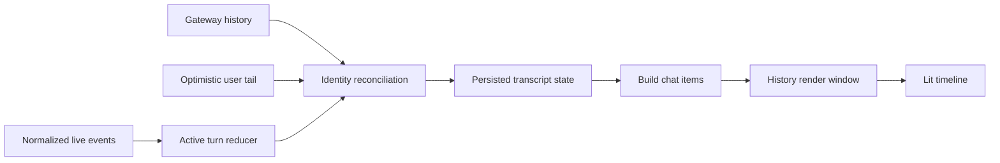

# Chat 渲染架构

本文按 `v2026.8.27` 的 `src/renderer/libs/openclaw-chat/`、`JustDoChatWrapper`、Gateway client 和相关测试重写。Chat 渲染不是“把 messages map 成 DOM”；它是 history、optimistic tail、实时事件、工具生命周期与滚动窗口的确定性投影。

## 1. 目标与不变量

附加会话的 `session.tool` 与普通 Agent 事件可能交错到达。工具详情允许按工具调用身份补入较早的 sequence，仍保留每个工具的去重与终态保护；终态后晚到的 start 只能补齐缺失参数，不能覆盖结果、状态或回退工具 sequence。运行活动的 sequence 比较限定在同一 run，补入不回退当前运行活动，新 run 从低 sequence 开始仍正常显示。历史中，用户续跑后的新 assistant run 可将旧 run 缺失结果的工具显示为中断，不伪造执行结果；同一轮中的子助手通知不结束等待中的工具。

- Gateway transcript/history 是持久消息权威。
- 当前 run 的 agent events 进入单一 reducer，不能再维护并行 overlay 状态机。
- sessionId、sessionKey、runId、lifecycleGeneration、sequence 和 stable message identity共同防串线。
- history/live/optimistic可对账并被替换，不靠文本相同或时间邻近去重。
- 高频delta最多每animation frame发布，长历史只渲染有界窗口。
- Markdown/diagram/tool输出是未可信内容，必须转义和清洗；性能降级不能裁剪canonical文本。
- 用户上滚后保持阅读锚点；新消息不强制抢焦点。

## 2. 模块地图

| 目录/文件                                | 职责                                                              |
| ---------------------------------------- | ----------------------------------------------------------------- |
| `JustDoChatWrapper.tsx`                  | React/Cowork与Lit chat的桥、Gateway订阅、session切换、history载入 |
| `gateway/client.ts`                      | Renderer Gateway client与连接信息适配                             |
| `gateway/chat-controller.ts`             | 对外状态/命令、订阅与transcript调度                               |
| `gateway/chat-history-protocol.ts`       | 原生offset分页、结构化超大行识别与完整消息补取                    |
| `model/chat-transcript-state.ts`         | persisted/history source、active turn、recent runs、revision      |
| `model/agent-event-reducer.ts`           | normalized agent event -> turn items                              |
| `model/session-message-apply.ts`         | durable append identity、ownership、去重与有序插入                |
| `model/history-reconciler.ts`            | history与active/optimistic identity对账                           |
| `model/history-window.ts`                | 750条窗口、每次250条前后移动                                      |
| `pipeline/build-chat-items.ts`           | 原始message -> group/timeline display items                       |
| `components/justdo-chat.ts`              | Lit组件、搜索、minimap、timeline、滚动、Mermaid后处理             |
| `components/markdown.ts`                 | Markdown-it、highlight、KaTeX、DOMPurify、stream边界/cache        |
| `controllers/assistant-stream-pacer.ts`  | 保留assistant快照边界并按frame平滑揭示                            |
| `controllers/stream-render-scheduler.ts` | frame合批和tool partial节流                                       |
| `controllers/chat-scroll-controller.ts`  | follow/paused、锚点、unseen revision、加载旧窗口                  |

## 3. 状态模型

`ChatTranscriptState`：当前 session key/id、persistedMessages、historySource、historyGeneration、activeTurn、recentRuns和revision。History source只有 `gateway` 或 `optimistic`：前者来自权威 history，后者是提交后等待 Gateway 接管的短暂用户尾部。Main/SQLite 不提供降级 transcript。

`AssistantTurn`绑定 run/session/lifecycle generation，状态 `running|final|aborted|error`，保存 last agent seq、时间、modelRef和有序items。Item分：

- Thinking：running/completed/failed/cancelled/interrupted；
- Tool：toolCallId/name/input/output/error与同样process status；
- Content：streaming/completed/interrupted，标记 delta/snapshot/replaceable；
- Terminal：aborted/error可见行。

最近24个run保留5分钟terminal/sequence fence，阻止迟到事件重新创建已结束turn。实时Tool结果保留完整canonical字符串；折叠detail和有界history DOM控制渲染成本，不再通过截断数据控制成本。

## 4. 端到端数据流

回复页脚的模型来自 Gateway 本轮 progress / final 消息和当前用户轮次的原生历史。
Main 的 `SessionRunTiming` 只决定开始、结束与状态；旧记录中发送前保存的
`modelRef` 不是实际执行证据，不能覆盖 Renderer 本轮的模型。运行中切换或 fallback
后，final 消息的模型优先于之前的 progress 模型，并随 Renderer turn timing 保留。
Gateway 分开的 provider/model 字段中，model 本身可以带 `/`，组装引用时必须保留 provider。
即使 model 自带与 provider 相同的前缀也不能去重，例如 `openrouter` 与
`openrouter/auto` 组成 `openrouter/openrouter/auto`。页脚查找当前轮次历史时应包含
尚未持久化的本地用户消息，避免在新轮开始时读取上一轮的回复模型。

Wrapper切换session时取消旧订阅、建立新generation、请求Gateway原生history/tool inputs/compaction detail，并设置chat element属性。Controller按session缓存未完成turn、pending user message、run activity和compaction状态；后台session的live/terminal事件及迟到的send/compact RPC结果写回所属缓存，重新选中时先恢复缓存再与history对账。

临时session转为canonical session必须由创建流程显式登记准确的source/target key。普通的“临时session → 其他已有session”导航不能推断为promotion，也不能迁移消息或sending状态。Live事件先经过shared domain分类，再送controller/reducer；完整final由后续`session.message`直接接管；无消息、带结构化截断标记、订阅未建立或已有持久化失效通知的final继续做有界补查。旧异步history请求即使晚返回，也因generation/session identity/active leaf fence被丢弃。

Gateway外层event sequence只属于单个WebSocket generation；每次连接都清空基线。发现向前缺口时当前socket立即退休，不消费缺口后的可疑帧，重连后重新订阅并加载history。Agent `payload.seq` 只提供run内顺序与去重栅栏，并不保证连续：累积Thinking/Content快照以及其他可替换高频事件可能被Gateway合并或因慢订阅者背压而丢弃，合法跳号不能触发断线。`chat.startup` / `chat.history` 返回的 `inFlightRun` 会重新接管run id/startedAt，按seq回放Thinking、Tool、Content等有界events，再以前缀安全规则合并累计text。这样切页、后台挂起和网络抖动后不依赖已丢失的delta；与请求并发发生的terminal或新run会通过run ownership fence拒绝陈旧snapshot。

`session.message` 是transcript append的增量权威通知。Controller先按Gateway message id、messageSeq、idempotency、run id和import provenance判断身份与producer ownership；可证明归属的user/current assistant/previous-run assistant立即去重或按seq插入，不再为每一行重载整段history。当前run的durable assistant保留在权威transcript中，但ActiveTurn存在时由显示投影隐藏，避免与流式Content/Tool双显。身份缺失、foreign/queued user、ambiguous assistant、partial import或截断内容仍回退history。

若对应Agent Tool start帧漏收或晚到，Controller还可在session/run identity和active-turn时间边界均匹配时，用稳定toolCallId恢复该append里的缺失Tool；若通知本身也因背压丢失，后续append暴露的messageSeq缺口会登记unresolved target并触发有界active-tail history追赶。只有权威history追到target并经过安全Tool hydration后才清除缺口，陈旧快照或请求失败会重试。恢复不替换整个live timeline，也不推进Agent sequence；每个新恢复Tool先作为live-tail边界，同一权威assistant row会补全并结束Tool前的Thinking。迟到的同轮Thinking帧只能更新已结束项而不能重新点亮；随后canonical start/result或携带同一toolCallId的Tool item原位确认该卡，无关status/commentary item不能释放边界。

## 5. Event admission

Reducer不只检查runId：

- session key先标准化并与当前域匹配；
- sessionId存在时必须一致；
- lifecycleGeneration防止同run id重用/重连污染；
- agent sequence按run维护单调高水位，并对Thinking/Tool等activity owner维护独立sequence fence；重复或回退的同身份事件忽略，但旧snapshot仍可补入此前未见的另一身份项；
- 新增的非展示stream也推进sequence fence；缺失的持久消息由history/session.message对账，活动文本由后续累计快照或in-flight snapshot接管；
- terminal recent run拒绝后续非合法修正；
- tool terminal status通过shared normalizer统一；
- foreign/detached run只在明确可见规则下形成历史项，不能抢当前active turn。

Main和Renderer共享 `agentEvent`/`messageDomain` 合约，禁止各自维护含义不同的字符串判断。

## 6. Reducer 规则

### 6.1 Thinking

start/delta/snapshot创建或更新独立Thinking item；兼容新版 `data.thinking` 与 `data.text`，文本按delta或snapshot规则合并。终止时变completed/failed/cancelled/interrupted。Thinking不拼入最终Content，也不因没有正文被隐藏。

### 6.2 Tool

用toolCallId稳定更新单卡；input只在详情展示，partial output节流，terminal result/error结束。`sessions_yield` 无输出但仍可显示蓝色running tool，不伪造空result。若其实时start漏收，可由身份受限的 `session.message` 或active-tail history按toolCallId恢复running卡片，并由后续实时事件原位完成；这种missing-item恢复不泛化到普通Tool。若持久化 history 中的 Tool 缺少 result，但其 root run receipt 已是 terminal，history projection 将该 Tool 收敛为 interrupted，不能在应用重启后继续显示呼吸灯。Projection 同时接收 running receipts 做 identity matching，但 running receipt 本身不能提供终态或耗时；同 root 的较新 running receipt 也会阻止旧 terminal receipt 错误结束当前 Tool。`progress_card` 的 Tool item 只投影为紧凑回执；完整卡片由 Renderer 调用 `progressCard.get` 读取，并在 `progressCard.changed` 后按 revision 刷新。

### 6.3 Content

Delta append、snapshot replace、replaceable允许权威final替换。文本merge处理suffix/prefix overlap，避免provider重复快照。final完成流；aborted/error把未完成内容标interrupted并增加terminal item。

运行中的producer-owned `session.message` assistant可以进入persisted transcript，但不能直接写入active Content；显示层在ActiveTurn结束前隐藏同run durable行。Tool及其前置Thinking/Content仍按稳定toolCallId修复活动项，不能让完整持久正文抢占后续流式增量。

Gateway v2026.9.2 原生 required-task join 必须在所有 required child terminal 后才允许父 turn 收敛。Renderer 只消费已获准的 assistant stream 与原生 task terminal event；被 Gateway 延迟或拒绝的 terminal 候选不能作为正文泄漏到 timeline。

### 6.4 Process summary

已完成的Thinking/Tool按时间压缩为process summary，默认不把完整输入/输出塞进主DOM。展开summary后仍按原时序展示；每个Tool有自己的detail disclosure。运行中的Thinking/Tool保持独立可见，不被已归档summary吞并。

## 7. History reconciliation

Stable transcript identity优先读取Gateway message id/记录标识，再用受控fallback。Reconciler：

1. normalize history role/content/tool blocks；
2. 对齐persisted和optimistic user message；
3. 识别active assistant正文是否已进入history；
4. 处理process summary takeover、failed-run message和project turn items；
5. 保留合法active tail，删除已被history覆盖的重复项；
6. 增加historyGeneration/revision。

首屏、切页与应用重启都直接以Gateway history恢复；提交后的optimistic user tail只在当前Controller内短暂存在，权威结果到达后takeover。每次刷新只读取一次`chat.startup`或`chat.history`，首屏和旧页均按250条读取，旧页直接使用响应的`nextOffset`调用`chat.history({ offset, limit: 250 })`。不存在Main IPC、REST或第二份独立快照之间的竞态；重复边界按source identity、projection和出现次数合并，尾页刷新不能让已推进的旧页cursor倒退。持续翻页直到新增可见消息或Gateway明确`hasMore: false`，不能用固定空页次数提前停止。Subagent首屏若尚未包含自己的task边界，会先沿同一原生offset链向前读取，而不是反复请求相同尾页。

同一物理会话运行期间，history响应中的`activeLeafEntryId`变化不能提前清空已显示历史或active turn：该快照仍须遵守active-run reconciliation约束。替换判断在异步消息补取结束、提交前读取当前运行状态；断线恢复的suspended reconciliation也保留running turn，继续确认远端运行状态。保留原leaf基线，等终态刷新可接管时再替换历史；显式reset与物理session identity轮换仍按各自生命周期处理。

Gateway会把超过单行history预算的消息替换为带`__openclaw.truncated`和message id的结构化占位。Renderer不再嗅探`...(truncated)...`文本：先用原生`chat.message.get`补取完整display message；若原生返回`oversized`或响应超过WebSocket frame预算，再调用受保护的`justdoRuntimeBridge.historyMessage`，按有界字符块从原生SQLite transcript的active branch重组同一message id。Bridge只接受Gateway已经发出的id，不列举消息；一次transfer固定同一份序列化快照，避免逐块重读整个transcript。只有全部块到齐并通过JSON解析后才替换占位，原display identity保留但`truncated/reason`标记被移除。

Tool input lookup先使用原生 `chat.history` display projection，再通过 `justdoRuntimeBridge.historyDetails` 的 `operator.read` RPC 按 session 和 call id 有界补齐，不能跨 transcript 搜相同 call id，也不能直接读取 `sessions.json`。工具参数与 compaction detail 的缺失 ID 均去重后按最多 250 个分批顺序查询；批次失败保留原始消息与其他成功批次的详情。

## 8. History 窗口

默认只渲染最新750条，older/newer每次移动250。用户在最新窗口时新history继续锁定尾部；浏览旧窗口时用第一条可见stable identity在新数组中重新定位，identity不存在才用索引clamp。窗口切换按滚动方向在距离边缘两个viewport时预取，避免反向误切和用户先撞到边界再等待刷新。

窗口是DOM/投影优化，不限制Gateway分页存储。Controller的chunked history store持有所有已加载页，`chatMessages`只保留最近权威窗口；加载旧页时保留滚动锚点和搜索/minimap identity。异步older返回前若用户转向newer/latest，只按prepend数量平移窗口，不反向覆盖用户意图。滚动期锚点/minimap更新按animation frame合并，并用有序节点的二分定位限制同步layout测量；不能用反复数组前插导致O(n²)组装。

## 9. 渲染管线

`buildChatItems`先 normalize role/message、过滤内部runtime context/heartbeat展示、恢复attachments和tool cards，再分project turns/message groups。Pipeline中的user content、role、stream text、text direction、search match和tool helper保持纯函数。

Timeline层决定avatar、sender/model label、timestamp、duration、usage、goal reply零usage隐藏、process/footer。配置的assistant名称不是模型metadata；真实modelName缺失时使用通用assistant label。

外观设置可在气泡和文档两种消息布局之间切换，默认保持气泡布局以兼容旧配置。文档布局只去除assistant Content的气泡背景与圆角，user Content仍使用右侧气泡，assistant avatar、Thinking、Tool、process summary和附件卡继续保持原有展示与disclosure层级。两种布局都会按消息密度为相邻assistant timeline行保留清晰的垂直间距。该选项只通过继承的CSS custom properties改变展示，不改写Gateway transcript、timeline identity或导出内容。

## 10. Markdown 与安全

`toSanitizedMarkdownHtml` 使用 Markdown-it的linkify/breaks、task list、texmath/KaTeX和自定义fence/table规则，再用DOMPurify tag/attribute allowlist清洗。

完整Markdown解析预算为40,000字符；超过预算时整条消息降级为经过转义和DOMPurify清洗的plaintext，但不丢弃任何字符或首尾空白。cache最多200项且只缓存不超过50,000字符的输入，version为 `markdown-render-v13`。Unknown code language只转义不自动highlight；自动highlight语言是固定allowlist。

链接修正CJK尾随标点但不改显式Markdown link。HTML原文不会直接注入。inline data image仅允许明确image MIME。

## 11. Streaming Markdown

未闭合fence、容器或语法在stream中会造成DOM大幅抖动。`findStableStreamingMarkdownBoundary`只完整解析稳定前缀，尾部以escaped plaintext显示；完成后再全量解析。普通包含box-drawing字符的文本不自动当diagram，只有完整上下边框的独立块才进入diagram展示。

## 12. Mermaid、公式与代码

Mermaid source先以sanitized block进入DOM，component updated后异步render SVG；失败保留syntax error并清临时节点，不展示Mermaid错误画布。Shadow root内使用document-level render后安全注入preview。气泡宽度约束500..820并按SVG调整，支持source/preview切换。

KaTeX由texmath生成且仍经过sanitizer。代码块提供copy按钮；复制来自已解析code文本，不执行内容。

## 13. 滚动

ScrollController只有follow/paused：在底部（0.5px容差）follow并随revision滚到底；用户上滚进入paused并累计unseen revisions。渲染前捕获最多3个可见DOM锚点及offset，渲染/resize后用存活锚恢复位置。

按滚动方向在距上下边缘两个viewport时预取older/newer window，窗口切换期间保持paused。搜索/minimap导航记录target并阻止render anchor和方向预取干扰；“跳到最新”清unseen恢复follow。展开工具/summary前保存interaction anchor，避免高度变化跳屏。

## 14. 渲染调度与性能

Canonical transcript始终立即接收完整assistant snapshot；显示层以canonical文本游标和snapshot结束位置按`requestAnimationFrame`依次揭示，避免provider在同一browser task内突发多个delta时直接跳出整段文本。正常流以24个grapheme为每frame目标并保留provider边界，边界对象上限240；超大重连snapshot按剩余字符和剩余frame自适应提高预算，保证在45 frame内收敛。非prefix权威修订、terminal guard rollback、Tool边界和turn terminal不会继续播放已撤销或越界的旧文本；会话切换返回已有live turn时直接seed当前可见正文，不重播历史。

Stream scheduler负责驱动上述显示节奏；无RAF时在一个microtask内直接收敛，tool partial有独立最小间隔，terminal立即发布当前frame但允许剩余合法正文继续有界追平。Dispose清timer/frame和显示状态。Final追平期间仍按streaming Markdown渲染不完整前缀；若authoritative history先到，component保留该terminal投影直到游标排空，再无缝交给history。该节奏器只改变active Content投影，不修改reducer、history或导出所读的canonical文本；流式期间DOM搜索、复制与`aria-busy`保持和当前可见进度一致，完成态Mermaid增强会等待对应Content追平后再运行。

性能边界包括：有界history DOM、Markdown解析预算与cache、超长Markdown的完整plaintext降级、collapsed detail不入DOM、persisted timeline/render cache、minimap最少2项才显示。任何新投影应避免每个token重新扫描全部history或JSON stringify大对象作为key；不能用裁剪canonical Thinking/Tool/Content代替渲染优化。

## 15. 搜索与 Minimap

搜索收集shadow DOM text nodes，跳过不应搜索的控件，标记match并展开包含它的summary/tool disclosure；清除时还原文本。Match count通过component event回React modal。

侧边栏的全局会话搜索与当前聊天内 DOM 搜索是两条独立链路。标题由 Renderer 在 Cowork session summary 上即时匹配；用户消息和 assistant Content 通过受控 preload IPC 调用 Gateway `sessions.search`。Main 按 agent 分组、按协议上限分批传入 JustDo session keys；截断批次递归二分后再按会话去重、全局排序，并把命中 key 映射回本地 session id。搜索弹窗使用独立的扁平结果列表，每个会话只显示标题和最多一行最佳消息片段，并直接高亮查询词，不复用侧边栏分组、拖拽或管理菜单。搜索结果不写入 SQLite/Redux，也不逐会话加载 `chat.history`；Gateway 原生 transcript FTS 仍是消息索引权威。首次查询若报告索引正在 reconcile，Renderer 会做有界退避重试；超时、截断或部分 agent 失败会显示可重试的不完整状态，不能伪装成无结果。

Minimap从timeline identity生成entry，追踪当前viewport并支持hover preview/点击导航。DOM anchor使用data-history-key/data-process-id等稳定属性，不以数组index作为跨更新身份。

## 16. Attachments 与路径

附件转换为Gateway content blocks，历史媒体从结构化message提取。OpenClaw 在消息的 `openclawDelivery.mediaUrls` 中记录模型输出的原始 `MEDIA:` 引用；JustDo 保留这个字段并直接生成文件卡片，不依赖 managed `/api/chat/media/outgoing/...` 下载地址。Windows 绝对路径原样用于文件操作，相对路径与当前工作空间目录拼接；白名单扩展名通过 Main 读取真实文件并在可编辑侧边栏打开，“使用系统工具打开”交给系统关联工具，“打开所在的文件夹”交给系统文件管理器。文件是否存在不影响卡片生成；用户点击时若文件已不存在，操作层显示“文件不存在”。对于已经通过本地媒体根目录、常规文件、符号链接和大小检查的 trusted local MEDIA 文件，无法识别 MIME 时以 `application/octet-stream` 的附件交付；不能借此放宽远程或不可信来源。消息复制遵循 OpenClaw WebChat 的可见 Markdown 语义，不承诺复制已被展示投影移除的原始 `MEDIA:` 指令。Markdown本地路径链接经专门utility转成应用操作；图片保存由Main shell IPC执行。双击消息图片通过专用IPC打开无 parent 的独立原生查看窗口，查看器使用单独的沙箱Renderer和最小权限preload，并在自身窗口内处理滚轮缩放、拖动与双击复位；最大化/还原由操作系统窗口框架负责，不受聊天主窗口尺寸限制。Renderer不能直接读 `file://`；`localfile://` 使用需遵守安全文档中的限制。

## 17. Goal、Compaction 与错误

压缩进度消费原生 `agent` compaction stream 和 `session.operation`，包括已切到后台的会话。`end` 中的 `completed: false` 或 `outcome: failed/skipped/aborted` 必须显示对应失败、跳过、取消状态，不能生成成功提示或等待不存在的成功 history marker。存在 `itemId/operationId` 时按操作身份去重并拒绝前一操作的迟到事件；没有身份的连续 start 不用时间窗口猜测是否重复。手动 `sessions.compact` 的 payload `ok: false` 通常是业务失败，但原生 preflight 的 `Already compacted` 与 `Nothing to compact (session too small)` 也是该形状，必须精确识别为无需压缩，其他失败不能被吞掉。原生 1800 秒 watchdog 会随进展重置，并非总执行上限，因此 `sessions.compact` 不再设置前端固定 RPC 总超时，仍由原生 watchdog 和断连拒绝收敛；其他 RPC 保持 90 秒超时。手动请求按连接和本地请求身份隔离，旧请求返回不得覆盖新操作。

压缩成功后从原生 history/checkpoint 查询补齐 summary 与 token 数；自动压缩按 marker 的 `itemId` 精确接管对应本地状态，不能把 transcript entry id 当作 item id，也不能用上一轮迟到 marker 替换下一轮状态。已经确认成功的压缩在临时 history 读取失败时保留成功提示，并有界重试补全。运行时若提供摘要增量则可以展示，但不要求原生 compaction stream 一定发送增量。当前仅展示摘要，不生成指向尚未实现的 checkpoint branch/restore 界面的操作提示。

历史 marker 可以先于原生 `end` 到达：这时只隐藏对应本地卡片，保留操作身份直到终态；若提交后扩展失败，同时保留已提交 marker 和失败诊断。连接中断时清除尚未确认的压缩进度，避免后台失败事件漏收后永久显示“压缩中”，后续由新的原生事件与历史恢复显示。

Goal card 位于 chat 周边，Goal 内容/状态来自 Gateway session row，自动续跑 phase 来自 Main snapshot。卡片生命周期按钮通过最小 preload IPC 提交带 goalId fence 的 structured mutation；start/resume 的 optimistic user text 始终显示用户原文，不展示 transport intent 或历史 follow-up envelope。`usage_limited`、`budget_limited` 使用独立状态文案，token 用量直接显示；elapsed 只在 active 时递增，并冻结在 paused/blocked/limited/complete 的原生时间戳。Compaction history detail通过专用IPC读取，timeline展示summary、tokens before/after和recovery progress；不把内部context markers显示给用户。

输入区上下文圆环与 OpenClaw webchat 使用同一会话行口径：初始值取 `chat.history.sessionInfo`，运行中的更新取 `sessions.changed` 以及 transcript-derived `session.message.session`，只在 session 已有 `totalTokens` 且能确定 context limit 时展示；`totalTokensFresh: false` 以 `~` 标记近似值。Controller 按 session identity 与 `updatedAt` 拒绝陈旧 history/event 快照，同时允许压缩后的 token 数下降；显示层把超过窗口的 provider 值限制为 100%。该链路不再维护独立 estimate cache，也不再通过 Main IPC 轮询 `sessions.describe/list`。

长时间无输出提示由active turn clock派生，仅表示等待，不宣告失败。Failed run message必须区分abort、error、transport和tool failure；OpenClaw log hint仅从streaming active content的特定系统尾部移除，普通完成内容中的“Logs”标题保留。

历史失败消息不使用会话级 `lastError` 回填；错误详情优先取消息自身的 `errorMessage`，其次取同一 run 的失败记录。缺少 run identity 时仅允许唯一且完全相同的时间戳匹配，不使用一分钟邻近窗口，避免新一轮失败改写历史错误。匿名失败消息一旦关联失败记录，不再被其他 run 覆盖；补齐错误详情时保留原生消息已有的错误正文。

## 18. 会话导出

导出使用Cowork session presentation与canonical items生成文本/Markdown等产品格式，包含必要角色、时间和内容；不直接dump internal state、token、approval payload或Gateway原始JSON。导出前需完成当前显示history加载范围的产品约定，避免误称“完整”却只导出窗口。

## 19. 测试矩阵

现有测试覆盖 WebSocket generation gap、in-flight run按owner补洞、reducer sequence/terminal/tool/thinking、session.message身份/producer admission/插序/去重、history identity/window/reconcile、optimistic tail、process summary、tool lifecycle/cards、active timeline、漏收 `sessions_yield` start后的直接恢复、messageSeq缺口、陈旧history重试、连续/重复/乱序cursor、foreign/旧/无timestamp拒绝及后续sequence连续性、Markdown/KaTeX/Mermaid、stream scheduler、scroll、minimap和wrapper辅助逻辑。

变更还应覆盖：session快速切换、旧request晚返回、重连generation、foreign run、分页两端、超大Markdown/tool输出、XSS payload、展开锚点、search disclosure、RTL/CJK、无RAF/ResizeObserver、history takeover和导出一致性。

## 20. 维护规则

- 新Gateway event先确认消费边界：聊天数据面更新Renderer normalize/reducer，产品生命周期面才同步Main adapter；不要重新双路投影同一消息。
- 不在component render中修协议；复杂转换放纯函数并测试。
- active状态只经transcript reducer/reconciler变更；durable append只经session-message apply或history reconciler进入persisted状态。
- 调整limit必须以性能profile和内存证据为依据。
- Chat架构变化同步Cowork、thin frontend、capability matrix和相关feature审计。

## 21. Item Identity 规则

History message、live assistant segment、tool lifecycle、thinking、plan 和 process summary 使用不同 identity namespace。相同文本不代表相同 item，时间戳也不能单独唯一。Reconciliation key 应优先使用 Gateway message/run/tool/call identity，并把 session domain 纳入；fallback identity 必须稳定且在测试中覆盖碰撞。

## 22. Terminal 与 Takeover

Terminal event 关闭 active reducer 的本次 run，但 OpenClaw 的两条final广播路径都可能先经过默认8K display projection。结构化截断final不能回退已经完整到达的live Content，也不能取消补全；只有前缀能够证明时才用live段恢复显示，并继续以100/400/1500/3000ms有界退避等待完整durable row。完整final保留optimistic tail，订阅到的producer-owned完整`session.message`按message/run identity原位替换并退休active turn；截断`session.message`只触发补查，不能覆盖完整本地投影。无消息、订阅缺口和`sessions.changed phase: message`失效同样进入补查。每次重试绑定session key/id、run与history generation，并且只把非optimistic、非truncated消息视为追平证据。

## 23. 渲染预算与降级

| 内容            | 控制                             | 降级                             |
| --------------- | -------------------------------- | -------------------------------- |
| History         | 750/250 有界窗口及分块           | 保留锚点，按需加载旧页           |
| Streaming delta | snapshot边界游标、45-frame追赶   | 大快照自适应、终态立即收敛       |
| Markdown        | normalize/cache/解析预算         | 全量escaped plaintext            |
| Mermaid         | source hash/cache/尺寸与错误边界 | 显示源码/错误卡，不执行任意 HTML |
| Highlight/KaTeX | 按块处理与 cache                 | 未识别语言/公式显示安全文本      |
| Tool output     | 摘要卡 + disclosure              | 折叠时不挂detail DOM，数据不裁剪 |

限额是产品行为，调整时要同时评估内存、首屏、搜索范围、导出语义和 accessibility，不只观察单次 benchmark。

## 24. 可访问性与交互不变量

Streaming 更新不应抢走键盘焦点或反复触发 screen reader 整页朗读；tool/plan disclosure 使用可聚焦控件与 `aria-expanded`；搜索/minimap 结果需可键盘导航。自动滚动只在用户仍位于跟随区域时发生，用户向上阅读后新 delta 不应强制拉回底部。

## 25. 代码证据地图

| 行为               | 入口/测试                                                         |
| ------------------ | ----------------------------------------------------------------- |
| Event reducer      | `model/agent-event-reducer.ts` 及测试                             |
| Transcript/history | `chat-transcript-state.ts`、history/window/reconciler tests       |
| Durable append     | `session-message-apply.ts` 及controller集成测试                   |
| Optimistic         | `optimistic-user-message.ts`、`optimistic-history-tail.ts` 及测试 |
| Projection         | `project-history-timeline.ts`、`project-turn-items.ts` 及测试     |
| Item pipeline      | `pipeline/build-chat-items.ts`、normalizer/tool tests             |
| Streaming/scroll   | controllers scheduler/scroll tests                                |
| Search/minimap     | `search-match.ts`、`chat-minimap.ts` 及测试                       |
| Gateway transport  | `gateway/client.ts`、`gateway/chat-controller.ts` 及测试          |

## 26. Chat 变更完成条件

新增 item/event 必须同时说明 live 与 history 表达、identity、session/run admission、terminal/takeover、渲染清洗、性能上限、搜索/导出和失败 fallback。至少测试乱序、重复、session 切换、分页、重连和危险内容；只截图证明视觉正常不构成数据流验收。

### 系统消息展示边界

同一用户轮次中连续且文本相同的失败记录仅在最终 timeline 投影中保留一条。明确的不同 runId 或失败记录 ID 不合并；缺少 runId 时，必须在当前快照中见到用户消息边界才合并连续错误。新用户消息、正常回复、工具记录及不同错误都会打断合并；附带工具结果的失败行始终保留。分页缺少用户边界时保守保留匿名失败。去重状态仅存在于单次投影调用，原始消息数组、messageSeq、Gateway transcript、运行状态与重试行为均保持完整。

Gateway 的 display history 会清除 assistant 错误的 errorMessage。历史 hydration 仅对空失败或通用失败提示且有消息 ID 的行，通过 justdoRuntimeBridge.historyDetails 的 failureMessageIds 批量恢复详情，每批最多 250 个 ID、一次可见 transcript 读取。仅补回经过 OpenClaw 内置敏感信息过滤并限制为 2000 字符的 errorMessage，不复制 diagnostics/errorBody 或替换原消息身份。已有部分回复、工具内容和具体恢复建议不触发读取。详情不可用时保留原提示；不借用其他轮次或当前会话的 lastError。截断行先恢复完整消息，再补充错误详情，最后执行失败消息规范化和展示合并。

Renderer 的 pipeline/system-message-display.ts 统一过滤历史消息、实时 Content 及实时/历史终态错误中的内部日志提示：旧版 Log:/Logs: 行、独立命令行，以及新版完整句子 To view logs, run ... in a terminal.。流式输出仅暂扣末尾匹配的提示前缀，完成后保留不完整或无关文本；实际错误原因和恢复建议不变。规则不依赖模型元数据，因为 Gateway 投影可能省略它；用户及工具正文不经过此过滤。原始 Gateway transcript 和诊断日志不改写。

气泡页脚、活动轮次页脚及会话详情使用共享的 isGatewayInjectedModelRef 判断内部模型标识，覆盖裸名、provider 前缀及大小写变化；气泡显示现有本地化系统消息标签，模型统计隐藏该内部标识。
