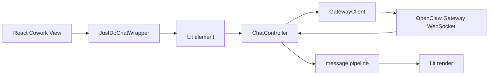
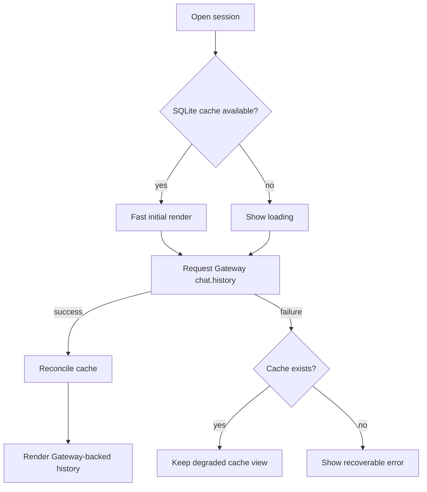

# Chat 渲染

JustDo 的聊天渲染由 React 容器和 Lit 自定义元素共同完成。React 负责应用 shell、session 选择、输入和 ask-user 交互 UI；`<justdo-chat>` 负责消息渲染管线，并连接本地 OpenClaw Gateway WebSocket。

## 关键文件

| 文件                                                             | 作用                                       |
| ---------------------------------------------------------------- | ------------------------------------------ |
| `src/renderer/features/cowork/components/JustDoChatWrapper.tsx`  | React wrapper                              |
| `src/renderer/features/cowork/components/ChatMessageDisplay.tsx` | Cowork message display integration         |
| `src/renderer/libs/openclaw-chat/components/justdo-chat.ts`      | Lit custom element                         |
| `src/renderer/libs/openclaw-chat/gateway/client.ts`              | Gateway WebSocket client                   |
| `src/renderer/libs/openclaw-chat/gateway/chat-controller.ts`     | chat controller                            |
| `src/renderer/libs/openclaw-chat/pipeline/`                      | message normalization/build/render helpers |
| `src/renderer/libs/openclaw-chat/components/markdown.ts`         | Markdown renderer                          |
| `src/renderer/libs/openclaw-chat/components/tool-display.ts`     | tool display                               |

## 渲染流程

## Pipeline

`src/renderer/libs/openclaw-chat/pipeline/` 包含：

- message extraction
- role normalization
- stream text handling
- heartbeat display
- tool card construction
- user message content handling
- search match
- text direction
- history limits

## Markdown

Markdown renderer 使用：

- `markdown-it`
- `markdown-it-task-lists`
- `markdown-it-texmath`
- `katex`
- `highlight.js`
- `mermaid`
- `dompurify`

渲染输出必须经过 sanitizer，避免把模型输出直接作为可信 HTML。

## Thinking Stream

Thinking/reasoning 内容通过 Gateway stream 和 runtime patch 支持。Renderer 不维护独立 thinking 状态机；它把 stream delta 交给 chat pipeline 展示。

相关文档：`docs/features/thinking-stream-implementation.md`。

## Goal 状态展示

`/goal` 的生命周期由 OpenClaw 持有，JustDo 不从命令回复文本反向解析状态。主进程通过现有 `sessions.list` 会话状态查询读取并校验 `goal`，再随 context usage IPC 返回 renderer。`CoworkPromptInput` 在输入区上方展示独立的 `GoalStatusCard`：

- 覆盖 `active`、`paused`、`blocked`、`usage_limited`、`budget_limited`、`complete` 全部状态。
- renderer 在提交创建型 `/goal` 命令时先从命令参数生成仅用于展示的 optimistic objective，因此首页首轮切换到临时 session 后也会立即出现卡片；一旦 Gateway 返回权威 `goal`，立即替换 optimistic 状态。
- 运行期间每 1.5 秒读取一次 `sessions.list` 中的 Goal，空闲但 Goal 仍为 `active` 时降频到每 5 秒；运行状态查询不得因 session active 而被主进程拒绝。终态停止轮询，后续控制命令和新一轮运行会重新触发刷新。
- `ChatController` 的 live state 被投影为 `starting`、`thinking`、`tool`、`responding` 四种瞬时执行阶段，卡片显示当前阶段、已执行工具数量和本轮耗时。它们是运行活动提示，不伪装成可量化的任务完成百分比。
- 展示 objective、最后状态备注、token 使用量及预算进度。
- OpenClaw 在缺少 fresh token baseline 时会把首个 Goal 回合结束后的快照作为基线，此时自动回复可能产生不可靠的 `Tokens used: 0`；JustDo 会隐藏该零值及零进度，取得正数用量后再展示。
- 根据当前状态提供 pause、resume、complete 或 clear 快捷操作；操作仍以 `/goal` 命令交给 Gateway 执行。
- Gateway 查询暂时失败时保留最后一次有效状态，切换 session 时立即清空，避免跨会话串状态。
- `/goal` 的两条发送路径都会先通过幂等的 `sessions.create` 建立或复用 OpenClaw 会话记录并取得 `sessionId`，再调用 `chat.send`：首页首轮由主进程 `OpenClawRuntimeAdapter` 处理，已有会话的后续消息由 renderer `ChatController` 处理。预建失败时停止发送，避免命令作为普通文本进入模型；不能仅凭 `chat.startup/history` 返回的候选 ID 判断持久化记录已经存在。

Goal UI 是 React 输入区状态，不进入 Lit message pipeline；命令产生的历史消息仍由正常聊天渲染链路处理。

## 工具显示

工具调用通过 pipeline 归一化为 tool cards/activity groups。工具输入等敏感历史数据通过 Main IPC 从 Gateway state/history 读取，不由 renderer 直接访问 runtime 文件。

## 维护规则

- 修改消息结构时先更新 pipeline tests。
- 不在 React 层重复实现 Lit pipeline 的消息解析。
- 新增 Markdown capability 时检查 sanitizer 和 CSP。
- 新增 Gateway WebSocket 行为时同步 `GatewayClient`、`ChatController` 和 IPC fallback。

## 版本

- JustDo: `v2026.7.6`
- OpenClaw Gateway: `v2026.6.11`

## 组件职责

### `JustDoChatWrapper`

React 与 Lit 的边界组件。它负责把 React props 转换成 custom element attributes/properties，并处理挂载/卸载生命周期。

不应在 wrapper 中实现复杂 message parsing。Wrapper 的职责是：

- 提供 session/gateway connection 参数。
- 订阅必要的 React-side 状态。
- 把 UI 事件桥接回 React。
- 处理 loading/error shell。

### `GatewayClient`

Gateway WebSocket 客户端负责：

- 连接本地 Gateway。
- 处理 challenge/auth。
- 发送 chat/session/history 相关请求。
- 分发 Gateway event。
- 在系统 resume 或 Gateway restart 后重连。

Token、port 等敏感连接信息通过 Main IPC 获取，不写死在 renderer。

### `ChatController`

Controller 是 Gateway event 到 Lit state 的协调层。它不应该知道 React Redux 的内部结构，也不应该直接操作 SQLite。

主要职责：

- 维护当前 chat session 的展示状态。
- 接收 stream event。
- 调用 pipeline 构建 render items。
- 处理 history load 和 incremental update。

状态协调必须遵守以下约束：

- 切换 session 时先取消上一 session 的 message subscription，再订阅目标 session。
- optimistic user message、live final 和 history apply 都要同步更新对应 session 的内存缓存。
- active run 拥有实时展示状态；并发 history 结果不能回退 stream、thinking、tool 或可见消息。
- history 的附件合并先于异步图片解析，异步结果只允许提交到发起时的 session 和消息版本。
- `chat.send` ack 前使用本地临时 runId；首个同 session Gateway event 可以将其绑定为真实 runId。

## Message Pipeline 详细设计

Pipeline 的目标是把 Gateway/raw/cached message 统一成可渲染 chat item。

```mermaid
flowchart LR
  Raw["Gateway/raw/cache messages"] --> Extract["message-extract"]
  Extract --> Normalize["message-normalizer"]
  Normalize --> Role["role-normalizer"]
  Role --> UserContent["user-message-content"]
  UserContent --> Stream["stream-text"]
  Stream --> Tools["tool-cards/tool-helpers"]
  Tools --> Build["build-chat-items"]
  Build --> Grouped["grouped-render"]
  Grouped --> DOM["Lit DOM"]
```

各层职责：

| 模块                    | 职责                                          |
| ----------------------- | --------------------------------------------- |
| `message-extract.ts`    | 从 Gateway payload 中抽取文本、工具、metadata |
| `message-normalizer.ts` | 统一字段形态，处理缺省值                      |
| `role-normalizer.ts`    | 标准化 user/assistant/system/tool 等 role     |
| `stream-text.ts`        | 处理流式文本片段和增量展示                    |
| `tool-cards.ts`         | 生成工具调用展示模型                          |
| `heartbeat-display.ts`  | 处理 Gateway heartbeat/活动提示               |
| `build-chat-items.ts`   | 生成最终 render item 列表                     |
| `grouped-render.ts`     | 把连续消息分组渲染                            |

## History Loading

聊天视图可能来自三种输入：

1. Gateway live stream。
2. Gateway `chat.history`。
3. SQLite message cache。

优先级是 Gateway live/history 高于 SQLite cache。SQLite cache 适合快速首屏和离线/故障降级，但恢复后应由 Gateway history 校正。

## Tool Cards

Tool card 的展示应区分：

- tool 正在运行。
- tool 成功。
- tool 失败。
- tool input 可查看。
- tool output 有 artifact/file。

敏感 tool input 不应随意塞进 DOM。需要读取历史 tool input 时，通过 `openclaw.history.getToolInputs()` 走 Main IPC。

## Markdown 安全

模型输出是不可信输入。Markdown 渲染必须：

- 禁止任意 script。
- 对 HTML 输出 sanitize。
- 外部链接通过安全打开路径。
- Mermaid/KaTeX 错误不能打断整条消息渲染。
- 代码高亮失败时降级为纯文本 code block。

## 性能考虑

- 长历史应分页或限制渲染数量。
- 流式 delta 更新应避免重建整棵 DOM。
- 大型 code block/mermaid 图要考虑懒渲染。
- Search highlight 不应改变 message identity。

## 测试重点

- grouped render。
- markdown task list/math/code。
- message normalization。
- Gateway client reconnect。
- tool card display。
- stream text incremental update。
