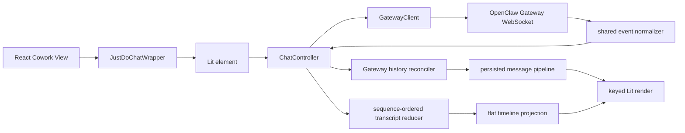
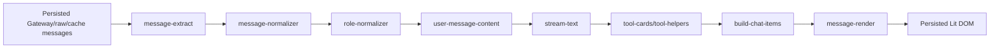
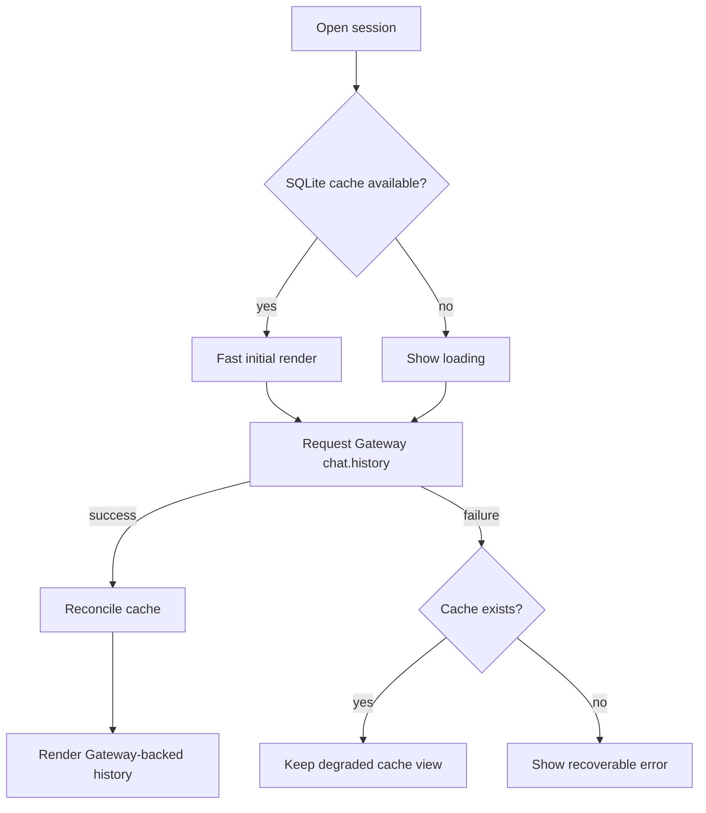

# Chat 渲染

JustDo 的聊天渲染由 React 容器和 Lit 自定义元素共同完成。React 负责应用 shell、session 选择、输入和 ask-user 交互 UI；`<justdo-chat>` 负责消息渲染管线，并连接本地 OpenClaw Gateway WebSocket。

## 关键文件

| 文件                                                             | 作用                                   |
| ---------------------------------------------------------------- | -------------------------------------- |
| `src/renderer/features/cowork/components/JustDoChatWrapper.tsx`  | React wrapper                          |
| `src/renderer/features/cowork/components/ChatMessageDisplay.tsx` | Cowork message display integration     |
| `src/renderer/libs/openclaw-chat/components/justdo-chat.ts`      | Lit custom element                     |
| `src/renderer/libs/openclaw-chat/gateway/client.ts`              | Gateway WebSocket client               |
| `src/renderer/libs/openclaw-chat/gateway/chat-controller.ts`     | chat controller                        |
| `src/shared/openclaw/agentEvent.ts`                              | Agent/chat event 协议归一化            |
| `src/renderer/libs/openclaw-chat/model/`                         | live transcript reducer、对账与投影    |
| `src/renderer/libs/openclaw-chat/controllers/`                   | render 调度与滚动状态                  |
| `src/renderer/libs/openclaw-chat/pipeline/`                      | persisted history normalization/render |
| `src/renderer/libs/openclaw-chat/components/markdown.ts`         | Markdown renderer                      |
| `src/renderer/libs/openclaw-chat/components/tool-display.ts`     | tool display                           |

## 渲染流程

## Pipeline

`src/renderer/libs/openclaw-chat/pipeline/` 包含：

- message extraction
- role normalization
- stream text handling
- heartbeat display
- tool card construction
- user message content handling
- search match
- text direction
- history limits

## Markdown

Markdown renderer 使用：

- `markdown-it`
- `markdown-it-task-lists`
- `markdown-it-texmath`
- `katex`
- `highlight.js`
- `mermaid`
- `dompurify`

渲染输出必须经过 sanitizer，避免把模型输出直接作为可信 HTML。

## Live timeline

Thinking/reasoning、Tool 和 Content 由 renderer-owned canonical transcript reducer
按 `runId + payload.seq` 排序。Gateway frame `seq` 只用于 transport 诊断，
`chat` event 的状态序列也不与 Agent sequence 比较。当前 bundled runtime 若只提供
`aseq`，shared normalizer 会走显式兼容回退。

Reducer 保留完整的 flat `TurnItem[]`；展示 selector 才把连续成功的 Thinking/Tool
压缩为 process summary。Content、用户消息、divider、terminal 和 run/session
边界都会结束 summary。运行中和失败/取消/中断的过程项保持可见。点击 summary
会通过原地 disclosure 在其时间线位置按稳定 item ID 和原始
顺序展开已归档的 Thinking/Tool；相邻 Content 保持在原位置，因此展开后仍能直接
阅读真实发生顺序。这是唯一的折叠层；旧的 `N tools: Tool1、Tool2` 二级分组及
Thinking/Tools 嵌套 cluster 已删除，不得由 persisted Content renderer 重新生成。
summary 折叠时 Tool input/output 不进入主时间线 DOM；用户原地展开 summary 后，
每个 Tool 才以独立详情项展示参数和有界结果。展开项不显示序号或逐项耗时。
persisted history 与 active-turn 投影在组成完整可见时间线后再合并相邻 summary，
合并时保留第一个归档项派生的稳定 key；Content 等真实边界始终阻止合并。

`message-render.ts` 仅负责普通用户/助手 Content、附件、Canvas、头像和 footer
布局能力。它不得渲染 Thinking 或 Tool，也不得包含这两类过程项的
`details`/`summary` disclosure；过程项的唯一展开状态由 `process-summary` 持有。

相关文档：`docs/features/thinking-stream-implementation.md`。

## Goal 状态展示

`/goal` 的生命周期由 OpenClaw 持有，JustDo 不从命令回复文本反向解析状态。主进程通过现有 `sessions.list` 会话状态查询读取并校验 `goal`，再随 context usage IPC 返回 renderer。`CoworkPromptInput` 在输入区上方展示独立的 `GoalStatusCard`：

- 覆盖 `active`、`paused`、`blocked`、`usage_limited`、`budget_limited`、`complete` 全部状态。
- renderer 在提交创建型 `/goal` 命令时先从命令参数生成仅用于展示的 optimistic objective，因此首页首轮切换到临时 session 后也会立即出现卡片；一旦 Gateway 返回权威 `goal`，立即替换 optimistic 状态。
- 运行期间每 1.5 秒读取一次 `sessions.list` 中的 Goal，空闲但 Goal 仍为 `active` 时降频到每 5 秒；运行状态查询不得因 session active 而被主进程拒绝。终态停止轮询，后续控制命令和新一轮运行会重新触发刷新。
- `ChatController` 的 live state 被投影为 `starting`、`thinking`、`tool`、`responding`、`compacting` 五种瞬时执行阶段，卡片显示当前阶段、已执行工具数量和本轮耗时。它们是运行活动提示，不伪装成可量化的任务完成百分比。
- 展示 objective、最后状态备注、token 使用量及预算进度。
- OpenClaw 在缺少 fresh token baseline 时会把首个 Goal 回合结束后的快照作为基线，此时自动回复可能产生不可靠的 `Tokens used: 0`；JustDo 会隐藏该零值及零进度，取得正数用量后再展示。
- 根据当前状态提供 pause、resume、complete 或 clear 快捷操作；操作仍以 `/goal` 命令交给 Gateway 执行。
- Gateway 查询暂时失败时保留最后一次有效状态，切换 session 时立即清空，避免跨会话串状态。
- `/goal` 的两条发送路径都会先通过幂等的 `sessions.create` 建立或复用 OpenClaw 会话记录并取得 `sessionId`，再调用 `chat.send`：首页首轮由主进程 `OpenClawRuntimeAdapter` 处理，已有会话的后续消息由 renderer `ChatController` 处理。预建失败时停止发送，避免命令作为普通文本进入模型；不能仅凭 `chat.startup/history` 返回的候选 ID 判断持久化记录已经存在。

Goal UI 是 React 输入区状态，不进入 Lit message pipeline；命令产生的历史消息仍由正常聊天渲染链路处理。

## Slash command 执行边界

`src/shared/slashCommands.ts` 统一解析命令并描述 JustDo 侧的特殊执行行为。未登记特殊行为的新命令默认作为普通 `chat.send` 消息交给 Gateway，因此新增 Gateway 原生命令不需要修改 renderer 分支。

- 仅本地执行、发送前置条件、提交前清空输入框等 transport/UI 差异在共享行为表中声明。
- `ChatController` 分别通过 local handler 和 before-send hook 表执行行为；新增特殊命令时注册对应 handler/hook，不新增命令名判断链。
- 主进程首页首轮发送也读取同一 before-send hook，确保两条发送路径的 session 前置条件一致。
- 命令特有的展示语义（例如 `/goal` optimistic objective）可以保留独立解析器，但必须复用统一命令解析结果。
- `/compact` 通过 `sessions.compact` 本地执行。OpenClaw v2026.6.11 Gateway RPC 不接受自定义摘要指令，命令菜单因此不展示参数提示；如果用户仍输入参数，JustDo 与当前 OpenClaw Control UI 一致，执行压缩并静默忽略参数。升级 OpenClaw 时必须重新核对 `sessions.compact` 是否已支持 `customInstructions`。

## 上下文压缩展示

- transcript 中的 compaction marker 使用 compaction entry ID；checkpoint 使用独立 UUID。Controller 保留 marker 的 `id`，并把恢复用途的 UUID 写入 `checkpointId`。
- checkpoint 优先通过 `postCompaction.entryId` 或 `postCompaction.leafId` 与 marker 精确关联。只有缺少 transcript 位置的旧 checkpoint 才允许按时间顺序回退配对。
- checkpoint 持久化是可失败的附加能力；没有 checkpoint 的 marker 仍应显示为普通压缩分隔线，不能借用其他压缩的摘要。
- `session.operation` 和 agent `compaction` start/end 共同维护 `compactionInFlight`。压缩期间暂停缺少 `chat.final` 时的终态计时，压缩结束后再恢复收敛。
- 手动压缩成功后必须以重新加载的 Gateway history 为准。刷新失败时保留现有历史并显示错误，不追加本地伪造 marker。

## 工具显示

live 工具调用以 `runId + toolCallId` 更新 canonical ToolItem；缺少名称时使用
`tool`，result-before-start 也会建立项目。冷历史中的工具仍由 persisted
pipeline 归一化。工具输入等敏感历史数据通过 Main IPC 从 Gateway state/history
读取，不由 renderer 直接访问 runtime 文件。成功 Tool 完成后归档到相邻 process
summary；运行中或失败的 Tool 保持可见，失败项可直接打开所在 summary 的详情。

增量事件和冷历史共同复用 `model/tool-message-adapter.ts` 的兼容规则，包括
OpenClaw message envelope、Tool ID/名称字段别名、metadata、`partialArgs`、
独立 `tool_use`/`tool_result`、附加 Tool 消息、对象/空结果和结构化错误。新增
Tool 数据形态时必须先扩展该适配器及双路径一致性测试，不能在两个投影入口分别
增加临时解析分支。

## 维护规则

- 修改消息结构时先更新 pipeline tests。
- 不在 React 层重复实现 Lit pipeline 的消息解析。
- 新增 Markdown capability 时检查 sanitizer 和 CSP。
- 新增 Gateway WebSocket 行为时同步 `GatewayClient`、`ChatController` 和 IPC fallback。

## 版本

- JustDo: `v2026.7.6`
- OpenClaw Gateway: `v2026.6.11`

## 组件职责

### `JustDoChatWrapper`

React 与 Lit 的边界组件。它负责把 React props 转换成 custom element attributes/properties，并处理挂载/卸载生命周期。

不应在 wrapper 中实现复杂 message parsing。Wrapper 的职责是：

- 提供 session/gateway connection 参数。
- 订阅必要的 React-side 状态。
- 把 UI 事件桥接回 React。
- 处理 loading/error shell。

### `GatewayClient`

Gateway WebSocket 客户端负责：

- 连接本地 Gateway。
- 处理 challenge/auth。
- 发送 chat/session/history 相关请求。
- 分发 Gateway event。
- 在系统 resume 或 Gateway restart 后重连。

Token、port 等敏感连接信息通过 Main IPC 获取，不写死在 renderer。

### `ChatController`

Controller 是 Gateway event 到 Lit state 的协调层。它不应该知道 React Redux 的内部结构，也不应该直接操作 SQLite。

主要职责：

- 维护当前 session 的 Gateway-backed persisted history 和 canonical active turn。
- 接收 stream event。
- 调用 pipeline 构建 render items。
- 处理 history load 和 incremental update。

状态协调必须遵守以下约束：

- 切换 session 时先取消上一 session 的 message subscription，再订阅目标 session。
- optimistic user message、live final 和 history apply 都要同步更新对应 session 的内存缓存。
- active run 拥有实时展示状态；并发 history 结果不能回退 process item 或可见 Content。
- 终态 active turn 与其 optimistic history fallback 是同一轮的互斥投影；fallback
  尚未被持久化覆盖时只显示 active turn，当前 generation 的 Gateway history
  接管后撤销 active turn，只显示权威历史。
- `sessionKey`、`sessionId`、Gateway lifecycle generation 与 run tombstone 共同隔离延迟事件。
- 只有当前 history generation 的成功 Gateway 响应有权证明持久化覆盖；SQLite/optimistic projection 不能清除 live tail。
- history 的附件合并先于异步图片解析，异步结果只允许提交到发起时的 session 和消息版本。
- `chat.send` ack 前使用本地临时 runId；首个同 session Gateway event 可以将其绑定为真实 runId。

## Message Pipeline 详细设计

Pipeline 的目标是把 Gateway/raw/cached message 统一成可渲染 chat item。

各层职责：

| 模块                    | 职责                                          |
| ----------------------- | --------------------------------------------- |
| `message-extract.ts`    | 从 Gateway payload 中抽取文本、工具、metadata |
| `message-normalizer.ts` | 统一字段形态，处理缺省值                      |
| `role-normalizer.ts`    | 标准化 user/assistant/system/tool 等 role     |
| `stream-text.ts`        | 处理流式文本片段和增量展示                    |
| `tool-cards.ts`         | 生成工具调用展示模型                          |
| `heartbeat-display.ts`  | 处理 Gateway heartbeat/活动提示               |
| `build-chat-items.ts`   | 生成最终 render item 列表                     |
| `message-render.ts`     | 渲染普通 Content、附件、Canvas、头像和 footer |

## History Loading

聊天视图可能来自三种 history 输入，另有 canonical active-turn tail：

1. Gateway live stream。
2. Gateway `chat.history`。
3. SQLite message cache。

优先级是 active live state > Gateway history > SQLite fallback > optimistic。
SQLite cache 适合快速首屏和离线/故障降级，但不能作为 prune live state 的证据。

## Tool Cards

Tool card 的展示应区分：

- tool 正在运行。
- tool 成功。
- tool 失败。
- tool input 可查看。
- tool output 有 artifact/file。

敏感 tool input 不应随意塞进 DOM。需要读取历史 tool input 时，通过 `openclaw.history.getToolInputs()` 走 Main IPC。

## 会话导出

会话页导出使用 `ChatController` 当前已加载的 Gateway history，而不是可能滞后的 Redux/SQLite message cache。`sessionExport.ts` 将文本、assistant tool calls 和 tool results 转为 OpenAI Chat Completions 兼容的 `messages`，并在用户选择时把原始 runtime messages 放入 `extensions.justdo`，以保留 reasoning、附件和运行时扩展字段。

Renderer 只负责构建 JSON；文件路径由系统另存为对话框选择，Main 通过受限的 `dialog:saveTextFile` IPC 写入 UTF-8 文本。导出内容有大小上限，错误必须返回 renderer 并显示本地化提示。

## Markdown 安全

模型输出是不可信输入。Markdown 渲染必须：

- 禁止任意 script。
- 对 HTML 输出 sanitize。
- 外部链接通过安全打开路径。
- Mermaid/KaTeX 错误不能打断整条消息渲染。
- 代码高亮失败时降级为纯文本 code block。

## 性能考虑

- 长历史应分页或限制渲染数量。
- persisted history projection 与 active-turn projection 分开；流式 delta 不重建 persisted history。
- stream visual publish 由 animation-frame scheduler 合并，terminal/state notification 可立即发布。
- active timeline 使用稳定 source ID 和 Lit keyed `repeat`，summary count 更新不会替换 DOM identity。
- Tool 至少展示 500 ms；计时器只延迟 presentation archive，不改变 reducer status。
- 滚动由 Lit 侧单一 controller 持有；用户一旦向上滚动即进入 paused，只有显式“跳到最新消息”恢复 follow。
- 左侧 Minimap 每轮用户对话只生成一个条目，以用户消息的真实 `data-history-key` DOM 节点作为导航锚点；流式 Content 只更新该条目的助手摘要，不按消息数量估算滚动位置。
- 大型 code block/mermaid 图要考虑懒渲染。
- Search highlight 不应改变 message identity。

## 测试重点

- Agent/chat event normalization 和 sequence isolation。
- active-turn reducer permutations、terminal preservation 和 run tombstone。
- process summary 的 Content hard boundary、stable key 和 inline disclosure。
- history authority/generation/regressive-tail reconciliation。
- scroll follow/paused/jump-to-latest。
- Minimap 的用户/助手摘要分组、增量 Content 更新、真实 DOM 锚点导航和当前条目高亮。
- persisted grouped render。
- markdown task list/math/code。
- message normalization。
- Gateway client reconnect。
- tool card display。
- stream text incremental update。
