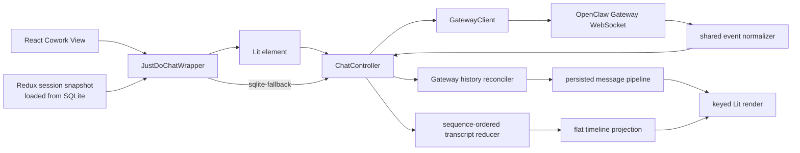
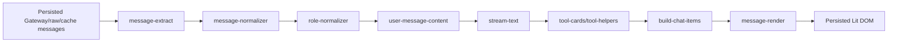
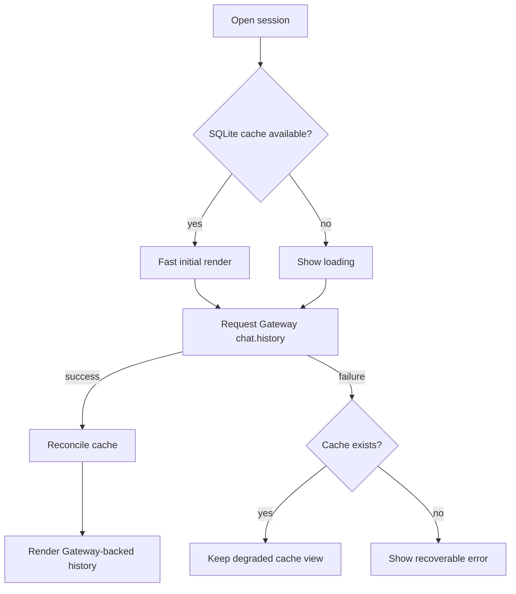

# Chat 渲染

JustDo 的聊天渲染由 React 容器和 Lit 自定义元素共同完成。React 负责应用 shell、session 选择、输入和 ask-user 交互 UI；`<justdo-chat>` 负责消息渲染管线，并连接本地 OpenClaw Gateway WebSocket。

## 关键文件

| 文件                                                             | 作用                                   |
| ---------------------------------------------------------------- | -------------------------------------- |
| `src/renderer/features/cowork/components/JustDoChatWrapper.tsx`  | React wrapper                          |
| `src/renderer/features/cowork/components/ChatMessageDisplay.tsx` | Cowork message display integration     |
| `src/renderer/libs/openclaw-chat/components/justdo-chat.ts`      | Lit custom element                     |
| `src/renderer/libs/openclaw-chat/gateway/client.ts`              | Gateway WebSocket client               |
| `src/renderer/libs/openclaw-chat/gateway/chat-controller.ts`     | chat controller                        |
| `src/shared/openclaw/agentEvent.ts`                              | Agent/chat event 协议归一化            |
| `src/renderer/libs/openclaw-chat/model/`                         | live transcript reducer、对账与投影    |
| `src/renderer/libs/openclaw-chat/controllers/`                   | render 调度与滚动状态                  |
| `src/renderer/libs/openclaw-chat/pipeline/`                      | persisted history normalization/render |
| `src/renderer/libs/openclaw-chat/components/markdown.ts`         | Markdown renderer                      |
| `src/renderer/libs/openclaw-chat/components/tool-display.ts`     | tool display                           |

## 渲染流程

## Pipeline

`src/renderer/libs/openclaw-chat/pipeline/` 包含：

- message extraction
- role normalization
- stream text handling
- heartbeat display
- tool card construction
- user message content handling
- search match
- text direction
- history limits

## Markdown

Markdown renderer 使用：

- `markdown-it`
- `markdown-it-task-lists`
- `markdown-it-texmath`
- `katex`
- `highlight.js`
- `mermaid`
- `dompurify`

渲染输出必须经过 sanitizer，避免把模型输出直接作为可信 HTML。

## Live timeline

Thinking/reasoning、Tool 和 Content 由 renderer-owned canonical transcript reducer
按 `runId + payload.seq` 排序。Renderer 中 Gateway frame `seq` 只用于 transport 诊断，
`chat` event 的状态序列也不与 Agent sequence 比较。当前 bundled runtime 若只提供
`aseq`，shared normalizer 会走显式兼容回退。缺少 canonical Agent sequence 的事件
不会进入 live display state，也不存在绕过 reducer 的旧 overlay fallback。

Main 与 Renderer 的 Gateway 连接保留各自的副作用适配器，但共享
`src/shared/openclaw/messageDomain.ts` 的纯协议核心：managed-session alias、
session/run/lifecycle admission、Agent sequence 去重、Tool 字段别名与 Tool 终态
都只能在该核心定义。Renderer 将 admitted transition 投影为 `TurnItem`；Main
将同一判定转换为 SQLite 和 IPC effect。Main 对缺少 inner Agent sequence 的旧
Gateway frame 保留兼容路径：优先使用 outer frame sequence，否则使用
process-local monotonic sequence；正常协议仍以 `payload.seq` 为准。共享事件语料
必须同时验证两种适配器的语义快照。

所有 `chat` 可见/持久化副作用必须先通过 canonical reducer 的 session、run 和
lifecycle admission；被拒绝的 final/error 不得清空当前 run 或写入 history。
Renderer 不再维护 `chatThinkingMessages`、`chatToolMessages`、`chatStreamSegments`
或独立 stream/thinking 字段；Goal、Lit timeline 与 final Thinking preservation
都读取 `transcript.activeTurn`。managed session alias 只允许显式
`justdo:<id>` / `agent:<agent-id>:justdo:<id>` 归一化，不允许任意 suffix 匹配。
Tool 会结束当前 Content segment；新版 Gateway 的 Agent assistant snapshot 可以只包含
Tool 后的当前 segment，而 `chat.delta.message` 和 final message 可以包含整轮累计文本。
Reducer 在更新当前 segment 前必须按顺序剥离已经完成的 Content，不能让累计快照把
Tool 前的文字复制到 Tool 后。纯 `deltaText` 仍只追加到当前 segment。
短暂 WebSocket 断开只把 transport 标为 `reconnecting`，保留 active turn 且不创建
run tombstone。重连后先用 Gateway history 接管已完成 turn，再以 `sessions.list`
的 `hasActiveRun` 确认无活动 run 后才生成一次 interruption。

Reducer 保留完整的 flat `TurnItem[]`；展示 selector 才把连续成功的 Thinking/Tool
压缩为 process summary。Content、用户消息、divider、terminal 和 run/session
边界都会结束 summary。运行中和失败/取消/中断的过程项保持可见。点击 summary
会通过原地 disclosure 在其时间线位置按稳定 item ID 和原始
顺序展开已归档的 Thinking/Tool；相邻 Content 保持在原位置，因此展开后仍能直接
阅读真实发生顺序。这是唯一的折叠层；旧的 `N tools: Tool1、Tool2` 二级分组及
Thinking/Tools 嵌套 cluster 已删除，不得由 persisted Content renderer 重新生成。
summary 折叠时 Tool input/output 不进入主时间线 DOM；用户原地展开 summary 后，
每个 Tool 才以独立详情项展示参数和有界结果。展开项不显示序号或逐项耗时。
persisted history 与 active-turn 投影在组成完整可见时间线后再合并相邻 summary，
合并时保留第一个归档项派生的稳定 key；Content 等真实边界始终阻止合并。

`update_plan` 是 process summary 折叠规则的一个显式例外。实时与 persisted
投影都先使用 `src/shared/openclaw/executionPlan.ts` 校验 `ToolItem.input`，再把
每一次有效调用提升为独立 `plan-update` 时间线项。卡片按调用顺序展示该次完整
快照、可选 explanation、完成数以及三种原生 step status；后续调用新增下一张卡，
不会覆盖、合并或改写先前快照。无效输入不会产生半成品卡片，仍按普通 Tool 留在
process summary 中供排查。该展示完全属于 Lit message pipeline，与 React 输入区
的 Goal 生命周期及 `GoalStatusCard` 无关。

`message-render.ts` 仅负责普通用户/助手 Content、附件、Canvas、头像和 footer
布局能力。它不得渲染 Thinking 或 Tool，也不得包含这两类过程项的
`details`/`summary` disclosure；过程项的唯一展开状态由 `process-summary` 持有。

assistant footer 的模型字段表示生成该条消息的实际模型，而不是 Agent 默认模型或当前
选择器状态。Live final 与 Gateway history 中的 `modelProvider/model` 会规范化为
`provider/model`；流式阶段尚无权威字段时不猜测模型，history 对账会回填 SQLite UI cache。
后续会话模型切换不得改写已经完成消息的模型归属。

### 长时间无输出提示

当前主会话的 active run 在 renderer 内维护独立的瞬时 `RunActivity`，记录 run、阶段、
最近 Agent 事件、最近模型活动和最近一次 active-run 确认。它不进入 Redux、SQLite 或
持久化 history，也不会创建消息气泡。Thinking、Assistant 文本和 Tool 事件会重置无输出
计时；Gateway tick 只证明 transport 有活动，不能证明模型正在思考。

- 连续 20 秒无模型活动后，timeline selector 才在当前回复末尾投影一个
  `waiting-status`；20 秒内 DOM 和原有三点动画、Thinking、Tool、Content、footer 不变。
- 20 秒后最多每 15 秒调用一次 `sessions.describe`。兼容补丁为该精确查询附加实时
  active-run tracker 结果；只有近期明确返回
  `hasActiveRun: true`，60 秒及 240 秒文案才可以声称任务仍在运行；RPC
  失败只保持“正在确认”状态，不得结束、重发或清空当前 run。
- 经近期 active-run 确认的 240 秒提示及 transport 断连使用 warning tone；恢复任何模型活动、收到终态、用户停止
  或切换普通会话时立即移除。临时 session 升格为持久 session 时保留同一 run 状态。
- OpenClaw 兼容补丁只发 `lifecycle/progress` 的 queued、preparing、waiting_model、retrying
  白名单字段。queued、preparing 和 starting 仅作为内部诊断阶段，等待提示统一使用
  “正在等待模型返回内容”，不据此声称模型请求尚未发出。既有 fallback 事件只读取归一化
  reason，不读取或展示错误详情。
- active turn 中存在运行中的 Tool 时不投影模型卡顿提示。最后一个 Tool 终止后重新开始
  模型等待计时，连续 20 秒无模型活动才显示“正在等待模型返回内容”。
- GatewayClient 根据 hello 中的 tick interval 监测超过两个 tick 周期的静默连接，并走既有
  WebSocket 重连；重连不调用 `chat.send`。页面后台期间暂停超时判断，恢复可见时重新计时。
- Lit 已有 active-turn 本地秒钟负责阈值更新，不产生 Gateway/IPC 请求。等待提示的读屏区域
  仅在状态类别变化时替换，动画尊重 `prefers-reduced-motion`。滚动控制器在 paused 模式下
  使用可见锚点保持位置，提示出现或更新不会强制滚到底部。

相关文档：`docs/features/thinking-stream-implementation.md`。

## Goal 状态展示

`/goal` 的生命周期由 OpenClaw 持有，JustDo 不从命令回复文本反向解析状态，也不把
Goal 状态复制到 SQLite。主进程使用 canonical session key 调用 `sessions.describe`
精确读取并校验 `goal`；这不会因为 Session 数量超过列表 limit 而漏掉当前 Goal。
`CoworkPromptInput` 在输入区上方展示独立的 `GoalStatusCard`：

- 覆盖 `active`、`paused`、`blocked`、`usage_limited`、`budget_limited`、`complete` 全部状态。
- renderer 在提交创建型 `/goal` 命令时先从命令参数生成仅用于展示的 optimistic objective，因此首页首轮切换到临时 session 后也会立即出现卡片；一旦 Gateway 返回权威 `goal`，立即替换 optimistic 状态。
- Goal 首次加载失败只做一次短重试；随后由 `sessions.changed`、session message、Goal execution event 和 lifecycle terminal 触发刷新，不为 idle active Goal 保留永久 5 秒轮询。
- active 且 execution 为 `running`/`continuing` 时，卡片只显示“目标正在执行”、本次应用启动后的自动续跑轮次和“暂停”。暂停先 abort 当前 run，再将 OpenClaw Goal 持久状态切为 `paused`；输入区原有 Stop 仍只中断当前 run。active 且等待或已停止时显示“继续”和“确认完成”。所有操作固定在卡片标题区右上角，不再使用独占高度的底部操作行。thinking、工具、回复阶段和详细耗时属于消息 timeline，不在 Goal 卡片重复投影；Goal 卡片是生命周期与执行控制面，不伪装成任务进度系统。普通 `chatSending` 只有在该 Session 已存在 active Goal 时才属于 Goal 执行，不能把任意聊天误报为 Goal run。
- active 但没有真实 execution 时显示“目标已就绪，等待继续”，提供继续和确认完成；输入区 Stop 只停止本次自动执行并保持 Goal active。stopped/failed 提供继续或重试及确认完成，其余 Goal 状态继续使用 OpenClaw 权威操作。
- Goal 卡片不显示 token 百分比。上下文增长不是任务完成进度；`SessionGoal.tokenBudget` 仅保留对上游旧 Goal 的兼容，JustDo 不解析 `/goal --tokens`、不创建预算，也不为自动续跑注入 token、轮数或时间上限。
- Goal 卡片根据权威 `goal.createdAt` 显示本地化运行时长，每分钟在 renderer 本地刷新，不写入持久化状态。非终态 Goal 在没有运行、自动续跑或重试时可行内编辑；保存通过现有 `chat.send` 发送 OpenClaw 原生 `/goal edit <objective>`，失败时保留草稿，`complete` 不提供编辑。
- 自动 continuation prompt 使用 `suppressPromptPersistence: true` 隐藏，不产生伪造的 user history；中间 assistant 回复、thinking 和工具活动照常展示，保证执行可审计。
- 普通 `chat.send` 轮次使用 OpenClaw v2026.7.1-2 原生的 bounded active Goal context；自动 continuation 仍走 `agent` RPC，以保留 `extraSystemPrompt` 和 `suppressPromptPersistence`。两条路径不得因为都携带 Goal 语义而误合并。
- 应用或 Gateway 重启后不自动扫描和恢复旧 active Goal；卡片等待用户手动继续，避免升级或异常退出后静默执行。
- Goal execution、Session runtime activity 和 Goal lifecycle 是三个独立概念，UI 不允许互相推断或替代。
- renderer 只有在 `execution.goalId` 与当前 OpenClaw `goal.id` 一致时才采用 execution 快照；Goal 被替换或事件乱序时，旧 run 不得控制新 Goal 的状态文案和按钮。纯文本轮次或没有工具活动不触发本地进度熔断；只有 OpenClaw 权威 lifecycle 或明确停止操作才结束持续派发。
- Gateway 查询暂时失败时保留最后一次有效状态，切换 session 时立即清空，避免跨会话串状态。
- `/goal` 的两条发送路径都会先通过幂等的 `sessions.create` 建立或复用 OpenClaw 会话记录并取得 `sessionId`，再调用 `chat.send`：首页首轮由主进程 `OpenClawRuntimeAdapter` 处理，已有会话的后续消息由 renderer `ChatController` 处理。预建失败时停止发送，避免命令作为普通文本进入模型；不能仅凭 `chat.startup/history` 返回的候选 ID 判断持久化记录已经存在。

Goal UI 是 React 输入区状态，不进入 Lit message pipeline；命令产生的历史消息仍由正常聊天渲染链路处理。

## Slash command 执行边界

`src/shared/slashCommands.ts` 统一解析命令并描述 JustDo 侧的特殊执行行为。未登记特殊行为的新命令默认作为普通 `chat.send` 消息交给 Gateway，因此新增 Gateway 原生命令不需要修改 renderer 分支。

- 仅本地执行、发送前置条件、提交前清空输入框等 transport/UI 差异在共享行为表中声明。
- `ChatController` 分别通过 local handler 和 before-send hook 表执行行为；新增特殊命令时注册对应 handler/hook，不新增命令名判断链。
- 主进程首页首轮发送也读取同一 before-send hook，确保两条发送路径的 session 前置条件一致。
- 命令特有的展示语义（例如 `/goal` optimistic objective）可以保留独立解析器，但必须复用统一命令解析结果。
- `/compact` 通过 `sessions.compact` 本地执行。OpenClaw v2026.7.1-2 的 Gateway RPC 仍只接收会话定位参数，不能转发自定义摘要指令；上游 Control UI 的命令描述虽然暴露了 instructions，实际 RPC 调用仍会忽略。JustDo 因此不展示误导性的参数提示；如果用户仍输入参数，则执行压缩并静默忽略参数。后续升级 OpenClaw 时必须以 Gateway RPC schema 和调用链重新核对 `customInstructions`，不能只依据命令菜单声明。

## 上下文压缩展示

输入区的上下文用量在运行期间轮询 Gateway 的 pre-prompt estimate（以 `~` 标记），运行结束后继续做有界收敛轮询。Main 用 `sessions.describe` 取得精确持久化行，并以带精确 key search 的 `sessions.list` 查询 active-run registry；registry 返回 false 后再次 describe，确保 usage 行晚于 idle 观测，不能把较晚的 active flag 拼到较早的 usage 行上。只有这样取得的 reported usage 与权威的 `hasActiveRun: false` 同时出现才结束收敛，矛盾的 `status: running` 始终按 active 处理。待收敛状态跨 React effect 重跑保留，直到成功、重试耗尽、新 run 开始或 session 切换，不能把本轮运行期间带新 session 时间戳的旧 total 当成最终统计。UI 优先按 usage/status 的 `updatedAt` 合并同一 Gateway session 与模型的读数：压缩、工具结果截断和 estimate → final usage 都可以让较新的读数合理下降，旧轮询结果不能覆盖新状态；`compactionCheckpointCount` 只作为缺少时间戳时的兼容回退，不能假定 checkpoint 保留数量永远递增。模型切换期间清空旧 usage，使用既有 OpenClaw 模型别名规则拒绝旧模型结果，并在 patch 确认后强制刷新。pre-prompt estimate 在恢复动作执行前可能暂时超过模型窗口；输入区把数值和百分比限制在窗口上限，并以 `+` 保留超限语义，恢复完成后采用较新的压缩后估算。live estimate 写回 session state 时按 `updatedAt` 拒绝乱序的旧状态。

- transcript 中的 compaction marker 使用 compaction entry ID；checkpoint 使用独立 UUID。Controller 保留 marker 的 `id`，并把恢复用途的 UUID 写入 `checkpointId`。
- checkpoint 优先通过 `postCompaction.entryId` 或 `postCompaction.leafId` 与 marker 精确关联。只有缺少 transcript 位置的旧 checkpoint 才允许按时间顺序回退配对。
- checkpoint 持久化是可失败的附加能力；没有 checkpoint 的 marker 仍应显示为普通压缩分隔线，不能借用其他压缩的摘要。
- 压缩摘要与 token/checkpoint 元数据独立降级：只要 marker 或当前会话 transcript 中存在摘要，分隔线就可展开；缺少完整 token 数时显示英文通用标签 `Context compacted`，缺少 checkpoint 时不提供恢复/分支动作。Controller 只按 compaction entry ID 从当前 session 对应 transcript（及同源 reset/bak 归档）回填缺失摘要，不能跨会话扫描或按时间猜配；回填失败不能阻断基础历史。Main 以 transcript 的 realpath、文件身份、已提交完整行 offset 和首尾哨兵维护增量摘要索引：纯追加只扫描尾部，未完成的 JSON/UTF-8/CRLF 尾部留待下次重读，文件替换、缩小、移除、前缀改写或 session 改指新 transcript 时丢弃旧 generation。同一 session 的回填串行执行，并限制请求 ID、跟踪 ID、缓存摘要字符数和 session LRU；所有扫描在正常、提前命中或异常时主动关闭流。
- `session.operation` 和 agent `compaction` start/update/end/failed 共同维护 `compactionInFlight`。压缩期间暂停缺少 `chat.final` 时的终态计时，压缩结束后再恢复收敛；Main 的丢失终态 watchdog 由受管压缩 timeout 加一分钟余量派生，不能早于仍合法运行的压缩。Gateway 只发 lifecycle error、遗漏 `chat.error` 时，Main 的短终态兜底也必须把 Session 收敛为 `error` 并发布 complete，不能让 Redux 状态永久停在 `running`。
- 手动 `/compact` 发起或自动压缩 `start` 事件到达时，立即在当前会话追加仅用于 UI 的 `compaction-status` 分隔线，显示英文 `Compacting...` 和每秒刷新的经过时间；该本地活性时钟不依赖模型是否已经返回首个 token。自动恢复路径还每五秒发布一次经过时间心跳，摘要 `text_delta` 到达后再携带并累计真实文本；临时分隔线在压缩进行中即可展开并持续更新。手动 RPC 或自动压缩 `end` 完成后先原位更新状态（有 token 信息时一并显示），再由重新加载的 Gateway history 中的正式 compaction marker 替换。`session.operation` 和 Agent stream 的重复事件复用同一临时 marker；切换会话时该状态随会话缓存保留。
- precheck overflow 只触发压缩，不是可展示为 provider 错误的事实。自动恢复失败时，Gateway payload、lifecycle 和会话终态必须优先使用最后一次压缩的真实 reason；只有 provider 明确返回并被分类为 context overflow 时，UI 才展示 overflow 恢复提示。
- 手动压缩成功后的持久化结果仍必须以重新加载的 Gateway history 为准。刷新失败时移除临时状态、保留现有历史并显示错误，不把临时状态冒充正式 compaction marker。

## 工具显示

live 工具调用以 `runId + toolCallId` 更新 canonical ToolItem；缺少名称时使用
`tool`，result-before-start 也会建立项目。冷历史中的工具仍由 persisted
pipeline 归一化。工具输入等敏感历史数据通过 Main IPC 从 Gateway state/history
读取，不由 renderer 直接访问 runtime 文件。成功 Tool 完成后归档到相邻 process
summary；运行中或失败的 Tool 保持可见，失败项可直接打开所在 summary 的详情。
Main 必须先由 `sessionKey` 定位对应 agent 的 `sessions.json` entry，再只异步流式
读取该 entry 的 transcript，以及同一 transcript basename 的 `.reset.`/`.bak.`
归档；禁止同步递归扫描整个 OpenClaw agents state。

增量事件和冷历史共同复用 `model/tool-message-adapter.ts` 的兼容规则，包括
OpenClaw message envelope、Tool ID/名称字段别名、metadata、`partialArgs`、
独立 `tool_use`/`tool_result`、附加 Tool 消息、对象/空结果和结构化错误。新增
Tool 数据形态时必须先扩展该适配器及双路径一致性测试，不能在两个投影入口分别
增加临时解析分支。

结构化 `update_plan` 输入同样只读取归一化后的 `ToolItem.input`，不解析 tool
output、assistant prose、Markdown task list 或 `TodoWrite`。因此 live Tool event
和 Gateway cold history 使用相同校验器与卡片渲染，不需要额外 Redux、SQLite 或
IPC 状态。

## 维护规则

- 修改消息结构时先更新 pipeline tests。
- 不在 React 层重复实现 Lit pipeline 的消息解析。
- 新增 Markdown capability 时检查 sanitizer 和 CSP。
- 新增 Gateway WebSocket 行为时同步 `GatewayClient`、`ChatController` 和 IPC fallback。

## 版本

- JustDo: `v2026.8.10`
- OpenClaw Gateway: `v2026.7.1-2`

## 组件职责

### `JustDoChatWrapper`

React 与 Lit 的边界组件。它负责把 React props 转换成 custom element attributes/properties，并处理挂载/卸载生命周期。

不应在 wrapper 中实现复杂 message parsing。Wrapper 的职责是：

- 提供 session/gateway connection 参数。
- 订阅必要的 React-side 状态。
- 把 UI 事件桥接回 React。
- 处理 loading/error shell。

### `GatewayClient`

Gateway WebSocket 客户端负责：

- 连接本地 Gateway。
- 处理 challenge/auth。
- 发送 chat/session/history 相关请求。
- 分发 Gateway event。
- 在系统 resume 或 Gateway restart 后重连。

Token、port 等敏感连接信息通过 Main IPC 获取，不写死在 renderer。

### `ChatController`

Controller 是 Gateway event 到 Lit state 的协调层。它不应该知道 React Redux 的内部结构，也不应该直接操作 SQLite。

用户可见的运行状态不由 Controller 的单个 `runId` 决定。Main 将主 run、可见
announce、descendant subagent 和 compaction 聚合为一个 `SessionRuntimeSnapshot`；
Redux 在一次 reducer 更新中同时刷新输入框“进行中”、会话列表呼吸灯和
`SessionRunTiming`。Lit 只用该 timing 渲染计时，内部 announce 切换 `runId` 不会重置
起点。结束时间取第二次 confirmed-idle 的观察时间，并与两个运行指示器同步生效；
转为历史消息后，页脚时间和持续时间仍分别使用同一 timing 的 `endedAt` 和时间差，
不会退回 Gateway 消息时间。应用重启后的未结束 timing 从本次启动重新计时。

主要职责：

- 维护当前 session 的 Gateway-backed persisted history 和 canonical active turn。
- 接收 Wrapper 已转换为 Gateway message shape 的 SQLite fallback snapshot。
- 接收 stream event。
- 调用 pipeline 构建 render items。
- 处理 history load 和 incremental update。

状态协调必须遵守以下约束：

- 初次连接或切换 session 时先完成目标 session 的 message subscription，再读取 startup/history
  快照，关闭“快照已读但订阅尚未建立”的丢事件窗口。subagent drawer 在这一首屏 barrier
  完成前保持 loading；预期已有 transcript 却读到空快照，或只有 assistant 尾巴而缺少
  原始 user/task 时，执行三次有界补拉，避免先显示空白或不完整的 live/final tail。订阅
  RPC 若未及时应答，barrier 会有界放行首个快照；迟到订阅成功后必须再补拉一次，以关闭
  临时通知缺口，而不能让 drawer 一直等待 Gateway 的完整 RPC timeout。drawer 自身等待
  超时时，已有 history 或 active Thinking/Tool/Content 必须继续显示，只有完全没有可见
  transcript 时才显示加载失败。
- 切换 session 时先取消上一 session 的 message subscription，再订阅目标 session。
- subscribe 异步完成时若 session 已再次切换，必须显式反订阅刚刚成功的陈旧 key；
  本地 sequence guard 本身不能撤销 Gateway 的 many-to-many subscription。
- optimistic user message、live final 和 history apply 都要同步更新对应 session 的内存缓存。
- Wrapper 在首次连接、切换会话或 SQLite snapshot 更新时调用
  `admitFallbackHistory()`；controller 按 session 缓存 source authority。
  `gateway > sqlite-fallback > optimistic`，因此 Gateway 一旦成功接管，
  后续缓存更新不能覆盖它。
- active run 拥有实时展示状态；并发 history 结果不能回退 process item 或可见 Content。
- `loadHistory()` 只协调 RPC、分页、compaction enrichment、Tool input hydration 和
  结果提交；optimistic tail 保留、并发陈旧响应、regressive tail、active-run
  admission、materialized fallback 保护及 deferred catch-up 全部由
  `history-reconciler` 作出一次性决定，controller 不维护第二套接纳启发式。
- 终态 active turn 与其 optimistic history fallback 是同一轮的互斥投影；fallback
  尚未被持久化覆盖时只显示 active turn，当前 generation 的 Gateway history
  接管后由 reconciler 同步撤销 active turn，只显示权威历史。
- `sessionKey`、`sessionId`、run ID、Agent sequence 与 run tombstone 是 Renderer
  隔离延迟事件的主要依据。`lifecycleGeneration` 在当前 Gateway 公共事件中通常不
  序列化，只是可选附加判据：缺失时不拒绝事件，仅当 active run 和 event 都提供且
  值冲突时拒绝。Renderer 正确性不得依赖该字段存在；服务端 stale-lifecycle
  suppression 仍由 OpenClaw 负责。
- `announce:v1:` 子代理完成通知复用父 session key，但不是新的用户回合。空闲状态下
  只暂存尚无可见输出的 lifecycle shell；首个 Thinking、assistant、Tool 或 chat 内容
  会按 Agent sequence 先回放 lifecycle，再立即进入与普通 run 完全相同的增量渲染。
  静默结束或最终 `NO_REPLY` 会丢弃仍未激活的 lifecycle；流式 `NO_REPLY` 的中间前缀
  也必须在 reducer 前过滤，避免 `NO_RE` 短暂闪现并把已完成会话反复置为运行中。
  切换会话、session identity 轮换或断开时清空缓冲。
- `spawnedBy` 只表明 run 来源，不能覆盖已经匹配的选中 session 身份。subagent drawer
  选中子会话后，带匹配 `sessionKey`（或匹配的已知 `sessionId`）的首个 Thinking、Tool
  或 lifecycle 事件可以启动该 transcript；缺少 session 身份的 spawned event 仍拒绝。
- `sessions.changed` 报告选中 key 的 `sessionId` 轮换时立即递增 history generation；
  paged history、compaction enrichment 和 Tool input hydration 每个 await 后都要复核
  generation/session identity。
- persisted message key 优先使用 `__openclaw.id`，其次使用 `__openclaw.seq`，再回退到
  provider 顶层 durable ID；加载更旧页面或同一 transcript entry 文本更新不得改变 key。
- live final 只按 transcript identity、相同 run ID、相同 timestamp 与完整 display
  signature，或“落盘尾部时间属于当前 active run 且完整 display signature 相同”替换已有
  终态。不能仅凭 role/text、包含关系或公共前缀去重，否则两个相邻 announce/异步 run
  （包括内容恰好相同的消息）会被错误合并成一条消息。
- 只有当前 history generation 的成功 Gateway 响应有权证明持久化覆盖；SQLite/optimistic projection 不能清除 live tail。
- history 的附件合并先于异步图片解析，异步结果只允许提交到发起时的 session 和消息版本。
- `chat.send` ack 前使用本地临时 runId；首个同 session Gateway event 可以将其绑定为真实 runId。

## Message Pipeline 详细设计

Pipeline 的目标是把 Gateway/raw/cached message 统一成可渲染 chat item。

各层职责：

| 模块                    | 职责                                          |
| ----------------------- | --------------------------------------------- |
| `message-extract.ts`    | 从 Gateway payload 中抽取文本、工具、metadata |
| `message-normalizer.ts` | 统一字段形态，处理缺省值                      |
| `role-normalizer.ts`    | 标准化 user/assistant/system/tool 等 role     |
| `stream-text.ts`        | 处理流式文本片段和增量展示                    |
| `tool-cards.ts`         | 生成工具调用展示模型                          |
| `heartbeat-display.ts`  | 处理 Gateway heartbeat/活动提示               |
| `build-chat-items.ts`   | 生成最终 render item 列表                     |
| `message-render.ts`     | 渲染普通 Content、附件、Canvas、头像和 footer |

## History Loading

聊天视图可能来自三种 history 输入，另有 canonical active-turn tail：

1. Gateway live stream。
2. Gateway `chat.history`。
3. SQLite message cache。

优先级是 active live state > Gateway history > SQLite fallback > optimistic。
SQLite cache 适合快速首屏和离线/故障降级，但不能作为 prune live state 的证据。
生产路径由 `JustDoChatWrapper` 将 Redux 中已加载的 `CoworkMessage[]` 转换后调用
`ChatController.admitFallbackHistory()`。Controller 不读取 Redux 或 SQLite，
只接收规范化快照；快照按 session 隔离并复用与 Gateway history 相同的 reconciler。
Gateway 请求失败时保留 fallback，成功后 source authority 升为 `gateway`，同一
controller 生命周期内不再接受该 session 的低权威缓存覆盖。canonical active
turn 为 running 时 fallback admission 会被拒绝。
分页 IPC 暂时失败时继续尝试 loopback REST；若两者均不可用，最多 1,000 条的
RPC history 只被视为有限 recent snapshot。它必须通过 durable transcript identity
与较大的 SQLite fallback 证明安全的尾部重叠后才能接管，否则保留完整 fallback，
避免以“更高权威但不完整”的响应截断历史。

Gateway REST history is cursor-paged. Main IPC and the browser fallback return
one page per request rather than draining the complete transcript. The initial
view requests the latest 250 messages; `ChatController` retains `nextCursor`,
and `ChatScrollController` requests an older page when paused scrolling reaches
the top region. Older messages are prepended under the existing semantic anchor
capture so the visible row does not jump. Loaded history is not truncated and
an available older cursor is never retired because of a renderer message or
byte threshold: a user can continue paging through a transcript containing
100,000 or more messages.

OpenClaw may project an individual long history message as an 8,000-character
preview ending in `...(truncated)...`. When that preview has a durable
`__openclaw.id`, `ChatController` requests a much higher-limit projection through
`chat.message.get` before normalization and rendering. This applies to both the
recent window and older pages; if the lookup is unavailable or the stored message
exceeds Gateway limits, the preview remains as a non-destructive fallback.

旧页经过隐藏规则和 identity 去重后可能不增加任何可见消息。Controller 会继续推进
cursor，跳过连续空页/重复页，直到加入可见消息、cursor 耗尽，或发现 cursor 循环。
为避免一次顶部滚动串行占用大量 Gateway 请求，每批最多处理 8 个空页；批次间通过
零延迟任务主动续取，并校验 session key、session ID、history generation 与 cursor，
因此既会让出事件循环，也不依赖第二次 scroll 事件。分页暂时失败时不会清除此前
可用的 `nextCursor`。

Loaded pages remain immutable chunks in `ChunkedMessageHistory`; admitting an
older page does not spread or copy the pages already in memory. The controller
keeps the newest chunk separately as its reconciliation/live-tail snapshot, so
a settled live message replaces only that chunk while all older chunks remain
reachable. If a wider RPC recent snapshot overlaps already loaded older chunks,
the newer snapshot wins by durable transcript identity and the overlapped older
copies are removed, preventing duplicate rendering, counts, and export rows.
Window reads slice across chunk boundaries. Full flattening is reserved for
explicit whole-session operations such as export.

Rendering is independently bounded by a 750-message sliding window. Reaching
the top moves that window toward older loaded messages (or fetches the next
page); reaching its bottom moves it toward newer loaded messages. A 250-message
overlap keeps semantic anchors alive while the window moves. “Jump to latest”
selects the newest window and restores follow mode. Thus transcript
reachability is unbounded by the DOM window, while projection, minimap, and Lit
`repeat` work stay bounded. Session switches and transcript generation changes
invalidate an in-flight older-page result.

Within that window, persisted timeline derivations are cached separately from
the active turn. The cache owns coalesced persisted rows, both trailing-footer
variants, assistant-turn/avatar state, and minimap entries. A stream revision
only projects the active items, merges the final persisted/active summary seam
when necessary, and clones the final minimap entry for new Content text.
Persisted rows, the optional seam row, and active rows are emitted as separate
keyed Lit segments, so an active delta does not spread or rescan the persisted
row list.

Active process summary 与 authoritative history summary 的 key 来源不同。
`ProcessSummaryTakeoverTracker` 只记住当前展开项，并在接管时按显式 run ID、
Tool call ID、稳定 process item ID 或精确 Thinking 文本寻找唯一候选。
找到唯一候选后，Lit 用新 history key 保持 disclosure 展开，并在原按钮拥有焦点时
把焦点恢复到替换按钮；候选冲突或切换 session 时清空状态，不做猜测性迁移。
Tracker 的隔离 identity 由 session key、backing session ID 和 history generation
共同组成，因此同 key 的 session ID rotation 或 transcript reset 也会清空状态。

## Tool Cards

Tool card 的展示应区分：

- tool 正在运行。
- tool 成功。
- tool 失败。
- tool input 可查看。
- tool output 有 artifact/file。

敏感 tool input 不应随意塞进 DOM。需要读取历史 tool input 时，通过 `openclaw.history.getToolInputs()` 走 Main IPC。

## 会话导出

会话页导出使用 `ChatController` 当前已加载的 Gateway history，而不是可能滞后的 Redux/SQLite message cache。`sessionExport.ts` 将文本、assistant tool calls 和 tool results 转为 OpenAI Chat Completions 兼容的 `messages`，并在用户选择时把原始 runtime messages 放入 `extensions.justdo`，以保留 reasoning、附件和运行时扩展字段。

Renderer 只负责构建 JSON；文件路径由系统另存为对话框选择，Main 通过受限的 `dialog:saveTextFile` IPC 写入 UTF-8 文本。导出内容有大小上限，错误必须返回 renderer 并显示本地化提示。

## Markdown 安全

模型输出是不可信输入。Markdown 渲染必须：

- 禁止任意 script。
- 对 HTML 输出 sanitize。
- 外部链接通过安全打开路径。
- Mermaid/KaTeX 错误不能打断整条消息渲染。
- 代码高亮失败时降级为纯文本 code block。

## 性能考虑

- 长历史按 cursor 向上分页，单页最多 250 条；历史数据不因 renderer 阈值截断，
  10 万条以上的会话仍可持续向上加载。
- timeline 仅投影和渲染 750 条消息的滑动窗口，每次按 250 条移动；窗口限制 DOM
  与流式重绘成本，但不限制用户可访问的历史范围。
- persisted history projection 与 active-turn projection 分开；持久行、头像/页脚状态和
  Minimap 基础条目按 projection identity 缓存。流式 delta 只更新 active tail、
  最后一条 summary seam 和最后一个 Minimap 条目，不重建或扫描持久历史。
- stream visual publish 由 animation-frame scheduler 合并，terminal/state notification 可立即发布。
- active timeline 使用稳定 source ID 和 Lit keyed `repeat`，summary count 更新不会替换 DOM identity。
- Tool 至少展示 500 ms；计时器只延迟 presentation archive，不改变 reducer status。
- 滚动由 Lit 侧单一 controller 持有；用户一旦向上滚动即进入 paused，只有显式“跳到最新消息”恢复 follow。
- 左侧 Minimap 每轮用户对话只生成一个条目，以用户消息的真实 `data-history-key` DOM 节点作为导航锚点；流式 Content 只更新该条目的助手摘要，不按消息数量估算滚动位置。
- 大型 code block/mermaid 图要考虑懒渲染。
- Search highlight 不应改变 message identity。

## 测试重点

- Agent/chat event normalization 和 sequence isolation。
- active-turn reducer permutations、terminal preservation 和 run tombstone。
- process summary 的 Content hard boundary、stable key 和 inline disclosure。
- history authority/generation/regressive-tail reconciliation。
- scroll follow/paused/jump-to-latest。
- Minimap 的用户/助手摘要分组、增量 Content 更新、真实 DOM 锚点导航和当前条目高亮。
- persisted grouped render。
- markdown task list/math/code。
- message normalization。
- Gateway client reconnect。
- tool card display。
- stream text incremental update。
