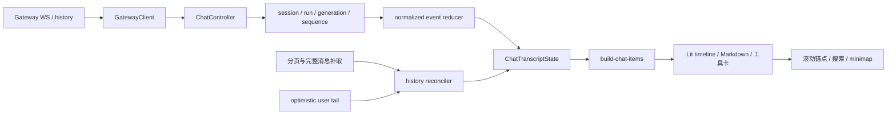
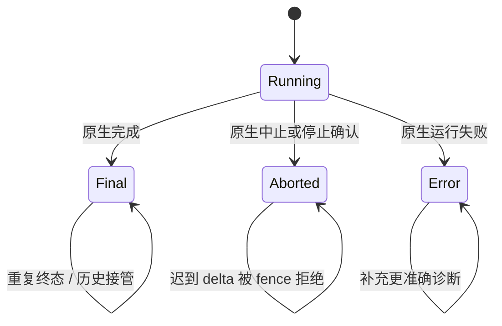
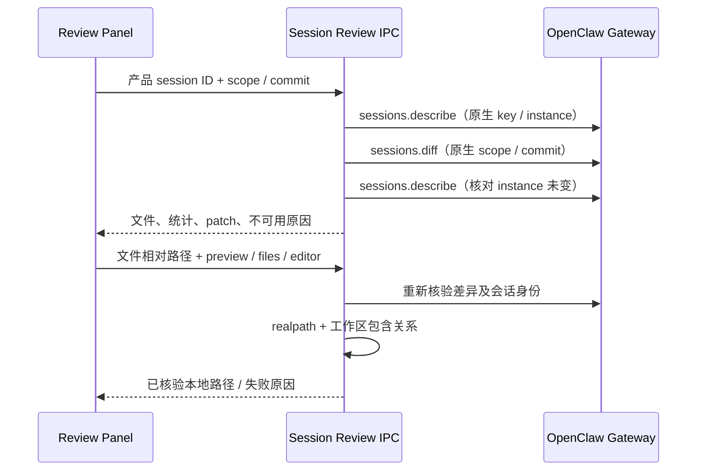

# 聊天渲染：原生历史、实时流与交互投影

聊天由 React 工作区和 Lit `<justdo-chat>` 组合。本文按当前 controller、reducer、history protocol、pipeline 和组件组织，重点解释消息顺序、终态、防重复、恢复及性能，避免把功能迭代记录混入架构正文。

会话冷归档恢复继续使用 `chat.startup` / `chat.history`，由 Gateway 校验和恢复原生记录；Renderer 不解压文件、不建立正文缓存。首次读取期间显示加载说明，归档历史可能耗时更长，不推断冷状态或伪造进度。`initialHistoryReady` 表示首次读取流程已结束，不能单独证明读取成功；`historyReadFailed` 单独记录选中会话的读取失败。

主聊天通过会话 key 绑定读取就绪状态，首次读取未完成或恢复失败时禁止发送、侧聊和导出；失败后保留已显示正文，提供只读重试。只有快照实际提交成功才解除错误状态，被拒绝的空快照不能清除失败。断连使初始化和分页世代失效，同一个 client 重连也要等待新的权威历史；排队等待旧请求不等于读取完成。异步读取的成功和失败均核对 sessionKey、client 和历史 generation，旧连接的失败不能污染新连接。普通后台历史刷新不显示初次加载横幅。导出范围仍是当前聊天快照，不能代表完整原生备份。

## 1. 从原生事件到屏幕

Code Mode 继续使用相同的原生工具事件与历史投影。仅当工具为 `exec` 且输入包含字符串
`code` 时，摘要显示原生 `title`（缺省为工具编排说明），展开后按原始换行展示 JavaScript。
普通 shell `exec({ command })` 不按代码推断或重新解释。工具名称保持上游显示名称。
`wait` 和内部工具调用继续由原生事件驱动，不另建任务状态、等待轮询或结果缓存；
实时与刷新后的失败状态、输出及代码详情使用同一渲染路径。

运行中的时间线尾部使用现有 `runActivity` 展示启动、排队、准备、等待模型、思考、回复、工具和重试阶段，并复用每秒更新的界面时钟展示耗时；不另建计时器或猜测进度。带 runId 的状态只附着于匹配的当前运行，结束后移除动态指示，耗时回归终态页脚。明确重试立即提示，慢响应仍遵循已有静默时长与活动确认规则。装饰性星芒、呼吸和文字流光响应 `prefers-reduced-motion`；读屏只播报阶段变化，不播报每秒计时。

实时及历史失败共用错误行：短错误直接显示，长或多行错误默认收起详情，支持键盘展开与复制完整的显示诊断；不复制已移除的终端日志指令提示。

运行提示的星芒使用固定尺寸 SVG，占用头像列，文字与消息正文左边缘对齐。阶段和慢响应/重连提醒复用同一个状态文本节点，恢复活动即替换提醒；耗时保持独立且不随提醒换行。后台工具历史补取刷新工具状态时保留较新的思考、回复或重试阶段。静默计时从最近模型活动或阶段切换中较晚者开始，明确排队/准备阶段不显示模型慢响应提醒。

等待提示优先反映可观测状态：断连与重连分别显示；明确重试按限流、超时、服务繁忙、认证失败或未知原因区分，且不被通用长等待文案覆盖。回复中途静默区别于尚未收到响应；只有近期 Gateway 确认运行仍活跃时才宣称任务仍在运行。收到新的模型内容后清除静默提醒，不凭等待时长猜测失败原因。

流式 Markdown 在代码围栏的语言行完整到达后即可渲染尚未闭合的普通代码块，复用最终态的解析和安全过滤，不向原始内容补写闭合标记；未闭合的 Mermaid 图表及其他不完整尾部仍按纯文本显示，避免提前隐藏源码或解析未完成的图表。用户向上滚动的输入意图立即暂停自动跟随，不等待原生 scroll 事件；手动滚动也会接管进行中的平滑定位。缩放手势、输入框内的光标移动及被工具详情内部容器消费的滚动不视为阅读历史。

```mermaid
flowchart LR
  Gateway[Gateway WS / history] --> Client[GatewayClient]
  Client --> Controller[ChatController]
  Controller --> Admission[session / run / generation / sequence]
  Admission --> Reducer[normalized event reducer]
  History[分页与完整消息补取] --> Reconcile[history reconciler]
  Reducer --> State[ChatTranscriptState]
  Reconcile --> State
  Draft[optimistic user tail] --> Reconcile
  State --> Pipeline[build-chat-items]
  Pipeline --> Lit[Lit timeline / Markdown / 工具卡]
  Lit --> Scroll[滚动锚点 / 搜索 / minimap]
```

Main 只提供连接准备、权限、产品生命周期和受限详情读取，不复制 Thinking/Tool/Content。Redux 也不保存 transcript。原生历史丢失时不能用产品消息缓存冒充恢复。

Composer 提交前只是草稿；Main 建立产品会话与 `clientTurnId`，并准备模型、权限和项目根目录。首轮可由 Router 发送，后续回合由集中式聊天 client 发送。产品 receipt 只证明身份已建立，原生 admission 只证明执行已被接收，live final 也不能单独证明后代任务与 Goal 已全部结束。排障时先查原生 history 和完整 event，再查 admission、reducer 与渲染 pipeline；Main 的摘要日志缺少中间帧不能证明原生事件未发生。

## 2. 控制器和状态归属

ChatController 入口持有连接、canonical session、订阅、transcript 和对外命令。session/history/recovery/compaction/progress 模块通过明确上下文操作；propertyContext 使用实时访问器，await 后不读取拆分时复制的旧状态。

ChatTranscriptState 包含 session key/id、persistedMessages、historySource、historyGeneration、activeTurn、recentRuns、terminalRunIds 和 revision。historySource 只有 gateway 或 optimistic；后者是等待原生接管的暂态，不是另一个历史来源。

| Turn item | 稳定身份与内容                                     | 结束语义                               |
| --------- | -------------------------------------------------- | -------------------------------------- |
| Thinking  | run + item/sequence，reasoning 文本                | completed/failed/cancelled/interrupted |
| Tool      | toolCallId、name、input、output、error             | 单工具状态，不直接决定 run 终态        |
| Content   | 文本段、delta/snapshot/replaceable、preamble owner | completed 或 interrupted               |
| Terminal  | run 对应的中止/错误说明                            | 合并为同一终态行                       |

activeTurn 记录原生 run/session/lifecycle generation 与序列。最近 24 个 run 的详情保留 5 分钟，但 identity-only terminal fence 保留到当前 session projection reset；详情过期不能允许慢到 delta 重新创建已结束运行。

## 3. 事件准入与顺序

连接 generation 防旧 socket，session 身份防切换串消息，run/lifecycle 防旧运行，sequence 防重复和乱序。不能只用时间戳或“当前页面是否忙”判断。

原生 Agent 事件与 Chat 持久消息事件可能交错。reducer 归一化 delta、累计 snapshot 和可替换段，不能把 snapshot 再 append 一遍，也不能用一个全局 latestSeq 拒绝另一个 owner 的缺口恢复。

run、toolCallId、entry id、preamble owner 和 sequence 共同决定时间线归属；时间戳不能独自决定工具完成顺序。Thinking 来自原生 reasoning/redacted-thinking 投影，可能因模型能力或 provider 配置而缺失；UI 不推测模型未返回的内容。Thinking 与正文、工具前说明分别保留 item 和 owner。展开、折叠与平滑揭示只是本地显示状态，不能改变原生段边界或历史。

`replace: true` 优先于 delta 追加语义，包括空字符串撤回。累计 chat 空替换按原生源序号撤回覆盖范围内的 assistant 文本，并阻止尚未到达的旧 owner 复活；Thinking、Tool 和独立 preamble 不受此水位影响。文本更新序号独立于 Tool 关闭段时的边界序号。普通空快照仍不构成段边界。

运行恢复使用原生 `chat.history`：持久消息来自 `messages`，进行中的正文来自
`inFlightRun.text`，工具、preamble 和 usage 来自 `inFlightRun.events`。原生 assistant
进度事件可仅有序号而无正文，不得据此忽略独立的 text 字段。已移除 017 分段恢复补丁；
恢复不要求自定义段标识，也不承诺重现未持久化 thinking 的所有分段及交错顺序。

工具的 `item(kind=tool, phase=update).progressText` 是独立的临时进度，并不保证同时有 `tool.partialResult`；直接更新运行中工具卡。临时进度序号阻止迟到 partial 令显示倒退，同时允许工具终态和缺失 input 补回。最终 Tool result 接管后清除进度，不为每个进度帧轮询历史。

in-flight recovery snapshot 是稀疏数据，不提升 live event fence。活动 owner 的序列分别跟踪；工具前 preamble、正文和 Thinking 保留独立 item 身份，避免多个段合并成一块再错误排序。

## 4. 历史加载与有界展示

混合工具消息使用 OpenClaw 原生 commentary fallback 投影；commentary 可先于剩余
Thinking/Tool 块返回。Renderer 保留原生历史顺序，不要求重新加载后的块顺序与实时
事件完全一致，也不额外重排。当前运行时不再应用 018 顺序增强补丁。

chat-history-protocol 的初始及旧页大小为 250，字符预算 500000。分页使用原生 offset/nextOffset，hasMore=true 时必须有合法 cursor。UI DOM 窗口最多 750 条，每次前后移动 250；这些是传输/展示预算，不是原生历史保留上限。

超大行通过结构化 truncated 标记及原生 entry id 识别，使用 message get 或分块桥补取。当前完整消息请求与分块读取各有独立大小和并发限制，不能从一段“已截断”可见文本猜原文。

`chat.message.get` 返回显示投影，不能假定包含同 id 的所有 commentary。补取按显示身份匹配，保留独立 commentary；不能确认完整性的混合片段保留原投影，避免把省略内容误当成撤回。每次续取分块和领取并发任务前检查连接、会话和历史 generation，失效后停止剩余请求。子代理历史找到初始任务时，保留此前已加载的所有中间页，并通过原生身份去重。

工具 input、失败 detail、compaction detail 在有原生身份时受限补取。查询失败应保留已有消息和明确错误，不把 placeholder 当正式空结果永久存入投影。

Gateway 会为原生空失败记录生成带正文的 assistant 显示消息。失败 detail 同时返回原始内容是否为空；Renderer 据此恢复显示副本的失败形态，沿用 Gateway 安全文案并按 run 身份合并失败提示，避免普通助手头像下重复报错。原生记录已有部分正文或工具内容时保留原输出，不按错误文字猜测或清除正文。

## 5. Reconciliation 与乐观发送

每次 history 请求携带 session key/id 与 historyGeneration，返回后先拒绝过时结果。合并优先使用原生 transcript identity；文本/时间辅助匹配只用于受控场景，不能合并用户真实重复发送。

`activeLeafEntryId` 随普通追加也会变化。比较时纳入上次 history 之后 `session.message` 已展示的持久后继，不能只使用上次 RPC 的 leaf。新尾页同时包含当前已展示 leaf 和后继新 leaf 时可证明同分支延续，保留已加载旧页及分页深度；没有该连续性证据时仍按原有分支替换规则处理。带 `spawnedBy` 却没有明确选中会话身份的事件不能绑定主会话 provisional run；明确属于选中子会话的事件仍正常接入。

optimistic tail 在原生接收前显示用户输入；history 接管后移除对应临时项，避免双份用户消息。实时 active items 可被持久 entry 接管，但 history 窗口缺少某段不代表它从原生消失，不应清空仍有效的 live 数据。

历史插入导致数组下标变化时，滚动窗口按首个可见 entry 身份重定位；不能按旧 index 滚到另一条消息。搜索定位和分支切点也依赖原生身份。

## 6. 终态、停止与迟到 admission

```mermaid
stateDiagram-v2
  [*] --> Running
  Running --> Final: 原生完成
  Running --> Aborted: 原生中止或停止确认
  Running --> Error: 原生运行失败
  Final --> Final: 重复终态 / 历史接管
  Aborted --> Aborted: 迟到 delta 被 fence 拒绝
  Error --> Error: 补充更准确诊断
```

停止成功回执通过 settleConfirmedRun 进入同一终态 reducer，不依赖 aborted stream 恰好送达。首个流事件尚未到达时只保存 fence，不制造空消息或结束别的 run。重复 receipt/abort/lifecycle 共用终态行及结束时间。

手动 compaction/send 尚未获得原生 handle 时，取消需要等待迟到 admission；UI 等待有界，超时不能假装原生已空闲。后台继续处理原操作取消，同一操作重试共用取消任务，完成前保留发送隔离。

## 7. Plan、Goal 与 progress card

Plan 规划和实施共用 canonical transcript，原生 reset 切断模型上下文但 display history 可跨边界。Renderer 不拼接多份 transcript，也不维护本地 segment 血缘。计划卡可重开持久计划预览，审核侧栏不是任意文件编辑器。

消息编辑/撤回仅绑定最后一个合法持久 user entry；分支入口绑定稳定、成功完成的助手 entry。Goal 存在、Plan reset 边界、sending、压缩、历史加载或缺少身份时限制操作，避免 rewind 与计划插件状态/文件副作用不同步。

Goal 卡保留六种原生状态，Main 只提供自动续跑阶段。progress_card 从原生 session 读取，不能扫描工具参数或模型文字重建“当前计划”。压缩进度与历史摘要也使用对应原生状态，不当作普通用户消息。

`progressCard.changed` 携带 revision，Renderer 在 Gateway 声明读取能力后调用 `progressCard.get`，并核对 session 与连接 generation。当前卡只保留有界内存投影；原生返回 null、读取失败或 revision 失效时不能沿用旧卡冒充最新状态。关闭卡片和完成后隐藏属于 UI 状态，不删除原生卡。progress_card 是执行进度，PresentPlan 是待审核 artifact，Goal 是目标与预算；三者的生命周期不可混用。

用户刷新卡片时，聊天 client 直接发送 `progressCard.refresh`。接收回执不替换已保存卡或输入草稿；后续 `progressCard.changed` 触发按 revision 读取。结果不确定时复用原刷新意图并查询原生卡，明确终态失败后才创建新意图。切换会话后的迟到回执不修改当前显示，也不生成合成用户消息。

## 8. 模型、时长和用量

回复模型来自本轮原生 progress/final 与历史；Main run receipt 的 modelRef 是发送前选择，不证明实际模型。fallback 或运行中切换后，final 模型优先；provider/model 拼接保留 model 内部斜杠，不能因前缀相同擅自去重。

时长绑定当前 turn/run，重复终态不反复结算。子任务总 Token 使用原生 canonical usage，不能用 sessions.list 的上下文快照当累计消耗，也不要求各 breakdown 简单相加恰好等于 total。

### 子任务详情与嵌套导航

子任务列表与详情分别呈现执行观测和结果交付状态。等待原因、原生依赖数量、进度摘要、错误及文件变更统计来自任务摘要；会话用量属于可选补充，读取失败不能隐藏已经核实的任务身份和生命周期。没有原生交付证据时，执行成功不得显示为“已回报父任务”。平级协作图的 accepted 也只代表消息已接收，不代表成员工作完成。

详情中的子任务入口按需读取当前层，每页最多 50 条，沿 task ID 导航并提供返回父层的路径。已读取条目按身份去重；页读取失败保留已有结果，允许刷新或重试；祖先身份不能再次作为子节点形成导航循环。根列表仍使用现有完整状态轮询，不能把视图内的分页展示描述成后端根扫描已分页优化。

操作按钮按精确任务提供取消、重新投递结果和忽略待交付结果。Main 重新核对所属产品会话与原生任务树；Renderer 不根据标签推导执行目标。操作后以及结果不确定时先核对 task ID 的新状态，再允许后续操作。重新投递只恢复结果通知，不重跑原任务；返回 `duplicateRisk` 时保留提示。切换任务或会话使旧详情、分页及控制响应失效，不把旧结果写入新的选择。

## 9. Markdown 与输出安全

Markdown-it 处理列表、代码、表格、公式和链接，DOMPurify 统一清洗；工具输出、错误、Mermaid、KaTeX 也不能绕开同一可信边界。链接和本地文件动作经受限回调到 Main，不把任意字符串执行为系统操作。

流式 Markdown 以稳定边界增量渲染，未闭合代码/公式/链接不应导致整页反复跳变。缓存 key 包含真实内容及影响渲染的模式；工具 canonical output 保留完整，折叠和有界 DOM 控制成本，不能靠破坏原始内容优化性能。

## 10. 滚动、搜索与调度

stream-render-scheduler 合并 frame 更新，assistant pacer 平滑揭示文本但保留原生段边界。用户向上阅读后暂停自动跟随；新内容记录 unseen revision，不强拉到底部。恢复跟随是明确用户动作或仍处底部的规则。

历史窗口移动、代码块高度变化、图片加载和 Mermaid 后处理都需要维护可见锚点。搜索/minimap 基于显示投影，跳转未加载范围需先取得相应历史。虚拟化不能破坏键盘导航、选择文本或展开工具详情的稳定性。

## 11. 工作区附件与临时侧聊

普通附件、浏览器标注和操作演示先在 Composer 草稿中等待用户发送。录制编辑使用右侧 Tab，带来源会话与序列，切换标签不会改变正文权威；发送后仍由原生历史持久化。录制隐私和内容边界见[操作演示](../features/browser-operation-recording.md)。

拖拽或粘贴本地文件时，Composer 通过 preload 的 `dialog.getPathForFile` 调用 Electron
`webUtils.getPathForFile` 取得原始路径，并将附件加入当前草稿（新消息页为 `__home__`）。
不读取已移除的 `File.path`；只有无磁盘路径的文件才通过 `saveInlineFile` 暂存，避免本地文件
因被误当作内联数据而受 25 MB 暂存上限限制。

侧边 /btw 聊天各有独立内存 timeline 与 draft，切换会话、关闭标签或应用时丢弃，不写入主 transcript。它的临时性必须与普通任务历史清楚区分。

协作图基于产品投递元数据，正文按原生 receipt 读取；选择成员复用只读原生详情，不切换主输入收件人。后台任务的展示更新不应抢占用户当前工作区。

## 12. 实现入口与回归矩阵

| 范围              | 代码 / 测试入口                                                         |
| ----------------- | ----------------------------------------------------------------------- |
| 连接和生命周期    | gateway/client、chat-controller 及 session-lifecycle/terminal tests     |
| 分页及大消息      | chat-history-protocol、chat-controller-history、chunked-message-history |
| 去重和段顺序      | agent-event-reducer、history-reconciler、session-message-apply          |
| timeline 与工具卡 | pipeline/build-chat-items、history-display-normalizer                   |
| 安全与视觉更新    | components/markdown、justdo-chat、controllers                           |

至少验证：同文重复提交、重连时 live/history 交错、工具前后多段正文、终态后迟到 delta、取消早于 admission、超大工具结果、Plan reset 后 rewind 门禁、Goal 操作 fence、后台会话停止、历史窗口移位与滚动锚点。领域测试与真实模型交互检查分别记录，不以一次截图替代协议验证。

## 12. 工作区审阅（T03）

侧面板启动入口和“+ → 审阅”打开按会话保留的只读 Tab；主聊天 edit
卡通过带产品 session ID 的事件定位文件。其他历史/子任务消息面不显示
无所属会话的跳转按钮。审阅是当前 checkout 差异，不是工具入参的拼接，也
不代表所有修改都来自当前 Agent；人工和其他任务的修改同样可能出现。

```mermaid
sequenceDiagram
  participant UI as Review Panel
  participant Main as Session Review IPC
  participant Gateway as OpenClaw Gateway
  UI->>Main: 产品 session ID + scope / commit
  Main->>Gateway: sessions.describe（原生 key / instance）
  Main->>Gateway: sessions.diff（原生 scope / commit）
  Main->>Gateway: sessions.describe（核对 instance 未变）
  Main-->>UI: 文件、统计、patch、不可用原因
  UI->>Main: 文件相对路径 + preview / files / editor
  Main->>Gateway: 重新核验差异及会话身份
  Main->>Main: realpath + 工作区包含关系
  Main-->>UI: 已核验本地路径 / 失败原因
```

直接沿用 OpenClaw v2026.9.6 原生行为：会话执行前由原生采集文件指纹基线，
`all`/`uncommitted` 隐藏与有效基线指纹相同的文件；再次变化的文件显示相对
Git 基准的完整 patch，不逐行扣除旧修改。`commit` 不应用会话过滤；基线缺失时
保留原生 checkout 结果。无需用户手动提交，但目录必须是 Git 仓库。产品不新增
快照或采集逻辑，也不修改原生会话基线；共享目录仍无法准确归属修改者。

组件快照仅是临时展示状态，不写入 Main/SQLite/Redux，也不缓存 transcript。
首次打开和显式刷新加载；隐藏时取消结果消费，不轮询。运行结束仅提示刷新。
请求绑定 session、范围、commit、generation；改范围立即隐藏旧范围，迟到响应
丢弃，同范围刷新失败保留并标注旧快照。Main 同时核对客户端、映射及原生
instance，reset/reconnect/deletion 后不接收旧身份结果。

文件支持过滤和逐文件展开、统一/并排、行号、语法着色、hunk 边界和自动换行。
工具栏使用布局图标与更多选项，窄面板压缩文字；文件行始终显示变更类型。
正文滚动同步目录选中项，文件标题在长 Diff 中吸顶。并排模式共用整块横向
滚动区域，不为每行创建滚动条；语法高亮按 patch、显示行数与语言缓存。
复制反馈在对应按钮显示两秒，切换会话或范围后忽略迟到的反馈。
默认显示 100 个文件、每个展开文件 200 行，可逐步展开；单 patch 最多渲染
2000 行、每行 4000 字符，并明确提示显示限制。复制原始 Diff 不使用显示截断
内容。原生截断、二进制、未跟踪、无 patch、非 Git、未知提交及工作区停止
分别说明。提交候选最多为原生返回的 50 项，不视为完整历史。

“在文件中显示”展开 Files 的父目录并定位；“打开预览”继续走既有预览事件，
保持版本校验和未保存草稿保护。Windows“选择编辑器”复用系统 Open With
选择器，不自动执行文件关联；其他平台保留预览/Files。远程无 root 和已删除
文件不允许本地动作。路径复制保留相对路径中的中文、空格及原始字符。

## 2026-09 消息阅读与工具展示投影

工具展示继续消费同一套原生事件和历史，不增加 transcript、Main 或 Redux 消息缓存。
`ToolItem.presentation` 只保存展示所需的可选字段：原生 title、parentToolCallId、activity
分类标记、结果退出码、结果 entry identity 与截断标记。实时 tool/item 和持久 toolResult
使用同一投影函数；`chat.history.activity` 按 messageId 绑定。旧记录缺字段时显示工具名和
有界参数摘要，不调用模型补标题。工具名后的预览优先取命令、路径等具体输入，
其他工具回退完整参数的有界预览；原生 title 不覆盖输入，action 不单独遮蔽其余参数。
Browser 提取动作、元素与输入文字，tool_call 提取目标工具，read 保留 offset/limit。
长工具名限制宽度，名称和预览提供悬停提示。非零退出码与受阻提示仅放在展开详情。

过程组沿用 Thinking / Tool 数量摘要，避免未覆盖的工具都显示为“其它操作”。
工具状态由原有指示灯和无障碍标签表达，不重复显示状态文字。
非零退出码、受阻、取消与结果未知是展示结果，不改写执行状态。嵌套仅使用同 run 明确父
身份，缺父、重复、循环或超深链回退平级；用缩进表达关系，保持原生段顺序。工具展开状态
按调用身份保留，过程组仍使用原有 takeover tracker。

普通工具保持直接展开输入、输出的原文布局，edit 保留 Monaco Diff。共享阅读器对短内容
仅在内容气泡右上角显示复制图标，保留键盘操作和复制反馈；长内容或部分输出增加下载/分页/补取操作。分页优先沿换行边界，
不拆分 UTF-16 代理对或 CRLF，每页最多 16,000 字符。空参数与等待参数单独提示。复制/下载使用已取得的
完整字符串；部分输出明确标记并禁用完整下载。按需补取复用 `chat.message.get` 和现有
有界 historyMessage 路径，仅接受唯一匹配的 toolResult，验证 entry/run/call identity。
会话、连接、读者身份变化或关闭详情使请求失效；失败允许重试。无法恢复的原生 capture
截断不会伪装为完整输出。edit 的 Monaco Diff 来自调用参数，不代表实际 checkout Diff。
Exec/命令工具结果在两种应用主题中均使用深灰底的 Monokai 风格终端卡片，左上角三个
红黄绿装饰点不提供窗口操作，右上角保留复制图标。ANSI 16 色和语义高亮统一配色，
等宽终端阅读样式保留列对齐并横向滚动。基础 ANSI 前景色和加粗
转换为安全文本 span，OSC/其他 CSI 控制序列不执行；无 ANSI 样式时对 Windows 路径、
表头/分隔线、日期时间及 PowerShell 文件行做主题适配高亮。分页基于显示文本，复制/下载保留原文。

代码块的展开、换行、下载，表格 TSV/放大查看，JSON 树/原文和 Mermaid 复制/放大/缩放
由 `RichMessageControls` 在共享 Lit 消息面上增强。状态以会话和消息内块 identity 为界。
JSON 树保存原文范围，保留重复键、数字拼写和转义，节点分批展开；非法、过深或过大 JSON
回退原文。TSV 对包含 tab/newline/双引号的单元格加双引号，并将内部双引号重复。
扩大视图里的链接关闭弹层后复用原链接动作。大段纯文本回退也使用分页阅读器。
Mermaid 保持 strict 模式，限制源码、行数和边数，禁止外部图片/点击指令/初始化覆盖，
主题变化后重绘。所有增强只改变阅读 UI，不改变原 Markdown 复制内容。

选文引用只在主聊天显式传入 `onMessageQuote` 时启用，来源为助手正文；原生 entry ID 可暂缺。
引用的 sessionKey/entryId/选区文本进入按 composer key 分隔的 `draftMessageQuotes`，
属于可删除的待发送草稿，不是 transcript 缓存。点击按钮不发送；侧聊按钮只创建临时侧聊
并放入引用。用户评论在输入框编辑，主聊正文保留纯引用块，并通过原生格式文本附件发送来源信息，侧聊使用下述
原生预填格式；成功后只清除本次引用，失败保留。不把旧 entry 解释成当前分支的
导航目标。子任务及协作只读消费者不获得发送回调。

原始斜杠命令不附加引用，也不消费引用草稿。恢复目标时引用以引用块加入 note 并计入
长度上限，只有恢复成功才清除本次引用。

消息选区操作使用右键菜单（复制、加入输入框、在侧聊中提问），不再在松开鼠标时插入操作条。
复制保留完整选区；引用仍限制原生助手消息及可写入口，沿用引用长度限制。菜单支持方向键、Esc、外部点击和滚动关闭。

用户气泡对旧版本生成的中英文引用包装做显示投影：历史主聊引用及侧聊 JSON 引用呈现为
引用块，隐藏 sessionKey/entryId。发送内容与原生历史保持不变，普通 JSON 不做转换。

引用发送对齐锁定的 OpenClaw 2026.9.6 Control UI 实现：
- `control-ui-boot-shared-DKAI-I6P.js` 的 `uC/dC`：侧聊预填 `Regarding "…": `，
  折叠空白并将选中文字限制到 300 UTF-16 单元，不发送 sessionKey/entryId JSON。
- `control-ui-boot-shared-DJHdUjIH.js` 的 `PN`：主聊创建 `selection-comment.txt`，
  含 Selected text、Source session/entry、文本长度及已知 DOM range，通过现有附件桥传递。
  本应用仍使用自己的引用草稿 UI；不引入原生 Control UI 的附件状态缓存。
  引用正文同时以纯 Markdown 引用块加入实际 Gateway prompt，使乐观气泡和原生历史一致；
  来源身份仍只在附件中。模型可能同时从正文和附件读取同一段选文，沿用每段 12,000 字符、
  最多 8 段的草稿限制。只含引用也可作为主聊消息发送，完成目标反馈仍要求用户输入正文。
- 历史 JSON 引用的显示投影保留，但移除额外标题；用户问题与引用正文保持独立。
右键菜单按原生 entry 范围验证选区，不再要求点击落在同一个正文节点；右键按下和菜单
点击保留选区，避免跨段落、代码块或点击气泡边缘时丢失选中文字。

实时及已完成的最新助手正文都标记为可引用区域，不以历史 entryId 作为菜单显示门槛。
尚无原生 entryId 的引用仅发送已知会话和选区信息，附件省略 Source entry，禁止构造假 ID。

历史消息选区允许终点落在消息外层容器：按 Range 边界裁剪到唯一来源，不以端点节点
contains 判定替代文本归属。Shadow DOM 优先使用 getComposedRanges，避免宿主重定位。
`components/fixtures/history-selection.html` 使用真实历史渲染组件，已在 Chrome 验证最后
一段选中后右键显示三个选项，加入输入框回调取得正确文字（合成会话，无 Gateway）。

Mermaid 卡片使用复制、放大查看、下载三个图标操作，提供 title/aria-label。
放大弹窗仅显示右上角关闭图标；滚轮按鼠标锚点缩放（0.2–5 倍），指针捕获支持拖动平移，
释放/取消拖动清理状态，Esc 与关闭按钮恢复既有焦点。

历史加载提示在消息区域水平居中。独立运行记录早于 Gateway 正文抵达时不渲染孤立的
时间/运行时长页脚；时间线出现内容后才显示对应元数据。

### 本地媒体与文件工具阅读（2026-09-28）

消息和 Tool 返回的显式媒体共用 `message-media.ts`：原生 audio/video 控件，不自动播放，失败可重新加载。消息卸载停止播放并释放资源，同步 DOM 移动不重置播放。既有图片使用 `localfile:`；音视频使用独立的 `localmedia://local/` 标准流式协议，Main 在 ready 前注册，在 handler 中支持单段字节 Range（206/416）、本地 MIME 与按范围读取，不改写消息或重新调用工具。CSP 仅为媒体增加本地协议与内联媒体来源。未扩展远程节点或平台能力。

`file-tool-presentation.ts` 仅适配 Read、Write、Apply Patch 及可确认的原生包装身份。Read/Write 复用分页原文 reader 做代码高亮；Read 始终对原始输出直接高亮，不以 details.content 替换正文，不重复显示路径或“原始结果”；仅使用原生 details.kind 判断结果类型，不猜测文件正文 JSON 的业务含义。实际 write/edit diff 在已完成时优先显示。Apply Patch 按文件呈现输入补丁，明确新增、修改、删除和移动，不重建不存在的旧文件版本；未知或不完整 patch 回退原文。保留原始参数/结果入口，不增加 JSON 树、文件定位或会话跳转。

### 子任务启动入口

sessions_spawn 保留通用参数和结果展示，仅在成功回执包含 childSessionKey 时在标题旁显示右上箭头（含 core tool_call 包装）。点击通过 getSubTaskStatus 刷新当前会话的子任务列表，按 childSessionKey 匹配完整原生任务（含任务 ID），再复用现有子任务详情 Tab，不从参数猜测目标，不改变执行流程；查询失败显示提示，离开当前会话后的旧查询不会打开 Tab。sessions_yield 保留通用展示。
