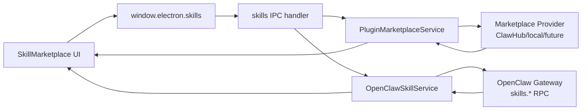
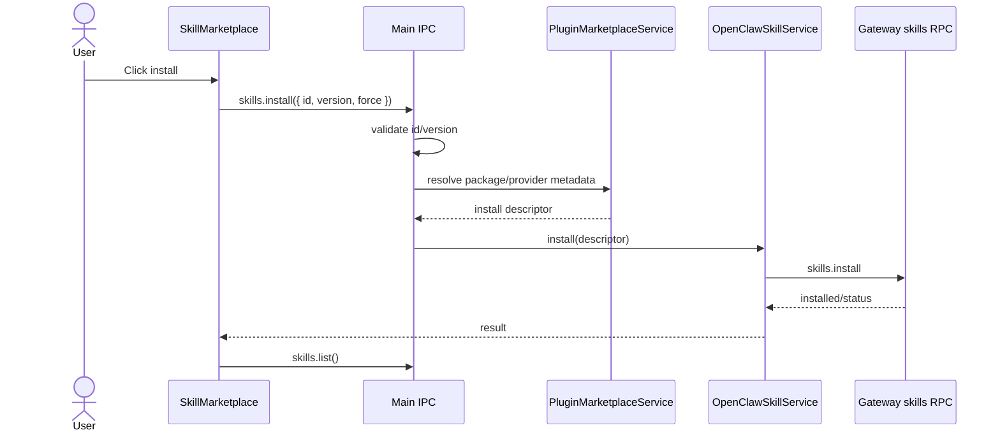

# Skill Marketplace Adapter

JustDo exposes skill marketplace actions through the main process only. The renderer never talks directly to marketplace providers.

## Boundary

| Layer | Responsibility |
| --- | --- |
| Renderer | Search/detail/install UI and Redux state |
| Preload | Narrow `skills.search`, `skills.detail`, `skills.install` APIs |
| Main IPC | Validate inputs and call plugin marketplace service |
| Marketplace provider | Query remote/local marketplace source |
| OpenClawSkillService | Execute Gateway skill install/status operations |



## Key Files

| File | Purpose |
| --- | --- |
| `src/main/plugins/marketplace/pluginMarketplaceService.ts` | marketplace service |
| `src/main/plugins/marketplace/openClawClawHubProvider.ts` | ClawHub provider |
| `src/main/plugins/marketplace/clawHubSkillRpc.ts` | provider RPC |
| `src/main/plugins/skills/openclawSkillService.ts` | Gateway skill RPC |
| `src/main/ipc/openclaw/skills.ts` | IPC handler |
| `src/renderer/features/plugins/components/skills/SkillMarketplace.tsx` | UI |
| `src/shared/plugins/marketplace.ts` | shared contracts |

## Rules

- Renderer uses `window.electron.skills.*` only.
- Main process normalizes query, id, version, and force options.
- Provider errors must be converted to typed failure results.
- Installing a skill must go through OpenClaw skill service so Gateway remains authoritative.
- New user-visible errors require i18n entries.

## Verification

- `src/main/plugins/marketplace/*.test.ts`
- `src/renderer/features/plugins/components/skills/*.test.ts`
- Manual smoke test through Plugins -> Skills marketplace UI.

## Data Model

Marketplace items should be normalized before reaching renderer. A renderer item should have enough information for display and install intent, but not provider-specific transport details.

Recommended fields:

| Field | Meaning |
| --- | --- |
| `id` | Stable skill id |
| `name` | Display name |
| `description` | Short description |
| `version` | Version string when available |
| `author` | Publisher/owner |
| `tags` | Search/filter tags |
| `installed` | Whether Gateway/local state reports installed |
| `enabled` | Whether Gateway reports enabled |

Provider-specific fields should stay in Main unless the UI explicitly needs them.

## Search Flow

```text
SkillMarketplace input
  -> skillService.search({ query, limit })
  -> window.electron.skills.search()
  -> skills IPC handler
  -> PluginMarketplaceService.search()
  -> provider.search()
  -> normalized result
```

Search should be best-effort. Network/provider failure should not break the whole Plugins page; it should show a localized marketplace error region.

## Detail Flow

Detail lookup is separate from search so the list can stay light:

```text
User opens detail
  -> skills.detail({ id })
  -> provider.detail(id)
  -> normalized details
```

Details may include README/description content. Treat it as untrusted text/markdown and sanitize in renderer.

## Install Flow


```

Install result should distinguish:

- already installed
- installed successfully
- version conflict
- provider unavailable
- Gateway unavailable
- validation failure

## Provider Abstraction

`PluginMarketplaceService` should depend on provider interface, not a hardcoded network client. This allows:

- ClawHub provider.
- Local/test provider.
- Future enterprise/private marketplace.

Provider implementations must not leak tokens or raw HTTP errors to renderer.

## Caching

Renderer can cache search results in component/Redux state for UX, but not in SQLite unless there is a product requirement. Installed state should be refreshed from Gateway after install/delete/enable changes.

## Security

- Marketplace metadata is untrusted.
- Install action is privileged because it changes runtime capability.
- Renderer cannot choose arbitrary install source paths unless using explicit local import flow.
- Force install should be explicit and visible.
- Logs should include skill id/version but not marketplace credentials.
