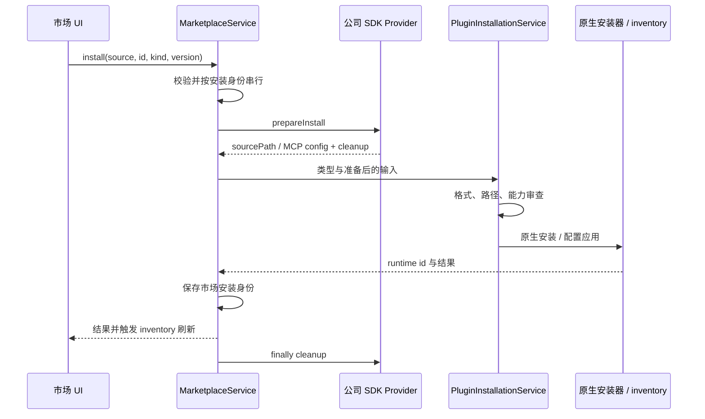

# 插件市场适配：从业务目录到原生安装

市场层解决目录查询、下载、来源和版本映射，不拥有插件执行状态。当前共享 MarketplacePluginKind 只包含 extension、skill、mcp；Hook 虽在 PluginKind 中存在，也不是已接通的市场安装类型。仓库默认没有业务 Provider。

## 1. 最小接入面

`PluginMarketplaceProvider` 位于 `src/main/plugins/marketplace/types.ts`。公司 SDK 只需提供搜索与下载，其他能力按实际支持暴露。

| 接口           | 必需 | 责任                                |
| -------------- | ---- | ----------------------------------- |
| source         | 是   | 稳定 id、名称与支持 kind            |
| search         | 是   | 有界分页目录，返回通用字段          |
| prepareInstall | 是   | 完成下载并提供目录或结构化 MCP 配置 |
| getDetail      | 否   | README、依赖等详情                  |
| listCategories | 否   | 指定 source/kind 的稳定类别目录     |
| checkUpdates   | 否   | 已安装项目的批量更新候选            |

Main 投影 supportsDetail/supportsCategories，Renderer 不为缺失能力制造空页面。最小 SDK 不必为了 UI 补造一个不存在的详情接口。

## 2. 查询与响应验证

MarketplaceService 验证 source ID、重复注册、kind、分页 limit/cursor 和返回字段。默认 limit=20、最大 100；类别最多 100 项且 ID 去重。Provider 错误转换成稳定错误分类并脱敏，不能把 SDK 原始响应直接送进 UI。

MarketplacePlugin 只含产品需要的名称、描述、版本、作者、tags、图标、来源和安装提示。没有图标时可稳定生成占位图；downloadCount 只是展示信号，不是安装可信度。

空关键词用于热门推荐，可按 provider 的 categoryId 查询；进入搜索后隐藏并清除类别条件。类别名不能当协议 ID，前端也不能在一页结果上假装实现服务端分类。

## 3. 安装完整链路

SDK 负责下载和认证，Main 不自行拼下载 URL 或重复实现公司协议。Extension/Skill 的 sourcePath 是下载后的本地目录；MCP 是经过映射的结构化配置。通用安装服务位于 `src/main/plugins/installation/`，路由到现有领域安装器。

临时资源无论成功失败都 cleanup。相同安装身份串行，避免重复点击产生交错覆盖；一个来源失败不应把其他来源的查询结果伪装为空。

## 4. 格式与能力审查

本地 Extension 和市场目录共用 conversion 入口。原生 openclaw.plugin.json 交原生安装器验证；异构 bundle 转换当前尚未实现，明确提示并停止。上游支持某种 manifest，不代表当前产品转换路径已经交付。

能力审查得到本次 declared surface、operator grants、source/integrity 及 reviewToken；提交时再验证内容未变。Provider 不能绕过审查直接写 runtime 目录，也不能把可执行安装脚本作为普通 Skill payload 偷渡。

新增 Agent、Command、CLI、Hook 或其他 kind，需要同时完成安装、启停、更新、卸载、状态对账和权限语义；只加一个 enum 与卡片不构成接入。

## 5. 三种 ID 和两种状态

| 字段                | 含义                                  |
| ------------------- | ------------------------------------- |
| sourceId            | 哪个市场负责查询和下载                |
| marketplacePluginId | 市场目录身份                          |
| runtimeId           | 安装后原生管理身份，可能不同于目录 id |
| installedVersion    | 产品记录的已安装版本来源              |
| installPath         | 必要时区分同名不同来源的文件安装      |

安装成功后 registry 在 KV 保存这些映射，但是否真实存在仍以 runtime inventory 为准。外部删除、同名 Skill fallback 或插件安装失败都可能使 registry 与原生清单不同，UI 必须对账。

系统管理/内置项即使同名，也不开放市场更新。Skill 删除同时核对路径，避免删除项目层同名文件时清掉另一个 managed 安装的市场身份。

## 6. 更新检查与 UI 一致性

checkUpdates 按 source 分组，仅传该来源的安装记录；无此接口时可消费搜索结果中的 update-available。不能判断版本就不制造更新提示，也不假设所有版本遵循 semver。

完整候选保留在 Renderer，即使普通推荐结果没再次带更新标记，同一 source/catalog/runtime identity 仍使用候选版本执行更新。成功后刷新 inventory 与 registry，使市场卡片和已安装卡片同时收敛。

单 Provider 的旧安装兼容检查只用于缺少历史映射的场景；多来源不能按同名 ID 猜归属。

## 7. 失败和补偿

| 阶段              | 应保留的事实                       |
| ----------------- | ---------------------------------- |
| Provider 查询失败 | 来源错误，不改变原生安装状态       |
| 下载失败          | 原安装及 registry 保持；清临时文件 |
| 格式不支持        | 未进入原生安装，不假装准备成功     |
| reviewToken 失效  | 必须重新审查                       |
| 原生安装失败      | 原生结果与清理状态，不先写成功身份 |
| 更新后读取失败    | 显示无法确认，重新 inventory 对账  |

## 8. 验收入口

MarketplaceService tests 覆盖 provider 校验、可选能力、分页、错误与安装串行；install registry tests 覆盖来源/runtime/path 映射；installation 与 Extension/Skill/MCP 测试覆盖实际 mutation。

接入验收至少用一个仅支持搜索/下载的最小 Provider、一个多来源同名冲突场景、一次失败更新和临时目录清理。业务 SDK 联网验收与本地协议测试分开记录。
