# Plugin Marketplace Adapter

JustDo exposes one provider-neutral marketplace boundary for Extensions, Skills,
MCP servers, and Hooks. The renderer never talks directly to a marketplace or
handles enterprise authentication.

## Boundary

| Layer                | Responsibility                                                           |
| -------------------- | ------------------------------------------------------------------------ |
| Renderer             | Shared card/search/action UI plus installed-state reconciliation         |
| Preload              | Narrow `window.electron.marketplace` API                                 |
| Main IPC             | Validate plugin kinds and return typed success/failure results           |
| Marketplace service  | Normalize queries and route by stable source id and kind                 |
| Provider             | Authentication, endpoint protocol, DTO mapping, and install preparation  |
| Installation service | Route provider-neutral payloads through the owning installer             |
| Runtime services     | Persist or activate installed Extensions, Skills, MCP servers, and Hooks |

```mermaid
flowchart LR
  UI["Four marketplace tabs"] --> Preload["window.electron.marketplace"]
  Preload --> IPC["plugins:marketplace:* IPC"]
  IPC --> Manager["PluginManager"]
  Manager --> Market["PluginMarketplaceService"]
  Market --> Provider["Configured provider"]
  Provider --> Install["PluginInstallationService"]
  Install --> Runtime["Owning runtime service"]
```

The shared contract lives in `src/shared/plugins/marketplace.ts`. Search results
contain provider-neutral metadata and an optional install state:
`available`, `installed`, `update-available`, or `unavailable`. The renderer also
compares stable item ids with the owning installed page so a provider may omit
installed state. An enterprise provider should return `update-available` when it
has authoritative version or policy information.

## API

The preload API exposes:

- `listSources(kind?)` for source discovery.
- `search({ kind, query, limit, cursor, sourceId })` for paged listings.
- `detail({ sourceId, pluginId, kind })` for optional heavy metadata.
- `install({ sourceId, pluginId, kind, version, operation })` for install/update.

Search returns `{ items, nextCursor }`. Provider-specific response fields,
credentials, transport errors, and install descriptors must not cross IPC.
No provider is registered by default. The UI reports that the marketplace is
not configured until a product build registers an enterprise provider.

## Adding the enterprise marketplace

Implement `PluginMarketplaceProvider` under `src/main/plugins/marketplace/` and
register it only in `createPluginMarketplaceService`. Keep these concerns inside
the provider:

- endpoint and authentication acquisition;
- request pagination and private response DTOs;
- mapping company categories to `PluginKind`;
- policy/availability and update-state mapping;
- downloading or constructing a provider-neutral payload in `prepareInstall()`;
- cleanup of provider-owned temporary downloads.

`prepareInstall()` returns `PreparedMarketplaceInstall`. Extension, Skill, and
Hook payloads contain a local directory/archive path; MCP payloads contain the
server configuration. The marketplace service then creates the same
`PluginInstallRequest` used by custom import and calls `PluginInstallationService`.
Providers must not write managed directories, SQLite, or OpenClaw configuration
directly.

Provider ids must be stable and unique. A provider declares only the kinds it
actually supports. Do not add company protocol fields to shared contracts unless
the UI has a provider-independent need for them. Plugin ids are globally unique
within a plugin kind; providers must namespace ids if their native ids can
collide with another configured source.

## Security and behavior

- Treat marketplace metadata and README content as untrusted.
- Never expose tokens, raw authorization headers, or credential objects to IPC.
- Installation is privileged and must use a registered provider; renderer input
  cannot supply arbitrary URLs or local paths.
- A failed or unconfigured provider affects only its marketplace result region,
  not the Plugins page.
- Refresh the owning installed list after a successful install.

## Verification

- `src/main/plugins/marketplace/*.test.ts`
- Manual smoke test for all four Plugins -> Marketplace tabs.
- Verify `+`, `✓`, update, loading, empty, unavailable, and error states.
