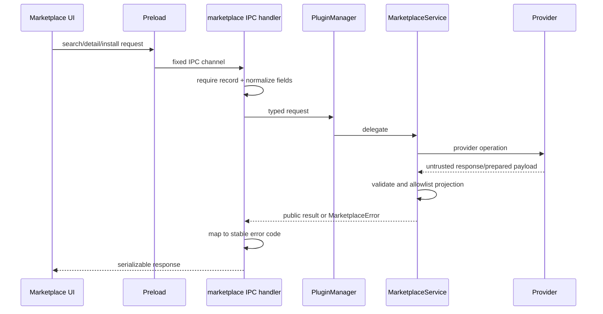
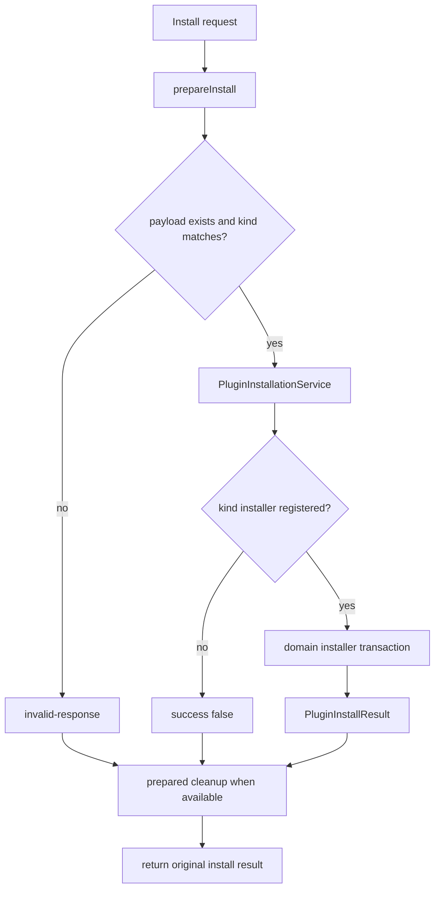

# Plugin Marketplace Adapter

本文按当前 shared contract、IPC、`PluginMarketplaceService`、`PluginInstallationService` 与测试重写。文件名历史上写 skill，但 adapter现支持四种 `PluginKind`：extension、skill、mcp、hook。

## 1. 当前状态

默认 factory `createPluginMarketplaceService()` 构造 `new PluginMarketplaceService([], installationService)`：没有注册任何公开/企业provider。因此 `listSources`返回空数组、search返回空items是当前正确行为，不是网络错误。

该层提供稳定扩展点；具体企业Marketplace必须在产品构建中显式注册provider，不能在service内硬编码URL/token。

## 2. 分层

Provider只负责catalog/detail和准备可安装payload；最终安装必须通过kind-specific installer，以复用Skill/MCP/Hook/Extension真实事务和安全规则。

## 3. API

- ListSources，可选kind过滤。
- Search：kind必填，query/limit/cursor/sourceId可选。
- Detail：sourceId/pluginId/kind。
- Install：sourceId/pluginId/kind，可选version及install/update operation。

响应统一有success、稳定errorCode和对应result/detail/pluginId/restartRequired。未知异常只返回 `internal` + 通用文案。

## 4. Provider contract

Provider暴露只读source和三个async方法：search、getDetail、prepareInstall。Source id/name非空且<=256，supportedKinds非空且只含已知kind；重复source id在构造时失败。

`prepareInstall` 返回payload.kind必须与请求一致，并可提供cleanup。Payload可以是本地临时archive/path或结构化MCP配置，但不直接视为可信。

## 5. 请求验证

IPC先要求plain record；字符串trim并限长：常规256、query500、cursor4096、version128。limit必须正finite number，service再floor/clamp至1..100（默认20）。kind/operation必须在shared枚举。

指定cursor时必须恰好一个source，否则不同provider cursor语义无法合并而直接invalid-request。

## 6. 响应验证与投影

Service校验item kind、id/name/description、可选version/author/homepage/icon/installedVersion、最多50个且每个<=100的tags、已知installState。不同source返回的同kind+大小写折叠plugin id视为冲突。

Detail readme最大1,000,000字符；requirements的bins/env各最多100项且每项<=256。最终对象重新构造allowlisted字段，provider额外的token/internalUrl不会穿过IPC。

## 7. 聚合与分页

未指定source时并行查询所有支持kind的provider，按provider注册顺序flatMap并做全局duplicate检测；多provider结果不返回cursor。指定source时保留其nextCursor。

Provider的invalid response与抛错分别映射稳定MarketplaceError；错误日志只包含公开code/message，不打印原始异常以防token泄漏。

## 8. 安装事务

1. 校验source支持kind、plugin id和operation。
2. provider准备payload。
3. 验证payload存在且kind相同。
4. 调 `PluginInstallationService.install`，origin=`marketplace`，携带plugin id/operation。
5. Service按kind查唯一installer；未注册失败，重复注册在startup失败。
6. 无论结果如何，在finally调用prepared cleanup；cleanup失败只记录脱敏warning。
7. UI根据result和重新列举的runtime状态更新，不能仅凭catalog installState。

## 9. 增加企业 provider

实现provider后，在composition root传入factory，并明确：认证取得/刷新、base URL、TLS/proxy、cursor、缓存、超时/取消、速率限制、签名/hash、版本兼容和审计日志。Token只能留在Main/provider内部，source/item不得包含秘密。

Installer必须为支持kind注册，并复用managed-directory/config-sync机制。若provider返回下载URL，应限制协议/redirect/大小、下载到随机临时目录并验证archive/hash；不允许Renderer自行下载。

## 10. UI 行为

无source时显示“未配置Marketplace”而不是无限loading。Source/kind/filter变化清cursor；安装中按source+kind+plugin id去重；失败显示公开错误并允许重试。要求项是信息，不代表自动执行任意shell installer。

## 11. 测试与验收

现有测试覆盖空provider、limit/cursor、多source合并、重复id、source/response验证、prepared cleanup、provider error脱敏、公开字段投影和IPC窄请求。新provider还要覆盖auth失效、分页、取消、下载/hash、恶意archive、install/update、restartRequired、cleanup失败和重新列举一致性。

## 12. 共享契约逐字段说明

契约位于 `src/shared/plugins/marketplace.ts`。它只描述可以跨 preload/IPC 的公开数据，不包含 Provider SDK、下载客户端或凭证对象。

### 12.1 Source

| 字段             | 类型           | Service 约束                      | 含义                           |
| ---------------- | -------------- | --------------------------------- | ------------------------------ |
| `id`             | string         | 非空、已 trim、最长 256、全局唯一 | Provider 的稳定路由键          |
| `name`           | string         | 非空、最长 256                    | UI 显示名                      |
| `supportedKinds` | `PluginKind[]` | 非空且全是已知 kind               | Provider 能搜索/安装的插件类型 |

`listSources()` 会重新构造 Source，只返回上述三个字段。即使 Provider 实例在 `source` 上挂了 token、base URL 或内部 tenant id，也不会穿过 Service。

### 12.2 Search item

| 字段                   | 必需     | 最大长度/数量        | 归一化                                   |
| ---------------------- | -------- | -------------------- | ---------------------------------------- |
| `id`                   | 是       | 256                  | trim；参与大小写不敏感重复检测           |
| `kind`                 | 是       | 已知枚举             | 必须等于本次 query.kind                  |
| `name`                 | 是       | 256                  | trim                                     |
| `description`          | 是       | 4,000                | trim                                     |
| `version`              | 否       | 128                  | 保持 Provider 值                         |
| `author`               | 否       | 256                  | 保持 Provider 值                         |
| `homepage` / `iconUrl` | 否       | 各 2,048             | 当前只做类型/长度校验，不代表 URL 已可信 |
| `tags`                 | 否       | 最多 50 项，每项 100 | 复制新数组                               |
| `installState`         | 否       | 四个已知状态         | 只用于 catalog 提示                      |
| `installedVersion`     | 否       | 128                  | 不能替代安装后真实重查                   |
| `sourceId`             | 输出必有 | 由 Service 覆盖      | 忽略 Provider 伪造值                     |

重复键是 `${kind}:${id.toLowerCase()}`。冲突会让整次聚合失败，而不是静默保留第一个结果；否则用户可能从错误 Source 安装同名插件。

### 12.3 Detail

Detail 继承 search item，并可增加：

- `readme`：最多 1,000,000 字符；它仍是不可信 Markdown，Renderer 必须走既有净化器；
- `requirements.bins`：最多 100 个字符串，每项最长 256；
- `requirements.env`：同上，只表示所需环境变量名称，不应携带值。

Service 会重建 requirements 对象。Provider 返回的 `internalUrl`、下载凭证或任意附加属性会被丢弃。

### 12.4 Installation payload

`PreparedMarketplaceInstall` 只能携带以下 union：

- Extension、Skill、Hook：`{ kind, sourcePath }`；
- MCP：`{ kind: 'mcp', config, targetId? }`。

`sourcePath` 只是 Provider 准备好的临时输入，不表示文件已通过真实 installer 的路径、archive、manifest 和冲突校验。MCP config 同样要经过 MCP installer 的 schema、ID 和配置同步逻辑。

## 13. IPC 调用链

四个 IPC channel 的输入规则：

| Channel                           | 输入         | 特殊校验                                                                   |
| --------------------------------- | ------------ | -------------------------------------------------------------------------- |
| `plugins:marketplace:listSources` | 可选 kind    | kind 必须为四个枚举之一                                                    |
| `plugins:marketplace:search`      | plain object | kind 必需；query 500；cursor 4096；source id 256；limit 为正 finite number |
| `plugins:marketplace:detail`      | plain object | source/plugin/kind 必需，字符串 trim 后非空                                |
| `plugins:marketplace:install`     | plain object | detail 字段 + version 128 + install/update operation                       |

IPC 的 `optionalLimit` 只拒绝非数值、非 finite 和 `<=0`；真正的 floor 与 1..100 clamp 在 Service 完成。这种双层校验同时防止恶意 Renderer 输入，并保证 Main 内其他调用者得到相同行为。

## 14. Search 聚合算法

Search 按以下顺序执行：

1. trim query；limit 缺省 20，向下取整并 clamp 到 1..100；
2. 有 `sourceId` 时查精确 Provider，并验证其支持请求 kind；
3. 无 `sourceId` 时选择全部支持该 kind 的 Provider；
4. cursor 存在但候选 Provider 不是恰好一个时拒绝；
5. 使用 `Promise.all` 并发请求候选 Provider；
6. 逐个验证响应是对象、items 是数组、nextCursor 是缺省或最长 4096 的字符串；
7. 按 Provider 注册顺序、Provider 返回顺序展平；
8. 规范化每个 item 并执行全局重复检测；
9. 只有结果恰好来自一个 Provider 时返回其 nextCursor。

Provider 数量为零时，`Promise.all([])` 得到空结果，最终返回 `{items: []}`。这正是当前默认 factory 的行为。它不是 `source-not-found`，因为用户并未指定不存在的 Source。

## 15. 安装事务的成功与失败边界

Provider 的 `prepareInstall` 异常被统一替换为 `provider-failure`，原始异常文本不会外泄。成功取得 prepared payload 后，cleanup 位于 `finally`：真实安装成功、失败或抛错都尝试执行。Cleanup 自身失败只写固定 warning，不能把成功安装改写为失败，也不能打印文件锁异常中可能携带的临时路径或 token。

`PluginInstallationService` 按 payload.kind 查唯一 installer。未注册时返回普通失败结果；重复注册同 kind 则在 composition/startup 立即抛错，避免运行时随机选一个 installer。

## 16. Error code 语义

| Code               | 产生位置         | 可以向用户表达的含义                                      |
| ------------------ | ---------------- | --------------------------------------------------------- |
| `invalid-request`  | IPC 或 Service   | 输入缺失、长度/分页/Source 定义不合法                     |
| `source-not-found` | Service          | 指定 Source 当前不存在                                    |
| `unsupported-kind` | IPC/Service      | kind 未知，或 Source 不提供该 kind                        |
| `provider-failure` | Provider wrapper | Provider 操作失败，内部原因已隐藏                         |
| `invalid-response` | Service          | Provider 返回结构、kind、cursor、payload 或重复 ID 不可信 |
| `internal`         | IPC catch-all    | 非 MarketplaceError 的未知 Main 错误                      |

错误码用于稳定 UI 分支，`error` 是公开可显示文案。日志只记录 operation、公开 code 和公开 message。不要把 caught error 再拼回日志，否则 `callProvider` 的脱敏就失去意义。

## 17. Provider 实现检查表

企业 Provider 不能只实现三个方法就视为可上线。至少明确：

1. 身份凭证存放位置、刷新、注销和失效后的 error mapping；
2. base URL 是否固定，是否允许管理员配置，协议是否强制 HTTPS；
3. Main fetch 的 timeout、redirect、response size、proxy 和取消语义；
4. cursor 是否 opaque，是否与 query/kind/tenant 绑定；
5. catalog cache 的 TTL、离线显示和账户切换失效；
6. archive 下载大小、Content-Type、hash/签名和临时目录权限；
7. ZIP/TAR traversal、symlink、device file、压缩炸弹与嵌套 archive 防护；
8. 插件 ID、manifest ID 与 Marketplace ID 不一致时如何失败；
9. install/update 的版本降级、冲突和 rollback；
10. Provider 下线后已安装插件如何继续管理。

## 18. 测试证据映射

| 测试文件                                                          | 证明的行为                                                                 |
| ----------------------------------------------------------------- | -------------------------------------------------------------------------- |
| `src/main/plugins/marketplace/pluginMarketplaceService.test.ts`   | kind 路由、limit/query、Source 重复、响应 allowlist、cursor、脱敏、cleanup |
| `src/main/plugins/installation/pluginInstallationService.test.ts` | kind installer 注册、重复注册和未注册失败                                  |
| `src/main/ipc/openclaw/marketplace.test.ts`                       | IPC plain-record、字符串/limit/kind/operation 校验及公开错误               |
| PluginManager composition test（当前缺失）                        | 后续应证明 delegation 与默认空 Provider 行为                               |

新增 Provider 需要自己的 contract test，不能只复用 mock Provider 的 Service 单元测试。测试至少使用恶意附加字段、错误 kind、重复 ID、非字符串 cursor、cleanup 抛错、下载失败和 installer 失败。

## 19. 当前缺口与下一步

当前缺口不是 Service 算法或 kind installer：Skill、Extension、Hook、MCP handler 会向共享 `PluginInstallationService` 注册四类 installer。真正缺失的是生产 Provider；默认 factory 传入空 Provider 数组。要把 Marketplace 从“架构能力”提升为“产品能力”，还必须交付：

- 至少一个已注册 Source；
- 认证/网络/下载实现；
- Provider `supportedKinds` 与现有四类 installer 的契约/集成验证；
- UI 空态、搜索、详情、安装、更新和重启提示；
- 打包环境的证书/proxy/权限 smoke；
- 安全评审和恶意 catalog/archive 测试。

在这些证据出现前，文档和发布说明都应继续表述为“Adapter/安装框架已实现，默认 Marketplace 未配置”。
