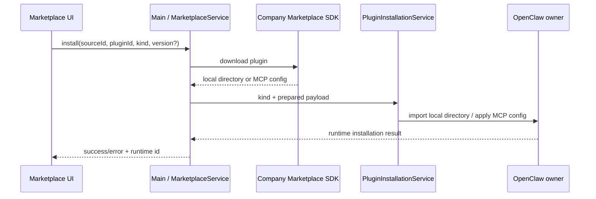

# Plugin Marketplace Adapter

本文描述企业内网插件市场的稳定接入边界。仓库默认不连接任何市场；内网构建注册公司 SDK Provider。

## 1. 支持范围

Marketplace 只暴露三种类型：

- `extension`：公司 SDK 下载的扩展目录，内容由内网市场与 OpenClaw contract 决定；
- `skill`：单个 Skill；
- `mcp`：结构化 MCP server 配置。

Hook 没有企业市场来源，也没有需要迁移的历史市场安装数据。Hook 的本地管理与 Marketplace 完全分离。

## 2. 安装链路



SDK 负责服务器通信和下载。对于 Extension/Skill，`prepareInstall` 返回下载完成后的本地目录 `sourcePath`；Main 不自行拼下载 URL，也不重复实现 SDK 的认证协议。对于 MCP，返回经过 Provider 映射的结构化配置。

`PluginInstallationService` 只负责按 kind 路由到现有安装器：

- Extension 目录原样交给 OpenClaw plugin/bundle 导入，不在通用市场层枚举或限制内部内容；
- Skill 目录交给用户 Skill 文件服务；
- MCP 配置交给 MCP 配置服务。

Provider 返回的临时目录可携带 `cleanup`，安装成功或失败后都会调用。

## 3. Provider contract

Provider 实现：

- `source`：稳定的 source id、显示名以及支持的三种 Marketplace kind；
- `search(query)`：调用 SDK 查询目录；
- `getDetail(request)`：调用 SDK 查询详情；
- `prepareInstall(request)`：调用 SDK 下载并返回本地目录，或生成 MCP 配置。

仓库不规定公司 SDK 的类名、鉴权对象或下载方法签名。这些对象只能存在于 Main/Provider 内部，不能放入 shared contract 或穿过 preload。

## 4. 通用校验

这里的校验是进程边界和类型校验，不是公司服务器的鉴权协议：

- IPC 限制 kind、字符串长度、limit 和 operation；
- Source 必须声明支持请求的 kind；
- catalog/detail 只投影 UI 使用的公开字段；
- prepared payload 的 kind 必须与请求一致；
- Renderer 不接触 SDK、凭证或下载目录管理；
- 安装完成后以 OpenClaw/本地配置重新列举的状态为准。

Marketplace 不要求额外的“详情身份 token”或内容白名单。内网 Provider 是受信任安装来源，SDK 下载的 Extension 目录直接进入 OpenClaw 安装器；格式和运行时合法性由 OpenClaw 判断。用户从磁盘手动导入代码 Extension 时仍遵循 OpenClaw 自身的 capability consent，这不是公司 Marketplace SDK 协议。

## 5. 默认与内网组合

默认 factory 注册空 Provider，因此 UI 显示“未配置 Marketplace”。内网版本只需要在 composition root 注入 SDK Provider，不应修改 Renderer 或 IPC 协议。

示意：

```ts
const provider: PluginMarketplaceProvider = {
  source: {
    id: 'company',
    name: 'Company Marketplace',
    supportedKinds: ['extension', 'skill', 'mcp'],
  },
  search: query => companySdk.search(query),
  getDetail: request => companySdk.getDetail(request),
  prepareInstall: async request => {
    if (request.kind === 'mcp') {
      return { payload: { kind: 'mcp', config: await companySdk.getMcpConfig(request.pluginId) } };
    }
    const download = await companySdk.downloadToDirectory(request.pluginId, request.version);
    return {
      payload: { kind: request.kind, sourcePath: download.directory },
      cleanup: download.cleanup,
    };
  },
};
```

## 6. 验收

通用层测试覆盖：三种 kind 路由、未知/Hook kind 拒绝、空 Provider、搜索分页、prepared payload 校验、cleanup、SDK 异常脱敏及 IPC 输入边界。

内网 Provider 另外验证：SDK 搜索/详情映射、目录下载失败、下载目录清理、Extension 目录导入、单 Skill 导入、MCP 配置安装/更新，以及安装后重新列举的一致性。
