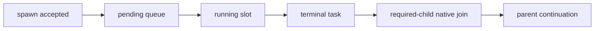

# OpenClaw Gateway Capability Matrix

本文以 OpenClaw `v2026.8.2`、当前 adapter/config sync、`scripts/patches/v2026.8.2/README.md` 和 runtime tests 为基线。矩阵用于判定能力 owner 与升级漂移；“Patch”只表示锁定 pristine npm 产物仍缺少 JustDo 所需语义，不表示 Renderer 拥有 Gateway 行为。

## 1. 当前能力归属

| 能力                    | Gateway/上游                                                     | JustDo App                                                 | v2026.8.2 处置                      |
| ----------------------- | ---------------------------------------------------------------- | ---------------------------------------------------------- | ----------------------------------- |
| chat、history、thinking | 执行、transcript、实时与历史 display projection                  | wire 校验、identity、reconcile、timeline                   | 原生；删除旧 002–004                |
| session、goal、model    | session/goal 权威 RPC；session tool visibility                  | managed key、产品 metadata、ready 后 `sessions.patch`；用户设置访问范围，默认 `tree` | 原生；不读写运行中 `sessions.json`  |
| tool directory          | tool schema、搜索和执行                                          | permission 与结构化卡片                                    | 原生；删除旧 009                    |
| subagent/task           | admission、排队、timeout、required-child join、task ledger/event | `tasks.list/get` 映射、父子展示、stop                      | 原生；删除旧 013–021、049           |
| approvals               | request 生命周期、挂起、恢复和终态清理                           | policy sync、modal、session grant                          | 原生；删除旧 022–025                |
| compaction/context      | safeguard、overflow、budget、precheck                            | 配置、进度与 detail 展示                                   | 原生；只保留 purpose metadata patch |
| cron                    | job/run scheduler                                                | isolated agent、receipt、显式 `delivery: { mode: 'none' }` | 原生；删除旧默认 delivery patch     |
| progress                | run/task/compaction 事实                                         | bounded runtime bridge 投影与 UI                           | 迁入 `justdo-runtime-bridge`        |
| embeddings              | provider 调用与 memory index                                     | loopback provider、代理与凭证边界                          | 迁入 `justdo-runtime-bridge`        |
| Windows/Chrome MCP      | MCP/Browser runtime                                              | bundled runner、Chrome 管理与设置                          | 保留 002–004 三个窄补丁             |
| host metadata           | provider request 构造                                            | session/parent/user/purpose metadata                       | 保留 006–007                        |
| app-start recovery      | durable task recovery                                            | JustDo app-start epoch                                     | 保留 008                            |
| manual reindex          | memory index/cache                                               | 一次性用户意图                                             | 保留 009                            |
| exec approval timeout   | 原生 approval request/wait                                       | 用户选择的等待时限                                         | 保留 010                            |
| plugin approval detail  | before-tool approval dispatch                                    | reviewer-only 完整变更内容                                 | 保留 011                            |
| plugin approval timeout | 原生 plugin approval request/wait                                | 用户选择的等待时限                                         | 保留 012                            |

窗口、tray、update、主题、i18n、session 分组/cwd、SQLite 产品数据、Marketplace、文件 preview 和代理 UI 都属于 JustDo，不应要求 Gateway patch。

## 2. 十二个保留补丁

| 编号 | 能力                                         | 移除条件                                    |
| ---- | -------------------------------------------- | ------------------------------------------- |
| 001  | value-bound managed Python 环境注入          | 上游提供可信 host Python 环境 API           |
| 002  | Windows 通用 npm/npx MCP runner              | 上游 runner 在 Electron/Windows 下等价可靠  |
| 003  | Chrome MCP Windows runner 与早期 stderr      | 上游提供等价启动与诊断                      |
| 004  | Chrome MCP 空页面恢复                        | 上游原生恢复 empty page set                 |
| 005  | 最终 system-prompt-only replacements         | 上游提供 final、cache-safe prompt hook      |
| 006  | agent session/parent/user-initiated metadata | 上游提供等价 provider metadata              |
| 007  | compaction/reviewer purpose metadata         | 上游为两类请求提供等价 metadata             |
| 008  | JustDo app-start task recovery boundary      | 上游 durable task 支持 host-instance epoch  |
| 009  | 手动 memory reindex 一次性 no-cache          | 上游提供 one-shot force re-embed            |
| 010  | 原生 exec approval 可配置等待时限            | 上游提供 exec approval timeout 设置         |
| 011  | trusted-policy plugin approval detail 转发   | 上游 before-tool approval 原生转发 `detail` |
| 012  | 原生 plugin approval 可配置等待时限          | 上游提供 host plugin approval timeout 设置  |

当前目录只对 pristine `openclaw@2026.8.2` 有效。旧 marker、历史补丁或部分应用状态必须明确失败；处理方式是从 source lock 重建，而不是原地迁移。

## 3. Gateway API 与 wire 边界

| 域             | 当前方法/事件                                                     | JustDo 稳定化                                                                           |
| -------------- | ----------------------------------------------------------------- | --------------------------------------------------------------------------------------- |
| Chat           | `chat.send`、`chat.history`、chat/agent/tool/lifecycle events     | session/run/generation、history takeover、thinking/tool timeline                        |
| Sessions       | `sessions.subscribe/list/get/describe/resolve/patch/abort/delete` | managed identity、model patch、分页与终态映射                                           |
| Tasks          | `tasks.list`、`tasks.get`、`task` event                           | `pending/running/done/failed/killed/timeout` DTO；`taskName` 是机器标识，`label` 是标题 |
| Approvals      | `exec.approval.*`、`plugin.approval.*`、`exec.approvals.get/set`  | fail-closed policy、交互 modal、session grant                                           |
| Skills         | `skills.status`、`skills.update`                                  | manifest、用户文件和 UI                                                                 |
| Cron           | `cron.list/add/update/remove/run/runs`、cron event                | agent 归属、receipt、readAt/catch-up                                                    |
| Runtime bridge | `justdoRuntimeBridge.historyDetails` 与扩展事件/provider          | 有界 `operator.read`、progress、embeddings                                              |

所有 v2026.8.2 专用响应先经过 `src/main/engine/openclaw/wire/v2026_8_2.ts`。Adapter 对 Renderer 只暴露稳定 DTO，不把上游内部的 `succeeded`、`lost`、cursor shape 或 bundle 类型泄漏到 shared contract。

## 4. Session 存储与旧数据迁移

JustDo 不再直接读写活动 OpenClaw `sessions.json`：模型更新使用 `sessions.patch`，历史使用 `chat.history`，tool input 与 compaction detail 由 runtime bridge 的受限 `operator.read` RPC 获取。

检测到 legacy `sessions.json` 时，Gateway 启动被 migration coordinator 阻止。流程固定为 dry-run plan → 用户确认 → 无 workspace 的已验证备份 → doctor import → validate/inspect/integrity → receipt。取消或任一步失败都保留旧状态且不启动空 Gateway；成功 receipt 使后续启动不重复导入。

## 5. Subagent 与 task 不变量

- `maxConcurrent` 限制 running，不把已接受的 queued child 变成错误；run timeout 从真正 running 开始。
- 父 agent 在所有 required child 终态被消费前不能提交最终结束；fire-and-forget 不形成该 obligation。
- Task ledger/event 是事实源。`tasks.list/get` 的 cursor、status 与 terminal projection 由版本化 validator 校验。
- 同一 JustDo 进程中的 Gateway 重启可恢复 task；完整 app 重启通过 patch 008 终止旧 app-start 接受的 task。
- UI 的 active 聚合与 stop 递归是产品投影，不替代 Gateway 原生 queue/join 状态机。

## 6. Compaction、context 与 progress

Config sync 使用原生 safeguard compaction、1800 秒 timeout、关闭 memory flush、启用 mid-turn precheck，其余保持上游默认。旧 Codex-local compaction instructions、context-budget 和 recovery 补丁已删除。

原生事件是最终事实；runtime bridge 只补充 JustDo 所需的安全进度与只读 detail。验收覆盖 pre-turn、mid-turn、manual compact、provider overflow、timeout/auth/network/no-progress 和 abort，不能只检查最后是否出现 summary。

## 7. Tool-call finish reason 边界

JustDo 内置 loopback 模型服务必须遵守响应契约：存在完整、结构化且工具名已知的 `tool_calls` 时，最终 `finish_reason` 必须为 `tool_calls`。普通可见文本、不完整参数或未知工具不得被 JustDo 推断为调用。

第三方 provider 继续使用 OpenClaw v2026.8.2 上游安全规则；尤其不能恢复旧 patch 045 去放宽“可见文本 + `finish_reason=stop`”响应。Pristine contract tests 验证该安全边界。

## 8. 升级与测试证据

每次升级对每个 RPC/event/patch 分别检查 Native、Patched、Adapted、Presented 四层：

| 层        | 证据                                                                  |
| --------- | --------------------------------------------------------------------- |
| Native    | 锁定 tarball、上游源码/schema、pristine contract test                 |
| Patched   | 唯一 anchor、首次 apply、二次字节不变、source/bundle verify、歧义失败 |
| Adapted   | wire validator、adapter/config/scheduler/IPC tests                    |
| Presented | preload、Renderer reducer/controller/component 行为测试               |

运行时 manifest 绑定 npm integrity、tarball SHA-256、Node major、构建 recipe 和最终 bundle。开发 runtime 是冻结快照，只有显式 force install 才从锁定 pristine 包重建。

最低验收场景包括：thinking 实时与历史一致；多个 subagent 在 `maxConcurrent=1` 排队且父 agent 等待；审批到期/恢复；compaction overflow；cron 无外发；embedding proxy；manual reindex；Windows MCP/Chrome empty page；迁移取消和各失败点；同进程 Gateway restart 与完整 app restart 的不同 task 边界。

新增或移除 Gateway 调用、patch 或 bridge method 时，同步本矩阵、`05-agent-engine.md`、patch README、patch guide 和对应行为测试。
