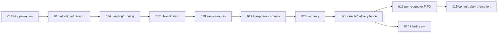

# OpenClaw Gateway Capability Matrix

本文以 OpenClaw `v2026.7.1-2`、当前 adapter/config sync、`scripts/patches/v2026.7.1-2/README.md` 和 runtime tests为基线。矩阵用于判定owner与升级漂移；“Patch”表示锁定pristine npm产物不满足JustDo契约，并非功能由Renderer实现。

## 1. 核心能力

| 能力                                                 | Gateway/上游                    | JustDo App                              | 当前补丁依赖                         |
| ---------------------------------------------------- | ------------------------------- | --------------------------------------- | ------------------------------------ |
| chat send/history/events                             | 执行与transcript权威            | adapter、identity、UI投影               | thinking/history/进度相关            |
| session list/get/describe/resolve/patch/abort/delete | 权威RPC                         | managed key、本地session映射            | goal clear、task title、identity pin |
| tool execution                                       | 权威                            | permission/UI cards                     | selected schema、tool error recovery |
| thinking/reasoning                                   | provider/run数据                | normalize/render/history                | 002-004                              |
| goal                                                 | session状态/tool                | continuation coordinator/卡片           | 011及compaction/progress能力         |
| subagent                                             | spawn/registry/delivery         | parent/status/抽屉/stop                 | 012-021、036、038等                  |
| approvals                                            | exec/plugin API与run suspension | policy sync/modal/session grant         | 022-025                              |
| cron                                                 | job/run scheduler权威           | mapping、isolated agent、result receipt | 005默认delivery等                    |
| Skills                                               | status/update/runtime           | bundled manifest、用户文件              | 009 tool catalog相关                 |
| MCP/Extensions                                       | runtime/config/CLI              | store/import/host/diagnostics           | 006-008 Windows/Chrome               |
| memory/usage                                         | Gateway API/state               | IPC normalize与页面                     | 无专用App替代                        |
| compaction/context                                   | runtime权威                     | detail/progress UI与goal恢复            | 028-031、034-035、037、039-040       |

## 2. App 本地能力

下列不应要求Gateway patch：窗口/tray/update/theme/i18n/shortcut；session标题/pin/group/cwd；SQLite KV/agents/MCP/Hook产品配置；result readAt/baseline/catch-up；文件preview edit grant；Marketplace provider adapter；系统/custom proxy UI。

## 3. Patch 能力分组

以patch目录README为最终逐文件说明：

| 编号    | 分组                 | 主要契约                                                                               |
| ------- | -------------------- | -------------------------------------------------------------------------------------- |
| 001     | managed pip env      | 只允许App提供且path-bound的PIP config                                                  |
| 002-004 | reasoning/history    | live thinking、think-tag、历史block投影                                                |
| 005     | cron                 | targetless detached默认delivery none                                                   |
| 006-008 | Windows/Chrome MCP   | safe runner、早期diagnostics、empty page恢复                                           |
| 009-012 | tool/session         | selective schema、final prompt replacement、silent goal clear、task title              |
| 013-021 | subagent核心         | 原子准入、pending、managed join、两阶段提交、恢复、delivery ownership                  |
| 022-025 | approval             | lifetime、suspension、resume、stop/failure                                             |
| 026-028 | request metadata     | parent/session/purpose，包括compaction/reviewer                                        |
| 029-031 | compaction基础       | retained user replay、Codex template、emergency fallback                               |
| 032-035 | progress/recovery    | safe run stages、tool error reasoning、live budget、Codex local compaction             |
| 036-040 | identity/convergence | managed identity、bounded overflow、taskName case、recovery progress/error attribution |

编号和内容只能从当前README/loader确认；旧 `v2026.6.11` 的25个文件不能作为当前证据。

## 4. Gateway API 使用清单

| 域           | 当前方法/事件                                                                          |
| ------------ | -------------------------------------------------------------------------------------- |
| Chat         | `chat.send`、`chat.history`、chat/agent events                                         |
| Sessions     | `sessions.subscribe/list/get/describe/resolve/patch/abort/delete/goal.clear`           |
| Approvals    | `exec.approval.list/resolve`、`plugin.approval.list/resolve`、`exec.approvals.get/set` |
| Skills       | `skills.status`、`skills.update`                                                       |
| Cron         | `cron.list/add/update/remove/run/runs`、cron changed event                             |
| Agents/tools | `agents.update`、`tools.invoke`                                                        |
| Usage        | `usage.cost`                                                                           |

Memory能力通过专用Main service/state调用；具体wire method应以实现为准，不在没有代码证据时写死。

## 5. 权威与缓存

- Gateway history胜过SQLite message；runtime session胜过local running flag。
- Gateway cron胜过Renderer task list；SQLite receipt只拥有read/delete projection。
- Gateway Skill status胜过文件scanner/UI cache。
- Active permission必须从Gateway读取验证，不能只看config文件或adapter info。
- Patch progress event是增量信号，最终状态仍由lifecycle/history确认。

## 6. 升级漂移审计

升级前对每项判断：上游是否原生实现、wire shape是否等价、安全边界是否保持、App是否仍消费、patch可否删除。验证链：pristine contracts必须证明原始缺口；首次patch成功；二次应用字节不变；source/bundle分别verify；歧义anchor原子失败；manifest绑定integrity/tar hash/Node/recipe/final bundle。

当前锁定 npm integrity、tarball SHA-256与Node版本记录在patch README。开发runtime是冻结快照；只有`OPENCLAW_FORCE_INSTALL=1`重建，strict verifier拒绝来源不匹配的runtime。

## 7. 测试证据

- `openclawPristineContracts.test.ts`：上游已具备/仍缺失能力基线。
- `openclawV202671*.test.ts`：reasoning、subagent、approval、metadata、compaction、recovery等当前能力。
- `openclawRuntimePatchManifest/Staging/Freeze/Prune`：产物、原子替换和tamper fence。
- adapter/shared/Renderer tests：证明App能消费wire contract；不能代替pristine/patch测试。

## 8. 维护规则

新增/移除Gateway调用或patch时，同步本矩阵、`05-agent-engine.md`、patch目录README、patch guide和对应feature文档。没有可执行测试的“上游应该支持”不能把矩阵状态改为native；没有consumer测试的patch也不能宣称产品能力已完成。

## 9. 能力状态判定规则

矩阵中的能力不能只用“有一个同名 RPC”判定完成。每项应分别标记四层证据：

| 层        | 要回答的问题                         | 权威证据                                           |
| --------- | ------------------------------------ | -------------------------------------------------- |
| Native    | pristine OpenClaw 是否具备所需语义   | 锁定 tarball、pristine verifier、上游源码/测试     |
| Patched   | 当前 runtime 是否原子补齐缺口        | patch header、apply/verify、manifest、focused test |
| Adapted   | JustDo Main 是否正确消费并稳定化协议 | Adapter/config/scheduler service 与单元测试        |
| Presented | Renderer 是否提供完整用户流程        | preload/IPC、slice/controller/component 与行为测试 |

只有四层都适用且有证据，才能在产品文档写“已实现”。例如 002 发出 thinking 并不自动证明历史可见；还需要 004 history projection、Adapter `thinkingUpdate`、Renderer reducer 和 timeline 测试。

## 10. Session 与 Chat 能力明细

| 操作                    | 调用方                            | Gateway 事实               | JustDo 额外责任                                    | 失败/恢复                                     |
| ----------------------- | --------------------------------- | -------------------------- | -------------------------------------------------- | --------------------------------------------- |
| `chat.send`             | Runtime Adapter / Lit chat client | 接受 run、产生事件         | provisional run 绑定、session domain、超时         | 接受响应/首事件竞态；断线后 history reconcile |
| `chat.history`          | Adapter/Main history IPC          | canonical transcript       | display projection、分页、SQLite fallback 标记     | generation 防旧响应覆盖新会话                 |
| `sessions.list`         | Adapter/Subagent/cleanup          | session registry 投影      | 分页、managed key、parent/goal/title读取           | cursor/hasMore、500 page、旧身份 pin          |
| `sessions.get/describe` | Goal、运行状态、详情              | session metadata           | normalize goal/context/model                       | schema 缺失时保守降级                         |
| `sessions.resolve`      | Cron/result/managed mapping       | key/id 解析                | canonical key 与本地 session id 绑定               | hash/fingerprint 日志，不泄漏完整 key         |
| `sessions.patch`        | model/agent/metadata 更新         | 修改 session runtime state | qualified model ref 与本地配置回正                 | revision/重载冲突                             |
| `sessions.abort`        | Stop/cleanup                      | 中止 active run            | 等待 Gateway 确认、审批清理、recent terminal guard | abort 不可用时不得假装已停止                  |
| `sessions.delete`       | Cowork/cron cleanup               | 删除 runtime session       | child→root 顺序与本地 metadata 清理                | 部分失败保留可重试证据                        |

事件层至少包含 chat、agent、tool、lifecycle、session changed 和 run progress。JustDo 使用 session key/id、run id、lifecycle generation 和 canonical sequence 做 admission；WebSocket transport sequence 不能替代 Agent sequence。

## 11. Tool 与结构化 UI 能力

Gateway 拥有工具 schema、选择、调用和结果；App 只做权限交互与显示。特殊投影必须有普通 Tool 回退：

| 工具/事件          | App 专用投影               | 契约位置                               | 回退行为                           |
| ------------------ | -------------------------- | -------------------------------------- | ---------------------------------- |
| `update_plan`      | 常显步骤卡、完成数、解释   | `src/shared/openclaw/executionPlan.ts` | 输入不合法时显示普通工具调用       |
| `sessions_spawn`   | Subagent 卡/菜单/父子关系  | Gateway registry + patch 012–021       | malformed child 不进入正常控制列表 |
| `sessions_yield`   | 等待 child 的运行卡        | 原生工具/lifecycle                     | 无 output 仍保持 running           |
| `update_goal`      | Goal 状态卡与 continuation | Session goal contract                  | usage/budget 兼容值归一 blocked    |
| exec/file mutation | Approval modal             | exec/plugin approval contract          | 来源或策略不明时 fail closed       |

Patch 009 的 selective schema catalog 只改变某些重型工具 schema 的发现时机；它不能改变工具实际权限和执行所有权。

## 12. Subagent 能力链

Subagent 不是一个 patch，而是一条依赖链：

关键不变量：

- admission 在第一次异步初始化前原子预留 requester child 容量；
- accepted/queued 与 running 分开，run timeout 从真正 running 开始；
- managed join 与 native announce 对同一结果只有一个 owner；
- required completion 对同 requester 按 durable sequence FIFO；
- outer delivery 完整提交后才提升 canonical branch；
- 隐式恢复不更换 managed session id，显式 reset/delete 仍可换号；
- Renderer 查询 Gateway registry projection，不用本地 taskName 作为事实主键。

任何升级只覆盖其中一个环节，都不能直接删除整组 patch。

## 13. Approval 能力链

| Patch | 缺口                                    | 不得改变的上游行为                   |
| ----- | --------------------------------------- | ------------------------------------ |
| 022   | 可信 JustDo 交互审批不随普通 TTL 过期   | 非可信/native channel 保持原 timeout |
| 023   | 等待人工决定时安全挂起 run              | 不把挂起当 final/abort               |
| 024   | 真正决定后隐藏恢复，避免重复可见 prompt | 未决定不得自动恢复                   |
| 025   | stop/failure 时收口 waiter/record       | 迟到 response 不执行工具             |

App 层还必须通过 `exec.approvals.get/set` + baseHash 管理 host policy，并用 `actionApproval.info` 检查 trusted extension readiness。Adapter info 只是必要信号，不是完整 effective policy 的单一权威。

## 14. Cron 能力链

Gateway 原生拥有 `cron.list/add/update/remove/run/runs` 和调度。Patch 005 只处理 targetless detached Agent-turn 在省略 delivery 时的默认语义；JustDo Main 另外负责：

- 将 Agent-turn job 归属 `justdo-scheduler`；
- 修复/禁用错误 assignment；
- 把 wire `ok` 映射为产品 `success`；
- 轮询 job state 和 run；
- 将有界 run 投影写入 SQLite receipt；
- 保存 readAt/baseline/catch-up；
- 打开详情时重新读取 Gateway history。

因此“结果收件箱已实现”不能作为 Gateway 新增 in-app channel 的证据；两者是不同数据面。

## 15. Compaction 与 Context 能力链

| Patch | 能力                                             | 消费/依赖               |
| ----- | ------------------------------------------------ | ----------------------- |
| 028   | compact/reviewer request purpose metadata        | Provider 路由/审计      |
| 029   | bounded 原始用户上下文 archive                   | 030、031、035、037      |
| 030   | Codex-style continuation prompt/replay           | 035                     |
| 031   | 模型/auth/timeout 等失败时 emergency handoff     | 非 Codex-local fallback |
| 034   | active run context budget publication            | Session/UI 实时状态     |
| 035   | 显式 Codex-local 90% compaction 语义             | 029、030                |
| 037   | provider-confirmed overflow 的最多三次收敛       | 029、035、outer retry   |
| 039   | recovery compaction start/update/end/failed      | UI 进度                 |
| 040   | timeout/auth/network/no-op/local budget 真实归因 | 037、039                |

能力验收必须覆盖 pre-turn、mid-turn、manual compact、连续两次 compact、provider overflow、摘要 timeout、auth failure、no progress 和用户 abort。只检查最终有 summary 会漏掉 identity、进度、错误归因和中间 terminal lifecycle 问题。

## 16. Browser、MCP 与平台能力

Patch 006 处理 Windows package runner/stdio 启动兼容；007 为 Chrome MCP 早期启动失败提供可诊断信息；008 处理空页恢复。App 侧还负责 Chrome 路径、DevToolsActivePort、port owner、extension packaging、pairing secret 和设置 UI。

这些能力必须在 packaged runtime 验证，因为开发环境 PATH、Node、Chrome、`.cmd` resolution 和资源目录与安装包不同。单元测试通过不能证明 Windows NSIS 安装后的 MCP 子进程可启动。

## 17. API 变更审计模板

每次 OpenClaw 升级，对每个 App 使用的 RPC/event 填写：

| 检查项                                        | 结果                    |
| --------------------------------------------- | ----------------------- |
| 方法/事件仍存在，权限角色是否变化             | native evidence         |
| 请求字段 required/optional/default 是否变化   | schema diff             |
| 响应分页、cursor、null/undefined 语义是否变化 | adapter tests           |
| session/run/sequence identity 是否变化        | reducer/reconcile tests |
| 错误 code/message/timeout 是否变化            | failure injection       |
| 当前 patch anchor 是否仍唯一                  | pristine verifier       |
| App 是否还消费该字段/事件                     | rg + consumer test      |
| UI 是否能从 history/query 重建                | restart/reconnect test  |

没有填写的项视为未验证，不能仅因 TypeScript 编译通过就宣布升级完成。

## 18. 端到端验收场景

1. 新会话发送消息，经历 thinking→tool→content→final，重启后由 history 重建同样顺序。
2. 同父并行 spawn 超过 child limit，验证 accepted/forbidden、queued/running 和 completion FIFO。
3. Ask 模式触发 exec 与文件审批，等待、允许、拒绝、停止、Gateway 重连均确定性收口。
4. 创建 Agent-turn cron，无外部 channel 仍产生 SQLite 未读结果，并能打开 Gateway session。
5. 触发 context 接近阈值、provider overflow 和摘要失败，验证 progress、收敛次数与最终真实错误。
6. Windows packaged runtime 启动 MCP/Chrome extension，验证 runner、诊断、空页恢复和资源路径。

上述场景分别连接 native、patch、Adapter 和 UI 四层，是 capability matrix 真正的完成证据。
