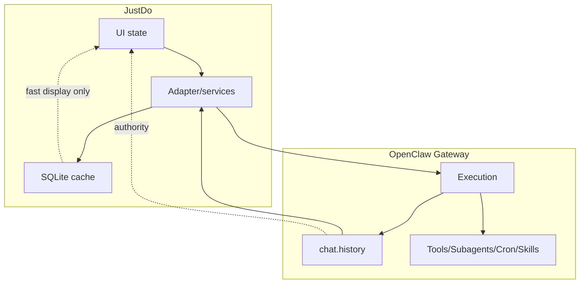

# OpenClaw Gateway Capability Matrix

This matrix records which layer owns each capability in the current JustDo architecture.

| Capability | Gateway API / Runtime | JustDo Main | JustDo Renderer |
| --- | --- | --- | --- |
| Send chat turn | Owns execution | Maps Cowork session to Gateway session and forwards stream | Starts/continues session through preload |
| Chat history | `chat.history` authority | Reconciles into SQLite cache | Displays/searches cache and Gateway-backed history |
| Gateway process | Runtime binary/package | Downloads, installs, starts, stops, reports status | Shows status and restart action |
| Provider config | Uses generated config | Stores config and syncs OpenClaw config | Settings UI |
| Agent model binding | Uses model refs | Normalizes/backfills model refs | Agent/model selection UI |
| Subagents | Owns lifecycle/history | Bridges status/history | Displays subagent menu/drawer |
| Skills | Owns discovery/status/install runtime | Skill RPC, local file import/delete, marketplace adapter | Skills manager and marketplace |
| MCP | Runs configured servers/tools | Stores definitions, probes, syncs config | MCP manager |
| Hooks | Runs configured hooks | Stores definitions and syncs config | Hook manager |
| Extensions | Extension host/runtime interactions | Lifecycle, callback server, ask-user routing | Extension manager/permission UI |
| Scheduled tasks | Cron execution | CronJobService polling and IPC | Scheduled tasks UI |
| Slash commands | Gateway capability + JustDo policy | Lists commands through Gateway client/policies | Slash command menu |
| Local files | No direct ownership | Dialog/shell/localfile protocol | File picker and preview UI |
| SQLite | No ownership | Local app data and UI cache | Access only via IPC |

## Notes

- If a feature changes execution truth, prefer an OpenClaw upstream API/change.
- If a feature changes desktop UX, local settings, or UI cache, implement it in JustDo.
- Runtime patches must stay small and documented in `scripts/patches/README.md`.

## Capability Details

### Chat

Gateway owns the canonical message sequence. JustDo can keep `cowork_messages` as a cache, but must reconcile from `chat.history` when opening a session or recovering after restart.



Expected behavior:

- Live stream updates UI quickly.
- History reload corrects stale cache.
- Tool input/history lookup goes through Gateway/Main IPC.

### Runtime

Gateway process management is local desktop infrastructure, so JustDo owns the manager. The runtime behavior once Gateway is running remains Gateway-owned.

This split means JustDo can:

- download runtime
- apply compatibility patches
- start/stop process
- expose status

But JustDo should not:

- replace Gateway session scheduler
- rewrite Gateway history storage
- execute Gateway tools directly in renderer

### Plugins

Skills, MCP, Hooks, and Extensions have a shared pattern:

```text
JustDo: configuration UI + local persistence + config sync
Gateway: runtime loading + execution
```

If a plugin feature requires runtime semantics, it belongs in Gateway or a runtime extension. If it requires desktop UX, it belongs in JustDo.

### Scheduled Tasks

Gateway owns schedule triggers and run execution. JustDo's polling layer is an observation mechanism, not a scheduler replacement.

If polling misses an update, the next poll should recover. If Gateway state and UI state disagree, Gateway wins.

### Local Files

Gateway tools may operate on files during execution, but renderer local file access is still gated by JustDo. File preview/open flows remain Main-process controlled.

## Ownership Checklist

Before implementing a feature, answer:

| Question | If yes |
| --- | --- |
| Does it decide whether a tool/session/run actually happened? | Gateway-owned |
| Does it change local UI organization or preference? | JustDo-owned |
| Does it need OS APIs or filesystem access? | Main process-owned |
| Does it only render existing state? | Renderer-owned |
| Does it bridge Gateway and desktop UX? | Adapter/service-owned |

## Drift Risks

Common ways the boundary drifts:

- Adding local fallback logic that silently becomes authoritative.
- Keeping stale SQLite data after Gateway history changed.
- Parsing human-readable tool output to derive IDs.
- Making runtime patches permanent without upstream tracking.
- Letting renderer call provider/marketplace/runtime endpoints directly.

These should be caught in review.
