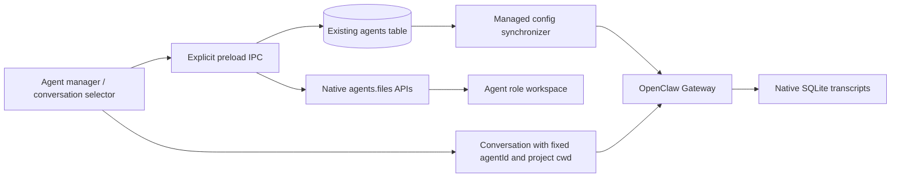
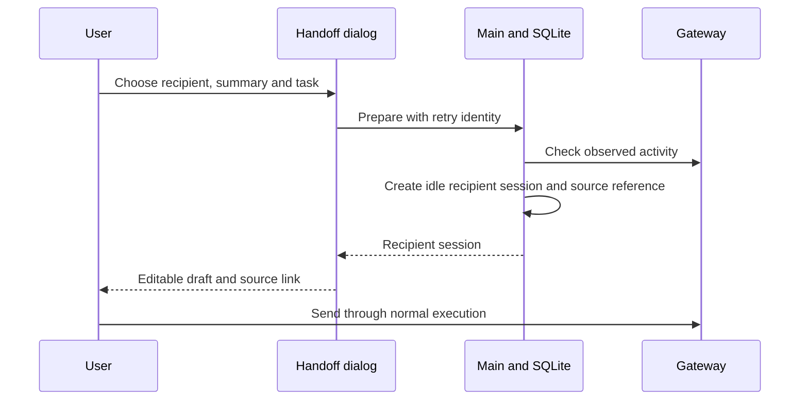

# 助手档案早期实施记录

> 历史归档：以下保留早期 P0/P2 的设计与验证记录。助手选择器、直接对话及手动 Handoff 已退出当前产品入口；测试结果只适用于文中提交。现行行为见[助手管理](../features/multi-agent.md)和[协作机制](../features/multi-agent-collaboration.md)。

## Historical implementation notes

The sections below record earlier P0/P2 validation and design. Their selectors,
direct assistant conversations and manual Handoff describe removed behavior;
they are not current user instructions. Legacy Handoff source metadata remains
readable, but its creation UI and IPC have been removed.

### Independent agents (P0/P2)

This delivery adds independent user-selectable Agent profiles. It does not turn
Subagent executions into long-lived roles. There is no group conversation,
automatic peer messaging or new transcript storage. P2 adds explicit manual
context handoff through an editable draft.

## User flow

1. Open **My agents** in the sidebar and create a named role.
2. Leave the model empty to inherit the application default, or select an override.
3. Save the profile, then edit its native AGENTS.md, SOUL.md, or IDENTITY.md.
4. Start a conversation from the manager or choose the role on the home screen.
5. Filter the unified conversation list by Agent. Existing sessions retain their owner.

A description is profile metadata; instructions belong in the role files.
Profile/file saves require a connected Gateway with no observed active runs.
Files are saved separately from profile metadata; unsaved edits require explicit discard.
Selecting a specialist model does not overwrite the global default.

## Ownership and compatibility

The existing agents table remains the product profile authority. The application
configuration synchronizer remains the only writer of the managed Agent roster;
Gateway agents.create/update/delete are intentionally not called in parallel.
Profile mutations are serialized, verified against the Gateway, and rolled back
on apply failure. The existing application config synchronizer owns runtime reload.
A failed rollback is surfaced to the user instead of reporting success.

Non-main role workspaces resolve to stateDir/agent-workspaces/normalizedAgentId,
independently of the selected project directory. main and the internal scheduler
retain their existing workspace behavior. This avoids silently relocating main's
existing rules. Pre-existing manually configured non-main workspaces should be
reviewed before adoption: the managed roster supplies its own explicit workspace.
No role files are copied into a user project by this feature.

The file editor calls agents.files.get/set, with an allowlist of three role files.
It compares the previously loaded content, missing flag, and workspace before a
write. Application writes are serialized. The Gateway API does not expose atomic
compare-and-swap: an external editor can still race between the check and write.
This is conflict detection, not a filesystem lock or immutable run snapshot.
Likewise, idle checks are preflight observations, not a lock against a new run
starting concurrently. Strict run-version pinning requires a native contract.

Legacy system_prompt/identity database fields remain untouched and are not used
as a second editor backing store. Role file contents remain native authority.
No private memory or credentials are copied when creating a role.

Disabled profiles remain in the native roster so history and role files can still
be accessed. Disable prevents new/continued chat runs through this application's
entry points; it is not native authorization revocation. Native delegation,
external clients, and scheduled-task permissions remain separate concerns. main cannot be
disabled. Set another default before disabling the current default. There is no
hard-delete operation in this phase.

## Data and runtime flow

No additional SQLite tables or Redux slices are introduced. is_default updates
are transactional. Empty model values intentionally remain empty across startup.
Session list grouping, pinning, and history rendering continue using existing data.

## Validation and follow-up

Focused tests cover payload validation, native file routing, conflict detection,
active runs on later pagination pages, config rollback, single-default persistence,
stable role directory selection, disabled role selection, and model isolation.
They validate application contracts, not live model behavior.

Before releasing, smoke-test with the locked bundled Gateway: create research and
review roles, use distinct rules in the same project, verify native bootstrap
sources and sessionRoot, restart, reopen both histories, and repeat in each
supported permission/sandbox mode. Include paths containing Chinese and spaces.
The adjacent OpenClaw source separates bootstrap identity from execution project,
but this delivery does not claim live sandbox/bootstrap verification.

Later phases: native handoff contract, shared collaboration context and routing,
explicit recipients, task visualization, and isolated parallel editing. Those
require their own native protocol and permission review before UI exposure.

### Worktree validation (2026-09-08)

Base: b35b28c96. Build, renderer/main TypeScript, lint and diff whitespace checks
passed. The focused application suite passed 81 tests across 12 files.
The full suite had 11 failures across four files; the same 11 failures reproduced
against an unmodified HEAD archive using the same dependencies:

- tests/renderer-motion-styles.test.ts
- tests/build/nsis-installer.test.ts
- tests/scripts/prepare-browser-extension.test.ts
- src/main/openclaw/config/openclawConfigSync.logout.test.ts

Test logs and the baseline archive are local verification artifacts under
node_modules/.cache; they are not source changes.

### Isolated interactive preview

From the worktree, run `npm run electron:dev:isolated`. This rebuilds the native
SQLite module for Electron, starts Vite on an available port, then opens Electron.
The host runtime must already be prepared (`npm run openclaw:runtime:host`).
The Electron process owns the worktree runtime lease; the launcher leaves
browser-extension preparation to the normal packaging workflow.

Development data defaults to `.work/multi-agent-preview`, including SQLite,
Gateway state, browser data and the default project. Set an absolute
`JUSTDO_DEV_USER_DATA_DIR` to use another development profile. Packaged apps
ignore this override. Vite excludes preview data and vendor assets from watching.
Model credentials are not imported: configure a provider in this test profile
before sending a real conversation. Agent creation and role-file editing work
even before a model is configured.

Manual checks: create a role; save AGENTS.md; reopen it; choose Start conversation;
verify the home-screen recipient; create a second role; confirm each role has a
different directory and unchanged file contents when switching between roles.
The shared project directory should contain neither role's private rule file.

Interactive verification on Windows completed with the bundled v2026.9.2 Gateway:
created research and review profiles through the real manager, saved research
AGENTS.md through native file APIs, switched roles and reloaded the saved file.
Native config confirms distinct role directories; the preview project contains
no AGENTS.md. Real model execution remains unverified in the empty preview profile.
After the preview fixes, build, lint, Electron TypeScript and 60 focused tests
passed; the no-model/auth config suite also passed all 29 tests with the prepared
runtime assets.

### Dev synchronization (2026-09-19)

Merged local dev at 804d9e937 (including origin/dev 067f81a5f). Agent UI uses
the new composer/sessions component directories and retains the updated browser,
external-session and read-only conversation flows. Native profiles keep their
independent role directories; ACP runtime owners retain the project workspace.
Renderer/main TypeScript, lint and 190 focused tests across 14 files passed.

## P2: explicit handoff drafts

The conversation header offers **Hand off to agent** for persisted local sessions.
Choose another enabled native profile, a title, a user-written summary and the
next task. The manager does not silently extract transcript content or copy
attachments, private memory, credentials, skills, rules, goal state or run receipts.

Main validates the bounded payload, checks native activity (including subagents),
and creates an idle product session in one SQLite transaction. A unique request
id makes retrying creation idempotent. The recipient owns the session and model;
the source project and permission mode are retained and explained in the dialog.
The source continues independently. The summary/task are placed in the existing
Renderer composer draft state. Only normal user submission prepares and executes
the native session.

Before sending, this draft has the same lifetime as current composer state; it
is not a durable workflow checkpoint. Main stores only provenance, not another
transcript cache. Deleting the source removes the live navigation link, retaining
the title captured during handoff. A live renamed source resolves to its current
title on reload. Deleting a recipient does not delete the source.

The locked runtime's patch 023 only accepts same-agent managed fork target keys.
This feature therefore uses explicit user context rather than cross-agent history
forking. It does not claim atomic ownership transfer, automatic dispatch, or a
shared group chat. The activity check is not a filesystem lock against external
clients.

Next phases: durable collaboration jobs, native peer routing and authority,
artifact sharing, task visualization and isolated parallel project editing.
No Subagent execution is promoted into a persistent user role.

P2 validation (2026-09-19): renderer/main TypeScript, lint, production build,
and 155 tests across 11 files passed. Tests cover existing-database upgrade,
retry identity, source deletion, role eligibility, recipient model isolation,
no inherited skills/runs, and explicit draft preparation. Live model execution
and multi-client concurrency are not established by these tests.

### Minimal Agent controls and collaboration presentation

The sidebar has one selector for session filtering and opening My agents.
The standalone manager button is removed. With one enabled profile, the home
recipient selector is hidden; with one profile, session identity badges are hidden.
Manual handoff lives in the existing session context menu, including grouped
sessions, rather than a permanent conversation-header action.

Agent profiles are durable identities; a sessions_spawn invocation is a delegated
execution that may use another permitted profile. Configuring a profile alone
does not grant spawn allowAgents or cross-agent sessions_send access. Peer messages
also depend on session visibility and agentToAgent policy. Do not automatically
expand these policies while changing presentation.

The current subtask panel exposes task identity, runtime status and summaries,
plus detail navigation. It is not a full peer-message graph. The proposed extension
uses the same panel: collapsed collaboration activity, sender/recipient rows and
expandable payload/result details. A send, delivery and completion must be separate
events joined by native correlation identities. Failed or unobserved delivery must
not appear as a completed edge. Do not infer peer exchange solely from model text,
shared files, or simultaneous tasks. Any graph is an optional detail view, not a
new permanent top-level button or another transcript store.
