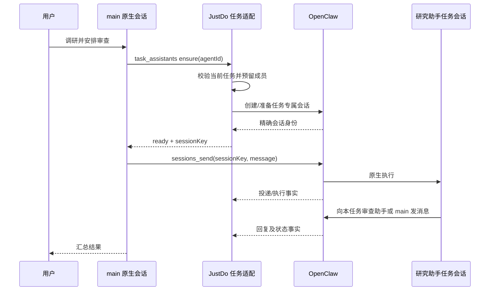

# 任务内协作早期提案（历史）

> 2026-09-19 的设计记录，保留目标与取舍；不作为当前功能状态。现行实现见[协作机制](../features/multi-agent-collaboration.md)。

# 一条用户会话下的多助手协作

状态：2026-09-19 设计稿，尚未实施原生通信替换。本次仅移除会话列表标题前的助手标记。
本文是下一阶段目标；现有 collaboration_* 工具仍在运行，不应把本文描述当作已交付能力。

右键菜单、统计和管理动作的具体范围与分期见 [协作会话右键菜单与统计改造计划](../features/collaboration-session-menu-plan.md)，其中对复制、导出的范围限制优先于早期概述。

## 1. 产品约定

用户会话代表一项持续的工作，主会话由 main 承接。用户只在主会话输入，主助手负责理解需求、决定分工和汇总结果；其他长期助手在各自的任务会话中工作，能够互相通信。main 是用户入口，并不把其他助手变成 sessions_spawn 创建的子代理。

普通会话不需要预建协作空间。实际需要助手参与时，才建立成员关系。一次任务在左侧始终只有一行；内部成员会话不进入普通列表、搜索结果或最近会话列表，但其消息可在协作节点内检索和查看。定时任务、外部渠道会话和真正的 Subagent 沿用自己的类型，不仅凭 agentId 非 main 就隐藏。

同一个长期助手可以参加多个用户会话，各自使用独立上下文。用户在原会话继续追问时复用原成员会话；新建用户会话时不复用其他任务的成员上下文。助手的持久身份和记忆不是任务私有数据：独立 Session 不等于所有长期记忆也隔离，界面和文档不得承诺后者。

## 2. 原生能力与产品边界

对照 ../openclaw/src/agents/tools/sessions-send-tool.ts 和 sessions-send-tool.a2a.ts：原生 sessions_send 支持会话寻址、执行触发、等待回复和有界往返。只传 agentId 会选择该 Agent 的默认会话；不能以此实现任务隔离。指定 label 需要正确解析既有会话；任意不存在的任务 sessionKey 不能假定会被自动创建。原生默认 Agent 会话的创建特例不能推广到任务会话。

| 所有者   | 职责                                                          |
| -------- | ------------------------------------------------------------- |
| 模型     | 选择参与助手、任务内容、通信对象、何时汇总                    |
| OpenClaw | Agent 配置能力、Session、原生发送与回复、执行、工具、消息历史 |
| JustDo   | 任务归属、内部会话准备、产品权限映射、原生事件关联、界面      |

不让 Main 重建一套消息投递执行器，也不把正文复制进产品数据库。必要的产品工具只解决“将某个助手加入当前任务并返回准确会话地址”，不同时发送任务、等待完成或自动安排步骤。

## 3. 标识和数据约束

继续以 anchorSessionId 作为用户会话身份，复用现有 collaboration_rooms 的 roomId，不新增第二套 taskId。按需建立房间，main 的现有 Session 就是锚点。

成员记录保存 roomId、agentId、productSessionId、nativeSessionKey、准备状态和加入时间；对 (roomId, agentId) 建唯一约束，对 nativeSessionKey 建唯一归属约束。默认每个 Agent 在一项任务中只有一个成员实例。无需在 UI 展示内部 ID。

准备状态为 preparing、ready、failed；运行状态从原生执行事实另行计算，两者不能混用。并发邀请同一成员必须采用事务预留和幂等原生创建；失败重试复用预留标识，不能生成多个幽灵会话。原生已创建而产品未确认时，先按精确 key 对账，再决定是否重试。preparing 不允许发送。

投递元数据保存 sourceSessionKey、targetSessionKey、sourceRunId、toolCallId、targetRunId（已知时）、原生消息引用（可获得时）、时间、状态和可信错误分类。唯一性以原生操作标识为主，不能按正文、时间接近程度或模型声明推断。正文仍从原生历史按需读取。

## 4. 模型如何发起协作

建议提供一个窄职责的产品工具 task_assistants，名称为设计占位，实施时确认。list 操作返回当前参与者及可用助手；ensure 操作接受一个准确的 agentId，建立或复用本任务成员，返回 agentId、显示名称、sessionKey 和准备结果。此工具不是 OpenClaw 原生能力，必须明确标识。

已验证唯一的显示名称可以作为解析便利；重名返回候选 ID，不猜测。schema 必须解释名称与 ID、必需字段和可重试错误。新建长期助手仍由 assistants_create 薄适配完成，创建成功不自动参与当前任务。

任何成员可发现当前任务参与者，且在权限允许时邀请已启用的长期助手。受邀助手不因此获得新增权限。模型决定是否邀请，不预建所有可用助手的会话。继承现有成员数限制并在错误中说明，不用无限自动重试。

提示词提供准确参与者映射及发送示例，要求使用任务 sessionKey。提示词只是减少误用，不承担访问隔离。优先异步发送，禁止轮询等待环；原生 timeout 表示等待超时，不证明目标没收到，不能据此自动重发。

## 5. 跨任务隔离是实施前置条件

原生 agentToAgent 开关和 allow 配置，以及 sessions 可见性，必须和产品任务归属一起核验。全局 visibility=all 或仅按 Agent 放行，不能等同于按任务授权。

PoC 必须验证源会话 A1 只能访问其任务成员 B1，不能因 A/B 被允许跨 Agent 通信就访问另一任务的 B2；同时覆盖 sessions_list、sessions_history、sessions_send 及原生自动回复路径。只拦截模型工具调用不足以证明后台回复路径受控。

优先复用原生受限访问能力；若锁定版本无法表达任务范围，需要明确的原生扩展点或最小能力补丁，并补入版本补丁清单。此条件未通过时，不切换生产发送链路，不通过扩大可见性掩盖问题。

模型不能指定来源 roomId、sourceRunId 或权限；从可信调用上下文解析。跨任务目标拒绝并提供本任务有效目标。真正的外部渠道通信保持已有工具与授权语义，不自动把外部会话吸纳为成员。

计划模式遵循现有只读执行规则；成员创建和任务发送不得绕过计划模式或审批。成员权限不超过本任务允许范围，也不超过助手自身范围。

## 6. 用户界面

### 会话列表与主界面

列表仅显示标题、已有状态、未读和菜单，不显示 main 或成员名字前缀，不为协作新增常驻按钮。主会话始终显示用户和 main 的消息；成员全部输出不自动灌入主聊天。原生工具结果按现有消息渲染展示，main 汇总给用户。

已有“协作 · N”入口仅在有实际参与者时出现，N 统计所有参与 Agent，包含 main。无需选择编排模板、手动画线或配置流程。普通新会话入口固定 main 是目标约束；历史非 main、外部和定时会话保持可读，不为移除列表标记修改其身份。

### 自动展开

当前任务首次产生真实成员准备/投递活动时展开协作页，preparing 节点可显示“准备中”，尚未投递不画成功边。初始化加载既有房间不算新活动；后台任务不抢当前面板，切回来可通过已有入口查看。用户手动关闭后，本次任务浏览期间不再次自动展开；新事件只更新已有入口状态。按锚点会话记录关闭偏好，不能用一个全局布尔值。

### 协作图

节点代表 Agent 在本任务的参与实例，显示名称、短职责和状态。稳定布局优先，新增成员才调整；流式消息不触发整图重排。连线只表示实际消息方向；双向通信保留两个方向，重复消息聚合计数，不把所有消息画成平行线。

点击节点，在同一协作标签页复用现有原生消息详情组件，支持流式更新、工具调用和审批状态；提供返回流程图的轻量导航。只读查看不改变主输入框收件人。点击边筛选对应方向的消息事件，展示发送时间和投递状态，消息正文按需加载。原生关联不足时只打开目标会话，不伪造精确定位。

节点“运行结束”不等于“业务任务完成”。消息区分发送中、已接收、失败、确认未知；执行区分运行中、等待授权、空闲、失败、停止。仅有明确回复关联才显示“已回复”。停止/超时后保留已发生的流程。

窄面板采用可滚动的简图和同页事件列表，不缩小文字到不可读；状态不能只依赖颜色，节点支持键盘聚焦。Agent 列表只显示参与者；Subagent 继续在其独立分区，不能混入平级图。

## 7. 文件、生命周期和恢复

助手身份文件由其原生 workspace 管理，不轮流覆盖项目根目录 AGENTS.md。任务项目目录属于任务资产，所有成员使用明确的项目路径；在锁定运行时验证身份提示词加载与实际执行目录的关系。共享文件不意味着上下文共享，也不提供并发写入隔离；默认由模型分配文件责任，冲突明确呈现，未来独立 worktree 另做能力。

用户继续会话复用成员；停止按钮停止本任务所有活动执行并阻止已停止轮次继续产生新投递，不取消该助手在其他任务里的执行。原生后台 A2A 往返也必须受停止范围约束，这是 PoC 验收点。全任务忙碌状态包含成员执行，不能 main 提前结束就显示全部完成。

归档隐藏列表记录但保留内部关系，删除沿现有确认流程清理本任务会话和元数据，不删除长期 Agent 或项目文件。禁用助手阻止后续调度，历史仍可查看。丢失原生会话显示不可用，不能创建空白会话冒充恢复历史。

重启先加载持久归属，再对账原生运行；断线时未确认投递显示未知。不得自动重发不确定操作。事件重复/乱序按原生 ID 去重和归并，终态不能被旧事件改回运行中。产品仅保存可恢复的索引，不建立正文缓存。

## 8. 逐步替换与验证

1. 原生 PoC：两名长期助手，各建两个任务会话，验证创建、双向/第三方通信、回复、并发、停止及跨任务访问拒绝；检查锁定的实际打包运行时，不能只验证 ../openclaw 工作副本。
2. 实现任务成员 ensure/list、可信源绑定、准备幂等和恢复。复用现有房间及成员表，必要字段按正式 schema 迁移补齐，并更新架构/数据文档。
3. 建立原生投递与回复的元数据投影，覆盖成功、工具内部返回错误、超时和后台 A2A 回复；不能只监听模型显式 sessions_send 调用，否则会漏掉原生往返连线。
4. 接入简洁面板与首次自动展开，列表统一按明确成员归属折叠；检验导航、搜索、归档、重启和节点历史。
5. 验证完成后，新任务使用原生链路，旧任务保持可读。按房间记录通信模式，同一房间不同时运行新旧调度器；旧任务切换需空闲且完成会话映射，不能盲目重放历史调用。停止向新任务暴露 collaboration_send，避免模型选到两个相似工具。

此处数据迁移仅涉及产品数据库，不为旧版本本地 OpenClaw 补丁添加兼容重写。运行时能力变更从锁定原始包重建。

验收至少包括：列表始终一条、两项任务同一助手不串上下文、B 可给 C 发消息、双向边可定位真实消息、首次展开且尊重关闭、失败不显示成功、同名助手不误投、并发 ensure 不重复、重复事件不重复计数、停止后不被后台回复重新启动、重启恢复、历史旧房间可读。真实模型测试必须覆盖中文助手名称与 ID 混用；模拟模型测试只能证明协议链路，不能代替可用性验证。
