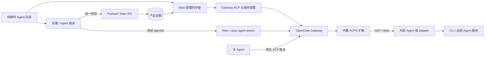

# 自定义外部 Agent 接入指南

> 适用对象：需要为本应用增加一种外部 Agent 的适配开发者、构建人员和验收人员。
>
> 运行版本以 `package.json` 和锁文件为准。
>
> 文档目标：完成接入后，新 Agent 能出现在“设置 → 外部连接 → Agent 委派”中，可独立测试、启用并接受主 Agent 的任务委派；所需运行依赖在交付前准备完成，已安装应用不在线下载适配器。

本文面向新增原生 ACP CLI、第三方 ACP adapter，以及企业自研 Agent 的开发者。自研 Agent
只有 HTTP/API 接口时，也可以通过本地 ACP adapter 接入。本文说明接入步骤和验收要求，
不涉及“设置 → 助手”中的角色档案，也不把模型 Provider 或 MCP Server 当作外部 Agent。

本文可以单独分发；在仓库内阅读时，可从[开发接入接口索引](README.md)进入。
示例中的 `example-agent`、包名和入口文件均为占位值，接入时应替换为实际产物。

## 最短接入路径

已有可用 ACP 命令时，按以下顺序完成接入：

1. 确认命令能在目标平台非交互启动，凭据已准备，stdout 只输出 ACP 协议数据。
2. 在 `EXTERNAL_AGENT_CATALOG` 增加稳定 ID、名称、翻译键和结构化 `adapter` 命令，默认停用。
3. 补齐中英文描述、品牌图标和图标样式。
4. 若使用内置 adapter，锁定依赖并补齐 runtime 同步、预编译和安装包必需文件检查。
5. 重新构建应用与受影响的 runtime，先测试握手，再启用、保存并验证实际委派。

| 修改点         | 实现入口                                                                                                                                                                                                                             | 新 Agent 的接入要求                                                  |
| -------------- | ------------------------------------------------------------------------------------------------------------------------------------------------------------------------------------------------------------------------------------ | -------------------------------------------------------------------- |
| 产品目录       | [externalAgentCatalog.ts](../../src/shared/openclaw/externalAgentCatalog.ts)                                                                                                                                                         | 增加一项；类型、设置默认值和页面列表随目录派生                       |
| 中英文说明     | [settingsTranslations.ts](../../src/renderer/services/i18n/settingsTranslations.ts)                                                                                                                                                  | 两种语言补齐同一个 `descriptionKey`                                  |
| 图标与样式     | [ExternalAgentBrandIcon.tsx](../../src/renderer/features/settings/integrations/ExternalAgentBrandIcon.tsx)、[ExternalAgentsSettingsSection.tsx](../../src/renderer/features/settings/integrations/ExternalAgentsSettingsSection.tsx) | 增加图标分支和 `AGENT_ICON_STYLES` 项                                |
| adapter 与依赖 | [ACPX 扩展](../../openclaw-extensions/acpx/README.md)                                                                                                                                                                                | 原生 CLI 可依赖部署方安装；内置 adapter 进入扩展源码或锁定的生产依赖 |
| 构建与归档检查 | [runtime 资源同步](../../scripts/openclaw/sync-openclaw-runtime-resources.cjs)、[打包校验](../../scripts/packaging/electron-builder-hooks.cjs)                                                                                       | 内置方案增加入口和目标平台必需文件校验；预安装方案记录环境前提       |

仅增加目录项通常不需要新增 IPC、Redux slice、数据库表或手工追加 Agent 白名单。
现有配置同步器负责生成启用列表和 ACP runtime owner；只有改变通用接入合同才需要修改这些层。

## 1. 先了解接入边界

外部 Agent 是随产品版本交付的能力，不是让最终用户在设置页面中自行填写命令行。
接入者需要在源码中登记 Agent、准备运行文件、补齐图标与文案、完成测试，然后重新构建应用。
设置页面只负责：

- 启用或停用当前版本已经登记的 Agent；
- 测试某个 Agent 的 ACP 连接；
- 设置统一的权限、超时和工具访问策略；
- 通过页面右下角的统一“保存”按钮持久化设置。

“测试”与“启用”彼此独立。测试不会修改启用状态，也不会自动保存设置。

接入外部 Agent 使用 ACP（Agent Client Protocol）。应用通过标准输入和标准输出与 Agent
进程通信，并由内置 ACPX 运行层管理会话、取消、关闭、权限请求和可选的 MCP 工具。

当前 ACPX 运行层只接收 stdio MCP 启动项；配置投影会排除 HTTP/SSE、已禁用或无命令的 Server，以及保留的 `openclaw-plugin-tools`、`openclaw-tools` 桥名称。支持其他传输需要先更新运行时协议与 Agent 能力验证，不能仅增加设置开关。

### 1.1 调用链与职责



- 应用负责目录、界面、设置持久化、配置投影和安装包。
- OpenClaw 负责原生任务调度、会话身份、恢复和结果交付；ACPX 负责协议连接、适配器进程及权限处理。
- adapter 负责目标 Agent 特有的协议、认证和能力转换。Renderer 不启动进程、不直接调用 Agent 服务。
- 会话与消息继续由原生执行层管理；接入时不在 Main、SQLite 或 Redux 增加消息缓存。

### 1.2 保存后会生成什么

关键实现位于 [openclawConfigBuilders.ts](../../src/main/openclaw/config/openclawConfigBuilders.ts)，
由 [openclawConfigSync.ts](../../src/main/openclaw/config/openclawConfigSync.ts)统一写入受管配置：

| 配置位置                                       | 生成规则                                                                             |
| ---------------------------------------------- | ------------------------------------------------------------------------------------ |
| `acp.enabled` / `acp.dispatch.enabled`         | 至少有一个 Agent 启用时为 `true`，全部停用时为 `false`                               |
| `acp.allowedAgents` / `acp.defaultAgent`       | 启用项按目录顺序生成；第一个启用项为默认 Agent                                       |
| `agents.entries.<id>.runtime`                  | 启用项生成 `type: 'acp'`，指定 `acp.agent` 与 `backend: 'acpx'`；不注入主 Agent 模型 |
| owner `workspace` / `runtime.acp.cwd`          | 使用配置同步器传入的受管工作区；实际委派还需核验原生会话的 cwd                       |
| `plugins.entries.acpx`                         | 保持启用，`startupProbe: false`；全部 Agent 停用时仍可单独诊断                       |
| `plugins.entries.acpx.config.diagnosticAgents` | 登记全部目录 ID，不受启用状态限制                                                    |
| `plugins.entries.acpx.config.agents.<id>`      | 有 `adapter` 的目录项投影为 `command` 和 `args`，包括尚未启用的 Agent                |

保存通过 `ExternalAgentIpc.SET_SETTINGS` 校验、持久化并同步运行配置；同步失败时会尝试回滚，
以返回结果判断是否生效。不要手工修改生成的 JSON 来完成接入，后续同步会重新投影这些字段。

默认权限为只读，越权请求默认拒绝后继续，连接操作超时为 120 秒，三个工具共享开关均关闭。
超时可选 30、60、120、180、300 秒，限制 ACP 启动与控制操作，**不限制任务总时长**；
任务时限由 OpenClaw 原生运行策略负责。

## 2. 选择接入方式

按下面的顺序选择，越靠前越简单。

### 方式 A：Agent 原生支持 ACP（推荐）

如果 Agent 已经提供稳定的 ACP 启动命令，例如 `example-agent acp`，只需要注册结构化命令，
无需再开发协议转换层。

适合条件：

- 命令启动后直接通过 stdin/stdout 说 ACP；
- 不会向 stdout 输出日志、欢迎语或进度条；
- 支持应用需要的会话创建、提示词、取消和关闭流程；
- 目标机器已可靠安装该命令，或该可执行文件会随应用一起打包。

### 方式 B：使用现成的 ACP adapter

如果上游提供独立的 ACP adapter npm 包，可以把它锁定到内置 ACPX 扩展中，再通过受管
Node.js 启动。依赖必须在构建阶段安装并进入最终安装包，运行时不得使用 `npm`、`npx`、
包 URL 或在线下载。

### 方式 C：开发专用 adapter

如果 Agent 不支持 ACP，也没有可用 adapter，在
`openclaw-extensions/acpx/adapters/<agent-id>/` 下实现专用适配器。协议转换、认证衔接、
Agent 特有的参数和兼容逻辑都应留在该目录，不要把 Agent 特例散落到设置页面或通用运行
代码中。

adapter 的职责是把 ACP 请求转换为目标 Agent 能理解的调用，并把 Agent 的增量输出、
工具请求、错误和终态转换回 ACP。

### 自研 Agent 只有 HTTP/API 接口时

采用方式 C：在本地运行 `ACP stdio adapter → 自研服务 API`。目录中登记本地 adapter 命令，
服务地址和凭据由 adapter 的受控配置或部署环境提供。当前设置页没有任意 URL、API Key 或
远程 Agent 注册入口；直接把 URL 填入 `adapter.command` 无法完成接入。

至少设计并验证以下映射：

- ACP 会话 ID 与远程任务/会话 ID 的对应关系，确保并发任务隔离；
- 流式输出、工具请求和任务终态，避免把“请求已接收”当作执行完成；
- 权限请求到远端受控操作的准入，不能远端先执行、本地再询问；
- 取消向远端传播；若服务不支持取消，应明确能力限制及任务关闭后的远端行为；
- 网络超时、断线和恢复；对状态不明的任务先查询或报错，不自动重复提交可能产生副作用的任务。

这是一种需要开发的适配方案。adapter 随包交付只消除了运行时安装依赖，远端任务仍需要
可访问的服务和有效认证。

## 3. 接入前检查清单

开始改代码前，先确认以下信息：

1. Agent 的稳定产品名和稳定 ID；
2. 是否原生支持 ACP，以及所支持的 ACP 版本与能力；
3. 启动命令、参数、工作目录和必要环境变量；
4. Windows、macOS、Linux 各自支持的 CPU 架构；
5. 认证信息存放位置，以及无交互启动时如何读取；
6. 是否支持 ACP 权限请求、取消、会话恢复、模型选择和 MCP Server；
7. 可执行文件与图标的许可证是否允许随产品分发；
8. 在目标环境中是“预先安装 CLI”，还是“随应用打包 CLI/adapter”。

如果某个平台没有可用产物，应在发布范围中明确排除该平台，不要注册一个永远无法启动的
占位命令。

## 4. 在产品目录中登记 Agent

权威目录位于：

`src/shared/openclaw/externalAgentCatalog.ts`

### 4.1 ID 规则

`id` 必须：

- 匹配 `[a-z][a-z0-9-]{0,63}`；
- 在整个目录中唯一；
- 发布后保持稳定；
- 与运行时使用的 `agentId` 一致。

ID 还会写入原生 `agents.entries`，应避免与 `main`、既有外部 Agent 或受管助手档案 ID 冲突。
目录校验只检查目录内部的格式和重复项，不能代替跨入口的命名审查。

不要把版本号、用户名称、安装路径或模型名称放进 ID。例如使用 `example-agent`，不要使用
`example-agent-v2`、`alice-example-agent` 或 `gpt-example-agent`。

目录顺序就是设置页面中的展示顺序。当多个 Agent 被启用时，第一个启用的 Agent 会成为
默认 ACP Agent，因此调整已有条目的顺序属于行为变更，需要重新测试。

新 Agent 通常应设置为 `defaultEnabled: false`。升级到包含该 Agent 的版本后，已有用户会
获得安全的未启用默认值，不需要单独编写数据迁移。

`ExternalAgentId`、`EXTERNAL_AGENT_IDS` 和设置中的 `agents` 由目录派生。
`validateExternalAgentSettings()` 为新增项补默认值，并忽略已不在目录中的旧设置项；
不要再维护一份独立 ID 列表。

### 4.2 原生 ACP 命令模板

```ts
{
  id: 'example-agent',
  name: 'Example Agent',
  descriptionKey: 'externalAgentsExampleDescription',
  defaultEnabled: false,
  adapter: {
    command: 'example-agent',
    args: ['acp'],
  },
},
```

`command` 和 `args` 必须分开保存，运行时使用 `shell: false` 启动。不要写成
`command: 'example-agent acp'`，也不要通过 `cmd /c`、PowerShell 或 shell 字符串拼接参数。

### 4.3 内置 npm adapter 模板

```ts
{
  id: 'example-agent',
  name: 'Example Agent',
  descriptionKey: 'externalAgentsExampleDescription',
  defaultEnabled: false,
  adapter: {
    command: ExternalAgentCommandToken.NodeExecutable,
    args: [
      `${ExternalAgentCommandToken.AcpxPluginRoot}/node_modules/example-agent-acp/dist/cli.js`,
      '--stdio',
    ],
  },
},
```

可使用的路径 token：

| Token                 | 运行时含义                    | 常见用途                                     |
| --------------------- | ----------------------------- | -------------------------------------------- |
| `${NODE_EXECUTABLE}`  | 应用管理的 Node.js 可执行文件 | 启动打包后的 JavaScript adapter              |
| `${ACPX_PLUGIN_ROOT}` | 已安装 ACPX 扩展目录          | 定位 adapter、npm 包或随扩展交付的可执行文件 |
| `${OPENCLAW_ROOT}`    | 已安装 Agent Runtime 根目录   | 定位运行时自带资源                           |

优先使用 token，不要写开发机器的绝对路径。token 可以嵌入参数字符串，但命令最终仍必须以
结构化 argv 启动。

当前 `ExternalAgentAdapterDefinition` 只支持 `command` 和 `args`，不支持目录级 `env`、
`cwd` 或 `url` 字段。认证环境和服务配置由 adapter 或明确的部署流程提供；如需扩大合同，
必须同时修改 shared 类型、配置投影、ACPX schema 和运行时，不能只在示例中增加字段。

### 4.4 随扩展交付的原生可执行文件

```ts
adapter: {
  command: `${ExternalAgentCommandToken.AcpxPluginRoot}/bin/example-agent-acp.exe`,
  args: ['--stdio'],
},
```

如果文件名或目录随操作系统、CPU 架构变化，建议增加一个固定的 JavaScript launcher，
由 launcher 根据 `process.platform` 和 `process.arch` 选择对应文件。launcher 必须：

- 验证最终路径仍位于扩展目录之下；
- 使用 `shell: false`；
- 继承协议需要的 stdin/stdout/stderr；
- 转发退出码和启动错误；
- 将取消传递给当前任务，并在父进程退出、协议 stdin 关闭或会话关闭时清理所属子进程及其后代。

### 4.5 什么时候可以省略 `adapter`

只有当内置 ACPX 扩展已经针对这个**完全相同的 ID**提供了离线安全的启动命令时，才可以
省略 `adapter`。当前 Claude 和 Codex 属于这种情况。

不能因为上游 ACPX “认识这个名字”就省略配置；上游默认命令可能使用 `npx` 或运行时下载，
这不满足已安装应用的交付要求。

## 5. 增加中英文文案和实际图标

### 5.1 文案

在 `src/renderer/services/i18n/settingsTranslations.ts` 的中文和英文对象中分别增加
`descriptionKey` 对应的键。

```ts
// 中文
externalAgentsExampleDescription: 'Example Agent。',

// English
externalAgentsExampleDescription: 'Example Agent.',
```

当前卡片为减少重复信息，不直接显示这段描述，但目录仍要求该字段，用于元数据完整性和其他
展示入口。不要删除或复用一个与 Agent 无关的翻译键。

产品名可以直接放在目录的 `name` 中；其他用户可见说明必须进入中英文翻译表，不要在组件中
硬编码。

### 5.2 图标

需要同步修改：

- `src/renderer/features/settings/integrations/ExternalAgentBrandIcon.tsx`
- `src/renderer/features/settings/integrations/ExternalAgentsSettingsSection.tsx` 中的
  `AGENT_ICON_STYLES`

请使用该 Agent 的官方图标或品牌方允许使用的图标，不要用首字母临时代替。SVG 应使用
`currentColor` 以适配主题；同时确认图标许可证和商标使用要求，并在需要时补充第三方声明。

`AGENT_ICON_STYLES` 是以 `ExternalAgentId` 为键的完整映射。新增目录项后如果没有补充样式，
TypeScript 构建会失败，这是一项有意保留的完整性检查。

## 6. 实现 ACP adapter

无论 adapter 来自上游还是自行开发，至少应满足以下合同。
协议版本、字段和可选能力以锁定依赖对应的 ACP SDK/类型及实际握手为准，不在本指南中
另定义一套私有请求格式。自行开发时优先复用 ACP SDK，并把新增 SDK 作为精确版本的生产依赖。

### 6.1 协议和输出

- 通过 stdin/stdout 传输 ACP；
- stdout 只能包含协议数据，日志、调试信息和诊断必须写到 stderr；
- 支持初始化、创建会话、执行提示词、取消和连接关闭；恢复能力按真实支持情况声明并测试；
- 启动失败时在 stderr 给出可诊断错误，并以非零退出码结束；
- 正确处理不完整输入、异常断开、超时和重复取消；
- 路径中包含空格或中文时仍可工作。

### 6.2 会话和模型

Agent 应为每个 ACP 会话维护清晰的会话身份，不要把不同任务合并到同一个全局会话。

如果 Agent 支持模型选择，应通过 ACP 能力与模型列表对外声明；如果不支持，就使用 Agent 自己
的默认模型。不要把主 Agent 当前使用的模型名称直接传给外部 Agent，因为两者的模型命名空间
通常不同。

### 6.3 权限

adapter 必须通过 ACP 权限请求上报受控操作，不能绕过运行时策略直接执行。应用提供三种统一
权限模式，投影关系如下：

| 页面选择             | 设置值                    | ACPX `permissionMode` | `nonInteractivePermissions` |
| -------------------- | ------------------------- | --------------------- | --------------------------- |
| 禁止受控操作         | `deny-all`                | `deny-all`            | `deny`                      |
| 只读，拒绝操作后继续 | `read-only` + `continue`  | `approve-reads`       | `deny`                      |
| 只读，立即终止任务   | `read-only` + `fail-task` | `approve-reads`       | `fail`                      |
| 完全访问             | `full-access`             | `approve-all`         | `fail`                      |

只读模式还可以选择“拒绝越权操作后继续任务”或“立即终止任务”。只有被 Agent/adapter 正确
上报为权限请求的操作才能被该策略控制；因此权限适配是正式接入的必要项，不应只验证聊天回复。

### 6.4 认证

认证应继续使用 Agent 官方支持的凭据存储或由部署方明确提供的进程环境。禁止把 token、密码、
cookie、认证文件内容写入：

- Agent 目录；
- 启动参数；
- 源码和提交记录；
- 日志与测试快照；
- 安装包中的公共配置。

如果应用启动 Agent 时使用隔离状态目录，而 Agent 默认只会从用户目录读取登录状态，需要在
adapter 内实现最小化的认证衔接，并验证文件权限、刷新流程和退出清理。不要实现“复制整个用户
配置目录”的通用逻辑。

测试时至少覆盖“未登录”“凭据过期”“凭据格式损坏”和“登录状态有效”四种情况。

### 6.5 进程生命周期

取消当前回合与关闭会话是两件事：取消应停止当前工作，会话是否保留由原生生命周期决定；
不要把可恢复会话中的存活进程直接判为孤儿进程。会话关闭、父进程退出、协议 stdin 关闭或
应用关闭后，应清理该任务所属的 Agent 与辅助进程。Windows 上要验证进程树清理，
且只能按已核验的启动路径和进程归属清理，不能按 `codex` 等名称杀掉用户的其他进程。

## 7. MCP 工具和 Skills

设置页可以选择向外部 Agent 提供：

- 已启用插件注册的工具；
- 本应用明确开放的内置工具；
- 用户已配置并启用的本地 stdio MCP Server。

这三项默认关闭。当前 ACPX 仅接受 stdio MCP 启动项；HTTP 和 SSE Server 不会被投影给外部
Agent。Agent/adapter 必须正确消费 ACP 会话中传入的 MCP Server 信息，才能真正调用这些工具。

用户配置的 MCP Server 当前只投影 `command`、`args`、`env`，不会透传 OpenClaw 专用的
`cwd`、请求超时、远程传输或 headers。自研 Agent 应明确声明并验证自己能消费的能力；
仅启动 ACP 握手不会证明 MCP 已可用。

应用内 Skills **不会自动复制给外部 Agent**。主 Agent 可以先使用 Skill，再把合适的子任务和
上下文委派出去；外部 Agent 也可以加载它自身支持的 Skills。若希望某个 Agent 直接消费应用内
Skill，需要单独设计显式的、安全的适配流程，不能把“已打开 MCP 工具”当成“已共享 Skills”。

工具桥接开启后，必须补测工具枚举、一次成功调用、权限拒绝、超时、Agent 取消和 Server 异常
退出。不得把凭据通过 MCP Server 名称、参数或错误详情泄露到界面。

## 8. 依赖和离线打包

### 8.1 npm adapter

1. 在 `openclaw-extensions/acpx/package.json` 中加入**精确版本**，不要使用 `^`、`~`、
   `latest` 或 git 浮动分支；
2. 使用仓库要求的 Node.js/npm 版本，在 `openclaw-extensions/acpx/` 下重新生成
   `package-lock.json`；
3. 在 `openclaw-extensions/acpx/THIRD_PARTY_NOTICES.md` 中补充许可证和声明；
4. 如果包包含原生文件或平台可选依赖，更新
   `scripts/openclaw/sync-openclaw-runtime-resources.cjs` 的目标依赖/必需文件检查；
5. 更新 `scripts/packaging/electron-builder-hooks.cjs` 的目录与安装包归档校验，使缺少 adapter 时构建
   直接失败；
6. 为上述校验补充 `tests/scripts/` 下的测试。

构建每个目标平台时，都应在该目标的全新 runtime 目录中安装依赖。不要把 Windows 的
`node_modules` 复制到 macOS/Linux，也不要把 x64 产物复用到 arm64。

版本、下载地址、文件名、存放目录和离线准备命令统一维护在
[离线下载指南](../offline-downloads.md)，本篇只说明交付合同。这里的“离线”指不在已安装应用中
下载运行依赖；模型、认证或远端 Agent 服务所需的网络连接仍应单独说明。

### 8.2 仓库自带 adapter

将源码放在 `openclaw-extensions/acpx/adapters/<agent-id>/`，确保扩展构建后生成稳定入口文件，
并把该入口加入 runtime 同步检查和安装包检查。这样缺失文件会在发布阶段暴露，而不是等用户点击
“测试”后才发现。

该目录是新增适配器的推荐组织方式，不是已有自动注册约定。还需检查
`scripts/openclaw/precompile-openclaw-extensions.cjs` 是否输出 launcher 所引用的文件；
把 `.ts` 放进目录并不保证已生成可由受管 Node.js 启动的 `.js` 入口。

### 8.3 允许依赖外部已安装 CLI 的情况

如果产品约定目标机器预先安装 Agent CLI，可以在目录中登记命令名，但必须满足：

- 安装文档明确最低兼容版本；
- 诊断能区分未安装、协议不兼容和启动超时；认证有效性需结合 Agent 的握手行为与实际任务验证；
- 命令不触发自动安装或自更新；
- 可执行文件查找不经过 shell；
- 发布验收环境与最终使用环境一致。

如果无法保证这些条件，应把 CLI 或 adapter 随应用打包。

移除一个已交付的 Agent 时，需同时清理产品目录、adapter 包及锁文件、第三方声明、目标平台产物检查和聚焦测试。只在设置中停用会阻止调度，但不会从安装包移除文件。

## 9. 测试入口及其含义

设置页的单项“测试”和“测试全部”会调用 Gateway 的 `acpx.agent.doctor`，使用产品目录中登记的
实际命令完成 ACP 初始化探测。

测试具备以下特性：

- 未启用的 Agent 也可以测试；
- 不会保存页面设置；
- 不会因为测试成功而自动启用 Agent；
- 失败时可以展开运行时返回的错误详情；
- 使用已加载的运行配置；页面未保存的权限、超时和工具开关不会随测试请求提交；
- Gateway 尚未运行时会先准备运行环境，已运行时不会为测试主动重启。

测试 IPC 位于 [cowork/config.ts](../../src/main/ipc/cowork/config.ts)，只接受目录中登记的 ID，
通过 `window.electron.openclaw.externalAgents.test(agentId)` 调用。返回值有两层语义：

- `success: false`：调用或报告校验失败，读取 `error`。
- `success: true`：取得有效报告；还必须检查 `ready`。`ready: false` 仍是连接测试失败，
  诊断来自 `code`、`message` 和 `details`，不能只凭 `success` 显示“测试通过”。

连接测试通过只表示 adapter 能启动并完成基础 ACP 握手，不等于任务委派、权限、模型、MCP、
取消和清理已经全部正确。有些 Agent 在握手后才校验登录状态，因此也不能据此宣称认证有效。
正式接入必须继续做端到端测试，并检查错误详情中的凭据遮蔽。

## 10. 必须补充的自动化测试

至少覆盖以下场景：

### 目录和设置

- ID、重复项、空名称和非法命令验证；
- 新 Agent 默认未启用；
- 设置页能显示真实名称与图标；
- 启用状态只通过统一保存按钮持久化；
- 单项测试与“测试全部”的成功、失败、进度和错误展开；
- 测试不改变启用状态、不保存设置。

### 运行时配置

- 启用后进入 `allowedAgents`，停用后移除；
- 第一个启用项成为 `defaultAgent`；
- 为新 Agent 生成 `runtime.type = "acp"` 的运行时 owner；
- owner workspace 和 ACP 默认 cwd 指向配置同步器的受管工作区，实际委派的 cwd 与任务项目一致；
- 不把主 Agent 模型错误地注入外部 Agent；
- 命令 token 展开正确，包含空格和中文的路径保持为单个 argv；
- Agent 不在目录中时，IPC 测试请求被拒绝。

### ACP 行为

- 初始化、创建会话、一次完整回复，以及已声明的恢复能力；
- 取消、关闭、父进程退出和孤儿进程清理；
- 三种权限模式及两种只读越权处理；
- 模型列表与不支持模型的错误；
- MCP Server 注入与工具调用；
- 缺少登录、缺少可执行文件、协议不匹配、stdout 污染、格式错误、超时和非零退出码；
- 同一个外部任务在子任务列表中只显示一条记录，并显示实际 Agent 名称。

### 构建和安装包

- 每个支持的 OS/CPU 组合选中正确依赖；
- runtime 同步后包含 adapter 入口和原生文件；
- 缺少必需文件时构建失败；
- 最终安装包归档包含所需文件；
- 在禁止在线安装运行依赖的环境中，从最终安装包完成 doctor 握手和真实任务，而不是只测试源码目录。

可优先参考并扩展这些现有测试入口：

- `src/shared/openclaw/externalAgentCatalog.test.ts`
- `src/shared/openclaw/externalAgents.test.ts`
- `src/main/openclaw/config/openclawConfigSync.test.ts`
- `src/main/ipc/cowork/config.test.ts`
- `src/renderer/features/settings/integrations/ExternalAgentsSettingsSection.test.tsx`
- `tests/openclaw/runtime/acpx-plugin-contract.test.ts`
- `tests/openclaw/runtime/acpx-command-tokens.test.ts`
- `tests/openclaw/runtime/acpx-dynamic-mcp.test.ts`
- `tests/openclaw/runtime/acpx-process-reaper.test.ts`
- `tests/openclaw/acpx/adapter-wrapper.test.ts`
- `tests/scripts/sync-openclaw-runtime-resources.test.ts`
- `tests/scripts/electron-builder-hooks-acpx.test.ts`

## 11. 本地验证和发布验收

使用仓库指定的 Node.js 24 环境安装依赖，然后依次执行：

```bash
nvm use 24
npm install
npm run lint
npm run build
npm run compile:electron
npm test
```

开发时按改动选择上述专项；提交接入实现前再执行完整检查。`npm test` 会切换
better-sqlite3 的 Node ABI 并在结束后恢复 Electron ABI，不要与依赖该模块的开发会话并行运行。
若只修改本文，检查格式、链接和 `git diff --check` 即可。

按发布平台重新生成 runtime，例如 Windows x64：

```bash
npm run openclaw:runtime:win-x64
```

扩展修改后，仅刷新 Vite 不会更新 Gateway 已加载的代码。同版本构建输入改变时，按
[开发与排障](../development.md)从锁定 pristine 包重新准备 runtime；不在旧补丁产物上增加
兼容转换或手工修补。重新加载代码与连接测试的正常流程应分别处理。

随后构建目标安装包，例如：

```bash
npm run dist:win
```

不能用开发目录中的成功代替安装包验收。最终至少完成以下人工流程：

1. 在一台没有源码目录、没有 npm cache、无法在线安装依赖的干净机器上安装应用；
2. 打开“设置 → 外部连接 → Agent 委派”；
3. 在未启用状态下点击新 Agent 的“测试”；
4. 检查握手结果及失败详情，再用实际任务验证登录有效性；
5. 启用 Agent，点击页面统一“保存”；
6. 在主会话中明确要求把一个任务委派给该 Agent；
7. 确认子任务只出现一次，标签显示 Agent 名称，不显示错误模型；
8. 验证读操作、写操作、命令、MCP 工具、取消和应用退出；
9. 关闭会话或应用后检查所属进程清理；取消回合后检查工作已停止以及会话是否仍可继续；
10. 重启应用后再次委派，确认保存状态、认证和会话行为正常。

预安装 CLI 方案需事先部署约定版本；远端服务方案需保留服务网络。断网依赖验收不应把这些
必要前提也移除。验收记录至少写明应用/runtime/adapter 版本、OS/CPU、交付方式、认证前提、
通过项与未验证项；一次 doctor 成功不能写成全平台接入完成。

## 12. 常见问题排查

| 现象                             | 优先检查                                                               |
| -------------------------------- | ---------------------------------------------------------------------- |
| 设置页没有新 Agent               | 目录项是否加入；是否补齐图标样式；前端是否重新构建                     |
| 点击测试提示“未登记”             | 请求的 ID 是否与目录 ID 完全一致；IPC 是否使用最新目录                 |
| 找不到可执行文件                 | 命令是否依赖 PATH；token 是否展开；安装包是否包含目标平台文件          |
| 开发环境可用，安装包不可用       | runtime 同步/归档检查是否遗漏 adapter、可选依赖或原生文件              |
| 测试通过，但委派失败             | 检查 `allowedAgents`、默认 Agent、runtime owner、workspace、会话路由   |
| 提示 `Unknown agent id`          | enabled Agent 是否生成了对应的 ACP runtime owner；ID 是否在各层一致    |
| 提示 model 未被 Agent 声明       | 是否错误传入主 Agent 模型；adapter 是否正确发布自己的模型列表          |
| 未指定模型却出现主 Agent 模型    | 检查任务创建处是否把主会话模型作为 ACP fallback 注入                   |
| 认证在终端可用、应用中不可用     | 比较环境变量、用户目录、隔离状态目录和凭据文件权限                     |
| MCP 工具不可见                   | 工具开关是否保存；是否为本地 stdio Server；Agent 是否消费会话 MCP 配置 |
| 页面改了超时，但测试未变化       | 测试只发送 ID，先保存后再验证新的运行配置                              |
| 新超时仍未终止长任务             | 连接操作超时只限制启动/控制操作，任务时限由原生运行策略控制            |
| 只读设置没有阻止写操作           | adapter 是否通过 ACP 上报权限请求，是否绕过协议直接执行                |
| 取消后仍继续工作或关闭后遗留进程 | 区分回合取消与会话关闭；检查取消传播及所属进程树清理                   |
| 子任务列表出现重复记录           | 是否同时把 controller wrapper 和 ACP backing instance 当成两个可见任务 |

排查时先保留错误详情和时间点，再检查应用主日志、Gateway 日志以及 ACP adapter 的 stderr。
日志位置与原生事件检索见[开发与排障](../development.md)。只记录必要的脱敏诊断，分享前检查
凭据及用户任务内容，不提交原始日志或认证文件。

## 13. 禁止做法

- 不要让最终用户在设置中输入任意 executable、参数或脚本；
- 不要在运行时执行 `npm install`、`npx`、下载 adapter 或自更新；
- 不要把命令和参数拼成 shell 字符串；
- 不要把凭据写入目录、参数、日志、测试或安装包；
- 不要把一个平台生成的 `node_modules` 复制给另一个平台；
- 不要只验证“能回复一句话”，忽略权限、取消、清理和离线安装包；
- 不要为了一个 Agent 在通用设置 UI 或核心调度代码中增加名称判断；
- 不要默认把应用内 Skills、主 Agent 模型或全部 MCP Server 自动共享给外部 Agent；
- 不要用测试成功代替启用与保存，也不要用重启 Gateway 作为正常测试步骤。

## 14. 提交前最终清单

- [ ] ID 稳定、合法、唯一，默认未启用；
- [ ] 选择了合适的原生 ACP 或 adapter 方案；
- [ ] 目录使用结构化命令和受管路径 token；
- [ ] 中英文元数据已补齐；
- [ ] 使用实际品牌图标并核对许可证；
- [ ] 依赖使用精确版本，lockfile 与第三方声明已更新；
- [ ] runtime 同步与安装包归档会校验必需文件；
- [ ] 认证不泄密，并覆盖未登录和过期场景；
- [ ] 权限、MCP、取消、关闭和进程树清理通过；
- [ ] 单项测试和“测试全部”不修改设置；
- [ ] lint、构建、Electron 编译和完整测试通过；
- [ ] 每个发布平台都从全新 runtime 构建；
- [ ] 最终安装包在禁止在线安装运行依赖的环境中完成真实任务验收；
- [ ] 远端 API 方案已验证会话隔离、终态、取消和不确定提交处理，并记录实际能力限制。
- [ ] [开发接入接口索引](README.md)、离线资源说明和受影响的架构文档已同步。

满足以上条件后，才能把该 Agent 视为已完成产品级接入。
