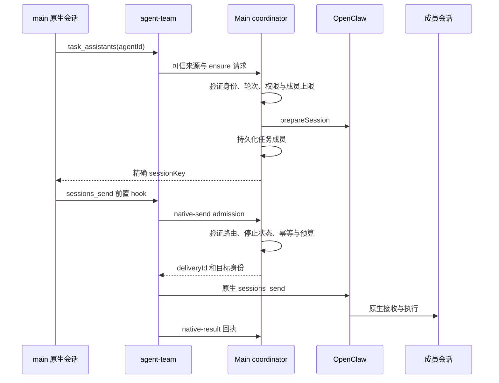
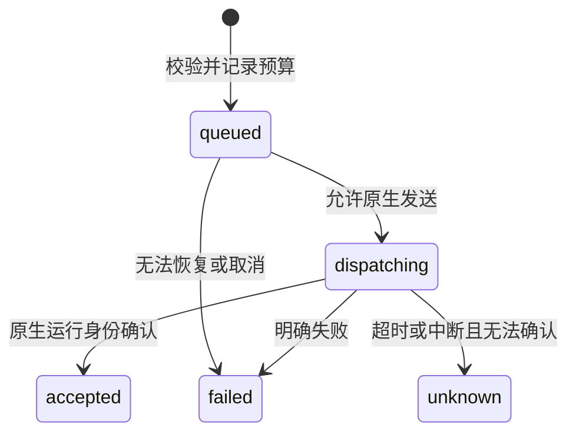

# 长期助手与任务内协作

长期助手是跨任务复用的档案；任务成员是某个用户会话中的助手会话；原生 Subagent 是委派执行。普通用户消息始终发给 main，模型在需要协作时准备成员，再通过原生 `sessions_send` 通信。

## 长期助手档案

用户在“设置 → 助手”创建、编辑和禁用档案。列表支持搜索与启用筛选；首次打开优先选中 main，后续刷新保留未保存的编辑。预设只填写名称和职责；复制档案只复制名称、说明和模型到一个未保存草稿，不复制角色文件、记忆或历史。main 不能禁用，首页没有助手收件人选择器、直接对话或手动 Handoff。

产品保存档案元数据和受管 roster，原生 `agents.files` 管理 `AGENTS.md`、`SOUL.md`、`IDENTITY.md`。角色文件位于 `stateDir/agent-workspaces/<agentId>`，实际任务使用任务项目目录。档案保存经过配置同步、Gateway 可见性核对和失败回滚；保存后显示后端返回的规范元数据，但不覆盖未保存的角色文件编辑。角色文件单独保存并检查外部编辑冲突，标签页显示字符上限。切换档案、文件或离开页面时保护未保存修改，冲突检查不等于跨客户端原子锁。

模型创建使用 `assistants_create`，底层调用原生 `agents.create/update/files`；未完成的创建保持禁用以便恢复。档案模型为空时继承应用默认模型；长期助手可选独立模型。main 的旧档案模型覆盖不影响新会话或输入框，保存 main 时清除该旧覆盖。

删除非 main、非默认助手前检查原生活动工作。删除后设置中隐藏该档案，拒绝修改与新任务邀请；历史图仍保留名称、原生身份、角色文件和消息归属。定时任务的技能库整理卡从当前成员、搜索与聚合状态中排除已删除助手，但原生任务和历史结果仍保留；这个显示过滤不撤销原生执行。不会调用会清除原生会话索引的 `agents.delete`，也不删除项目文件。同名新档案获得新身份；已删除身份的中断创建重试必须在原生写入前拒绝。数据约束见[存储设计](../architecture/10-data-storage.md)。

## 启用与用户入口

协作由可选 `agent-team` Extension 提供，默认关闭。启用后提供 `task_assistants`、`assistants_create`、配套 Skill 和原生发送 hooks。配置同步保留用户开关，不在每个普通 turn 自动注入 roster 或协作说明。

用户始终向 main 发起普通对话。模型先发现助手，再按需为任务准备成员；侧边栏以锚点会话展示一条任务。聊天工具栏的协作入口可重新打开图，选择成员查看其原生历史，主输入框不切换收件人。Subagent 使用独立子任务视图，不混入平级协作图。

禁用扩展后保留档案、成员关系和历史。Runtime Services 继续提供历史回执读取，同时阻止受管会话的 peer send；禁用不是删除任务。

## 身份、所有权与限制

| 对象 | 身份与职责                                                     |
| ---- | -------------------------------------------------------------- |
| 助手 | 持久 agentId，档案由产品保存，角色文件由原生 agents.files 管理 |
| 任务 | roomId 与 anchorSessionId，负责产品归属和导航                  |
| 成员 | room 内唯一 agentId，关联独立产品 sessionId 与原生 sessionKey  |
| 轮次 | 用户运行派生的 roundId；成员回复继承该轮次，不自动重置预算     |
| 投递 | 可信 sourceRunId/toolCallId 派生的幂等身份及原生接收 runId     |

`src/shared/cowork/collaboration.ts` 定义最多 12 名成员、每轮最多 16 次投递；消息参数上限 16000 字符。失败投递也计入轮次预算。原生 session 只能归属一个 room，一个助手在同一 room 只能有一个成员实例。

产品 SQLite 保存路由、状态、摘要哈希和回执，不保存正文、模型输出或复制的 transcript。原生历史缺失时不能创建空白会话冒充恢复。

## 准备和发送链路

`task_assistants` 准备会话，不发送正文或启动目标工作。可用助手只向有邀请资格的锚点会话返回；成员可以发现已有任务成员，但不能自行扩大房间或权限。Main 对同一锚点串行处理成员写入，原生准备完成后再次检查停止、删除和启用状态。

扩展从可信工具上下文绑定来源，不接受模型自报 room、run 或权限。发送许可限定目标原生实例及有效期，不通过全局扩大 `tools.sessions.visibility` 或 agentToAgent 放行。计划模式拒绝执行性协作请求。

原生接收可能早于发送方的 after-tool 回执。Main 通过有界等待和匹配的原生运行身份处理快速回复，不能仅凭模型正文认定“已经收到”。

## 投递状态与恢复

`accepted` 是接收确认，不是业务完成。回复必须由另一条真实投递及关联身份表达。具体原生结果分类由扩展 after-tool hook 和 Main `native-result` 分支共同决定。

重启将不可恢复的 queued 标记为 failed，将中断的 dispatching 标记为 unknown；不自动重放。重复调用受房间、发送人、源 run 和 toolCall 的唯一约束保护，参数哈希变化拒绝。不能把网络超时解释为“目标没有收到”并自动重发。

## 停止、删除与助手退役

停止任务先冻结相关轮次，再停止成员会话；准备途中和迟到的请求也需校验冻结状态。新的显式用户 turn 可形成新轮次，旧回复不能自行重开旧轮次。

删除任务是跨数据库与 Gateway 的补偿流程：持久化删除标记、停止成员、确认原生状态、逐一删除原生 session 并记录进度，最后事务删除产品会话。部分失败保留可重试任务，不重新删除已确认完成的成员。长期助手档案和项目目录不随任务删除。

删除助手与删除任务相互独立；助手退役保留历史身份与角色文件，规则见上文“长期助手档案”。

## 展示与正文读取

图只绘制实际投递关系，失败和未知状态分别展示。选择一对成员展示两个方向的往来；节点详情读取原生消息，不改变主会话。消息读取每批最多 16 条，Main 先验证所有 delivery 属于当前房间，再交给 Runtime Services 按 receipt 索引和 provenance 核对。

图、搜索和虚拟滚动使用 Renderer 投影；不新增持久正文缓存。没有原生精确定位证据时，只打开成员历史，不伪造 transcript entry。成员共享项目目录并不共享上下文，也不提供文件写入隔离。

## 维护和验证入口

- `src/main/ipc/cowork/collaboration.test.ts`：成员准备、可信来源、原生回执、停止和删除流程。
- `src/main/data/collaborationStore.test.ts`：唯一约束、预算、状态迁移及恢复。
- `src/shared/cowork/collaboration.test.ts`：参数、路由和状态合约。
- `tests/openclaw/extensions/collaboration.test.ts`：扩展工具、hooks 和原生通信接入。
- `src/main/openclaw/config/openclawConfigSync.logout.test.ts`：可选扩展开关保留。

这些是现有验证入口，不表示本轮重新执行了上述测试。真实 Gateway 与模型验收需在隔离配置下检查：主会话创建并邀请助手、原生 `sessions_send` 往返、图与成员历史定位、停止后的迟到回复、部分失败删除与重试。主列表仍只有一条用户任务；导出只含主对话，协作任务不提供复制或手工交接。协议测试、模型自主协作质量、沙盒与多客户端竞态必须分别验收。
