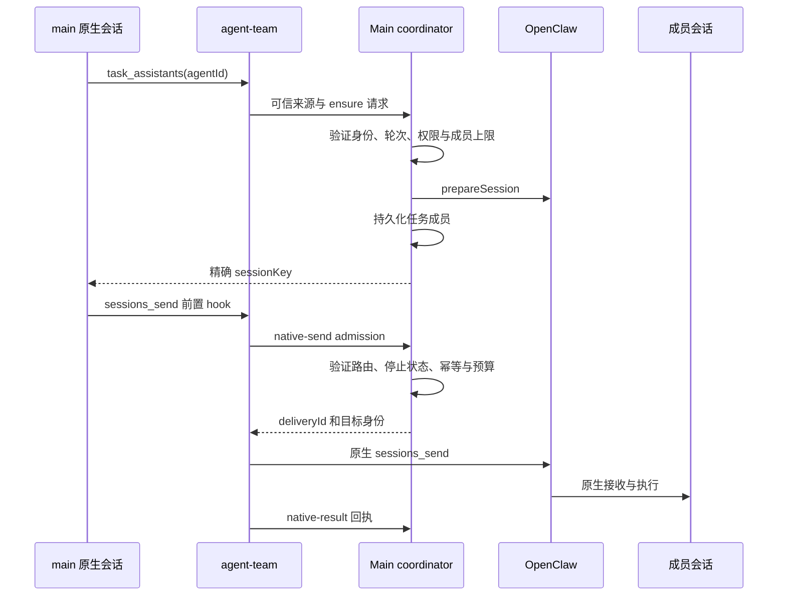
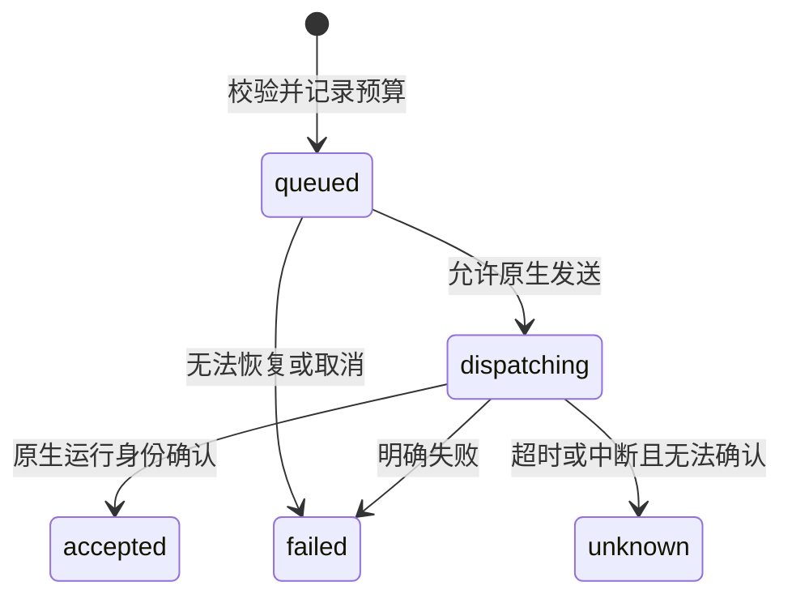

# 长期助手与任务内协作

新版 OpenClaw 的接口与能力复核见 [OpenClaw v2026.9.6 多 Agent 能力复核](openclaw-multi-agent-review.md)。

长期助手是跨任务复用的档案；任务成员是某个用户会话中的助手会话；原生 Subagent 是委派执行。普通用户消息默认发给 main；开启“允许切换主会话的助手”后可选择其他已启用助手。模型在需要协作时准备成员，再通过原生 `sessions_send` 通信。

## 长期助手档案

用户在“设置 → 助手”创建、编辑和禁用档案。列表支持搜索与启用筛选；首次打开优先选中 main，后续刷新保留未保存的编辑。研究、开发、审查和写作预设会填写名称、职责及可编辑的 `AGENTS.md` 草稿；复制档案只复制名称、说明和模型到一个未保存草稿，不复制角色文件、记忆或历史。main 不能禁用，默认隐藏助手选择器。设置中的“允许切换主会话的助手”开关默认关闭，保存在 cowork_config.allowMainAgentSwitch；开启后在输入框上方、工程目录按钮左侧显示选择器。已有聊天切换助手会保留工程目录并进入新会话，不搬迁原生历史。运行中禁止切换；禁用或删除的助手不可选择。关闭开关重置新会话选择为 main，已有会话继续归属原助手。

产品保存档案元数据和受管 roster，原生 `agents.files` 管理当前运行时支持的 `AGENTS.md`、`SOUL.md`、`IDENTITY.md`、`USER.md`、`BOOTSTRAP.md`、`MEMORY.md`。设置页提供这六个文件的读取与编辑；不存在的文件显示提示，由用户填写保存后创建，不自动生成。`BOOTSTRAP.md` 在初始化完成后可能不存在。OpenClaw 的 `run-orchestrator` 从会话 agent 身份解析 canonical workspace，`attempt-bootstrap-prepare` 加载该助手的 bootstrap 文件，再叠加执行工程根目录的 `AGENTS.md`。切换助手不复制、改写或删除工程文件；工程规则仍有效，其中若包含 main 专属身份指令，用户应将它们整理到角色文件中，避免与新助手身份冲突。所有原生助手（包括 main）的角色文件固定在 `stateDir/agent-workspaces/<agentId>`。配置中的 `agents.defaults.workspace` 指向该角色目录根，受管条目显式指定各自 workspace；原生 `cwd` 指向所选工程，具体会话仍以 `sessions.create.cwd` 持久化自己的任务目录。切换工程、常规保存和登录/退出登录同步都保持角色目录稳定。ACP 外部执行器保留其原有工程 workspace/cwd 合约。

首次使用独立 main 角色目录时，会从 OpenClaw 运行时包的 `docs/reference/templates` 初始化 `AGENTS.md`、`SOUL.md`、`IDENTITY.md`、`USER.md` 和 `BOOTSTRAP.md`；已存在的角色文件不会被覆盖。该路径在开发环境来自 `vendor/openclaw-runtime/current`，安装后来自随应用打包的运行时。`MEMORY.md` 没有模板，由用户或助手创建。初始化不读取工程目录；工程 `AGENTS.md` 仍作为项目规则注入，旧工程中若有身份指令，需由用户核对整理。

档案保存经过配置同步、Gateway 可见性核对和失败回滚；保存后显示后端返回的规范元数据，但不覆盖未保存的角色文件编辑。角色文件单独保存并检查外部编辑冲突，标签页显示字符上限。切换档案、文件或离开页面时保护未保存修改，冲突检查不等于跨客户端原子锁。

模型创建使用 `assistants_create`，底层调用原生 `agents.create/update/files`；未完成的创建保持禁用以便恢复。档案模型为空时继承应用默认模型；长期助手可选独立模型。main 的旧档案模型覆盖不影响新会话或输入框，保存 main 时清除该旧覆盖。

删除非 main、非默认助手前检查原生活动工作。删除后设置中隐藏该档案，拒绝修改与新任务邀请；历史图仍保留名称、原生身份、角色文件和消息归属。定时任务的技能库整理卡从当前成员、搜索与聚合状态中排除已删除助手，但原生任务和历史结果仍保留；这个显示过滤不撤销原生执行。不会调用会清除原生会话索引的 `agents.delete`，也不删除项目文件。同名新档案获得新身份；已删除身份的中断创建重试必须在原生写入前拒绝。数据约束见[存储设计](../architecture/10-data-storage.md)。

### 可编辑角色模板

模板在保存前只是本地草稿，用户可修改名称、职责和角色规则。规则包含平级协作约定，允许在现有任务成员之间交流，不套用“专家只能通过协调者通信”的原生 SubAgent Team 指令，也不自动创建整队或打开扩展。

内置 main 模板与助手职责预设同时声明规则范围：助手文件定义身份、职责和通用工作方式；工程 `AGENTS.md` 补充项目执行规范，在该工程内，具体执行要求优先于通用偏好，但不会改变助手身份或扩大权限。修改子目录文件前应检查适用的嵌套 `AGENTS.md`，更具体的目录规范仅作用于其范围。这是给模型的指令约定，不是代码合并或冲突消解；OpenClaw 仍按原生机制加载助手文件并追加工程根 `AGENTS.md`，不新增 Codex 式自动祖先扫描或 `AGENTS.override.md` 解析。已有角色文件保留用户编辑，不会自动追加新模板内容。

保存先完成助手档案，再通过原生 `agents.files` 读取并写入 `AGENTS.md`。角色写入失败时明确保留已创建档案和待保存规则，用户可在该助手的角色文件编辑器重试，不重新创建一个助手。未保存规则参与离开与切换保护；原生文件写入继续使用现有冲突检查。模板是角色起点，不是跨客户端原子创建事务。

## 启用与用户入口

协作由可选 `agent-team` Extension 提供，默认关闭。启用后提供 `task_assistants`、`assistants_create`、配套 Skill 和原生发送 hooks。配置同步保留用户开关，不在每个普通 turn 自动注入 roster 或协作说明。

用户始终向 main 发起普通对话。模型先发现助手，再按需为任务准备成员；侧边栏以锚点会话展示一条任务。聊天工具栏的协作入口可重新打开图，选择成员查看其原生历史，主输入框不切换收件人。Subagent 使用独立子任务视图，不混入平级协作图。

禁用扩展后保留档案、成员关系和历史。Runtime Services 继续提供历史回执读取，同时阻止受管会话的 peer send；禁用不是删除任务。

## SubAgent 与平级 Team 的独立适配

原生 SubAgent 仍从独立子任务入口查看。详情从原生会话投影读取执行状态、运行身份、耗时与累计用量，并按需分页打开嵌套子会话、返回父层。取消针对稳定原生 session key；Main 验证产品会话与原生 spawnedBy 控制树归属。OpenClaw v2026.9.8 移除了旧任务账本以及重投递/忽略结果操作，产品同步移除这些按钮，不伪造已不再暴露的交付状态、等待原因与变更统计。失败或不确定结果先核对状态，不自动重跑任务。根子任务状态轮询仍扫描完整直接子会话列表。具体协议和限制见[引擎设计](../architecture/05-agent-engine.md)。

运行时设置新增独立 Swarm 开关和并发、组内直接子任务数、组内总任务数，投影至原生 `tools.swarm`。它控制原生批量委派容量，与平级 Team 的房间、成员和消息预算分别管理。当前仍不自动把长期助手 roster 加入原生跨角色委派白名单，也不直接导入 `agents team create` 的整队配置。

平级协作图保留消息接收状态与成员运行状态的区别；历史或回执重试只重新读取原生证据，不发送一条新的协作消息。Team 的 peer 投递与 SubAgent 的原生完成通知仍是两个独立生命周期。

## 身份、所有权与限制

| 对象 | 身份与职责                                                     |
| ---- | -------------------------------------------------------------- |
| 助手 | 持久 agentId，档案由产品保存，角色文件由原生 agents.files 管理 |
| 任务 | roomId 与 anchorSessionId，负责产品归属和导航                  |
| 成员 | room 内唯一 agentId，关联独立产品 sessionId 与原生 sessionKey  |
| 轮次 | 用户运行派生的 roundId；成员回复继承该轮次，不自动重置预算     |
| 投递 | 可信 sourceRunId/toolCallId 派生的幂等身份及原生接收 runId     |

`src/shared/cowork/collaboration.ts` 定义最多 12 名成员、每轮最多 16 次投递；消息参数上限 16000 字符。失败投递也计入轮次预算。原生 session 只能归属一个 room，一个助手在同一 room 只能有一个成员实例。

产品 SQLite 保存路由、状态、摘要哈希和回执，不保存正文、模型输出或复制的 transcript。原生历史缺失时不能创建空白会话冒充恢复。

## 准备和发送链路

```mermaid
sequenceDiagram
  participant A as main 原生会话
  participant E as agent-team
  participant M as Main coordinator
  participant G as OpenClaw
  participant B as 成员会话
  A->>E: task_assistants(agentId)
  E->>M: 可信来源与 ensure 请求
  M->>M: 验证身份、轮次、权限与成员上限
  M->>G: prepareSession
  M->>M: 持久化任务成员
  M-->>A: 精确 sessionKey
  A->>E: sessions_send 前置 hook
  E->>M: native-send admission
  M->>M: 验证路由、停止状态、幂等与预算
  M-->>E: deliveryId 和目标身份
  E->>G: 原生 sessions_send
  G->>B: 原生接收与执行
  E->>M: native-result 回执
```

`task_assistants` 准备会话，不发送正文或启动目标工作。可用助手只向有邀请资格的锚点会话返回；成员可以发现已有任务成员，但不能自行扩大房间或权限。Main 对同一锚点串行处理成员写入，原生准备完成后再次检查停止、删除和启用状态。

平级成员发送仅支持省略 `mode` 或 `followup`。原生 `steer` 的消息回执与执行身份不同，`notify` 不建立执行，`resume` 属于任务恢复；扩展在登记投递和扣预算前明确拒绝这些 peer 模式。原生 SubAgent 与 ACP 子会话不经过平级投递流程，其模式与权限由 OpenClaw 判断。

扩展从可信工具上下文绑定来源，不接受模型自报 room、run 或权限。发送许可限定目标原生实例及有效期，不通过全局扩大 `tools.sessions.visibility` 或 agentToAgent 放行。计划模式拒绝执行性协作请求。

原生接收可能早于发送方的 after-tool 回执。Main 通过有界等待和匹配的原生运行身份处理快速回复，不能仅凭模型正文认定“已经收到”。

## 投递状态与恢复

```mermaid
stateDiagram-v2
  [*] --> queued: 校验并记录预算
  queued --> dispatching: 允许原生发送
  queued --> failed: 无法恢复或取消
  dispatching --> accepted: 原生运行身份确认
  dispatching --> failed: 明确失败
  dispatching --> unknown: 超时或中断且无法确认
```

`accepted` 是接收确认，不是业务完成。回复必须由另一条真实投递及关联身份表达。具体原生结果分类由扩展 after-tool hook 和 Main `native-result` 分支共同决定。

重启将不可恢复的 queued 标记为 failed，将中断的 dispatching 标记为 unknown；不自动重放。重复调用受房间、发送人、源 run 和 toolCall 的唯一约束保护，参数哈希变化拒绝。不能把网络超时解释为“目标没有收到”并自动重发。

## 停止、删除与助手退役

停止任务先冻结相关轮次，再停止成员会话；准备途中和迟到的请求也需校验冻结状态。新的显式用户 turn 可形成新轮次，旧回复不能自行重开旧轮次。

删除任务是跨数据库与 Gateway 的补偿流程：持久化删除标记、停止成员、确认原生状态、逐一删除原生 session 并记录进度，最后事务删除产品会话。部分失败保留可重试任务，不重新删除已确认完成的成员。长期助手档案和项目目录不随任务删除。

删除助手与删除任务相互独立；助手退役保留历史身份与角色文件，规则见上文“长期助手档案”。

## 展示与正文读取

图只绘制实际投递关系，失败和未知状态分别展示。选择一对成员展示两个方向的往来；节点详情读取原生消息，不改变主会话。消息读取每批最多 16 条，Main 先验证所有 delivery 属于当前房间，再交给 Runtime Services 按 receipt 索引和 provenance 核对。

图、搜索和虚拟滚动使用 Renderer 投影；不新增持久正文缓存。没有原生精确定位证据时，只打开成员历史，不伪造 transcript entry。成员共享项目目录并不共享上下文，也不提供文件写入隔离。

图中的正文或单条回执读取失败后可原地重试；图保留已成功读取的正文，仅补取缺失项。重试不发送新协作消息，也不改变投递状态。

## 维护和验证入口

- `src/main/ipc/cowork/collaboration.test.ts`：成员准备、可信来源、原生回执、停止和删除流程。
- `src/main/data/collaborationStore.test.ts`：唯一约束、预算、状态迁移及恢复。
- `src/shared/cowork/collaboration.test.ts`：参数、路由和状态合约。
- `tests/openclaw/extensions/collaboration.test.ts`：扩展工具、hooks 和原生通信接入。
- `src/main/openclaw/config/openclawConfigSync.logout.test.ts`：可选扩展开关保留。

这些是现有验证入口，不表示本轮重新执行了上述测试。真实 Gateway 与模型验收需在隔离配置下检查：主会话创建并邀请助手、原生 `sessions_send` 往返、图与成员历史定位、停止后的迟到回复、部分失败删除与重试。主列表仍只有一条用户任务；导出只含主对话，协作任务不提供复制或手工交接。协议测试、模型自主协作质量、沙盒与多客户端竞态必须分别验收。

本次适配的代码与协议测试覆盖精确任务操作、会话归属、嵌套分页、状态投影、Swarm 配置及模板草稿/失败恢复。上述实现说明不构成真实 Gateway 与模型的完整验收结论；真实并发、停止竞态、重启恢复与端到端协作需单独记录实测结果。

记忆面板提供独立的助手选择，默认 main；可查看未删除助手（包括已禁用助手）的历史记忆。文件浏览、搜索、索引状态和重建均按所选助手的原生 workspace 隔离；切换助手会清空预览、搜索结果和提示，旧请求不会更新新助手视图。索引重建按助手去重，后台任务不因切换视图而取消。原生长期记忆整理继续按配置中的各助手工作区分别处理。
