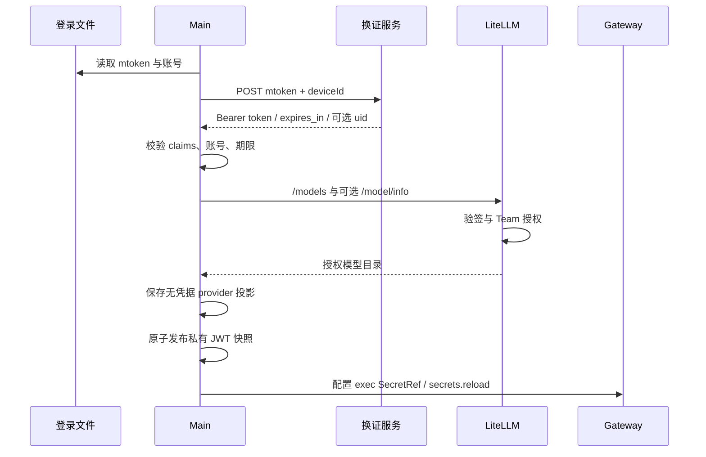

# 内置模型认证与账号生命周期

内置 provider 的稳定 ID 为 builtin_models。当前生产路径使用登录 mtoken 换短期 JWT，服务端 Team 授权，OpenClaw SecretRef 解析。本文按客户端配置、换证、模型发现和服务端 Hook 分层说明，不把登录文件、JWT 和模型 API Key 混为同一凭据。

## 1. 部署前必须确定的配置

`src/config/builtinModelAuth.ts` 编入 Main，包含完整 tokenExchangeUrl、maxJwtLifetimeSeconds 和仅开发模式使用的认证选择。默认换证 URL 为空，JWT 上限 300 秒；空地址不从模型 base URL 推断，也不发送 mtoken。

组织接口若签发更长 token，客户端与服务端必须显式配置一致上限，支持范围 30–10800 秒，不能根据返回值自动放宽。修改配置需重启开发 Main 或重新打包，用户目录不存在另一套自动生成的换证配置。

未打包开发可临时使用 api-key 模式，正式包忽略该模式，打包钩子要求恢复 jwt 并清空调试 key。配置说明见 [部署客户端](../../deploy/client/README.md)。

## 2. 凭据的去向

| 数据           | 来源                    | 允许到达                                     |
| -------------- | ----------------------- | -------------------------------------------- |
| mtoken         | 登录组件 user_info.json | Main → 明确配置的换证服务                    |
| X-User-Account | 同一登录身份            | Main 校验、模型请求身份字段                  |
| deviceId       | 本机安装 UUID           | 换证请求；不代表设备密钥绑定                 |
| JWT            | 换证服务                | Main、私有派生快照、Gateway 内存、模型数据面 |
| X-Cookie       | 既有登录/工具链         | 不作为 JWT 或模型独立授权                    |
| Team 权限      | 服务端数据库            | 模型目录、预算、blocked、限流                |

登录文件通常位于 `<userData>/huawei/user_info.json`，deviceId 在同目录 model-device.json。JWT 不回写登录文件，mtoken 不进入 Gateway 或产品数据库。

## 3. 换证、发现与原生接入

换证拒绝 redirect，timeout 15 秒，响应最大 32 KiB。返回必须为 Bearer，uid/sub 与登录账号一致，JWT 期限需满足本地上限和 expires_in。Main 做结构与时间检查，真正的签名、issuer、audience 和 Team 授权在服务端完成。

模型发现 `/models` 必需，`/model/info` 可选增强；区分 chat/embedding 并规范化能力。请求使用约定哨兵 Authorization 与专用 JWT/account 字段，不能让哨兵本身变成授权凭据。memory search 走同一 JWT SecretRef 的原生认证路径。

## 4. 轮换与并发

Main 监听登录文件，通常在剩余 60 秒续签；短生命周期 token 按有效期一半安排并预留安全窗口，避免高频循环换证。并发 refresh 合并，generation 和 AbortController 使账号切换后的旧结果失效。

短暂网络错误可继续使用尚有效 token，到期前 15 秒失效；400/401/403 立即清除。显式退出后旧 mtoken 即使尚留文件也不能被后台重试重新启用。重新换证成功还需复核当前身份，不能把 A 账号结果写给 B。

有效轮换更新派生快照并通知原生 secrets.reload，不为每次 token 变化重启 Gateway。配置本身变化则走原生配置 watcher 与受管同步。

## 5. 本地持久化边界

builtin provider 在 SQLite/Renderer 中 apiKey 为空，只保存 base URL、模型与产品标记。openclaw.json 使用 justdo_login exec SecretRef；launch env 不放 JWT。快照只保存 JWT、账号和到期时间，不复制 X-Cookie。

快照采用私有权限及 AES-GCM 包装，但材料可由客户端推导，不抵御同用户逆向；安全依赖短期凭据和服务端验证。解析器只接受已知 secret id，复核期限，通过受限管道返回，不新增长期本地 token 转发服务。

自定义 provider 保持自己的 file SecretRef 路径和配置，不因 builtin logout 被清理。产品 appConfigCredentials 也不能被描述成统一加密所有自定义 key，见[存储](../architecture/10-data-storage.md)。

## 6. 退出、失效与发现失败

凭据缺失/失效时清内存、中止旧发现，移除 builtin provider、相关 memory search 引用与受管 SecretRef，同步 Gateway 并通知 Renderer；不继续请求模型服务。

发现失败但凭据有效且 generation 仍最新时，保留 provider 壳并清空目录，避免沿用上一账号模型。可选 info 失败不等于必需 models 失败，错误应区分。

## 7. 服务端长期授权

LiteLLM JWT Hook 验证非对称签名、kid、issuer/audience、时间与账号，解析 internal user 和唯一非 legacy jwt_managed Team，再进入公共模型、blocked、预算和 RPM/TPM 检查。JWT 轮换不会重新创建 Team 或每用户 Virtual Key。

认证 dispatch 将 JWT 与普通 Key/管理会话分开，JWT 失败不得回退到旧 Key。多 worker 用量协调与权限缓存传播属于部署范围，不能承诺权限变更瞬时生效。

旧客户端限时 legacy Key 是独立服务端兼容机制，不是新版客户端凭据。部署前若旧值仍为 master key，先旋转 master；兼容期限不自动延长。操作步骤见 [LiteLLM 部署](../../deploy/litellm/README.md)。

## 8. 活动上报不是认证

ACTIVITY_REPORTING_CONFIG 默认开启，控制 startup、周期心跳和失败重试。关闭不影响 JWT 或模型调用，不清除服务端历史。上报正文账号仍须与 JWT 一致，clientTime/loginTime 与数据库接收时间分开；离线未上报不能证明未启动。

## 9. 验证与限制

测试覆盖 claims、期限、跨账号迟到响应、退出后重试、必需/可选发现、SecretRef 轮换和敏感值不外泄。真实部署另验签发方/JWKS、Team 白名单、预算限流、管理路由拒绝与并发。

JWT 是 bearer token，在剩余有效期内可重放；deviceId UUID 不是设备签名。若需要防重放，必须由身份系统提供设备密钥绑定等额外协议，客户端不能自行宣称已实现。
