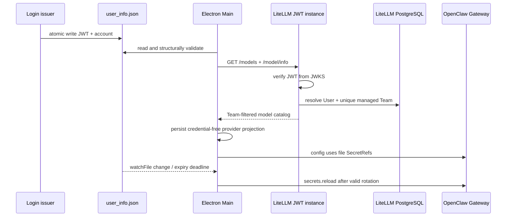

# 内置模型短期 JWT、Team 与生命周期

本文描述 `v2026.8.27` 的内置模型认证、LiteLLM Team 授权、模型发现和
OpenClaw 凭据轮换。内置 provider id 固定为 `builtin_models`。

## 1. 认证边界

新版客户端不持有 LiteLLM master key，也不创建或持有 Virtual Key。登录服务使用
非对称密钥签发最长 5 分钟的 JWT，并以原子替换方式维护：

`%APPDATA%/<productName>/huawei/user_info.json`

文件包含：

- `X-JustDo-JWT`：短期 JWT；
- `X-User-Account`：用户 ID，必须等于 JWT 的 `sub`；
- `X-Cookie`：既有登录和部分工具权限字段，LiteLLM 不读取它。

JWT header 必须有受支持的非对称 `alg` 和 `kid`；payload 必须有 `iss`、`aud`、
`sub`、`iat`、`exp`、`jti`，且 `exp - iat <= 300` 秒。Main 的结构校验只是尽早
fail closed；真正的签名、issuer、audience 与 Team 授权由 LiteLLM 端完成。

JWT 是 bearer token，被抓包后在剩余有效期内仍可能重放。短有效期消除了固定 Key
被长期盗用的问题，但不等于防重放。若需要“抓到也无法使用”，需由登录系统登记设备
公钥并增加 DPoP、mTLS 或逐请求设备签名。

## 2. 服务端授权模型

新版请求进入加载 `deploy/litellm/custom_auth.py` 的 JWT 数据面。Hook 完成以下检查：

1. 通过 HTTPS JWKS 校验签名、算法、`iss`、`aud` 与时间；
2. 要求 `X-User-Account`（若携带）与 JWT `sub` 一致；
3. 从 LiteLLM PostgreSQL 读取已存在的 internal user；
4. 要求用户属于且只属于一个非 legacy 的 `justdo_managed` Team；
5. 把 Team 的模型、blocked、预算、RPM/TPM 和成员限额投影到 LiteLLM 通用检查。

JWT 只证明当前请求的身份。User、Team 和成员关系长期存在于 LiteLLM 数据库，模型
权限由 Team 管理，不随 JWT 轮换。`X-User-Account` 仍映射为 Customer/EndUser，便于
用量审计，但不能单独授权。

OSS LiteLLM 的原生 JWT Authentication 以及“自定义认证 + native Virtual Key 的
单实例 auto 模式”都需要 Enterprise 能力。因此部署以 Nginx 分流两个共享 PostgreSQL
的 LiteLLM 实例：有 JWT 的请求固定进入 JWT 实例，无 JWT 的旧版请求进入 native
Virtual Key 实例；无效 JWT 不得回退旧版通道。

## 3. 启动、发现与轮换



Main 先启动 outbound-header proxy、读取凭据、打开 SQLite 并恢复代理，再执行模型发现。
内置 provider 只有在受管 base URL 有效且 Main 中存在可用 JWT/account 时才启用。

发现请求携带非密钥 Authorization 哨兵以及专用身份 headers：

```text
Authorization: Bearer justdo-jwt-auth
X-JustDo-JWT: <short-lived JWT>
X-User-Account: <JWT sub>
```

`GET /models` 是必需请求；`GET /model/info` 是可选增强。服务端只为客户端身份开放
LLM 路由、`/models` 与 `/v1/models`，不会开放 Team/User/Key 管理写接口。响应经 shared
discovery parser 区分 chat/embedding 模型并合并 name、image、context length 和
max tokens。Team 白名单变化无需发布客户端；下次启动、登录、轮换或手工刷新会更新目录。

登录服务应在 JWT 剩余 30–60 秒时原子写入新 token。Main 使用非持久 `fs.watchFile`
监听替换，并在本地可用期限前主动复核。有效轮换会重新发现模型、同步配置并调用
OpenClaw `secrets.reload`，无需重启 Gateway 或中断正在运行的任务。未及时续签、文件
损坏或账号不匹配时立即按 logout 路径删除内置 provider。

## 4. 本地持久化与 SecretRef

`app_config.providers.builtin_models` 只保存 base URL、readonly 标记、空 `apiKey`、
chat 模型和 embedding 模型。这里的 SQLite 是 JustDo 本地数据库，与 LiteLLM 的
PostgreSQL 不是同一个数据库。

- JWT 只存在于登录交接文件和 Electron Main 内存；
- Renderer/API 配置始终看到空的 builtin `apiKey`；
- `openclaw.json` 的 provider `apiKey`、`X-JustDo-JWT` 和 `X-User-Account` 都是指向
  登录交接文件的 file SecretRef，不含明文；
- Gateway launch environment 不包含 builtin JWT；
- logout 会删除 builtin provider、memory search 引用和受管 SecretRef provider；
- 自定义 provider 的 Key 与其他 SecretRef provider 不受影响。

OpenClaw memory search 只能配置 remote `apiKey`，所以它把同一 JWT SecretRef 放入
Authorization；服务端 Hook 同时支持此路径。常规模型调用使用专用 JWT header。两条
路径都只能进入 JWT 数据面。

## 5. 失败与并发

模型发现失败且请求仍是最新 generation 时，provider 壳保留但模型列表清空，避免
切换账号后沿用上一用户的目录。每个 store 的同步状态包含 generation 和
AbortController；新的登录、退出或刷新会取消旧请求，晚到响应不能覆盖新状态。

凭据缺失或失效会：

1. 清除 Main 内存凭据并中止旧发现；
2. 删除 `providers.builtin_models`，且不向 LiteLLM 发请求；
3. 清理 OpenClaw 的模型、memory search 与 `justdo_login` SecretRef；
4. 同步 Gateway 配置并通知 Renderer。

## 6. Team 与旧版 30 天兼容

`deploy/litellm/provision_groups.py` 幂等创建/更新长期 Team 和 internal user，明确使用
`auto_create_key=false`，并维护每个用户唯一的 JustDo-managed Team 归属。脚本不会为
新版用户生成、返回或保存 Virtual Key。

旧版客户端只使用一枚服务端 legacy Virtual Key：值与历史固定 Key 完全相同，绑定
独立 legacy Team，仅开放推理和模型发现路由，并固定 `duration=30d`。若旧值还是当前
master key，必须先旋转 master key。脚本拒绝延长已存在的过期时间，也拒绝恢复已过期
Key；30 天后未升级客户端按计划停止模型服务。

LiteLLM PostgreSQL 会保存这一枚 legacy Virtual Key 的哈希和过期时间。这是临时的
服务端兼容记录，不是 JustDo SQLite 中的 provider Key，也不是新版用户凭据。完整部署
和迁移步骤见 `deploy/litellm/README.md`。

## 7. 测试要求

- JWT claim/算法/长度/账号匹配、临近过期与 logout fail-closed；
- `X-Cookie` 单独存在时不能启用内置模型；
- discovery 带 JWT/account，但 SQLite、Renderer、Gateway env 和 `openclaw.json` 不含明文；
- SecretRef 轮换调用 `secrets.reload`，过期时删除 provider；
- models 成功、info 失败、chat/embedding 分类和 enabled 合并；
- Team 白名单、blocked、预算/限流、唯一成员关系和白名单外拒绝；
- JWT 客户端可访问推理和模型发现，但不能访问管理路由；
- 新用户不生成 Virtual Key；legacy Key 与 master 不同、仅一枚、30 天且不可续期；
- 带无效 JWT 的请求不能回退到 legacy 数据面。

## 8. 代码入口

| 层       | 文件                                               | 责任                             |
| -------- | -------------------------------------------------- | -------------------------------- |
| 凭据     | `src/main/cowork/builtinModelCredential.ts`        | 结构校验、Main 内存持有、清除    |
| 轮换     | `src/main/cowork/builtinModelCredentialMonitor.ts` | 文件监听、到期复核与串行刷新     |
| Provider | `src/main/cowork/builtinModelProvider.ts`          | 认证发现、无凭据投影、并发收敛   |
| OpenClaw | `src/main/openclaw/config/openclawConfigSync.ts`   | file SecretRef 与 logout 清理    |
| JWT Hook | `deploy/litellm/custom_auth.py`                    | JWKS 认证和持久 Team 权限投影    |
| 分流     | `deploy/litellm/nginx.conf`                        | JWT 与 30 天 legacy 数据面隔离   |
| 运维     | `deploy/litellm/provision_groups.py`               | Team/User 与唯一 legacy Key 迁移 |

任何日志、测试失败信息和排障材料都不得输出 Authorization、JWT、`X-Cookie`、master
key 或 legacy Key 明文。
