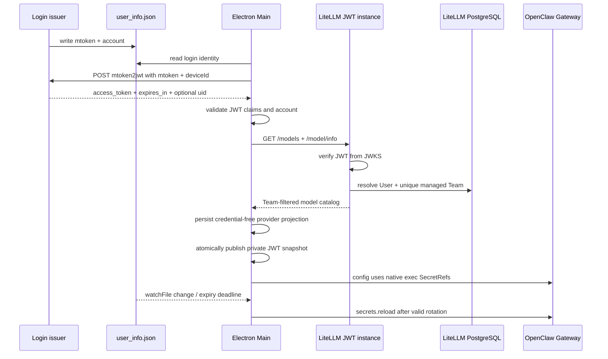

# 内置模型短期 JWT、Team 与生命周期

本文描述 `v2026.8.27` 的内置模型认证、LiteLLM Team 授权、模型发现和
OpenClaw v2026.9.2 凭据轮换。内置 provider id 固定为 `builtin_models`。

## 1. 认证边界

### mtoken 换证接入（2026-09-22）

当前启动链路已改为 Main 从下述登录文件读取 `mtoken` 和 `X-User-Account`，
向显式配置的 `POST /api/litellm/mtoken2jwt` 获取 JWT；不再要求登录组件写入 JWT。
完整 URL 由 `src/config/builtinModelAuth.ts` 中的 `tokenExchangeUrl` 指定；
未配置时不推测服务器地址、不发送 mtoken。配置说明见 `deploy/client/README.md`。
配置编入 Main，修改后重启 Electron 开发进程或重新打包，不再读取或生成用户目录 JSON 配置。
未打包开发环境可在同一配置中将 `developmentAuthMode` 改为 `api-key` 并填写
`developmentApiKey`，临时使用 API Key。
该模式优先于换证，仅发送 Bearer Key，并沿用 OpenClaw SecretRef；正式打包应用强制忽略。
打包钩子要求恢复 `jwt` 并清空 Key，防止调试凭据进入安装包。
请求只发送 mtoken 和 deviceId，暂省略可选 clientIp。deviceId 是持久化在
`<userData>/huawei/model-device.json` 的安装 UUID，不代表设备私钥绑定。

Main 通常在 JWT 剩余 60 秒时主动换证；生命周期短于 120 秒时在有效期一半处续期
（至少预留 15 秒），避免短期 JWT 每秒换证。Main 同时监听登录文件变化；并发换证合并，完成时重新
核对身份以拒绝跨账号迟到响应。显式退出后，后台重试不能复用未清除的旧 mtoken。
短暂网络故障保留尚可用的 JWT，到期前 15 秒失效；400/401/403 立即清除 JWT。
重定向拒绝、超时 15 秒、响应上限 32 KiB，所有诊断均不包含请求/响应正文。
返回值必须为 Bearer，可选 uid 和 JWT sub 均须匹配登录账号；以 JWT exp 决定期限，
且不得超出 expires_in 声明。JWT 不回写登录文件，mtoken 不进入 Gateway 或 SQLite。

现有五分钟策略仍是默认值。接口若正式签发 900 或 10800 秒 token，客户端和 LiteLLM
需分别显式设置客户端配置的 `maxJwtLifetimeSeconds` 和服务端的
`LITELLM_JWT_MAX_LIFETIME_SECONDS`，范围 30–10800 秒；不能根据响应
自动放宽策略。默认值保持不变，正式配置待组织接口契约确认。

新版客户端不持有 LiteLLM master key，也不创建或持有 Virtual Key。登录组件维护：

`%APPDATA%/<productName>/huawei/user_info.json`

文件包含：

- `mtoken`：仅供 Main 向换证服务申请 JWT 的用户登录凭据；
- `X-User-Account`：用户 ID，必须等于 JWT 的 `sub`；
- `X-Cookie`：既有登录和部分工具权限字段；模型请求的 Header Hook 校验其 Cookie 格式，不验证会话有效性。

JWT header 必须有受支持的非对称 `alg` 和 `kid`；payload 必须有 `iss`、`aud`、
`sub`、`iat`、`exp`、`jti`，默认 `exp - iat <= 300` 秒（可按上述组织策略显式调整）。Main 的结构校验只是尽早
fail closed；真正的签名、issuer、audience 与 Team 授权由 LiteLLM 端完成。

JWT 是 bearer token，被抓包后在剩余有效期内仍可能重放。短有效期消除了固定 Key
被长期盗用的问题，但不等于防重放。若需要“抓到也无法使用”，需由登录系统登记设备
公钥并增加 DPoP、mTLS 或逐请求设备签名。

## 2. 服务端授权模型

新版请求进入加载 `deploy/litellm/hooks/jwt_auth/handler.py` 的 JWT 数据面。Hook 完成以下检查：

1. 通过 HTTPS JWKS 校验签名、算法、`iss`、`aud` 与时间；
2. 要求 `X-User-Account`（若携带）与 JWT `sub` 一致；
3. 从 LiteLLM PostgreSQL 读取已存在的 internal user；
4. 要求用户属于且只属于一个非 legacy 的 `jwt_managed` Team；
5. 把 Team 的模型、blocked、预算、RPM/TPM 和成员限额投影到 LiteLLM 通用检查。

JWT 只证明当前请求的身份。User、Team 和成员关系长期存在于 LiteLLM 数据库，模型
权限由 Team 管理，不随 JWT 轮换。`X-User-Account` 仍映射为 Customer/EndUser，便于
用量审计，但不能单独授权。

部署使用一个 LiteLLM 实例。
`hooks/jwt_auth/dispatch.py` 在启动时安装针对 LiteLLM 1.99.1 的认证适配：JWT 请求交给
自定义 Hook，普通 Key 和管理会话继续原生认证；JWT 失败直接拒绝，不回退。
模型请求统一经过公共权限、预算和限流检查，多个 worker 通过 Redis 协调用量。

## 3. 启动、发现与轮换



Main 打开 SQLite，按新版 Extension policy 初始化 outbound-header proxy，读取凭据并恢复代理，再执行模型发现。
内置 provider 只有在受管 base URL 有效且 Main 中存在可用 JWT/account 时才启用。

发现请求携带非密钥 Authorization 哨兵以及专用身份 headers：

```text
Authorization: Bearer access-jwt-auth
X-ACCESS-JWT: <short-lived JWT>
X-User-Account: <JWT sub>
```

`GET /models` 是必需请求；`GET /model/info` 是可选增强。服务端只为客户端身份开放
LLM 路由、`/models` 与 `/v1/models`，不会开放 Team/User/Key 管理写接口。响应经 shared
discovery parser 区分 chat/embedding 模型并合并 name、image、context length 和
max tokens。Team 白名单变化无需发布客户端；下次启动、登录、轮换或手工刷新会更新目录。

Main 使用非持久 `fs.watchFile` 监听登录身份变化，并在 JWT 剩余 60 秒时主动换证。有效轮换会重新发现模型、同步配置并调用
OpenClaw `secrets.reload`，无需重启 Gateway 或中断正在运行的任务。未及时续签、文件
损坏或账号不匹配时立即按 logout 路径删除内置 provider。

## 4. 本地持久化与 SecretRef

`app_config.providers.builtin_models` 只保存 base URL、readonly 标记、空 `apiKey`、
chat 模型和 embedding 模型。这里的 SQLite 是 JustDo 本地数据库，与 LiteLLM 的
PostgreSQL 不是同一个数据库。

- JWT 不回写登录文件，存在于受限权限的派生二进制快照、Main 与 Gateway 运行时内存；
- Renderer/API 配置始终看到空的 builtin `apiKey`；
- `openclaw.json` 的 provider `apiKey`、`X-ACCESS-JWT` 和 `X-User-Account` 都是
  `justdo_login` 原生 exec SecretRef，不含明文；
- Gateway launch environment 不包含 builtin JWT；
- logout 会删除 builtin provider、memory search 引用和受管 SecretRef provider；
- 自定义 provider 的 Key 与其他 SecretRef provider 不受影响。

OpenClaw v2026.9.2 的 `memory.search.remote.apiKey` 使用同一 JWT SecretRef，通过
Authorization；服务端 Hook 同时支持此路径。常规模型调用使用专用 JWT header。两条
路径都只能进入 JWT 数据面。

Main 将结构及时间检查通过的 JWT/account 原子写入
`<stateDir>/credentials/credentials.bin`，沿用 dev 的 AES-GCM 包装和私有文件权限。
包装材料可从客户端推导，不能抵御同一用户的逆向；认证安全依赖服务端签名、有效期与 Team 校验。
文件只含 JWT、账号和到期时间，不复制 `X-Cookie`。exec 解析器仅接受这两个已知 secret id，
解析时再次检查过期，通过受限 stdin/stdout 协议返回给 Gateway。
Windows 沿用系统 PowerShell 启动 Electron Node 模式，兼容中文路径且不绕过原生执行路径检查；
没有新增长期运行的进程。自定义 provider 仍沿用 dev 的 file SecretRef。
配置不变而 JWT 更新时，配置同步的 `secretsChanged` 触发一次 `secrets.reload`；
配置同时变化时由原生 config watcher 更新。刷新失败按配置服务既有机制 fail closed。

## 5. 失败与并发

模型发现失败且请求仍是最新 generation 时，provider 壳保留但模型列表清空，避免
切换账号后沿用上一用户的目录。每个 store 的同步状态包含 generation 和
AbortController；新的登录、退出或刷新会取消旧请求，晚到响应不能覆盖新状态。

凭据缺失或失效会：

1. 清除 Main 内存凭据并中止旧发现；
2. 删除 `providers.builtin_models`，且不向 LiteLLM 发请求；
3. 清理 OpenClaw 的模型、memory search 与 `justdo_login` SecretRef；
4. 同步 Gateway 配置并通知 Renderer。

## 6. Team 与旧版 30 天兼容

首次部署只初始化默认 Team，已存在时不修改。管理员通过 LiteLLM 网页维护模型列表、
预算、限流和成员关系，无需重启。新用户首次认证自动加入默认组，不生成 Virtual Key；
每个用户只能属于一个 `jwt_managed=true` 的非 legacy Team。权限变更受授权缓存传播影响。

旧版客户端只使用一枚服务端 legacy Virtual Key：值与历史固定 Key 完全相同，绑定
独立 legacy Team，仅开放推理和模型发现路由，并固定 `duration=30d`。若旧值还是当前
master key，必须先旋转 master key。脚本拒绝延长已存在的过期时间，也拒绝恢复已过期
Key；30 天后未升级客户端按计划停止模型服务。

LiteLLM PostgreSQL 会保存这一枚 legacy Virtual Key 的哈希和过期时间。这是临时的
服务端兼容记录，不是 JustDo SQLite 中的 provider Key，也不是新版用户凭据。完整部署
和迁移步骤见 `deploy/litellm/README.md`。

## 7. 测试要求

- JWT claim/算法/长度/账号匹配、临近过期与 logout fail-closed；
- `X-Cookie` 单独存在时不能启用内置模型；
- discovery 带 JWT/account，但 SQLite、Renderer、Gateway env 和 `openclaw.json` 不含明文；
- SecretRef 轮换调用 `secrets.reload`，过期时删除 provider；
- models 成功、info 失败、chat/embedding 分类和 enabled 合并；
- Team 白名单、blocked、预算/限流、唯一成员关系和白名单外拒绝；
- JWT 客户端可访问推理和模型发现，但不能访问管理路由；
- 新用户不生成 Virtual Key；legacy Key 与 master 不同、仅一枚、30 天且不可续期；
- 带无效 JWT 的请求不能回退到 legacy 数据面。

## 8. 代码入口

| 层       | 文件                                               | 责任                             |
| -------- | -------------------------------------------------- | -------------------------------- |
| 凭据     | `src/main/providers/builtinModelCredential.ts`        | 结构校验、Main 内存持有、清除    |
| 轮换     | `src/main/providers/builtinModelCredentialMonitor.ts` | 文件监听、到期复核与串行刷新     |
| Provider | `src/main/providers/builtinModelProvider.ts`          | 认证发现、无凭据投影、并发收敛   |
| OpenClaw | `src/main/openclaw/config/openclawConfigSync.ts`   | exec SecretRef 与 logout 清理    |
| JWT Hook | `deploy/litellm/hooks/jwt_auth/handler.py`                    | JWKS 认证和持久 Team 权限投影    |
| 认证适配 | `deploy/litellm/hooks/jwt_auth/dispatch.py`           | 单实例 JWT/原生 Key 认证分派     |
| 初始化   | `deploy/litellm/start.py`                         | 显式建表及默认组初始化          |
| 旧 Key   | `deploy/litellm/hooks/jwt_auth/legacy_key.py`       | 唯一 legacy Key 限时登记         |

任何日志、测试失败信息和排障材料都不得输出 Authorization、JWT、`X-Cookie`、master
key 或 legacy Key 明文。

## 9. 联调边界

上线前填写换证地址、issuer、audience、JWKS，核对实际 JWT claims 和有效期，并完成生产登录服务联调及目标并发压测。deviceId 本机保存，clientIp 不发送。权限变更受 LiteLLM 缓存传播影响，不保证瞬时生效。
