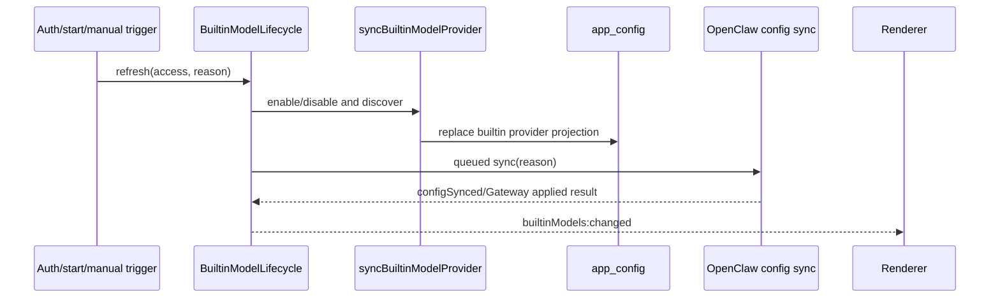

# 内置模型与认证生命周期

本文按 `v2026.8.12` 的 `BuiltinModelLifecycle`、`syncBuiltinModelProvider`、provider discovery、Main composition和测试重写。当前应用尚无完整登录UI/认证handler；启动时明确以 `Enabled` 同步内置provider。因此 login/logout方法是已实现的接入契约，不应被描述成已经存在的用户登录流程。

## 1. 当前状态

| 能力                           | 状态                    | 证据                                        |
| ------------------------------ | ----------------------- | ------------------------------------------- |
| 内置provider配置               | 已实现                  | `builtinModelProviderConfig.ts`             |
| `/models` 与 `/model/info`发现 | 已实现                  | `builtinModelProvider.ts`、shared discovery |
| login refresh协调              | 已实现、未接认证handler | `BuiltinModelLifecycle.refreshAfterLogin`   |
| logout removal协调             | 已实现、未接认证handler | `refreshAfterLogout`                        |
| 手工刷新                       | 已接IPC                 | `builtinModels:refresh`                     |
| 启动同步                       | 已接，当前强制Enabled   | `src/main/main.ts`                          |
| Renderer变更通知               | 已实现                  | `builtinModels:changed`                     |

## 2. Provider 配置

当前受管配置：enabled true、loopback base URL `http://127.0.0.1:9108/v1` 和开发占位API key。它是代码内的受管provider，不来自用户设置；UI呈现为readonly。真实发布凭证/endpoint策略必须另行安全管理，不能复制到文档、日志或Renderer。

Provider id为 `builtin_models`，OpenClaw映射使用相同受管id。API format是产品侧 `openai`，进入OpenClaw时由provider mapper转换为对应wire API。

## 3. 同步流程



Provider sync和OpenClaw config sync是两个阶段：前者更新产品配置，后者让Gateway消费。保存到SQLite不等于Gateway已经应用。

## 4. Enable 与模型发现

启用条件同时满足：access=Enabled、受管config enabled、base URL非空。同步先取消上一次同store fetch并增加generation，然后：

1. GET规范化base URL的 `/models`，非2xx视为失败。
2. GET `/model/info`；失败不会让整个发现失败，只缺少附加能力信息。
3. shared parser区分chat和embedding模型，合并name、image、contextLength、maxTokens。
4. 保留同id旧chat model的enabled选择；新模型默认enabled。
5. embedding按id稳定排序。
6. 写入readonly provider；若全局default model为空，用第一个chat model初始化provider/model。

请求带Authorization只在apiKey非空时；任何日志不得打印header/key。

## 5. 失败语义

发现失败且仍是最新generation时，当前实现写入enabled provider但清空chat/embedding缓存，并记录warning。它不是“保留上一次模型列表”；维护者修改该策略时应同步本文与UI预期。

旧generation的成功/失败都静默丢弃，防login/logout/manual refresh乱序覆盖。新同步会Abort旧fetch；generation检查是第二道防线。

OpenClaw config sync失败分两类：

- `configSynced` false/缺失：抛错，调用方应显示失败；
- config已写但Gateway application失败：记录warning、仍通知UI，不回滚已写产品config。

这反映“持久化成功但活动runtime未应用”的可恢复状态；Cowork新turn仍由ensure-running/permission/config readiness控制。

## 6. Disable/logout

access=Disabled会立即abort旧fetch、删除 `providers.builtin_models` 并写回app_config，不发网络请求。然后排队OpenClaw sync并通知Renderer。

当前实现不会自动修复以下引用：全局default model、agent model、既有session model可能仍指向builtin provider。Config mapper/logout tests负责尽量删除无效builtin model并保留custom模型；正式接入认证前必须再次验证UI selection fallback和正在运行session策略。

## 7. 并发与顺序

Lifecycle自己维护generation和configSyncQueue：provider refresh可被更新trigger取代，但OpenClaw config sync串行执行，防两个reason同时写config。Queue在成功/失败后都恢复，后续操作不会因前一个rejection永久卡死。

只在当前generation通知UI；被取代的旧请求不产生闪烁。手工刷新handler还会先检查app_config中builtin provider存在，已禁用时拒绝意外重新启用。

## 8. 启动行为

Main打开SQLite并应用proxy后调用 `syncBuiltinModelProvider(store,{access:Enabled})`。这样模型发现可使用已保存的system/custom proxy。之后才创建adapter、同步OpenClaw config并启动Gateway。

代码注释明确这只是认证引入前的临时产品决策；未来登录/退出必须替换这一单点调用，而不是再增加一套provider修改逻辑。

## 9. 正式认证接入要求

### 登录成功

认证服务确认token可用后调用 `refreshAfterLogin()` 并等待完成；失败应保持用户登录事实与模型可用事实分开显示。不能在Renderer直接写provider或调用发现endpoint。

### 退出

先阻止新的builtin turn admission，再调用 `refreshAfterLogout()`；根据产品决定处理活动run（等待/停止/允许完成）。清理认证credential后验证OpenClaw active config不再包含builtin provider。

### 账号切换

作为logout+login的新generation事务处理；旧账号fetch结果不得落盘。若endpoint/credential随账号变化，应由Main auth service注入受管配置，不能写进普通IPC payload/log。

## 10. Renderer 更新

设置/模型组件订阅 `builtinModels:changed` 后重新读取完整api config并重算默认模型可用性、capability提示和selector。事件不携带模型或secret，只是invalidate信号。

UI要区分：登录状态、provider enabled、发现中/失败、模型为空、Gateway尚未应用。一个boolean `hasBuiltinModels` 无法表达这些状态。

## 11. 测试矩阵

- models成功、info失败、两者解析/分类/排序；
- enabled选择保留、新模型默认；
- discovery失败当前清空列表；
- enable后disable取消旧请求；两个login刷新latest wins；
- config sync串行且failure后queue继续；
- config写成功/Gateway应用失败分支；
- logout移除provider、default/agent/session引用处理；
- proxy在发现前应用；
- changed只对当前generation发出且不含secret；
- 正式auth handler接入后的login/logout/account-switch集成测试。

## 12. 维护约束

内置provider的owner只有Main lifecycle。任何认证模块只调用该入口；不得复制app_config结构或OpenClaw mapper。更新reason使用shared常量 `auth-login|auth-logout|manual-refresh`，便于日志和测试稳定关联。

## 13. 代码入口与依赖图

| 层               | 文件                                            | 责任                                             |
| ---------------- | ----------------------------------------------- | ------------------------------------------------ |
| 共享事件         | `src/shared/builtinModels.ts`                   | refresh/changed channel 和 sync reason           |
| 受管静态配置     | `src/main/cowork/builtinModelProviderConfig.ts` | enabled、baseUrl、apiKey                         |
| Provider 同步    | `src/main/cowork/builtinModelProvider.ts`       | 发现、归一化、写 app_config、取消竞态            |
| 生命周期         | `src/main/cowork/builtinModelLifecycle.ts`      | login/logout、config sync queue、通知            |
| Discovery parser | `src/shared/providers/modelDiscovery.ts`        | `/models`、`/model/info` 到 chat/embedding model |
| IPC              | `src/main/ipc/app/store.ts`                     | 手工 refresh handler                             |
| Composition      | `src/main/main.ts`                              | startup Enabled、proxy 顺序、changed广播         |
| Renderer         | `Settings.tsx` / `ModelSettingsTab.tsx`         | readonly Provider、刷新、URL/日志隐藏            |

`BuiltinModelLifecycle` 不持有 endpoint/apiKey，也不自己改数据库对象；它通过 `syncBuiltinModelProvider` 完成第一阶段，再调用注入的 `syncOpenClawConfig`。这种依赖注入使 lifecycle 测试可以分别制造 Provider、配置写入和 Gateway application 失败。

## 14. app_config 投影

Builtin Provider 位于 `app_config.providers.builtin_models`。写入对象包含受管 URL/key、readonly 标记、chat models 与 embedding models。它与用户创建的 Provider 共用产品 config，但有不同所有权：

- Renderer 不允许编辑 base URL、API key 或删除；
- 手工 refresh 只更新模型发现投影；
- logout/Disabled 由 Main 删除整个 Provider；
- Config Sync mapper将其转换成 OpenClaw provider/model entries；
- 自定义 Provider 在 builtin enable/disable 时必须原样保留。

启用后如果 `model.defaultModel` 为空，代码用第一个 chat model设置 provider/model。若已有 default，无论是否指向别的 Provider，都不会在普通 refresh 中抢占。

## 15. 模型发现请求

规范化 base URL 后发出两个请求：

| 请求                    | 必需性   | 失败行为                          |
| ----------------------- | -------- | --------------------------------- |
| `GET <base>/models`     | 必需     | 整体 discovery 失败，写空模型列表 |
| `GET <base>/model/info` | 可选增强 | 使用空 info继续解析 `/models`     |

API key 非空时发送 `Authorization: Bearer ...`。Fetch 使用当前 Main 网络/代理能力；启动顺序确保 system/custom proxy 已应用。AbortController 属于每个 store 的当前 generation，新同步会 abort上一请求。

返回值先由 shared discovery parser处理，不能在 lifecycle 中直接假定 OpenAI 列表字段。Chat 与 embedding 分开，capability/info用于补充 image input、context length和max tokens。未知或不完整项按 parser规则忽略/降级，而不是把整个 Provider response原样写SQLite。

## 16. Enabled 选择合并算法

每次发现都可能改变模型列表，但用户对单个 chat model 的 enabled选择应保留：

1. 读取旧 `builtin_models.models`；
2. 以 model id建立旧选择映射；
3. 新 discovery 中同 id沿用旧 enabled；
4. 新出现 model默认 enabled；
5. 已消失 model不继续保留；
6. embedding model不使用相同的UI enabled语义，并按 id稳定排序。

这意味着 Provider更新模型 metadata时不会重置用户选择，但 Provider改变 model id 会被视为新模型。

## 17. Generation 与 Queue 的不同作用

Provider generation和Config Sync queue解决两个不同竞态：

- generation：确保慢 discovery不能覆盖更新的login/logout/manual refresh；
- queue：确保多个OpenClaw config mutation不并行写相同 config/runtime。

典型交错：login A开始fetch → logout B递增generation并abort A → B删除Provider → A即使网络晚返回也因generation失效不写入。Config sync仍按入队顺序完成，但旧generation完成后不会发 changed事件。

Queue tail无论前一 promise fulfilled/rejected都恢复为 resolved `void`，因此一次 sync异常不会让所有后续认证操作永久短路。

## 18. Lifecycle 返回语义

| Provider阶段                              | Config写入       | Gateway应用       | Lifecycle结果    | UI通知             |
| ----------------------------------------- | ---------------- | ----------------- | ---------------- | ------------------ |
| 最新generation成功                        | 成功             | 成功              | resolve          | 是                 |
| discovery失败                             | 写enabled+空列表 | 继续sync          | 取决于sync       | 是                 |
| 被新generation取代                        | 不落盘或结果忽略 | 旧操作完成后忽略  | resolve          | 否                 |
| config sync抛异常                         | Provider已写     | 未知/失败         | reject           | 当前generation通知 |
| sync返回success=false, configSynced=false | Provider已写     | config未成功      | reject           | 是                 |
| sync返回success=false, configSynced=true  | Provider已写     | Gateway apply失败 | resolve并warning | 是                 |

最后一种行为容易被误读：Lifecycle认为持久配置已经同步，允许以后通过 Gateway restart/reload恢复，因此不回滚数据库；UI收到changed后必须能够显示“Provider有数据但当前runtime应用失败”的更细状态。

## 19. 手工 Refresh IPC

`builtinModels:refresh` 在 Main 检查当前 app_config 中 Provider是否存在。不存在说明 access disabled，handler拒绝隐式重新启用。存在时调用同一受管同步入口，而不是 Renderer直连 loopback endpoint。

Renderer：

- 设置 `isRefreshingBuiltinModels` 防重复点击；
- IPC完成后重新读取配置；
- 对 builtin Provider隐藏 URL和测试日志中的受管 endpoint；
- readonly字段不显示普通 Provider编辑/删除动作；
- changed事件作为invalidate signal，不携带模型数组。

## 20. Logout 引用清理审计

删除 Provider本身不等于所有引用都安全。正式认证接入前逐项确认：

| 引用                        | 预期                                           |
| --------------------------- | ---------------------------------------------- |
| 全局 default provider/model | 若指向 builtin，回退到有效 custom或空          |
| Agent固定model              | 移除/回退无效 builtin ref                      |
| Subagent默认model           | 若固定builtin，恢复跟随caller或提示            |
| 已存在Cowork session model  | 不让新turn继续提交失效ref；历史仍可显示旧model |
| 正在运行的builtin run       | 明确等待、停止或允许完成的产品策略             |
| Gateway session store       | Config Sync不得在运行中越权覆盖Gateway writer  |
| Renderer selector cache     | changed后重算，不保留幽灵option                |

当前 Config Sync logout tests覆盖部分删除/保留规则，但没有完整认证UI与活动run产品流程，所以本文仍把正式logout标为未交付。

## 21. 认证服务未来接口

建议认证层只向 lifecycle提供 access变化，不泄漏credential：

```ts
interface BuiltinModelAuthBridge {
  onAuthenticated(): Promise<void>;
  onSignedOut(): Promise<void>;
}
```

若账号决定不同 endpoint/apiKey，应由Main credential store和受管config resolver组合；不要把token作为 `refreshAfterLogin(token)` 参数一路传入普通日志/测试mock。生命周期reason保持非敏感固定枚举。

## 22. 排障顺序

1. 查看 app_config是否存在 `builtin_models`，不要输出apiKey；
2. 确认 startup/auth/manual reason与generation；
3. 区分 `/models` 失败和 `/model/info` 可选失败；
4. 检查 system/custom proxy是否在discovery前应用；
5. 确认 Provider阶段写入的chat/embedding数量；
6. 检查 OpenClaw config sync是写失败还是Gateway application失败；
7. Renderer未更新时检查 changed是否属于当前generation、是否重新读取config；
8. 不把 Authorization、完整 endpoint response或用户credential写入issue。

## 23. 测试证据映射

| 测试                                                         | 重点                                                 |
| ------------------------------------------------------------ | ---------------------------------------------------- |
| `src/main/cowork/builtinModelProvider.test.ts`               | enable/disable、发现解析、失败清空、generation/abort |
| `src/main/cowork/builtinModelLifecycle.test.ts`              | login/logout、queue、通知、configSynced分支          |
| `src/main/openclaw/config/openclawConfigSync.logout.test.ts` | Provider/default/Agent/session引用清理               |
| `src/main/ipc/app/store.test.ts`                             | 手工refresh IPC和错误响应                            |
| Renderer settings tests                                      | readonly、刷新busy、URL/log隐藏、selector回正        |

未来认证handler需要新增Main集成测试，使用真实顺序 login→refresh→Gateway apply、logout→admission fence→删除→回退，以及账号快速切换。

## 24. 完成交付定义

只有以下证据同时存在，才能把“认证生命周期接口已实现”改成“内置模型认证已交付”：

- 安全的credential存储与Main auth service；
- 登录、退出、过期、刷新和账号切换handler；
- Renderer登录状态和错误/重试UI；
- 活动run与新turn admission策略；
- logout后OpenClaw active config回读无builtin引用；
- packaged runtime的端到端登录/发现/调用/退出测试；
- 日志、IPC、导出和崩溃报告不包含credential。
