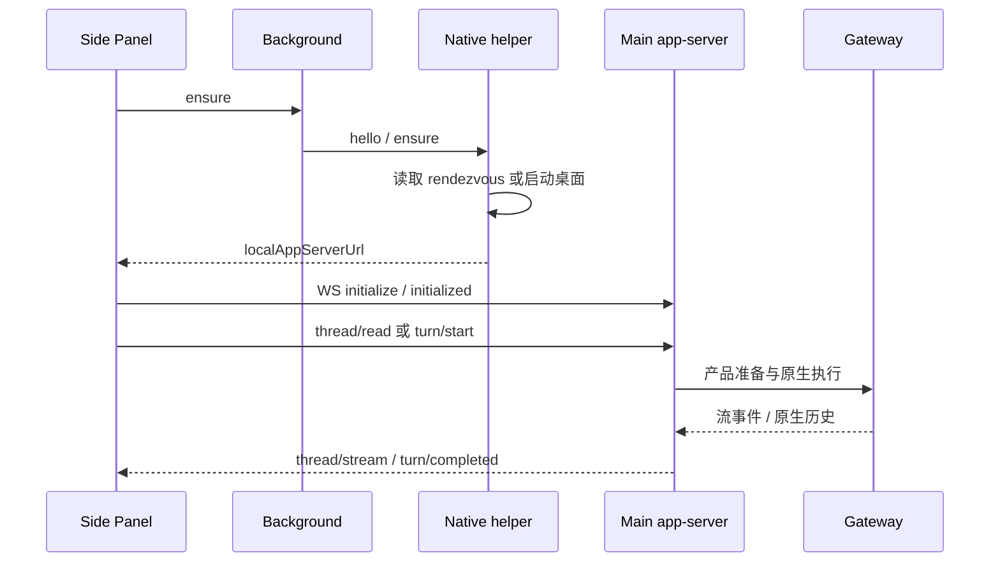

# Chrome 扩展侧栏对话

侧栏对话已接入产品会话、模型/权限选择、附件、页面上下文和停止。本文说明当前 JustDo 行为，不再以其他产品某个已安装版本的静态观察作为功能承诺。逐字段规范见[扩展 API](../browser-extension-api/README.md)。

## 1. 用户入口与范围

工具栏按钮打开 Side Panel，对话区可新建或继续桌面会话。输入区提供文字、附件、权限、模型和发送/停止；设置入口打开扩展 options，那里继续管理 OpenClaw relay 配对与 Tab 授权。

两条连接独立：自动化 relay 控制已授权网页，聊天 app-server 管理产品会话。自动发现聊天服务不等于已配对自动化；重新配对 relay 也不能修复 Native host 发现失败。

## 2. 建连和生命周期

Native helper 只负责 framing、发现和启动，Electron GUI 不直接承担 Chrome stdin/stdout。app-server 每次启动随机 loopback 端口和 capability；退出清理发现信息，客户端重连重新取得地址，不能长期缓存旧 URL。

## 3. 当前协议子集

初始化后支持 thread/list/read/start/unsubscribe、composer/options、turn/start/interrupt；通知包括 thread/started/updated/stream 与 turn/started/completed。采用 request/result/error 和 notification 形态，但不宣称实现其他产品全部私有 API。

Main 复用 Cowork 身份、权限、模型和原生历史。流直接转发原生生成事件，历史轮询只用于快照校准和终态确认；扩展本身不建立另一份持久 transcript。

## 4. 页面上下文的明确授权

用户显式勾选并授权读取时，在发送时采集当前页标题、URL、选中文字及有界可见正文。当前是最多 24000 字符的快照，不是模型稍后按需读取整页的工具通道。

Main 将上下文放入仅限认证本地客户端的 justdoUntrustedContext，原生只加入本轮 Agent 输入；持久用户消息保留原始文字，不需 Renderer 用正则隐藏注入前缀。网页可含 prompt injection，不能将其当用户命令。

关闭开关就不采集。切换会话清除未发送附件，防止跨任务误发；页面自身导航后旧快照不能被当作当前页面实时事实。

## 5. 模型、权限与附件

composer/options 读取真实配置模型目录，已保存会话/助手模型仅作为启动重连期间兜底，不能把已分配助手的模型当完整目录。选项未就绪时禁用操作，提升 Full access 使用产品确认。

附件和文本有大小/数量限制，当前附件最多 5 个、原始总量 4 MiB，入站 WS 最大 8 MiB。Main 再次验证，不能只依靠浏览器表单。发送成功是原生接收，完成另由运行事件确认。

## 6. 展示和中止

Markdown 使用扩展离线 bundle，关闭原始 HTML，安全链接在外部 Tab 打开，不从 CDN 动态载入脚本。Thinking/Tool 分组，历史默认折叠，用户手动展开选择在后续同组更新保留；完整工具内容按需展开。

停止绑定当前 turn 与原生运行，不因面板切换取消另一会话。断线需重新发现、初始化和读取原生历史，不能自动重发未确认用户消息。

## 7. 安全边界

Native manifest 只允许固定公钥派生的扩展 ID。app-server 校验 capability、精确 extension Origin、path 和消息大小；Gateway token 和 relay key 不返回 Side Panel。Origin 不是单独凭据，随机 URL capability 也不能写日志。

页面内容、附件和协议 payload 都要验证。新增方法必须明确 owner、取消、权限和消息持久化边界，而不是把 Gateway RPC 通配透传给扩展。

## 8. 维护、测试和未交付范围

日常 UI 修改在 conversation-overlay，relay 基线由锁定 OpenClaw 版本更新，构建接缝单独审查。回归包括 Native host 未安装/拉起失败、旧 rendezvous、非法 Origin/token、初始化前调用、流与历史重合、停止、超限附件和页面上下文分离。

当前不能将手动 Chrome 加载验证扩展为所有 Chromium 浏览器/商店发布承诺。右键提问、YouTube transcript、tab mention 等未接通能力不列作现有功能；新增时需同步[兼容规范](../browser-extension-api/compatibility.md)。
