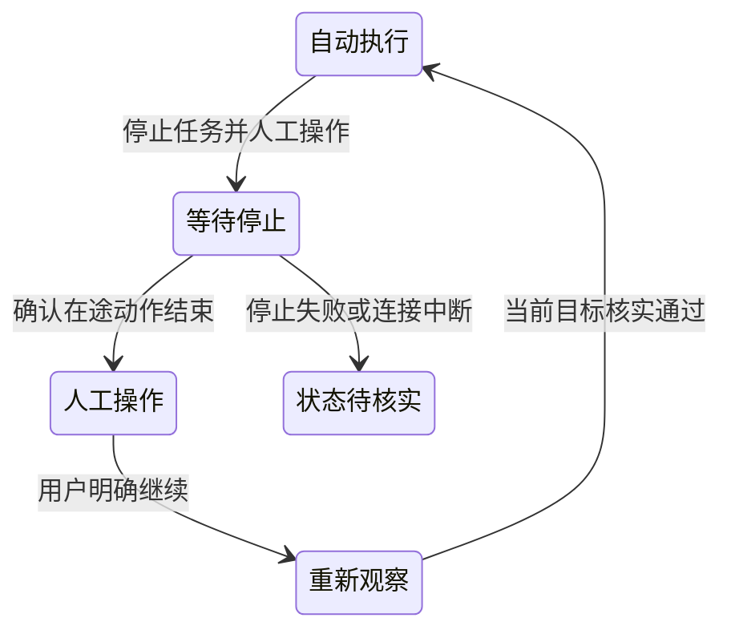

# 阶段 2：内置浏览器操作与人工介入

更新日期：2026-09-26。产品方向已调整：所有新增浏览器任务体验围绕内置浏览器的真实网页实现，撤回独立“查看任务页面”及外部浏览器镜像方案。停止、人工操作、明确继续的首版流程已实现；真实模型与企业页面验收仍待完成。

## 1. 目标与边界

用户在同一个网页面板中观察 Agent 操作、停止当前任务、手动完成登录或修改，再明确要求 Agent 继续。页面、登录状态和任务上下文保持关联，不另建镜像 Tab，不在截图上实现远程点击。

现有外部浏览器模式仍可使用，但本阶段不增加外部流、截图轮询或控制入口。OpenClaw 继续拥有执行与工具语义；应用负责真实网页、状态呈现和用户操作流程。

## 2. 当前已实现

- 内置浏览器使用真实 Electron guest，支持页面导航与现有交互功能。
- 修复已有面板时 Agent 新标签请求未创建 guest 而超时的问题；保留请求的 targetId/profile，重复 targetId 不重复创建。
- 浏览器工具指导根据本轮有效权限生成。默认沙箱策略不提供宿主 browser；网页可见不等于 Agent 有操作权限。用户在“设置 → 安全 → 任务执行方式”自行选择本机执行。
- 移除独立查看页、菜单入口、相关 IPC 和画面采集服务。保留浏览器故障修复与权限说明。

## 3. 实施流程与边界

### 3.1 真实网页与任务关联

直接定位当前任务的真实网页；多页时保留明确的活动目标。打开、刷新、关闭、切换任务、后台运行和请求取消需要完整验证。工具不可用、guest 创建失败或目标已关闭时，在面板显示具体原因和可执行的恢复操作，不以空白页或泛化超时替代。

### 3.2 停止当前任务并人工操作

在内置浏览器工具栏增加“停止任务并人工操作”。复用现有任务停止能力；等待在途浏览器操作结束前继续保护页面，避免用户输入和 Agent 输入相互覆盖。停止失败或状态未知时明确提示，不能仅凭停止请求已发送就宣称可以安全操作。

必须核实批量动作、导航、等待、下载及子代理的取消收敛，确认其他执行者是否仍操作该目标。尚未证实的全局独占、暂停执行栈不能作为产品承诺。

### 3.3 人工完成后继续

用户在原网页完成登录、验证或修改后，点击“继续任务”，可补充说明。重新确认会话与目标有效，再基于当前页面发起新一轮；重新观察页面，不复用旧元素引用，不自动重放未确认表单提交。重复点击或网络超时不能重复发送。

## 4. 验收要求

- 从聊天打开网页，无需提前手动建立面板；已有页、空面板、后台任务均能正确创建目标。
- 所见页面即被操作页面；切任务不串页，关闭或重建目标不沿用旧引用。
- 自动操作期间的交互保护有效；收到取消确认前无误放行，人工输入后无迟到自动输入。
- 登录状态和人工修改保留；继续前重新观察，避免重复提交。
- 断线、重载、重复停止/继续有明确状态，不自动恢复执行。
- 单元测试之外，必须完成真实模型与内置网页的端到端验收。真实模型验收尚未完成，不以单元测试替代。

## 5. 本次实现与验证

操作栏按任务和页面状态显示：空闲空白页不显示介入入口，但会话控制器保持挂载以恢复既有介入；真实网页上只有 BrowserAgentBridge 的当前页面操作 lease，或当前任务打开/切换页面的面板级 lease 处于 busy 时，才提供新的停止入口。模型思考、文件操作及其他会话/标签页的动作不触发当前页入口。不使用会话级 sessionRuntimeActivity 作为显示依据。没有浏览器操作且没有介入状态时隐藏整个操作栏，网页照常可操作。已建立的介入状态不随浏览器动作结束而消失，仍保留等待确认或继续操作。普通状态读取不触发网页锁；只有用户发起但未确认的介入请求、正在停止或继续待核实才保持保护。空白页无 guest 的状态查询失败不再造成持续等待光标。

内置浏览器模式的真实网页顶部显示操作栏：点击“停止任务并人工操作”，等到“人工操作中”再输入、登录或修改；可填写补充说明，再点击“我已完成，继续任务”。首页临时网页不提供任务介入流程。切换或关闭原网页后仍可继续；提示模型先枚举现有标签页，再核实目标并重新观察，不能假设原目标仍存在。

Main 的 `BrowserIntervention` 按产品 sessionId 关闭新的 browser 调用入口，并取消该会话已有调用。它跟踪原始操作 Promise 的结束，不能以调用超时包装器的提前返回代替动作完成。清除已预设的上传/对话框动作与浏览器下载，避免人工阶段触发旧自动动作。Renderer 复用当前任务停止流程，再查询包含子代理的运行状态；只有停止确认和 Main 在途动作清空都满足，才解除网页交互保护。

继续使用正常聊天提交路径和运行回执，不创建转录缓存。Main 先消费本次介入 token，清除快照/元素引用状态，进入 resuming；用户说明要求模型重新观察当前网页。确认发送成功后结束介入。发送失败重新建立保护；发送结果未知或重载中断时不重复发送，用户须先停止并核对。关闭面板、切会话或 Renderer 重载不自动释放 Main 中的人工保护；应用进程退出时网页一起销毁，下次不自动恢复执行。

该保护覆盖当前任务通过应用内置 browser bridge 发出的动作，不承诺暂停操作系统、其他任务的独立网页、外部 Chrome 或任意网页自身脚本。任务/子代理仍在运行或状态未知时保持等待状态。并不保留模型执行栈，继续是基于当前页面的新一轮任务。

已通过 Bridge/Renderer 行为测试，以及 `node scripts/browser-intervention-smoke.cjs`：独立 Electron profile、真实 guest、真实 IPC，验证取消收敛、人工阶段拒绝自动调用、原网页输入保留和重复继续拒绝。该测试不调用 Gateway 或模型，不等同于企业登录、真实模型端到端验收。

构建、lint、Renderer/Main TypeScript 检查通过。标准 `npm test` 的本机 SQLite 模块为 Electron ABI 146，而 Node 24 需要 ABI 137；原文件被运行中的程序占用，直接重建会报 EBUSY。2026-09-26 使用相同版本 better-sqlite3 的独立 Node ABI 137 副本、Vitest 模块别名及 4 个 worker 验证全量用例：559 个测试文件通过、2 个跳过，5459 项通过、42 项跳过。工作区原生模块仍保持 Electron ABI 146。最终变更的 8 个相关文件共 158 项测试通过；真实 Electron smoke 通过。

介入状态及多行描述位于网页范围内的可拖动悬浮框，不增加工具栏行或挤压网页高度；工具栏入口复用现有图标按钮样式。

### 停止确认延迟恢复

停止请求返回时，Gateway 的运行状态可能尚未收敛。内置浏览器在 `stopping` 阶段每两秒重新核对该会话及子任务的权威运行状态；待发送任务的取消也必须完成。确认空闲后，使用原介入 token 提交停止确认，不重复发送停止命令。关闭再打开面板仍会恢复核对；旧页面或旧操作的异步结果不能确认新的介入。

Main 的 `stopConfirmed` 与网页原始动作是否结束分别记录。任务停止一经确认便停止查询 Gateway，只继续读取本地动作收尾状态；两者都完成后解除网页交互遮罩、显示人工操作说明和继续按钮。连接异常时保留交互保护并继续核对，恢复后清除错误，不自动继续任务。

### 2026-09-26 多 agent 审查与修复

三路分别审查 Main 状态机与取消、Renderer 交互生命周期、权限及开页集成，主审复核提交与运行状态并发边界。确认并修复：

| 问题 | 修复与验证 |
| --- | --- |
| 空白页或关闭最后一个网页导致恢复入口消失 | 控制器按会话保留，首次介入仍校验真实页面；既有 hold 由原窗口恢复。覆盖切页、关闭 guest、保留说明及继续。 |
| macOS 关闭窗口后 Main 常驻，旧 owner 无法恢复 | 仅旧 owner 已销毁且新可信窗口持有同会话真实 guest 时接管；存活 owner 不可被抢占。 |
| 清理网页状态抛错导致 drain 永不结束 | finally 始终释放原始操作计数；覆盖预设动作清理异常。 |
| Renderer 标签容量与 Main 注册状态短暂不同步 | openTab 明确返回是否接受，拒绝创建时不改父状态及活动目标；覆盖 8 页容量及重复目标。 |
| 普通消息尚在提交时运行状态暂时为空闲 | 状态查询前后均检查待提交操作；停止确认和继续提交复用同一检查，避免提前放行。 |

停止确认延迟、断线恢复、过期确认、重复继续、跨窗口访问以及原始操作晚于取消回执结束，均有行为测试。没有尚未修复的已确认问题；真实企业网页与模型端到端验收仍保留为发布前验证项。
