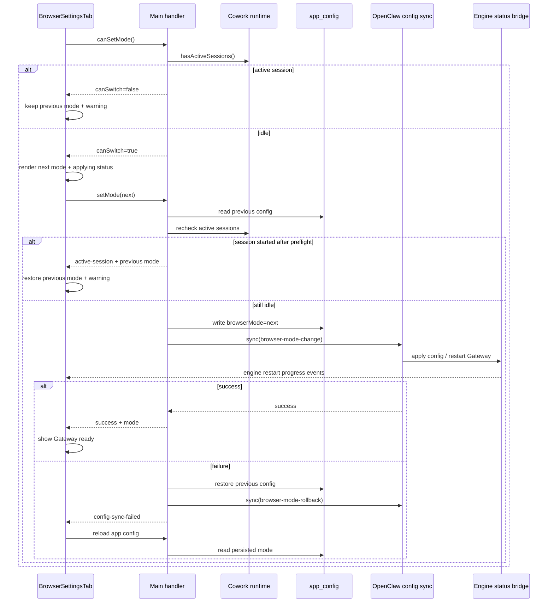
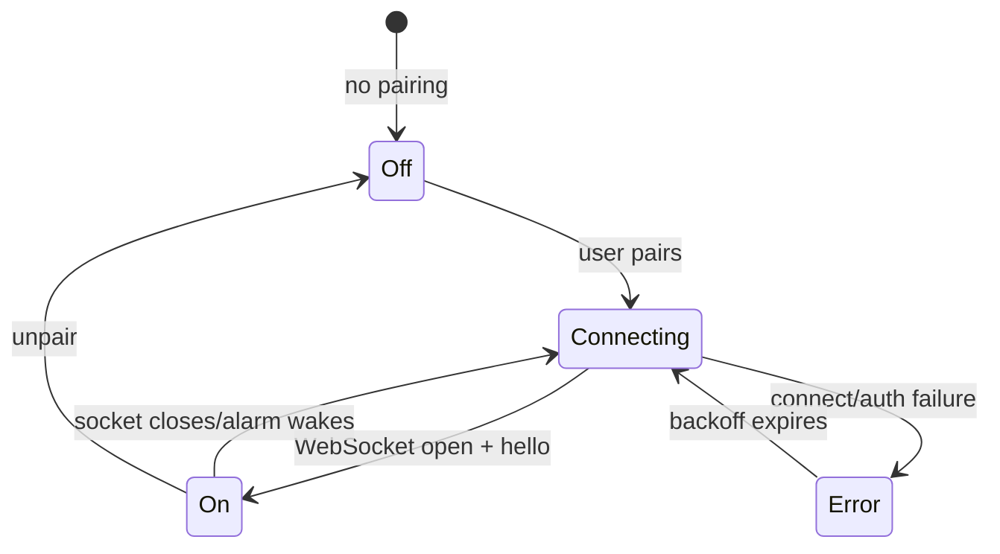

# 浏览器设置：当前实现与安全边界

本文按 `v2026.8.12` 的 Browser shared contract、Main IPC、设置页、打包扩展和OpenClaw config mapper重写。原“设计方案”现已大部分落地；本文明确三种模式、实际诊断、扩展配对与仍存在的平台限制。

## 1. 三种模式

| 模式       | 值          | 数据/控制边界                              | 适用场景                         |
| ---------- | ----------- | ------------------------------------------ | -------------------------------- |
| 隔离浏览器 | `isolated`  | OpenClaw受管profile                        | 默认；不共享用户Chrome登录态     |
| 用户浏览器 | `user`      | 已开启remote debugging的本机Chrome profile | 有人值守、用户接受浏览器调试     |
| 浏览器扩展 | `extension` | 用户加入专用tab group的标签页              | 精细共享；当前命令级校验仍有缺口 |

`normalizeBrowserMode` 对未知值回退isolated。模式保存在 `app_config.browserMode`，SetMode写入后同步OpenClaw；sync失败返回 `config-sync-failed`，不能只更新UI。

## 2. 设置页

`BrowserSettingsTab` 读取status和当前app config，展示模式卡、说明、连接issue和对应动作。切换防重复提交；成功后刷新status/config。所有文案来自中英文i18n。

User模式提供：打开remote debugging设置、重新检测。Extension模式提供：打开扩展管理、显示扩展目录、复制配对信息、测试Gateway/扩展连接。

## 3. User 模式诊断

Main定位Chrome executable和默认user data dir：Windows Program Files/LocalAppData，macOS `/Applications/Google Chrome.app`，Linux google-chrome路径。读取profile的 `DevToolsActivePort` 第一行，要求1..65535。

状态字段：platform supported、Chrome found、remote debugging enabled、active port/file、port owner resolved/owner、endpoint reachable和issue。

Issue分类：unsupported-platform、chrome-not-found、remote-debugging-disabled、port-occupied-by-other-process、chrome-restart-required、not-running。

端口owner：Windows用隐藏的 `netstat.exe` + `tasklist.exe`（2秒timeout）；Unix用 `lsof -nP -iTCP:<port> -sTCP:LISTEN -Fp -Fc`。无法查询owner与确认无人监听是不同状态，不能误报“安全”。

Endpoint通过loopback DevTools JSON探测。若port被非Chrome进程占用，UI必须阻止连接；Chrome配置改变但旧进程仍在时提示重启。

## 4. 打开 Chrome 设置

OpenRemoteDebugging把 `chrome://inspect/#remote-debugging` 复制到系统剪贴板，然后启动或聚焦Chrome。Chrome内部URL不能可靠经OS external protocol直接打开，因此当前实现不会代替用户导航；用户需要把剪贴板中的地址粘贴到Chrome地址栏。相关spawn使用固定参数数组和detached/unref，并在Windows隐藏子进程窗口；不拼接用户shell字符串。

用户仍需在Chrome中明确启用/确认remote debugging。应用不能无提示修改企业policy或profile配置。

## 5. Extension 构建与分发

源位于 `resources/browser-extension/chrome-extension/`；`npm run browser-extension:prepare` 复制到 `build/browser-extension/chrome-extension`，替换product name/version并准备icons。Electron dev启动和packaging都确保build产物存在；builder作为extraResource打包到 `browser-extension/chrome-extension`。

Manifest V3，minimum Chrome 125，service worker为module。权限按当前manifest为准，核心使用storage、tabs/tabGroups、debugger、alarms等；host/connect范围不应扩张而不做安全评审。

## 6. Relay 与配对

Main根据Gateway port计算extension relay：默认18799，或Gateway port+10的策略；真正端口/能力由Gateway browser relay支持。Secret文件为 `<stateDir>/credentials/browser-extension-relay.secret`：随机32 bytes hex、exclusive create、mode 0600；父目录创建为0700，并复用合法既有值。

CopyExtensionPairing把 `ws://127.0.0.1:<port>/extension#<token>` 写剪贴板，但Browser status/result不返回token。扩展解析后把relayUrl/token存 `chrome.storage.local`。

WebSocket token不放URL query，而作为subprotocol `openclaw-extension-token.<token>`，同时发送固定 `openclaw-extension-relay` protocol，减少URL日志泄漏。Relay仅应监听loopback。

## 7. Tab group 是同意边界

扩展创建以产品名命名的tab group；只有组内tab会报告给relay，`chrome.debugger.attach` 前也会校验membership。用户把tab移出组后，tab/group事件会触发同步并detach；点击Chrome debugger infobar Cancel也会移出组，防自动重连重新授权。

Relay命令支持attach/detach、CDP、create/close/activate tab。Attach前再次确认tab仍在共享组；同tab并发attach合并，`Another debugger is already attached`在本扩展已记录状态时安全视为已连接。当前 `cdp`、`closeTab`、`activateTab` 分支没有再次校验目标tab的group membership；其中CDP通常还受debugger attachment约束，但close/activate可直接按Relay提供的tabId调用Chrome API。这是待修复的授权边界缺口，不能把“组外tab不可访问”写成已满足的不变量。

这比“共享整个profile”更细，但共享tab内的cookie/页面内容仍可能敏感；UI必须解释Chrome debugger提示。

## 8. Extension 生命周期

Badge：off空、connecting省略号、on绿色ON、error红色感叹号。连接成功发hello（UA/browser/extension版本和共享tabs）；tabs/group变化150ms debounce同步。

断线指数退避1/2/4/8/16/30秒上限。MV3 service worker可能被回收，因此每0.5分钟alarm唤醒并重连，startup/installed也连接。当前Unpair只删除url/token并关闭socket，不会遍历detach已附加tab，也不会清理共享group。Relay失去配对后无法继续下发命令，但Chrome debugger attachment仍可能保留到其他tab/group事件、扩展生命周期或Chrome自身清理；这是明确的撤销缺口。

Extension模式下JustDo启动Gateway时设置 `OPENCLAW_EAGER_BROWSER_CONTROL_SERVER=1`，使Extension Relay在首次 `browser.request` 前开始监听；其他浏览器模式不承担这项启动开销。设置页的首次自动检测还会对 `gateway-unavailable` 和 `extension-not-connected` 做有上限的短暂重试，以覆盖Gateway重启与扩展WebSocket重连之间的正常窗口；手动检测仍保持单次即时结果。

## 9. Connection test

`browser:testConnection` 用 Gateway client 请求对应 profile 的 `/tabs`，错误分 gateway-unavailable、permission-timeout、extension-not-connected、connection-failed。User 模式只判断 RPC 是否成功，用于触发并确认 Remote Debugging 授权；Extension 专用测试使用 `chrome` profile，并只以响应的 `running === true` 判断扩展已连接。共享 tab 是独立授权状态，不参与连接判断。

测试结果是即时诊断，不保证下一次Agent操作时tab仍授权。当前attach会执行membership检查，但CDP、close和activate命令未做同等级检查。

## 10. OpenClaw 配置映射

Mode保存触发 `applyBrowserModeChange` -> 写app_config -> `syncOpenClawConfig`。Mapper负责生成OpenClaw browser配置/启用相应plugin/tool。Unknown mode回isolated；Extension依赖当前Gateway bundle与Chrome MCP/relay patch能力。

配置同步必须保留非JustDo受管字段；UI不能直接编辑openclaw.json。当前OpenClaw只把`browser.profiles.*`列为hot reload，三种产品模式还会改变要求restart的`browser.defaultProfile`，因此不能只热更新profile并宣称模式已经完整生效。切换前Main用runtime adapter的活动会话状态做权威检查；存在运行中会话时，在写app_config之前返回`active-session`，不触发配置同步或Gateway重启。

Renderer先通过轻量`browser:canSetMode`预检活动会话；Main确认空闲后，UI立即乐观渲染目标模式，再等待持久化和runtime应用完成。真正的`browser:setMode`在写配置前会再次检查，封住预检与写入之间新会话启动的竞态。等待期间复用OpenClaw engine progress事件展示应用中、Gateway重启中和进度百分比；成功后展示就绪状态，失败则reload持久化配置并回到权威模式。若未来OpenClaw支持`browser.defaultProfile`安全热更新，同一UI流程会直接从应用中进入完成态，不依赖重启事件。

## 11. 安全要求

- Relay loopback + secret；token文件权限和日志/IPC/URL泄漏检查。
- Tab group作为可见授权；目标实现应在每个可控命令前验证membership，并在移组或unpair时立即detach。当前只有attach和移组事件路径覆盖了这条规则，命令级校验与unpair清理仍待补齐。
- Port owner不明时不得宣称Chrome可信；非Chrome owner明确阻断。
- Chrome/PowerShell/open命令参数固定，窗口隐藏，不用shell拼接。
- Extension/relay message视为不可信，校验type、seq、tabId、URL/CDP参数与消息大小。
- 不自动绕过Chrome首次debugger确认或企业policy。
- Mode/config sync失败时保持可恢复，并阻止错误模式被宣告成功。

## 12. 已知限制

- 主要针对Google Chrome，Chromium/其他衍生浏览器的发现有限。
- DevToolsActivePort与进程owner检查存在TOCTOU，真正连接仍需Gateway验证。
- Pairing string进入系统剪贴板，其他应用可能读取；用户应完成后覆盖/系统应考虑短期token轮换。
- MV3后台会暂停，依赖alarm和reconnect；短暂不可用是预期状态。
- Chrome debugger会显示可见警告，无法也不应隐藏。
- Extension relay能力依赖固定OpenClaw runtime和Windows/Chrome相关patch。
- `cdp`、`closeTab`、`activateTab` 当前未重新校验共享组membership；不能将tab group视为完整命令级capability。
- Unpair当前不主动detach既有debugger attachment，也不清理共享group；撤销语义尚未完全收敛。

## 13. 测试

现有Main测试覆盖active port/parser、Windows/Unix owner、secret创建复用、pairing不回token、路径发现和handler。Extension pure helper测试应覆盖pairing、subprotocol、backoff、color/tab normalize；集成需覆盖group授权/撤销、并发attach、MV3重启、0 tab、Chrome Cancel和mode config sync失败。

手工跨平台验证：全新Chrome、Chrome已运行、debugging关闭/需重启、端口被其他进程占用、扩展load unpacked/packaged路径、配对/断线/重启、共享/移除多个窗口tab。

## 14. 维护入口

- Shared：`src/shared/browser.ts`
- Main：`src/main/ipc/app/browser.ts`
- UI：`src/renderer/features/settings/components/BrowserSettingsTab.tsx`
- Extension：`resources/browser-extension/chrome-extension/`
- Prepare：`scripts/prepare-browser-extension.cjs`
- Config：`src/main/openclaw/config/openclawConfigSync.ts`

## 15. Shared contract 逐项说明

`src/shared/browser.ts` 是 Renderer 与 Main 的稳定边界：

| 类型/常量                     | 当前值                            | 用途                                     |
| ----------------------------- | --------------------------------- | ---------------------------------------- |
| `BrowserMode`                 | isolated/user/extension           | 产品选择，不直接等同 OpenClaw profile 名 |
| `BrowserConnectionIssue`      | 6 个稳定错误分类                  | User 模式设置向导                        |
| `BrowserPortOwner`            | pid/processName/isChrome          | 只表示诊断结果，不是安全 capability      |
| `BrowserConnectionStatus`     | 发现、配置、端口、owner、endpoint | 一次状态快照                             |
| `BrowserConnectionTestResult` | success/error/errorCode           | Gateway `/tabs` 即时调用结果             |

`normalizeBrowserMode` 只有 `user` 和 `extension` 原样通过，其他值全部回到 `isolated`。IPC SetMode 仍会严格拒绝未知值；normalize 用于读取旧配置时安全恢复，不能代替写入校验。

## 16. Main handlers 明细

| IPC                               | Main 行为                                     | 是否修改状态         |
| --------------------------------- | --------------------------------------------- | -------------------- |
| `browser:getStatus`               | 执行 Chrome/DevTools/owner/endpoint 诊断      | 否                   |
| `browser:setMode`                 | 校验枚举，调用 config transaction             | 是                   |
| `browser:openRemoteDebugging`     | 复制内部 URL并启动/聚焦 Chrome                | 只修改剪贴板         |
| `browser:openExtensionManagement` | 复制 `chrome://extensions` 并聚焦 Chrome      | 只修改剪贴板         |
| `browser:revealExtension`         | 定位打包或开发扩展目录并用 shell 打开         | 否                   |
| `browser:copyExtensionPairing`    | 构建/复用 secret，复制 pairing string         | 可能创建 secret 文件 |
| `browser:testConnection`          | user profile `/tabs`，并前景/再次聚焦 Chrome  | 否                   |
| `browser:testExtensionConnection` | chrome profile `/tabs` 并验证扩展处于 running | 否                   |

Handler 统一返回可序列化 `{success,...}`；路径、Gateway token、Relay token 不应出现在失败响应。RevealExtension 日志会记录扩展目录，这是受管应用路径而非用户秘密，但仍不应扩展为打印 manifest/config 内容。

## 17. User 模式状态判定算法

`getBrowserConnectionStatus()` 按以下证据顺序计算：

1. 判断平台是否在支持集合；
2. 定位 Chrome executable；
3. 定位默认 user data dir，并读取 Preferences 中 remote debugging 开关；
4. 检查 `DevToolsActivePort` 是否存在，解析第一行整数端口；
5. 对该 loopback 端口做 TCP probe；
6. 只有端口监听时才查询 owner；
7. owner 已解析、进程名存在且不是 Chrome 时判定冲突；
8. `endpointReachable = portListening && !occupiedByOtherProcess`；
9. 按固定优先级选择单个 issue。

Issue 优先级是 unsupported → chrome missing → debugging disabled → other-process owner → restart required → not running。一个状态可能同时有多个底层缺口，UI 只收到最高优先级 issue，但仍可读取其他布尔字段展示辅助信息。

Owner 查询失败时 `activePortOwnerResolved=false`，不会被归类成明确的 other-process conflict。当前 `endpointReachable` 仍可能为 true，所以它只表示端口可连接，不是“已证明对端是 Chrome”。文档、安全评审和 UI 不应扩大这一字段含义。

## 18. Browser mode 配置事务



Rollback sync 也可能失败；Main 记录错误但响应仍是原操作失败。此时持久 app_config 已恢复 previous，活动 Gateway 是否恢复要看第二次 sync 结果。UI 应重新读取配置/engine status，而不是仅把卡片切回旧选项就假设 runtime 已一致。

## 19. Extension pairing 文件与端口

Relay port 解析顺序：

1. 若 `OPENCLAW_CONFIG_PATH` 指向的 config 中 `browser.profiles.chrome.cdpPort` 是 1..65535 整数，直接使用；
2. 否则读取 `OPENCLAW_GATEWAY_PORT + 10`；
3. 结果非法时回退 18799。

Secret 创建：

- 路径必须来自绝对 `OPENCLAW_STATE_DIR`；
- 父目录 `credentials` 以 0700 创建；
- token 是 `crypto.randomBytes(32).toString('hex')`，即 64 个小写 hex 字符；
- 文件使用 `flag:'wx'` 和 mode 0600；
- 并发创建发生 EEXIST 时重新读取胜者；
- 已有内容只有匹配 `/^[0-9a-f]{64}$/` 才复用，否则失败。

Pairing string 的 fragment 只避免 token 作为 WebSocket URL query 被常规服务器日志记录；扩展 popup 仍会解析并持久化 token，系统剪贴板也暂时包含明文。它不是一次性 token，当前轮换依赖用户重新配对或 runtime/secret 管理策略。

## 20. Extension background 状态机

Extension service worker 的核心状态包括 pairing config、WebSocket 状态、已共享 group/tab、debugger attachment 和重连 attempt。典型流程：



Tab group 是授权可见面；目标不变量是在真正控制前检查tab存在、仍属于目标group、URL/command可接受且debugger attach成功。当前实现只在attach入口强制membership，后续CDP及close/activate没有统一的前置校验。Group/tab事件以150ms debounce汇总，避免拖动标签页时向Relay发送大量中间状态。

Chrome debugger attachment 与 WebSocket 是两个资源。移出group的事件路径会同步并detach，但当前Unpair只断WebSocket并删除storage，不处理attachment或group；因此扩展仍可能暂时拥有页面调试权限。修复后的回归测试不能只检查storage/token已删除，还必须观察debugger与group状态。

## 21. 连接测试的准确语义

`testBrowserConnection()` 调用：

```text
browser.request
  method: GET
  path: /tabs
  query.profile: user | chrome
  timeoutMs: 45000
```

普通 Remote Debugging 模式只要求请求 resolve，以便保留“触发 Chrome 授权”的探测语义。扩展模式还会读取响应 body，并只检查 `running === true`。因此：

- success：Gateway client 存在且请求 resolve；扩展模式还必须确认 Relay 中的扩展处于运行状态，共享 tab 可以为空；
- gateway-unavailable：Main 当前没有 client；
- permission-timeout：错误文本命中 timed out/timeout；
- extension-not-connected：扩展模式未返回严格的 `running: true`；
- connection-failed：其他错误。

扩展连接测试只证明测试时刻扩展与 Relay 已连接。共享 tab 是独立的用户授权状态；即使连接测试成功，也不能证明存在可控页面、tab group 后续仍授权、debugger attach 可通过或页面命令可执行。

设置页在首次以扩展模式打开或从其他模式切换到扩展模式时会自动执行一次相同的连接测试；手动按钮用于配置完成后的即时重试。离开扩展模式时，尚未完成的探测结果会被丢弃，避免过期结果覆盖当前页面状态。

## 22. 安全测试清单

### Main

- 恶意/损坏 `DevToolsActivePort`：空、负数、65536、额外文本；
- owner tool timeout、命令不存在、输出多进程、PID 消失；
- secret 父目录不存在、并发创建、非法旧 token、权限错误；
- config path/state dir 缺失或相对路径；
- mode sync 首次失败、rollback失败和活动 workload；
- IPC 结果不包含 token。

### Extension

- pairing parser 拒绝空 token、错误协议和非 `/extension` path；
- WebSocket protocols 不把 token放 URL；
- 非组内 tab 的 attach/CDP/close/activate 全部拒绝；
- tab 在检查与 attach 之间移出 group；
- Chrome Cancel 后不会自动重新 attach；
- service worker suspend/resume 后 attachment/storage/socket 收敛；
- unpair 清 socket、timer、storage和attachment；
- Relay 发送 malformed JSON、超大 payload、未知 command、错误 seq/tabId。

## 23. 排障路径

1. 先确认设置中的 mode 与 Main app_config 一致；
2. User 模式记录 activePort、ownerResolved、owner和issue，不记录用户页面；
3. Extension 模式确认打包目录、pairing已保存、badge、共享 group/tab 数；
4. 用 TestConnection区分 Gateway入口失败与后续attach失败；
5. 检查 Main daily log、Gateway log，再按原生 JSON log关联browser request；
6. 若更新配置后异常，确认 Gateway generation 是否实际重载/重启；
7. 不把 pairing token、Chrome cookie、CDP response或页面内容贴入 issue。

## 24. 完成交付标准

Browser 功能的完整验收不是三个模式能保存，而是：

- isolated 不读取用户 Chrome profile；
- user 模式在明确授权下连接，并能区分配置、进程和端口问题；
- extension 的attach、CDP、close、activate都只接受用户可见共享组内tab，移组和unpair均立即detach；当前实现尚未满足此项，属于发布前安全修复项；
- config sync失败不会让 UI 宣告错误模式成功；
- token、页面、cookie和CDP payload不泄漏到 IPC/日志；
- Windows、macOS、Linux 的实际 Chrome 安装路径与打包资源经过 smoke；
- Gateway/OpenClaw升级后 `/tabs` profile、Relay protocol和Chrome MCP patch重新验证。
