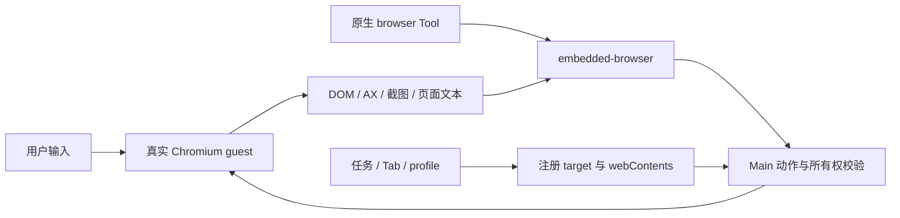

# 浏览器：四种模式、实时工作区与控制权

浏览器设置选择 Agent 使用哪个 browser Tool；右侧工作区提供用户可操作的真实网页。当前承载是 Electron webview guest，WebContentsView 仍是后续迁移候选，不能写成已交付架构。

## 1. 模式和提供方

| 模式       | 持久值    | 提供方                       | 用途                              |
| ---------- | --------- | ---------------------------- | --------------------------------- |
| 隔离浏览器 | isolated  | OpenClaw 原生 Browser        | 独立受管资料                      |
| 用户浏览器 | user      | 原生 existing-session driver | 连接用户 Chrome                   |
| 浏览器扩展 | extension | 原生 extension driver        | 用户授权的已登录 Chrome Tab       |
| 内置浏览器 | embedded  | embedded-browser Extension   | 用户与 Agent 共用桌面侧栏实时网页 |

配置未知旧值归一为 isolated，写入 IPC 严格拒绝未知值。切换同时更新产品 app_config 和原生配置，失败恢复原模式。原生 Browser 和 embedded-browser 互斥，任何时刻只有一个名为 browser 的 Tool；插件页与 Main 都禁止绕过模式开关单独启停。

前三种属于原生浏览器部署形态，第四种由产品 guest bridge 承载。内置模式固定 host，不暴露远程 node/container 拓扑，也不偷偷切外部 Chrome 补缺能力。

## 2. 内置浏览器的资源模型

每个 Tab 绑定任务、profile、UI target 与真实 webContents。Main 复核主窗口归属、webview 类型、合法 partition 与真实存储路径，每次动作都不能只信前一次注册。

默认 embedded、导入 imported 及合法命名 profile 使用隔离持久 partition。弹窗、复制、恢复和派生 Tab 继承来源 profile，不能意外共享应用壳 Cookie 或认证。后台任务可创建自身 Tab，但不抢用户当前工作区。

## 3. 工具动作与观察

事件桥对齐锁定 Browser Tool 的生命周期、Tab、观察、页面/文件与 act 能力。查询状态不预建空 Tab，首次 open/navigate 在对应任务创建真实页面。目标可用稳定 tN、label、完整 ID 或唯一前缀，歧义必须拒绝。

同一 guest 动作串行。DOM eN ref 绑定快照和文档；部分无导航输入后节点仍有效可继续使用，点击/脚本/批量变化等会主动失效。AX 引用在同文档且节点仍存在时可自解析，导航或移除后失效。模型不提交内部 snapshot ID。

快照递归同源 frame/open Shadow DOM，合并可获得的跨域 AX 语义，连续兼容快照可标记新增节点。截图是私有观察结果，不替换网页承载；带标签图在离屏副本绘制，不改页面 DOM。evaluate 只在无 Node/Electron 权限的 isolated world 执行，输入输出有界。

页面文本、日志、脚本结果均按 network 不可信内容返回；诊断不收集 header/POST body，清理链接凭据和敏感 URL。完整原生 schema 对齐以 bridge/contract tests 为准，不能用“类似支持”返回伪造结果。

## 4. 用户与 Agent 不能同时破坏现场

Agent 控制同一页面期间，Renderer 使用交互遮罩；用户画笔、框选、元素检查、评论和录制期间，反向 lease 阻止 Agent 导航、输入、切 Tab 或关闭。允许的观察不应改变页面。

profile 管理动作在修改 Renderer 前取得 scope lease。无 Tab 时可先挂载空面板完成遮罩 ACK，但不预造隐藏 guest；并发 readiness 共享，单个等待取消不能让其他调用失败。

暂停/停止录制要确认 guest 最后输入已提交，再释放保护。窗口销毁、导航、取消和 Gateway 停止清理请求与 lease。操作演示内容仍在 guest/Renderer，Main 不增建正文存储，见[录制说明](browser-operation-recording.md)。

## 5. 导航、权限和认证

Main 强制 guest preload、sandbox、context isolation、无 Node/嵌套 webview 与 HTTP(S)/about:blank 导航；请求层 guard 防绕过。主窗口也只能停留应用范围。

低风险聚焦全屏和净化剪贴板按明确规则授权；摄像头、麦克风、定位和通知经 Main 来源确认，audio/video 分开。授权绑定 guest、frame origin 和能力，非同文档导航失效，不能用旧页面确认批准新页面。

HTTP auth challenge 绑定随机 request 与 guest，只有主窗口主 frame 可回应。导航、关闭、取消或期限结束统一清理；迟到响应忽略。凭据不写应用密码库和日志，Chromium 自身的 session 缓存另有生命周期。

## 6. 文件、下载与 PDF

人工下载遵循询问/目录设置。Agent 上传必须是真实任务工作区文件；download/pdf 只写工作区并拒绝覆盖，以真实父目录形成 canonical reservation 防并发冲突。下载事件还需匹配具体 guest 与等待请求；失败或取消终止下载并清理部分文件。

默认 PDF 使用 Chromium 原生查看器。内部 PDF 扩展的特殊子 frame 流导航有精确放行条件，不能为修白屏允许任意 chrome-extension 页面。打印使用原生 PDF 自带入口，避免打印外层空白页。

兼容 PDF.js 由用户显式选择，读取请求绑定窗口且可取消，有超时/大小限制；只渲染活动 Tab，关闭释放 worker。兼容模式未实现的查找、打印、截图、标注等明确禁用，不把动作发给背后不可见 guest。其限制不等于原生 PDF 查看器也不支持。

## 7. 数据导入与清理

设置支持从 Chromium 系资料导入允许的数据，密码经 safeStorage 保存于独立 browser-import.sqlite，Renderer 不读取密文。导入默认目标与工具 importprofile 目标分开，命名 profile 保持自己的 partition。

下载记录保存安全展示字段，Main-only 路径只经记录 ID 进行打开/定位。删除记录不删磁盘文件。按时间删历史/记录与 Chromium Cookie/storage/cache 全量清理区别披露；清理需涵盖已持久化命名 profile，不能仅处理默认两个 partition。

## 8. Chrome 配对与侧栏聊天是两条链

自动化配对由锁定 OpenClaw CLI 生成 relay pairing，只写剪贴板，不返回 Renderer 或日志。原生 relay 负责授权 Tab 和自动化。

侧栏聊天通过固定扩展 ID 的 Native Messaging 发现 Main app-server，不依赖手工 relay 配对，也不取得 Gateway token。详见[扩展侧聊](browser-extension-side-chat.md)和[协议](../browser-extension-api/README.md)。

资源分别位于 browser-extension/openclaw 基线与 conversation-overlay。升级先整体更新对应版本的 pristine relay 基线，再审查 manifest/background/options 显式接缝，最后组合 overlay；不能从 build 混合产物反向覆盖源码。

## 9. 故障与后续范围

| 症状                          | 优先核对                                      |
| ----------------------------- | --------------------------------------------- |
| 模型找不到 browser 或出现两个 | 模式配置与互斥提供方                          |
| 已有 Tab 无法操作             | 任务归属、profile、真实 webContents、lease    |
| stale ref                     | 文档导航或快照失效，不盲目复用                |
| 下载不结束                    | guest 匹配、路径 reservation、取消/超时       |
| PDF 空白                      | 原生内部流导航或兼容读取结果                  |
| 侧栏连不上但自动化可用        | Native host/app-server，不重配 relay 冒充修复 |

WebContentsView 迁移需单独验证 DPI/bounds、焦点、输入、实时标注、profile 和销毁，不能退化成截图遥控。当前验证重点包括 bridge action/schema、页面安全、lease 竞争、文件边界、PDF 和扩展组装测试；真实浏览器与平台验收另行记录。
