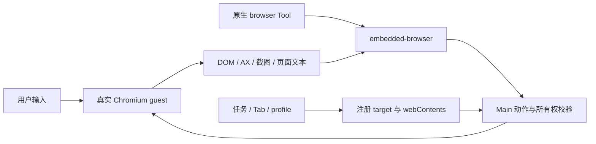

# 浏览器：四种模式、实时工作区与控制权

浏览器设置选择 Agent 使用哪个 browser Tool；右侧工作区提供用户可操作的真实网页。当前承载是 Electron webview guest，WebContentsView 仍是后续迁移候选，不能写成已交付架构。

源码保持两侧各自的生命周期入口：Main 的 `browser/browserAgentBridge.ts` 持有 guest、连接和操作上下文，辅助能力归 `agent`、`downloads`、`extension`、`history`、`data`、`recording`、`pdf` 和 `preview`；Renderer 的 `features/browser/BrowserPanel.tsx` 持有网页面板，标注、录制、人工介入、数据对话框与 PDF 分别归对应领域目录。测试与实现相邻。目录归位不改变进程边界、原生 browser Tool 语义、下载策略或扩展配对协议。

## 独立浏览器代理

“设置 → 浏览器 → 浏览器代理”保存 `app_config.browserProxy`，默认使用系统代理；可独立选择不使用代理或自定义 HTTP/HTTPS 代理。只作用于应用持有的 Electron 浏览器 guest session，包括默认、导入和任务隔离 profile。用户 Chrome、扩展及 OpenClaw 管理的独立 Chrome 仍使用各自浏览器的代理配置。

浏览器代理草稿由设置页统一持有，切换标签页不丢失；代理区域和页底的“保存”使用同一个提交与校验流程，“取消”丢弃尚未保存的代理修改。自定义代理必须有有效的主机和端口；保存失败保留草稿供修改或重试。

原有“设置 → 通用 → 代理设置”继续保存 `app_config.proxy` / `useSystemProxy`，默认不使用代理，仅用于 Main、默认 Electron session、Gateway 和继承其代理配置的非浏览器客户端。两类设置不互相继承；已有配置没有 `browserProxy` 时也使用新的浏览器系统代理默认值，不复制已有模型抓包配置。

Main 分别应用两个偏好：非浏览器代理变化更新默认 session、进程环境和 outbound-header 的上游选择，并按原规则在空闲时重启 Gateway；浏览器代理变化只更新 guest sessions 并关闭旧连接，不修改进程环境、不重启 Gateway。后续创建的 profile 在同一浏览器配置队列中应用当前偏好。浏览器代理认证只读取 `browserProxy` 中与挑战 host/port 匹配的凭据。

网页 Tab 图标由 Main 监听真实 guest 的原生 favicon 事件，通过该 guest 的 session 读取，沿用浏览器代理和 Cookie；主窗口 Renderer 只接收有大小限制的图片 data URL，不再从默认 session 重复请求网站图标。读取受 10 秒期限、256 KiB 网络图片体积、候选与重定向次数限制；内联 data URL 最长为 512 × 1024 个字符。逐跳执行浏览器 URL 与本地 HTML 资源范围校验，并继续经过 session 的网络请求保护。需要代理认证且 session 尚未建立认证缓存时，仅对代理认证失败回退同 session 的原生 GET 请求；只向与当前配置 host/port 精确匹配的代理挑战提供一次凭据，不给源站认证或主动注入认证 Header。主文档导航和 guest 销毁取消旧请求，更新按 guest ID 与当前页面匹配；缺少或失败的图标依次尝试网站候选和 `/favicon.ico`，最终显示通用网页图标。

最近访问复用历史记录中的已加载图片，重启或离线也不需要主界面重新请求网站图标。历史列表只返回元数据；主窗口主 frame 通过按已有页面 URL 的专用接口读取单张图片。旧记录缺图时，Main 在默认内置浏览器 partition 使用浏览器代理和该 partition 的 Cookie 补取记录地址及网站 favicon，成功后保存；其他 profile 浏览时已取得的图片由对应真实 guest 直接写入历史。重复补取合并，最多四项并行，其余在受限队列中等待。迟到的旧补取不能覆盖已更新的图片或来源；历史删除和缓存清理使此前开始的读取失效，清理后的新读取仍可正常保存。Tab 显示独立于图片缓存写入，数据库写入失败不会隐藏已取得的图标。加载和解码期间始终显示通用图标，图片解码成功后才切换；解码失败最多重新尝试一次网站 favicon，隐藏或关闭页面后忽略迟到结果。删除历史或清理缓存同时处理这些图片，详见[数据存储](../../architecture/10-data-storage.md)。

模型调试可采用“非浏览器自定义抓包代理 + 浏览器系统代理”，也可针对需要直连公司 IP 的浏览器设置不使用代理。系统模式沿用 OS 的代理与绕过规则，不新增应用自动 IP 分流。outbound-header 仍是 Gateway 的第一跳注入代理，第二跳由非浏览器设置决定；浏览器网页不进入 Header 注入数据面。

## 1. 模式和提供方

| 模式       | 持久值    | 提供方                       | 用途                              |
| ---------- | --------- | ---------------------------- | --------------------------------- |
| 隔离浏览器 | isolated  | OpenClaw 原生 Browser        | 独立受管资料                      |
| 用户浏览器 | user      | 原生 existing-session driver | 连接用户 Chrome                   |
| 浏览器扩展 | extension | 原生 extension driver        | 用户授权的已登录 Chrome Tab       |
| 内置浏览器 | embedded  | embedded-browser Extension   | 用户与 Agent 共用桌面侧栏实时网页 |

新配置以及缺失、未知的模式值默认使用 embedded；已保存的 isolated、user 或 extension 选择保持不变。写入 IPC 严格拒绝未知值。切换同时更新产品 app_config 和原生配置，失败恢复原模式。原生 Browser 和 embedded-browser 互斥，任何时刻只有一个名为 browser 的 Tool；插件页与 Main 都禁止绕过模式开关单独启停。

Chrome 扩展安装入口作为独立区域始终显示，位于浏览器选择上方，安装说明默认收起。通过“应用名称 / Chrome”下拉框选择环境，应用名称从 package.json.productName 读取，再显示对应的连接内容。浏览器选择和连接内容合并在同一区域；Chrome 下用紧凑选项保留隔离、日常和扩展三种连接方式，只显示所选方式的说明。同一次打开设置期间切回 Chrome 会恢复上次选择的连接方式，未选择过时使用 isolated。搜索、历史和下载设置始终显示。环境与连接方式切换均遵循现有任务检查、应用进度和失败回退。切换进度复用标题下方的固定高度说明行，使用简短状态与图标；下拉框按最长选项自适应宽度，长名称受窗口宽度限制；保留右侧锚点，状态变化和选项切换不改变布局，不追加提示行。

前三种属于原生浏览器部署形态，第四种由产品 guest bridge 承载。内置模式固定 host，不暴露远程 node/container 拓扑，也不偷偷切外部 Chrome 补缺能力。

## 2. 内置浏览器的资源模型

每个 Tab 绑定任务、profile、UI target 与真实 webContents。Main 复核主窗口归属、webview 类型、合法 partition 与真实存储路径，每次动作都不能只信前一次注册。

默认 embedded、导入 imported 及合法命名 profile 使用隔离持久 partition。弹窗、复制、恢复和派生 Tab 继承来源 profile，不能意外共享应用壳 Cookie 或认证。后台任务可创建自身 Tab，但不抢用户当前工作区。

## 3. 工具动作与观察

事件桥对齐锁定 Browser Tool 的生命周期、Tab、观察、页面/文件与 act 能力。查询状态不预建空 Tab，首次 open/navigate 在对应任务创建真实页面。目标可用稳定 tN、label、完整 ID 或唯一前缀，歧义必须拒绝。

同一 guest 动作串行。DOM eN ref 绑定快照和文档；部分无导航输入后节点仍有效可继续使用，点击/脚本/批量变化等会主动失效。AX 引用在同文档且节点仍存在时可自解析，导航或移除后失效。模型不提交内部 snapshot ID。

快照递归同源 frame/open Shadow DOM，合并可获得的跨域 AX 语义，连续兼容快照可标记新增节点。截图是私有观察结果，不替换网页承载；带标签图在离屏副本绘制，不改页面 DOM。evaluate 只在无 Node/Electron 权限的 isolated world 执行，输入输出有界。

页面文本、日志、脚本结果均按 network 不可信内容返回；诊断不收集 header/POST body，清理链接凭据和敏感 URL。完整原生 schema 对齐以 bridge/contract tests 为准，不能用“类似支持”返回伪造结果。

## 4. 用户与 Agent 不能同时破坏现场

Agent 控制同一页面期间，Renderer 使用交互遮罩；用户画笔、框选、元素检查、评论和录制期间，反向 lease 阻止 Agent 导航、输入、切 Tab 或关闭。允许的观察不应改变页面。

profile 管理动作在修改 Renderer 前取得 scope lease。无 Tab 时可先挂载空面板完成遮罩 ACK，但不预造隐藏 guest；并发 readiness 共享，单个等待取消不能让其他调用失败。

暂停/停止录制要确认 guest 最后输入已提交，再释放保护。窗口销毁、导航、取消和 Gateway 停止清理请求与 lease。操作演示内容仍在 guest/Renderer，Main 不增建正文存储，见[录制说明](browser-operation-recording.md)。

## 5. 导航、权限和认证

“消息链接打开位置”和“内置浏览器设置”分为两个独立区域，均使用紧凑单列列表，不再嵌套子卡片或留双栏空白。网页链接与本地 HTML 文件的打开位置下拉框使用同样的应用名称 / Chrome 标签，分别对应内置浏览器与 Chrome，不改变 AI 的 browser Tool 模式，也不重启 Gateway。搜索、历史与下载设置归入内置浏览器，始终显示；下载目录保留路径和完整路径悬停提示，简短标签配合无障碍说明保留字段含义。消息气泡、展开的用户消息和媒体附件在点击时读取当前偏好；网页链接与本地 HTML 均默认内置，缺失或无效配置也使用此默认值，已保存的 Chrome 选择保持不变。内置链接打开当前会话的真实网页 Tab；Chrome 通过 Main 专用 IPC 校验主窗口主 frame 与 HTTP(S) URL，再将 URL 作为独立参数启动已安装的 Google Chrome，不依赖系统默认浏览器。HTML 在两种模式下都先通过既有本地预览服务校验与发布，相邻静态资源范围沿用预览根目录；失败显示提示，不自动切换浏览器。

普通 HTTP(S) URL、Markdown 链接和 `MEDIA` 中的网页／HTML 附件都走上述偏好。在线 `.html` 按网页设置处理。本地 HTML URL 的 query/hash 与文件路径分开传递，在校验后的预览地址上设置 search/hash，不能改变预览的 origin 或 pathname；裸原生路径中的文件名字符保持原样。句子前缀不能阻止裸 HTML 路径识别，代码和现有链接中的路径不重新链接。内置浏览器已挂载时必须调用 panel handle 创建实际 Tab，并保留相同 targetId 和 HTML 来源元数据；容量拒绝不新增外层 Tab，未挂载时才用初始 Tab 状态。异步预览保留点击时的会话和浏览器选择。

Main 强制 guest preload、sandbox、context isolation、无 Node/嵌套 webview 与 HTTP(S)/about:blank 导航；请求层 guard 防绕过。主窗口也只能停留应用范围。

低风险聚焦全屏和净化剪贴板按明确规则授权；摄像头、麦克风、定位和通知经 Main 来源确认，audio/video 分开。授权绑定 guest、frame origin 和能力，非同文档导航失效，不能用旧页面确认批准新页面。

HTTP auth challenge 绑定随机 request 与 guest，只有主窗口主 frame 可回应。导航、关闭、取消或期限结束统一清理；迟到响应忽略。凭据不写应用密码库和日志，Chromium 自身的 session 缓存另有生命周期。

## 6. 文件、下载与 PDF

人工下载遵循询问/目录设置。Agent 上传必须是真实任务工作区文件；download/pdf 只写工作区并拒绝覆盖，以真实父目录形成 canonical reservation 防并发冲突。未指定输出路径的 PDF、等待下载及普通操作触发的下载默认保存至工作区 `.agent-tasks/browser-artifacts/`，与 Swarm 使用同一通用任务根目录。下载事件还需匹配具体 guest 与等待请求；失败或取消终止下载并清理部分文件。

默认 PDF 使用 Chromium 原生查看器。内部 PDF 扩展的特殊子 frame 流导航有精确放行条件，不能为修白屏允许任意 chrome-extension 页面。打印使用原生 PDF 自带入口，避免打印外层空白页。

兼容 PDF.js 由用户显式选择，读取请求绑定窗口且可取消，有超时/大小限制；只渲染活动 Tab，关闭释放 worker。兼容模式未实现的查找、打印、截图、标注等明确禁用，不把动作发给背后不可见 guest。其限制不等于原生 PDF 查看器也不支持。

## 7. 数据导入与清理

设置支持从 Chromium 系资料导入允许的数据，密码经 safeStorage 保存于独立 browser-import.sqlite，Renderer 不读取密文。导入默认目标与工具 importprofile 目标分开，命名 profile 保持自己的 partition。

下载记录保存安全展示字段，Main-only 路径只经记录 ID 进行打开/定位。删除记录不删磁盘文件。按时间删历史/记录与 Chromium Cookie/storage/cache 全量清理区别披露；清理需涵盖已持久化命名 profile，不能仅处理默认两个 partition。

## 8. Chrome 配对与侧栏聊天是两条链

手动自动化配对由锁定 OpenClaw CLI 生成 relay pairing，只写剪贴板，不返回 Renderer 或日志。Automatic connection 复用产品 Native Messaging host 发现本机 app-server，初始化并鉴权后调用 `browser/extension/pair`；Main 准备 Gateway，再通过同一锁定 CLI 的 `--local-gateway` 生成原生 `/browser/extension` 唤醒入口。配对信息仅返回扩展后台，不进入桌面 Renderer、发现文件或日志，不安装或调用另一套上游 Native host。原生 relay 仍负责授权 Tab 和自动化。

侧栏聊天通过固定扩展 ID 的 Native Messaging 发现 Main app-server，不依赖手工 relay 配对，也不取得 Gateway token。详见[扩展侧聊](browser-extension-side-chat.md)和[协议](../../browser-extension-api/README.md)。

Automatic connection 点击后立即显示连接进度，失败提示允许重试。设置页状态轮询只读取原生控制器状态，不能隐式启动配对；自动重试仍由原生 watchdog 负责。Main 合并进行中的配对请求，完成或失败即释放，不缓存配对凭据；Gateway 配置与权限检查保持执行。

单次 app-server 配对等待上限为 30 秒。开发时首次冷启动准备可能更长，此时扩展显示失败并由 watchdog 重试，后续请求复用 Main 尚未完成的准备任务；不承诺首次冷连接在 30 秒内完成。

配对使用公共 CLI 入口，不使用 Gateway bundle 代替。`src/shared/openclaw/cliRuntimeFiles.json` 记录锁定版本的完整根目录启动依赖；安装时验证并打入 gateway.asar，开发提取和各平台最终打包均核验完整清单。Main 仅选择依赖齐全的 CLI 根目录。Gateway 可启动不能证明 CLI 可用；修改打包后须通过桌面实际入口验证自动和手动配对。缺失依赖的开发运行时从锁定 pristine 包整体重建，不补写自制 helper。

资源分别位于 browser-extension/openclaw 基线与 conversation-overlay。升级先整体更新对应版本的 pristine relay 基线，再审查 manifest/background/options 显式接缝，最后组合 overlay；不能从 build 混合产物反向覆盖源码。

自动配对的构建接缝仅为原生 bootstrap controller 增加可注入请求函数，并由 background 注入产品发现／配对传输。默认上游传输、原生去重、手动配对优先、Disconnect 的迟到响应撤销与旧任务保护保持不变；产品桥不读取或控制 Tab，也不创建聊天会话。失败仍由原生状态机决定重试或提示手动连接，不能将请求已发出显示成配对成功。

扩展设置页由应用自己的 conversation-overlay/options.html、options.css、options.js 和文案字典维护，组装时覆盖上游设置页，不修改 pristine 基线。页面按用户要求固定使用英文，不随浏览器语言切换；四块标题为 Automatic connection、Manual connection、Tab Access、Background color，操作尽量沿用 Use local、Pair manually、Disconnect 等原有用词。自动和手动操作使用同一原生连接，两处 Disconnect 均调用原生 unpair，断开并停用自动重连。保留原生旧任务保护、连接状态轮询和标签授权语义；配对内容仅在成功后清空，失败时保留输入，界面不显示原始诊断命令或凭据。

桌面“设置 → 浏览器”的扩展配对说明优先引导保持桌面应用与 Chrome 运行，等待扩展自动发现并完成配对，再选择 Tab Access。原生后台在安装、Chrome 启动及 worker 加载时尝试自动配对，watchdog 负责后续重试；Use local 仅用于自动连接已停用时重新启用或主动重试。自动配对说明、实际连接状态和测试按钮合并为一行，复制配对信息与 Manual connection → Pair manually 放在默认收起的备用说明中。连接状态文案对齐扩展的 Connected，完成状态来自实际连接验证，不能由复制配对信息成功代替。

构建从 resources/icons/png 的应用图标复制 16、32、48、128 像素版本，覆盖生成产物中的上游图标；品牌文字继续由 package.json.productName 注入。背景颜色使用已有持久化偏好，同时应用到设置页和已打开的对话侧栏。源布局、基线校验和、生成文件一致性与回归测试共同防止升级丢失界面定制。

## 9. 故障与后续范围

Agent 请求新标签时，`AgentEnsureTab` 在当前任务已挂载的 `BrowserPanel` 上调用 `openTab`，保留 Main 分配的 targetId 与 profile。`initialTabs` 只初始化空面板；已挂载面板不能靠修改外层标签列表创建 guest。重复 targetId 不重复创建，容量限制拒绝时也不改变外层选择和目标列表，否则 Main 会等待不存在的目标注册直到超时。

| 症状                          | 优先核对                                      |
| ----------------------------- | --------------------------------------------- |
| 模型找不到 browser 或出现两个 | 模式配置与互斥提供方                          |
| 已有 Tab 无法操作             | 任务归属、profile、真实 webContents、lease    |
| stale ref                     | 文档导航或快照失效，不盲目复用                |
| 下载不结束                    | guest 匹配、路径 reservation、取消/超时       |
| PDF 空白                      | 原生内部流导航或兼容读取结果                  |
| 侧栏连不上但自动化可用        | Native host/app-server，不重配 relay 冒充修复 |

WebContentsView 迁移需单独验证 DPI/bounds、焦点、输入、实时标注、profile 和销毁，不能退化成截图遥控。当前验证重点包括 bridge action/schema、页面安全、lease 竞争、文件边界、PDF 和扩展组装测试；真实浏览器与平台验收另行记录。

阶段 2 以内置浏览器真实网页为唯一新增交互入口；独立“查看任务页面”及外部镜像采集方案已撤回。停止、人工操作与继续的首版流程已实现，真实模型验收待完成，见[内置浏览器介入方案](browser-intervention.md)。

## 2026.9.8 上游基线复核

9.8 升级复核发现原生扩展基线曾遗漏更新，已刷新相关 JavaScript 并补入 strict-json 认证模块；因此不能继续沿用早期“配对与中继源码无变化”的判断。原生基线按锁定版本替换，侧栏会话 overlay 仍独立构建。差异与验证证据见[升级说明](../../openclaw-upgrades/v2026.9.8/v2026.9.8.md#关键修复与必须保留的约束)与[验收摘要](../../openclaw-upgrades/v2026.9.8/validation.md)。上游 Lightpanda、云端桌面音频和多用户浏览器并未替代本软件四种浏览器模式。
