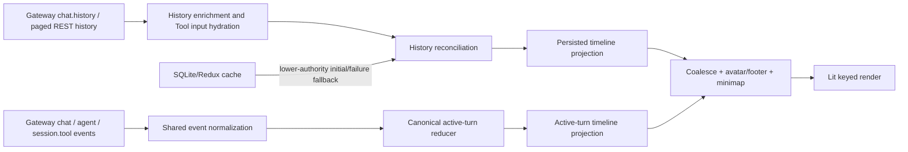

# Chat Message Flow Review

## Status

- Review date: 2026-07-26.
- Reviewed range: the latest five JustDo commits at review time:
  - `84baf8e9 fix(lint): eliminate source warnings`
  - `59dfb2cf fix(engine): allow proxy-compatible network access`
  - `cc83af2a fix(ui): keep active processes outside summaries`
  - `74a13463 fix(cowork): unify tool status presentation`
  - `e0619c4d feat(cowork): refactor chat message timeline`
- OpenClaw reference checkout: `../openclaw`.
- OpenClaw reference commit/tag: `e085fa1a3f`, `v2026.6.11`.
- Scope: message submission, Gateway event handling, live transcript state,
  persisted history reconciliation, SQLite/Redux caching, timeline projection,
  and rendering.
- This is a review and repair handoff. No production source was changed as part
  of the review.
- Focused verification passed:
  - `src/shared/openclaw/agentEvent.test.ts`
  - `src/renderer/libs/openclaw-chat/model/agent-event-reducer.test.ts`
  - `src/renderer/libs/openclaw-chat/model/history-reconciler.test.ts`
  - `src/renderer/libs/openclaw-chat/model/project-history-timeline.test.ts`
  - `src/renderer/libs/openclaw-chat/gateway/chat-controller.test.ts`
  - Result: 5 test files, 78 tests passed.

## Implementation Progress

Implemented on 2026-07-26:

- P0.1: `chat` side effects are gated by canonical reducer admission, with
  explicit selected-session external-final handling and adversarial controller
  tests.
- P0.2: transport reconnect is separate from business terminal state. Active
  runs survive disconnect, reconcile history after reconnect, and are
  interrupted only after `sessions.list` authoritatively reports no active
  run.
- P0.3: Tool input hydration resolves the selected session through its agent
  `sessions.json`, reads only that transcript and same-identity reset/backup
  artifacts, and uses asynchronous line streaming.
- P1.1/P1.3/P2.3: history keys use `__openclaw.id/seq`, session ID rotations
  invalidate in-flight history across every enrichment await, and compatible
  mid-run events backfill missing turn identity.
- P1.2: all optimistic-tail preservation, concurrent stale-response detection,
  regressive-tail rejection, active-run admission, materialized-fallback
  protection, catch-up scheduling, and settled active-turn takeover decisions
  now live in `history-reconciler`; `loadHistory()` is an I/O coordinator.
- P1.4: Goal progress, live timeline rendering, and final-message Thinking
  preservation now derive solely from the canonical active turn. Retired
  Thinking/Tool/Content overlay storage, merge helpers, permissive suffix
  matching, and missing-sequence display fallback have been removed.
- P1.5: Main and Renderer now share the pure message-domain admission and Tool
  normalization core. Main routes `chat`, `agent`, and `session.tool` frames
  through the shared normalizers, applies session/run/lifecycle/sequence
  admission before SQLite or IPC effects, retains bounded terminal run
  tombstones, and has a shared adversarial parity corpus.
- P1.6: stale successful message subscriptions are explicitly unsubscribed.
- P1.7: Main IPC and direct REST requests now
  return one bounded page at a time. Renderer initially loads the latest 250
  messages, preserves `nextCursor` in `ChatState`, requests older pages when
  paused scrolling approaches the top, and never retires the cursor because of
  a renderer-side message/byte threshold. The existing paused-scroll anchor
  preserves position while a page is prepended. Controller history is retained
  as immutable older-page chunks plus a replaceable recent reconciliation
  chunk; older-page admission no longer copies the accumulated transcript, and
  whole-history flattening occurs only for explicit consumers such as export.
- P1.8 (windowing portion): projection, minimap construction, and Lit rendering
  consume a 750-message sliding window with a 250-message step. Users can move
  backward and forward through every loaded message, including 100,000-message
  transcripts, while the DOM-facing input remains bounded.
- P1.8 (incremental portion): persisted timeline rows, avatar/footer state, and
  minimap entries are cached by persisted projection identity. A stream paint
  projects only the active tail, the final persisted/active summary seam, and
  the final minimap entry. Lit renders stable persisted rows and active rows as
  separate keyed segments instead of rebuilding one combined row array.
- P2.1: `JustDoChatWrapper` now converts the selected Redux/SQLite message
  snapshot and admits it to `ChatController` as `sqlite-fallback` before the
  Gateway history request. The fallback is cached per session, remains visible
  when Gateway history fails, is rejected after Gateway authority is
  established, and cannot replace an active live turn. Focused coverage also
  verifies that a 100,000-message fallback is not truncated.
- P2.2: lifecycle generation is now documented and tested as an optional
  discriminator only. Renderer admission continues when the field is absent
  and rejects a mismatch only when both the active run and event carry it;
  session key/session ID, run ID, sequence, tombstones, history generation,
  and OpenClaw's server-side stale-lifecycle suppression remain the actual
  isolation guarantees.
- P2.4: expanded process summaries now retain disclosure state and keyboard
  focus across a correlatable live-to-history takeover. A short-lived tracker
  matches the unique authoritative summary by run ID, Tool call ID, stable
  process item ID, or exact Thinking content, and rejects ambiguous matches.
  Its disclosure identity includes session key, backing session ID, and history
  generation, so a rotation/reset cannot inherit state from the old transcript.
- Post-review history hardening: an IPC page failure now falls through to the
  loopback REST endpoint. A limited RPC snapshot cannot truncate a larger
  SQLite fallback unless stable transcript identity proves a safe overlapping
  tail merge. Existing paging cursors survive a transient paged-history
  failure. Older-page loading skips consecutive hidden/duplicate pages in
  bounded eight-page batches and automatically schedules the next batch until
  it adds a visible message or exhausts the cursor. A wider RPC recent snapshot
  removes stable-identity overlap from already loaded older chunks before
  replacing the recent chunk.

Still outstanding from the full multi-phase program:

- Add the Electron 10,000-message stream benchmark and visual evidence.
  Chunk-native storage and pure window traversal cover 100,000 messages, and a
  10,000-row pure projection regression verifies that active-only revisions do
  not reread persisted message roles.

## Executive Assessment

The refactor is directionally correct. It introduced a canonical live
transcript, explicit history reconciliation, run tombstones, optimistic
history-tail ownership, flat timeline projection, keyed rendering, render
scheduling, and Lit-owned scroll behavior.

The remaining system is not yet a single message flow. It contains multiple
state machines that consume the same Gateway events and can disagree:

1. Main-process `OpenClawRuntimeAdapter` state and SQLite/Redux effects.
2. Renderer `ChatController.state.transcript`.
3. Renderer persisted `chatMessages`.
4. Main and Renderer still maintain separate protocol state machines even
   though Renderer now has only one live display state machine.

The highest-priority work is therefore correctness at the boundaries between
these state machines, followed by stable history identity and long-history
performance. Splitting large files should happen after those invariants are
made explicit and tested.

## Current End-to-End Flow

### First turn

1. `CoworkView` creates a temporary Redux session and optimistic user message.
2. `JustDoChatWrapper.setPendingUserMessage()` creates a renderer-side
   optimistic prompt.
3. `coworkService.startSession()` calls Main through IPC.
4. Main creates/persists the JustDo session and calls
   `OpenClawRuntimeAdapter.startSession()`.
5. `OpenClawRuntimeAdapter` calls Gateway `chat.send`, tracks the run, writes
   streaming cache messages to SQLite, and emits Redux-facing IPC events.
6. Independently, renderer `ChatController` connects to Gateway, promotes the
   temporary session key to the persisted session key, receives the same live
   Gateway events, and renders its own transcript.

### Later turns

1. `CoworkView` calls `JustDoChatWrapper.sendMessage()`.
2. Renderer `ChatController.sendMessage()` sends directly to Gateway.
3. Renderer owns the optimistic prompt and live transcript.
4. Main's separate Gateway connection also observes the run, creates an
   external/visible active turn when needed, and reconciles SQLite after
   `session.message` or terminal events.

### Renderer history and live composition



### Relevant files

- `src/renderer/features/cowork/components/CoworkView.tsx`
- `src/renderer/features/cowork/components/JustDoChatWrapper.tsx`
- `src/renderer/libs/openclaw-chat/gateway/chat-controller.ts`
- `src/renderer/libs/openclaw-chat/model/agent-event-reducer.ts`
- `src/renderer/libs/openclaw-chat/model/chat-transcript-state.ts`
- `src/renderer/libs/openclaw-chat/model/history-reconciler.ts`
- `src/renderer/libs/openclaw-chat/model/project-history-timeline.ts`
- `src/renderer/libs/openclaw-chat/model/project-turn-items.ts`
- `src/renderer/libs/openclaw-chat/components/justdo-chat.ts`
- `src/main/engine/openclaw/openclawRuntimeAdapter.ts`
- `src/main/ipc/openclaw/history.ts`

## Confirmed OpenClaw Protocol Semantics

The following were checked against `../openclaw` at `v2026.6.11`:

1. Agent payload `seq` is the canonical per-run sequence.
   `src/infra/agent-events.ts` stores `seqByRun` and increments it for every
   emitted Agent event.
2. The outer Gateway WebSocket frame `seq` is a transport sequence. It must not
   be compared with the Agent payload sequence.
3. `aseq` is the name used by OpenClaw's condensed WebSocket log summary for the
   Agent payload sequence. It is not the primary live payload field in upstream
   source. JustDo's `aseq` fallback may remain narrowly for bundled/runtime
   compatibility, but it should be instrumented and eventually removed if
   runtime evidence shows it is unused.
4. `session.tool` mirrors Tool events to session-scoped subscribers that may
   not know the run ID in advance. Run-scoped `agent` and session-scoped
   `session.tool` deliveries can overlap depending on recipient registration.
   Deduplication by `runId + Agent seq` is appropriate.
5. OpenClaw paged session history attaches stable transcript metadata under
   `message.__openclaw`, including `seq` and often `id`.
6. OpenClaw registers session message subscriptions as a many-to-many mapping.
   A single connection can remain subscribed to multiple session keys unless
   each key is explicitly unsubscribed.

## Priority 0: Correctness and Data-Boundary Fixes

### P0.1 Canonical reducer rejection does not gate chat side effects

Location:

- `src/renderer/libs/openclaw-chat/gateway/chat-controller.ts`, around
  `handleEvent()` lines 1089-1095.

Current behavior:

```ts
reduceChatEvent(this.state.transcript, payload, this.transcriptDependencies);
this.handleChatEvent(payload);
```

`reduceChatEvent()` can reject an event because of:

- session mismatch;
- run mismatch;
- session ID mismatch;
- lifecycle generation mismatch.

The result is ignored. The legacy/controller handler still runs and may:

- append to `state.chatMessages`;
- clear `chatSending`, Tool, Thinking, or stream state;
- end the current run;
- schedule history reloads.

This is not merely a diagnostic compatibility issue because `chatMessages`
feeds the production persisted timeline.

Repair direction:

1. Make chat event routing return an explicit classification, for example:
   - `applied-active-run`
   - `external-session-message`
   - `ignored-session`
   - `ignored-run`
   - `ignored-lifecycle`
2. Only the first two classifications may produce visible/persisted side
   effects.
3. Distinguish a legitimate external `chat.final` for the selected session
   from a stale final for an old run.
4. Add controller-level tests asserting that rejected events leave every
   production state surface unchanged.

Acceptance tests:

- A final with the right run ID but wrong session ID changes nothing.
- A final from a stale lifecycle changes nothing.
- A final from another active run does not terminate the selected active run.
- A legitimate injected/external final with no active run is appended once.

### P0.2 A transient WebSocket disconnect is treated as a business abort

Location:

- `src/renderer/libs/openclaw-chat/gateway/chat-controller.ts`,
  `handleClose()` around lines 1063-1086.

Current behavior:

- A running active turn is immediately reduced to `aborted`.
- A terminal run tombstone is created.
- `chatSending` is cleared.
- The Gateway client then automatically reconnects.

If the OpenClaw run continues during a short connection interruption, future
events for the same run are rejected by the tombstone. The UI can show an
interruption even though the task is still running and will stop receiving live
progress until history or `chat.final` catches up.

Repair direction:

1. Represent transport loss separately from run terminal status:
   `connected`, `reconnecting`, or `suspended`.
2. Preserve the active turn without creating a terminal tombstone on close.
3. After reconnect:
   - refresh `sessions.list` or an equivalent authoritative run-status source;
   - refresh current history;
   - resume accepting the same run if it is still active;
   - terminalize only if Gateway confirms no active run and history establishes
     the final state.
4. A user abort, Gateway terminal error, or authoritative terminal event may
   still create a tombstone immediately.

Acceptance tests:

- Disconnect during a running Tool, reconnect, then receive a later event for
  the same run; the Tool continues updating.
- Disconnect followed by authoritative completed history retires the live turn.
- Disconnect followed by confirmed no-active-run with no final output produces
  one interruption state, not duplicate terminal rows.

### P0.3 Tool input lookup ignores the requested session boundary

Location:

- `src/main/ipc/openclaw/history.ts`
  - `collectSessionJsonlFiles()` around line 108.
  - `GetToolInputs` handler around lines 184-220.

Current behavior:

- The IPC receives a `sessionKey`.
- The handler does not use it to resolve a transcript.
- It recursively enumerates all JSONL files under the OpenClaw agents state
  directory.
- It synchronously reads entire candidate files on Electron's Main thread.
- It returns the first matching Tool call IDs.

Risks:

- A Tool call ID collision can hydrate parameters from another session.
- The declared sensitive-data boundary is not actually session-scoped.
- Large histories can block the Main process.
- Work scales with the entire OpenClaw state directory rather than the selected
  session.

Repair direction:

1. Resolve `sessionKey` through OpenClaw session state to the exact agent,
   session ID, and transcript path.
2. Read only the current transcript and explicitly allowed reset/archive
   fallback for that same session.
3. Use asynchronous streaming reads or a bounded index rather than
   `fs.readFileSync`.
4. Prefer an OpenClaw message/tool-input RPC if a future version exposes one.
5. Treat a missing/rotated session as unavailable rather than scanning globally.

Acceptance tests:

- Two sessions containing the same synthetic Tool call ID never cross-hydrate.
- The handler does not read unrelated transcript files.
- A large transcript lookup does not synchronously block the event loop.
- Reset/archive fallback remains limited to the same session identity.

## Priority 1: History Identity and Reconciliation

### P1.1 Stable OpenClaw transcript identity is ignored

Location:

- `src/renderer/libs/openclaw-chat/model/history-reconciler.ts`
  - `durableMessageId()` around lines 48-57.
  - `deterministicHistoryKey()` around lines 59-70.
- `src/renderer/libs/openclaw-chat/model/project-history-timeline.ts`,
  history key construction around line 235.

Current behavior:

`durableMessageId()` checks only top-level:

```ts
entryId;
messageId;
id;
seq;
```

OpenClaw paged history supplies the stable transcript identity under:

```ts
message.__openclaw.id;
message.__openclaw.seq;
```

Messages therefore commonly fall back to:

```text
role + visible text hash + array index
```

Consequences:

- Loading an older page changes indexes and keys for newer messages.
- Compaction or insertion near the beginning can replace most keyed DOM nodes.
- Text updates change identity.
- Live-to-history handoff loses disclosure/focus state more often.
- Regressive-history detection compares unstable display identity and can
  accept a shorter stale response when text changed.

Repair direction:

1. Introduce one shared `readTranscriptIdentity(message)` helper.
2. Identity priority should be:
   - `__openclaw.id`
   - `__openclaw.seq`
   - documented top-level durable IDs
   - a last-resort deterministic fallback
3. Use the helper consistently in:
   - keyed history rendering;
   - regressive/stale history detection;
   - optimistic replacement detection;
   - pagination merging;
   - active/history takeover where correlation is possible.
4. Do not include the current array index in a fallback key unless there is no
   other choice. If it is required, scope it to a stable page/window identity.

Acceptance tests:

- Prepending an older page does not change the keys of the existing page.
- Updating the text of the same `__openclaw.seq` keeps its key.
- A shorter prefix with the same transcript IDs is rejected as regressive.
- A compaction/reset with a new session ID is accepted as a new generation.

### P1.2 History authority is duplicated across two heuristic layers

Implementation status: completed on 2026-07-26. The listed controller helpers
were removed. `reconcileHistory()` now receives the request-start snapshot,
current snapshot, active-run state, source authority, generation/session
identity, and visibility policy. It returns the accepted message set,
optimistic-tail count, active-turn takeover outcome, rejection reason, and
deferred catch-up decision.

Original review finding: `ChatController.loadHistory()` applied multiple large
helper heuristics:

- `preserveOptimisticTailMessages`
- `collectLateOptimisticTailMessages`
- `isStaleHistoryRefresh`
- `isRegressiveHistoryRefresh`

It then called the separate `reconcileHistory()` state machine.

This makes it difficult to state which layer owns history authority and why a
response was rejected. It also relies heavily on role/text/timestamp
similarity.

Repair direction:

1. Move all history admission into one reconciler with explicit inputs:
   request generation, session identity, source authority, transcript
   watermarks, active run, and optimistic message IDs.
2. Have the reconciler return:
   - accepted messages;
   - preserved optimistic tail;
   - active turn takeover decision;
   - rejection reason;
   - next catch-up action.
3. Keep `loadHistory()` as an I/O coordinator rather than a second state
   machine.

### P1.3 Session ID can change during multi-stage history loading

`loadHistory()` first obtains session metadata via RPC, then independently
loads paged REST history, enriches compaction markers, and hydrates Tool input.
A session reset between these awaits can associate a new history payload with
an earlier session ID until the next RPC refresh.

Repair direction:

- Carry a session/history identity from the paged endpoint when possible.
- Observe `sessions.changed` for the selected session.
- Increment history generation immediately when session ID rotation is
  detected.
- Revalidate session ID and generation after every asynchronous enrichment
  phase, not only the session key.

## Priority 1: Remove Renderer Dual State

### P1.4 Retired overlay arrays remain a second live state machine

Location:

- `src/renderer/libs/openclaw-chat/gateway/chat-controller.ts`
  - `chatThinkingMessages`
  - `chatToolMessages`
  - `chatStreamSegments`
  - `chatStream`
  - `chatThinkingStream`
- `src/renderer/features/cowork/components/goalRunProgress.ts`

The canonical production timeline reads `transcript.activeTurn`, but the
controller still updates the old fields for every event. Goal progress still
uses those fields, so they cannot currently be deleted.

The old adapter also retains permissive suffix matching:

```ts
this.state.sessionKey.endsWith(eventSession);
```

This contradicts the explicit alias normalization in
`eventMatchesTranscriptSession()`.

Repair direction:

1. Rewrite Goal progress as a pure selector over:
   - `transcript.activeTurn`;
   - `compactionInFlight`;
   - connection/reconnect status.
2. Move `startedAt`, current Tool name, Tool count, and phase derivation to
   canonical selectors.
3. Delete old overlay fields and all update/merge helpers.
4. Delete the `endsWith()` compatibility match.
5. Keep only persisted history, canonical live transcript, and transport state.

Expected benefit:

- One event state machine instead of two.
- Smaller `ChatController`.
- No disagreement between timeline and Goal UI.
- Less allocation and notification work for every stream event.

## Priority 1: Main/Renderer Parity

### P1.5 Main and Renderer parse the same Gateway protocol differently

Implementation status: completed for the safer immediate architecture. Both
Gateway connections remain, but `src/shared/openclaw/messageDomain.ts` now owns
managed-session aliases, run/session/lifecycle admission, Agent sequence
rejection, Tool field aliases, structured output/error detection, and monotonic
Tool terminal status. Main converts admitted events to SQLite/IPC effects;
Renderer converts them to the active timeline. The shared corpus covers
duplicate cross-channel delivery, sequence gaps, result-before-start Tool
events, and legacy Tool field aliases. Main keeps an explicit compatibility
fallback for older Gateway frames without inner Agent sequence, preferring the
outer frame sequence before a process-local monotonic sequence.

Location:

- Renderer:
  - `src/shared/openclaw/agentEvent.ts`
  - `src/renderer/libs/openclaw-chat/model/agent-event-reducer.ts`
- Main:
  - `src/main/engine/openclaw/openclawRuntimeAdapter.ts`
  - `handleChatEvent(payload, _seq)`
  - `handleAgentEvent(payload, _seq)`

Original review finding: Main received the outer frame sequence but
intentionally ignored it, and did not use the shared normalizer/admission
rules. Renderer had ordered run/session admission while SQLite/Redux
persistence still followed older rules.

Repair direction:

1. Extract a shared, pure message-domain core:
   - event normalization;
   - session alias normalization;
   - run admission;
   - Tool normalization;
   - terminal rules;
   - sequence/tombstone behavior.
2. Renderer converts domain state to timeline models.
3. Main converts domain transitions to SQLite and IPC effects.
4. Run the same event corpus through both adapters and assert equivalent
   semantic results.

Medium-term architectural decision:

- Either retain separate Main and Renderer Gateway connections but share the
  canonical core, or
- move the selected-session event hub into Main and stream normalized events to
  Renderer over a bounded IPC channel.

The second option removes duplicate Gateway connections and keeps credentials
out of Renderer, but it is more invasive and requires careful high-frequency
IPC batching. The first option is the safer immediate step.

## Priority 1: Subscription Correctness

### P1.6 Concurrent session switching can leak server subscriptions

Location:

- `src/renderer/libs/openclaw-chat/gateway/chat-controller.ts`,
  `syncMessageSessionSubscription()` around lines 516-550.

The local sequence guard prevents an old request from updating
`subscribedMessageSessionKey`, but it cannot undo a stale subscribe that already
succeeded on the server.

Example:

1. Subscribe A request is in flight.
2. UI switches to B.
3. B subscription succeeds.
4. A subscription also succeeds, but its local completion is ignored by the
   sequence guard.
5. The connection remains subscribed to both A and B on OpenClaw.

This is confirmed possible by OpenClaw's many-to-many session message
subscriber registry.

Repair direction:

- Serialize unsubscribe/subscribe transitions, or
- after a stale subscribe resolves, explicitly unsubscribe the session it just
  subscribed, or
- maintain a desired-subscription set and reconcile server state to exactly
  that set.

Also reject or conservatively handle `session.message` events without a
session key; leaked subscriptions otherwise cause reloads of the currently
selected session.

Acceptance tests:

- Delayed A subscribe followed by B switch leaves only B subscribed.
- A stale completion triggers cleanup.
- Events for A never reload B.

## Priority 1: Long-History Performance

### P1.7 Paged history is eagerly loaded in full and assembled quadratically

Locations:

- `src/main/ipc/openclaw/history.ts`, around line 166.
- `src/renderer/libs/openclaw-chat/gateway/chat-controller.ts`, around line 1365.

Both paths prepend every page using:

```ts
messages = [...pageMessages, ...messages];
```

This repeatedly copies the accumulated history. The IPC path then transfers the
entire result to Renderer in one payload.

Implementation progress:

- Completed: one-page Main IPC/direct REST contract, initial latest-page load,
  controller-owned cursor, upward-scroll fetch, repeated-cursor guard, and
  unbounded cursor reachability. Renderer thresholds never discard loaded
  messages or make older pages unreachable. `ChunkedMessageHistory` retains
  older pages without rebuilding a flat loaded-history array; recent history
  reconciliation replaces only the newest chunk, and export explicitly
  materializes all loaded chunks.
- Remaining: Electron long-history performance evidence is tracked with P1.8.

Repair direction:

1. Initially load only the latest bounded window, for example 100-300 visible
   messages.
2. Preserve OpenClaw `nextCursor` in controller state.
3. Fetch older pages on upward scroll.
4. Store pages as chunks or prepend once after collection; do not repeatedly
   spread the accumulated array.
5. Bound the DOM/projection window independently from the loaded transcript;
   never use a renderer threshold to discard the only route to older history.

### P1.8 A stream paint still performs O(history) projection work

Location:

- `src/renderer/libs/openclaw-chat/components/justdo-chat.ts`, around lines
  1723-1732.

Persisted timeline construction is cached, but each active-turn paint still:

- spreads persisted and active arrays;
- coalesces the entire visible timeline;
- recomputes all avatar/footer rows;
- recomputes the full minimap;
- presents the complete row list to Lit `repeat`.

The DOM is keyed, but the JavaScript projection path is still proportional to
the full history for each stream frame.

Repair direction:

1. Cache persisted:
   - timeline rows;
   - assistant turn/avatar state;
   - minimap entries.
2. Incrementally update only:
   - the active timeline tail;
   - the last persisted/active seam summary;
   - the last minimap entry.
3. Add windowed rendering for old messages.
4. Preserve semantic anchors when rows enter/leave the render window.

Performance acceptance:

- Benchmark at 10,000 history messages and 1,000 Tool items.
- A Content or Thinking stream update should be approximately independent of
  total history length.
- DOM node count should remain bounded.
- Paused-scroll anchoring must remain stable while older pages are prepended.

Implementation progress:

- Completed: a 750-message render/projection/minimap window with 250-message
  overlap, bidirectional traversal, jump-to-latest, semantic-anchor retention,
  and a 100,000-message traversal test.
- Completed: persisted row/avatar/footer/minimap caching, incremental
  persisted/active seam composition, last-entry-only minimap updates, and
  separate keyed Lit segments. A 10,000-message regression asserts that 100
  active Content revisions do not reread old persisted roles.
- Remaining: Electron performance and visual evidence.

## Priority 2: Missing or Misleading Capabilities

### P2.1 SQLite initial/failure fallback

Completed. `JustDoChatWrapper` reads the selected session's already-loaded
Redux snapshot, converts `CoworkMessage` values to the Gateway display shape,
and calls `ChatController.admitFallbackHistory()` before connecting or
switching. The controller records history authority per session:

- SQLite is rendered immediately while Gateway history is loading.
- Gateway history replaces the fallback as one reconciled snapshot and becomes
  permanently higher authority for that controller/session.
- A later Redux/SQLite update cannot overwrite Gateway-backed state.
- An active canonical turn rejects fallback admission, so cached history cannot
  retire or prune the live tail.
- Gateway load failure leaves the existing fallback visible.
- If cursor paging is temporarily unavailable, the bounded RPC response is
  treated as a limited recent snapshot. It may update a larger fallback only
  when durable identities prove a safe overlap; otherwise the complete fallback
  remains authoritative and visible.
- If older pages are already loaded, a wider RPC recent snapshot removes its
  durable-identity overlap from those chunks before replacing the recent chunk,
  so counts, rendering, and exports remain duplicate-free.

The fallback uses durable SQLite message IDs through the normal transcript
identity reader. It is retained without a renderer-side count cap; controller
coverage verifies 100,000 messages remain available across session switches and
after a paged-history failure followed by a 1,000-message RPC snapshot.

### P2.2 Lifecycle generation is optional in Renderer

OpenClaw stores lifecycle generation as internal, non-enumerable event metadata
and intentionally avoids serializing it in public Agent payloads. Chat payloads
also do not normally contain it.

Completed as a contract correction. JustDo retains `lifecycleGeneration` for
forward compatibility and for event shapes that explicitly serialize it, but
the shared message-domain classifier treats it only as an optional
discriminator:

- absence never blocks an otherwise valid event;
- a mismatch is rejected only when both sides provide non-null values;
- renderer correctness does not depend on this field being present.

Actual isolation relies on session key/session ID, run ID, canonical Agent
sequence, bounded terminal tombstones, history request generation, and
OpenClaw's server-side stale-lifecycle suppression. A future Gateway protocol
may promote a documented serializable generation without changing this
nullable contract.

### P2.3 Missing identity backfill for turns joined mid-run

If Renderer first observes a mid-run Tool/assistant event without a session ID,
the active turn starts with `sessionId = null`. A later lifecycle event may
contain a session ID, but `admitTurn()` returns the existing turn without
backfilling missing identity fields.

Repair direction:

- When an admitted event has a compatible non-null session ID or generation and
  the turn field is null, bind it once.
- Never overwrite a conflicting non-null identity.

### P2.4 Live-to-history disclosure and focus takeover

Completed. `ProcessSummaryTakeoverTracker` remembers only the currently
expanded summary and carries it across one correlatable projection change.
Persisted projection now preserves explicit history `runId`/`run_id` metadata.
Correlation scores use:

- exact summary key;
- explicit shared run ID;
- Tool call ID;
- stable process item ID;
- exact normalized Thinking text.

The highest match must be unique; ties and unrelated summaries close normally
instead of transferring UI state incorrectly. `<justdo-chat>` renders the
matched history summary expanded, synchronizes its new key after the update,
and restores focus to the replacement summary button when the old button had
focus. Session changes clear the tracker.

## Maintainability Work After Correctness

Current approximate sizes at review time:

- `chat-controller.ts`: 3,407 lines.
- `justdo-chat.ts`: 2,546 lines.
- `build-chat-items.ts`: 1,234 lines.

Suggested extraction boundaries:

### `ChatController`

- `gateway-session-subscription.ts`
- `history-loader.ts`
- `history-enrichment.ts`
- `chat-event-router.ts`
- `message-send-coordinator.ts`
- `compaction-controller.ts`
- pure canonical transcript core under `src/shared/` where possible

### `justdo-chat`

- timeline composition/cache
- minimap controller
- search controller
- Mermaid enhancement controller
- footer/avatar projection
- custom element host containing only properties, subscriptions, and top-level
  render composition

Do not split by arbitrary line count. Extract around state ownership and
testable invariants.

## Recommended Repair Sequence

### Phase 1: Safety and terminal correctness

1. Gate all chat side effects on reducer/event-routing classification.
2. Replace disconnect-as-abort with reconnect/suspended reconciliation.
3. Scope Tool input lookup to the exact session transcript and remove sync
   global scanning.
4. Add the associated adversarial tests.

### Phase 2: Stable identity and reconciliation

1. Adopt `__openclaw.id/seq`.
2. Consolidate history admission into one reconciler.
3. Add reset/session-ID generation checks across all awaits.
4. Stabilize live-to-history takeover keys.

### Phase 3: One renderer state machine

1. Move Goal progress to canonical selectors.
2. Delete retired overlay arrays and handlers.
3. Delete permissive suffix matching.
4. Simplify notification types around canonical revisions.

### Phase 4: Main/Renderer parity

1. Share event normalization and run/session admission.
2. Define domain transitions and Main persistence effects.
3. Add a shared event-corpus parity suite.

### Phase 5: Long-history scalability

1. Cursor-based incremental history. Completed.
2. Timeline windowing without transcript truncation. Completed.
3. Chunked history storage. Completed.
4. Persisted seam/minimap caching. Completed.
5. Electron visual and performance evidence.

## Required Test Matrix

### Event ordering

- Duplicate `agent` and `session.tool` delivery with the same run/seq.
- Agent sequence gaps caused by server text coalescing.
- Result-before-start Tool events.
- Late partial after terminal result.
- `chat.final` before/after lifecycle end.
- `chat.final` without a renderable message.

### Session and run isolation

- Explicit managed session aliases.
- Same suffix but unrelated session keys.
- Missing session key with matching run.
- Mid-run attach followed by identity backfill.
- Temporary-session promotion.
- Concurrent external and selected-session runs.

### Reconnect

- Short transport disconnect with continuing run.
- Gateway restart/session ID rotation.
- Reconnect with completed history.
- Reconnect with active Tool.
- Reconnect with no terminal event.

### History

- `__openclaw.seq/id` stability.
- Older-page prepend.
- Consecutive hidden/duplicate pages before a visible older page.
- More than eight consecutive duplicate pages continue automatically in bounded
  batches without another scroll event.
- Paged IPC failure falling through to loopback REST.
- Limited RPC snapshot cannot truncate a complete 100,000-message fallback.
- RPC recent snapshot does not duplicate identities already loaded in older pages.
- Stale shorter prefix.
- Changed content under the same transcript ID.
- Compaction/reset generation.
- Optimistic user and assistant takeover.
- SQLite fallback never retiring active live state.

### Security and filesystem

- Tool input lookup cannot leave selected-session scope.
- Reset/archive fallback remains in scope.
- No synchronous whole-state scan.
- Missing session path returns a bounded error.

### Performance and UI

- 10,000-message stream-update benchmark.
- Bounded DOM/window size.
- Paused-scroll preservation while prepending history.
- Summary disclosure/focus retention across history takeover.
- Search and Mermaid work does not scan the transcript after unrelated stream
  paints.
- Automated Electron visual proof for Thinking, Tool, Content, failure,
  compaction, reconnect, and long history.

## Definition of Done

The message-flow repair should not be considered complete until:

1. One canonical run/session state machine decides whether an event is admitted.
2. Rejected events cannot mutate any visible or persisted state.
3. Transport disconnect does not fabricate a business terminal state.
4. Tool input reads are strictly session-scoped.
5. History identity is based on OpenClaw transcript metadata.
6. Main and Renderer agree on ordering, Tool, and terminal semantics.
7. Renderer no longer maintains the retired overlay state machine.
8. A live update does not perform work proportional to the full transcript.
9. History is incrementally pageable and DOM size is bounded.
10. The reconnect, identity, subscription-race, security, and long-history test
    matrices pass.
