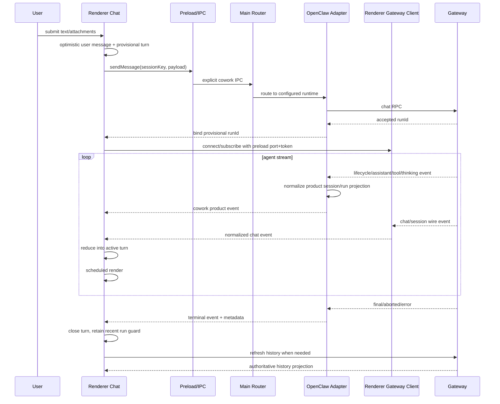

# Chat 消息流端到端审计

> 文件名保留历史审计日期以维持已有链接；本文已按 `v2026.8.12` 的实际代码重新核对，不再描述 2026-07-26 时的临时实现。

## 1. 审计范围与结论

本文审计一次 Cowork 对话从用户提交、Main 进程受理、OpenClaw Gateway 执行、事件归一化、Renderer 投影，到历史重载与终态收敛的完整链路。重点不是组件外观，而是回答四个正确性问题：

1. 一条事件属于哪个会话和哪次 run；
2. 增量、快照和替换型内容是否会被重复拼接；
3. abort、error、重连和迟到事件是否会污染下一轮；
4. 实时视图最终是否能与 Gateway 历史一致。

当前实现已经形成“Gateway 为执行与历史真源、Main 负责产品命令/运行投影、Renderer 集中式 Gateway client 负责聊天数据面与可重建投影”的闭环。旧版最危险的全局流状态、按文本猜测事件归属、终态后继续追加、单纯 append delta 等问题均已由 session/run/sequence/lifecycle 约束替代。剩余风险主要集中在 Main/Renderer 两条 Gateway 消费路径的契约一致性、外部 Gateway 协议升级、SQLite 降级历史信息量较少，以及超大工具输出只保留有限实时视图。

## 2. 参与模块

| 层              | 主要代码                                                    | 职责                                                      |
| --------------- | ----------------------------------------------------------- | --------------------------------------------------------- |
| Lit 对话组件    | `src/renderer/libs/openclaw-chat/components/justdo-chat.ts` | 提交输入、订阅流、触发历史加载、发布渲染                  |
| Renderer 控制器 | `gateway/chat-controller.ts`                                | 维护当前会话、发送状态、历史代次和 Gateway 调用           |
| 规范化状态      | `model/chat-transcript-state.ts`                            | 保存持久消息、活动 turn、近期 run、revision               |
| 事件归约        | `model/agent-event-reducer.ts`                              | 将规范化事件确定性地归并为 thinking/tool/content/terminal |
| 历史协调        | `model/history-reconciler.ts`                               | 校验请求代次、合并历史并接管活动过程                      |
| Main 路由       | `src/main/engine/cowork/coworkEngineRouter.ts`              | 选择运行时并转发统一事件                                  |
| OpenClaw 适配   | `src/main/engine/openclaw/openclawRuntimeAdapter.ts`        | Gateway RPC、事件映射、run 生命周期和历史恢复             |
| Main 广播       | `src/main/engine/cowork/coworkRuntimeForwarder.ts`          | 将 runtime 事件广播给 Renderer 窗口                       |
| 共享契约        | `src/shared/openclaw/agentEvent.ts`、`messageDomain.ts`     | 定义事件、会话匹配和键归一化                              |

## 3. 正向数据流

提交前 Renderer 校验当前 session、发送状态和输入；活动 turn 可以先使用 `justdo-` 前缀的临时 run id。Gateway 接受请求并返回真实 run id 后，`bindAssistantTurnRunId` 只允许把该临时 id 绑定一次，并同步更新已创建的 turn item，避免接受响应与首个流事件先后顺序不同导致双 turn。

## 4. 身份模型

### 4.1 会话身份

消息域同时携带 `sessionKey` 和可选 `sessionId`。托管会话可能以 `justdo:<id>` 或 `agent:<agent-id>:justdo:<id>` 出现；`normalizeMessageSessionKey` 只承认这组明确别名，不使用任意后缀匹配。这样既兼容 OpenClaw 的 agent 前缀，又不会把两个偶然同尾的 session 合并。

切换会话时 `resetChatTranscriptState` 会清空持久消息、活动 turn 和近期 run，增加 `historyGeneration` 与 `revision`。异步历史结果只有在 session key、session id 与 generation 仍匹配时才能落地。

### 4.2 Run 身份

每个 Assistant turn 持有：

- `runId`：本次执行的主键；
- `sessionId` 与 `sessionKey`：所属会话；
- `lifecycleGeneration`：Gateway 生命周期实例，隔离重启前后的同名事件；
- `lastAgentSeq`：已接收的最大序号；
- `status`：`running`、`final`、`aborted` 或 `error`。

事件必须同时通过会话、run、lifecycle 和 sequence 判断。终态 run 被放入 `recentRuns`，最多保留 24 个、保留 5 分钟，用于吸收网络缓冲中的重复或迟到事件。它不是历史存储，超限或过期会被清理。

### 4.3 Item 身份

活动 turn 内部不是一个大字符串，而是有序 item：

| 类型       | 标识与状态                         | 数据语义                       |
| ---------- | ---------------------------------- | ------------------------------ |
| `thinking` | item id、seq、running/completed 等 | reasoning 的独立可见块         |
| `tool`     | `toolCallId`、名称、状态           | 输入、部分输出、最终输出或错误 |
| `content`  | item id、sourceMode                | 助手回答的增量、快照或替换内容 |
| `terminal` | item id、aborted/error             | 没有自然回答终态时的明确结束行 |

`toolById` 是活动 turn 内的索引，避免每个部分输出都扫描完整时间线。

## 5. 内容合并规则

回答文本带有 `sourceMode`：

- `delta` 表示只包含新增字符，可追加到同一内容项；
- `snapshot` 表示截至当前的完整快照，必须比较或替换，不能无条件 append；
- `replaceable` 表示中间内容允许后续权威内容覆盖。

这些模式由协议适配层确定，Renderer reducer 只执行明确规则，不靠内容相似度猜测。思考文本和最终回答不会合并到同一 item。工具调用以 `toolCallId` 更新原 item；最终结果覆盖部分结果的状态，而不是创建重复的完成卡。

实时工具输出在 reducer 和投影层限制为 120,000 字符。部分输出超限时保留末尾并注明截断，历史显示路径按其自身投影规则截断。这一限制保护渲染内存，不等于 Gateway 或工具原始结果被删除。

## 6. 终态与异常收敛

### 6.1 正常完成

final 事件关闭活动 turn，补齐结束时间并完成仍在运行的适用 item。随后终态 run 进入近期集合。历史刷新可以把临时过程替换为 Gateway 返回的持久消息，但必须通过 generation 校验。

### 6.2 用户停止

停止操作经 Main/Adapter 发送 abort。Renderer 不把按钮点击当作 Gateway 已确认完成；收到 abort/终态事件后才将 turn 标记为 `aborted`，将仍运行的过程投影为 cancelled/interrupted，并显示终端行。这样“已请求停止”和“已经停止”不会混为一谈。

### 6.3 运行错误

错误既可能属于工具，也可能属于整次 run。工具错误落在对应 tool item；run 级错误生成 terminal item 并关闭 turn。已关闭 run 的普通增量被近期 run guard 丢弃，避免错误后又出现幽灵回答。

### 6.4 Gateway 断连或重启

连接状态与 run 状态分离。重连后通过 session/history 查询恢复权威消息；`lifecycleGeneration` 防止重启前缓存事件接入新生命周期。若 Gateway 历史不可用，可用 SQLite 消息作为 `sqlite-fallback` 显示，但 UI 和协调器仍保留来源差异，不能把降级数据假装成完整工具时间线。

## 7. 历史加载与实时接管

历史来源有三种：

- `gateway`：权威且能携带 OpenClaw 投影后的结构化内容；
- `sqlite-fallback`：本地持久消息降级视图；
- `optimistic`：尚未完成权威同步的本地提交状态。

历史窗口一次最多取 750 条，按 250 条步进扩展。每次请求捕获 `sessionKey`、`sessionId` 和 `historyGeneration`；响应到达时任何字段变化都会判为过期。历史协调器还要处理“请求期间活动 turn 已经开始或已经终态”的竞争，不能让较旧快照覆盖较新的实时状态。

`project-history-timeline.ts` 负责把持久消息投影为显示项，`project-turn-items.ts` 投影活动过程。二者使用一致的特殊工具识别规则，例如合法 `update_plan` 都作为独立计划项显示；无效输入仍作为普通工具调用保留，确保历史和实时不发生语义分叉。

## 8. 渲染与滚动背压

事件接收不直接对每个 token 强制渲染。`StreamRenderScheduler` 优先在 `requestAnimationFrame` 合并发布，无该 API 时退回 microtask；工具部分输出最多每 80ms 发布一次，终态调用 `flush()` 立即展示。

`ChatScrollController` 使用 `follow` 与 `paused` 两种模式：

- 距底部不超过 0.5px 时继续跟随；
- 用户离开底部后固定可见锚点，并累计未读 revision；
- 距顶部 160px 以内触发更早历史加载；
- DOM 高度变化由 `ResizeObserver` 修正锚点；
- “跳到最新”清除未读并恢复 follow。

因此流式更新不会强制把正在阅读历史的用户拉回底部，展开工具详情也不会导致视口跳动。

## 9. 已解决的旧审计问题

| 旧问题                         | 当前处理                                       |
| ------------------------------ | ---------------------------------------------- |
| 全局 assistant buffer 串会话   | 状态以当前 transcript session 与 turn 身份隔离 |
| 请求返回与首事件竞态产生双 run | provisional id 仅可受控绑定真实 run id         |
| 快照被当 delta 重复追加        | `sourceMode` 区分 delta/snapshot/replaceable   |
| abort 后迟到 token 继续显示    | terminal 状态与 `recentRuns` 去重/拒收         |
| 历史响应覆盖新会话             | `historyGeneration` 和会话双校验               |
| thinking 混入回答正文          | 独立 thinking item 和历史投影                  |
| 部分工具输出触发高频重排       | 80ms 工具节流、RAF 合并、终态 flush            |
| 读取历史时滚动位置漂移         | paused anchor 与 ResizeObserver 恢复           |

## 10. 当前边界与风险

1. Gateway 原生事件只能由 Main adapter 或集中式 Renderer chat gateway 层消费；升级 OpenClaw 时必须同步审查两条路径和补丁，不能把新字段直接透传到展示组件。
2. SQLite fallback 主要保证消息可读性，不保证恢复全部 reasoning、工具中间态和计划卡结构。
3. 120,000 字符是实时 UI 安全上限；需要查看完整产物时应依赖工具生成的文件或专用查看器。
4. Main 日志经过 `gatewayLogFilter.ts` 压缩。主日志缺少某个 delta 不能作为 Gateway 未发送的证据，应按 run/session/timestamp 对照 OpenClaw 原生 JSON 日志。
5. 组件仍包含较多编排职责。后续重构必须保持共享事件模型和 reducer 的确定性，不能重新在视图模板里组装协议状态。

## 11. 验证清单

代码变更至少应覆盖以下行为：

- 同一 session 的临时 run 与真实 run 绑定；
- 不同 session、session id、lifecycle generation 的事件被拒绝；
- 重复或倒序 sequence 不重复显示；
- delta、snapshot、replaceable 各自的合并行为；
- 工具 start/partial/result/error 的单卡收敛与截断；
- thinking 与 content 的独立顺序；
- final、abort、error 后迟到事件不复活 turn；
- 切换会话后旧历史响应无效；
- Gateway 历史与 SQLite fallback 的来源标记；
- 计划工具在实时和历史中的一致投影；
- paused 滚动、加载更早历史和跳到最新；
- 高频流更新合并与终态立即刷新。

对应测试主要位于 `src/renderer/libs/openclaw-chat/**/*.test.ts`、`src/main/engine/openclaw/*.test.ts` 和 `src/shared/openclaw/*.test.ts`。涉及 Gateway 行为时还要核对当前版本补丁目录的能力清单；本文写作时使用的旧版补丁已经移入 Git 历史。

## 12. 审计结论

当前消息链路已经具备清晰的身份边界、确定性的事件归约、异步历史代次防护和终态幂等性。它不依赖“最后一条消息”或文本模式推断协议状态，实时过程也可以由历史重新构建。后续工作的正确方向是持续收紧 adapter 契约、扩大故障注入测试和降低巨型组件的编排密度，而不是再次引入另一套平行聊天状态。

## 13. 逐层证据地图

| 阶段             | 当前入口                                                       | 审计重点                                  |
| ---------------- | -------------------------------------------------------------- | ----------------------------------------- |
| Gateway event    | `src/main/engine/openclaw/openclawRuntimeAdapter.ts`           | session/run binding、wire shape、terminal |
| Main forward     | `src/main/engine/cowork/coworkRuntimeForwarder.ts`             | 事件命名、目标窗口、脱敏                  |
| Shared admission | `src/shared/openclaw/messageDomain.ts`、`agentEvent.ts`        | domain、sequence、normalize               |
| Renderer reduce  | `src/renderer/libs/openclaw-chat/model/agent-event-reducer.ts` | item identity、幂等、终态                 |
| History baseline | Main/Renderer history reconciler                               | generation、stable merge、takeover        |
| Visible items    | `pipeline/build-chat-items.ts`                                 | ordering、fallback、display limit         |
| Rendering        | chat components/Markdown pipeline                              | 清洗、cache、scroll、accessibility        |

## 14. 故障注入场景

1. Start 已持久化但 Gateway 拒绝：root run 必须失败结算，optimistic user message显示可恢复错误。
2. Assistant delta 到达后 WebSocket 断开：保留内容，标记连接状态，不生成业务 terminal；重连查 history/runtime。
3. Final 先于最后一个 delta：terminal 后迟到 delta按 sequence/lifecycle 规则拒绝或由 history takeover补齐，不能复活 running。
4. 用户切换 session 后旧 history 返回：`historyGeneration` 不匹配，整个响应不得覆盖当前 transcript。
5. 同一 tool update重复广播：按 call/tool identity归约，不新增第二张卡。
6. Parent main run final但 child仍 running：父会话 activity继续反映 managed subagent，不提前显示总完成。

## 15. 可观测性要求

排障记录 session id、Gateway session key、run id、message/tool identity、sequence、connection generation 和时间范围。主日志只保留 condensed stream，完整顺序需查看 native JSON log；任何临时诊断不得打印完整消息、thinking、tool input、credential 或 auth header。

## 16. 审计完成条件

消息流修改只有在 live、history、terminal、abort/error、重连、session switch、分页和超大内容都通过时才完成。测试必须断言状态/identity，而不只做 DOM snapshot；特殊 plan/tool/thinking 投影失败时仍需保留可理解的通用 timeline item。
