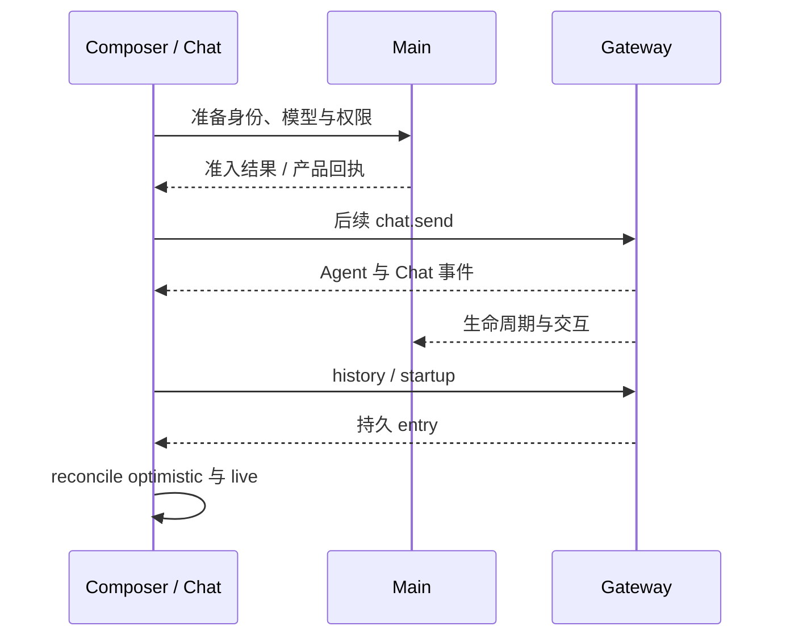

# 聊天消息端到端维护指南

文件名保留早期审计日期，本文按当前链路重写，不再把历史修复和旧补丁编号作为现行实现。架构细节见[聊天渲染](../architecture/15-chat-rendering.md)。

## 1. 一条消息的完整路径

用户草稿经 Composer 校验，首轮通过 Main 建立产品会话与 clientTurnId，后续 turn 在 Main 准备权限和模型后由集中式 chat client 发送。Gateway 接收后生成原生 run，实时事件驱动 Renderer，原生 transcript 提供最终历史。

首轮也可由 Router 代为发送；不论路径如何，原生消息不在 Main/Redux 复制持久化。

## 2. 每个阶段的成功含义

| 阶段                | 可以确认               | 不能确认               |
| ------------------- | ---------------------- | ---------------------- |
| 草稿提交            | 用户表达发送意图       | 已被原生接收           |
| 产品行/receipt 建立 | 会话与幂等身份存在     | 模型已经执行           |
| 原生 run 接收       | 执行已获准入           | 工具或任务成功完成     |
| live final          | 对应原生运行终态       | 所有后代与 Goal 都结束 |
| history entry       | 内容已进入原生可见历史 | 任意文件副作用可撤销   |

## 3. 常见显示故障的定位顺序

先看原生 history 是否已有内容，再检查完整原生 event，最后检查 client admission、reducer 和 pipeline。Main 的摘要日志可能只保留首尾流事件，不能凭摘要缺失判断没发送。

同条消息重复：核对 clientTurnId、原生 entry/run identity 与 optimistic 接管。正文丢段：检查 delta/snapshot 与 preamble owner。工具顺序跳动：检查 history 补取是否被误当新 live 序列。刷新后不同：检查原生可见分支和 reset 边界，不增加本地消息缓存补救。

## 4. 取消和断线

准入前取消必须阻止稍后自动发送。准入结果未知时保留身份，等待或查询原生；不能原样重发。停止确认进入同一终态 reducer，迟到 delta 不能改回 running。

断线恢复是重新查询与合并，不是重播用户命令。切换会话淘汰旧 history generation，后台任务事件仍归自己的 session，不能更新当前窗口的另一会话。

## 5. 交互与附件

问答、计划和审批分别有原生 pending 身份与期限；UI 卸载只改变展示。附件、浏览器标注和操作演示在发送前属于 draft，发送后进入原生消息，不由 preview state 承担历史存储。

## 6. 回归检查

至少覆盖：同文重复输入、首次事件前停止、原生先完成后 RPC 返回、断线时接收未知、历史与 live 交错、超大工具输入、Plan reset、Goal fence、后台会话完成和窗口卸载。使用 controller/reducer/history tests 核对协议，再以真实运行时验证交互；不要沿用旧审计测试数量。
