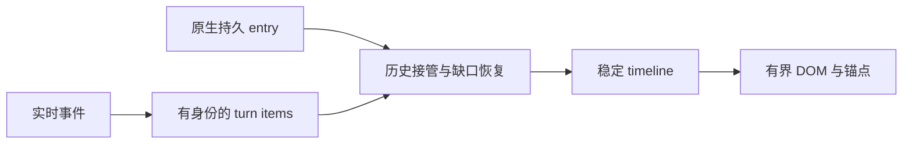

# 聊天时间线：实现规则与后续边界

时间线重构已落地；本文解释维护规则，不是待执行迁移清单。当前状态由 ChatTranscriptState、event reducer、history reconciler 与 build-chat-items 共同形成。

## 1. 为什么不是普通消息数组

同一 turn 会交错 Thinking、工具前说明、工具调用、工具结果和多段正文。历史与实时还可能先后到达。若按 role 拼字符串或每次 history 覆盖数组，会丢失顺序、重复工具卡或让已停止任务复活。

## 2. 顺序的依据

原生 run、toolCallId、entry id、preamble owner 和 sequence 共同决定归属。时间戳不能单独决定工具完成顺序；历史 assistant 时间也不等于 toolResult 真正完成时间。

稀疏 recovery snapshot 不推进 live 高水位。恢复某个 owner 的缺段不能因为另一 owner 已有更高序列就被全部拒绝，也不能把恢复内容重复 append 到已收到 snapshot 后。

## 3. 展示状态与原始内容分离

Tool 保留完整 canonical input/output，折叠卡片、分页和虚拟化控制成本。Content 标明 delta/snapshot/replaceable，不通过删除历史压缩 UI。Thinking 与正文保持独立 item，状态样式不能改变内容权威。

中断与错误共用该 run 的终态行，后续更精确诊断更新同一行。终态 fence 保留到 session projection reset，不能因为短期缓存过期重建运行。

## 4. 历史窗口与滚动

默认 DOM 窗口 750 条、每次移动 250；history page 也有自己的传输预算。前插旧消息按原生 entry 锚定可见区域，用户阅读历史时新流不强制拉到底部。

代码块、图片和 Mermaid 改变高度后保持锚点。搜索和 minimap 必须标明可定位范围；未加载历史先读取再导航，不能用当前数组位置假装全局消息编号。

## 5. 操作门禁

撤回/编辑只针对合法的最后持久 user entry。分支基于完成的助手 entry；Goal、Plan reset、正在发送、压缩及不稳定历史阻止不安全操作。时间线不是可任意编辑的日志，撤回显示也不会回滚已经发生的文件或网络副作用。

## 6. 维护入口与限制

核心入口在聊天库 model、gateway、pipeline、controllers 和 components。控制器拆分使用实时上下文，不能为每个模块建立自己的 current session。

后续优化应验证 long history、超大工具结果、连续多工具、用户滚动和会话切换，不以数据截断换性能。真实协议能力变化更新[聊天架构](../architecture/15-chat-rendering.md)，视觉调整保留 item 身份与可访问性。
