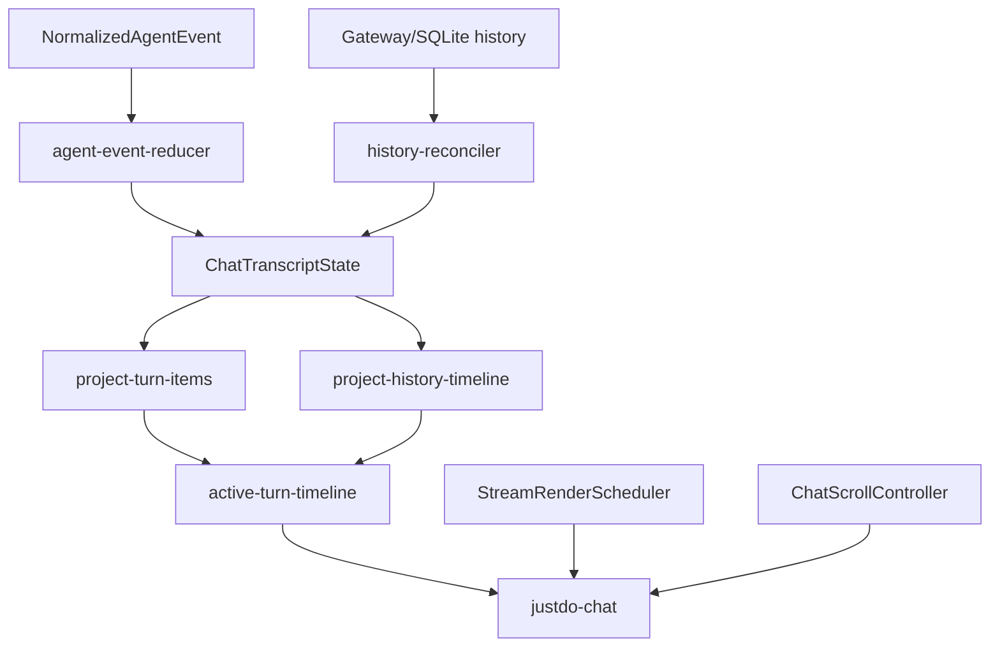

# Chat Timeline 架构与演进说明

> 本文件沿用历史上的 `refactor-plan` 文件名，但核心重构已经落地。本文按 `v2026.8.12` 记录现状、设计约束、仍待演进项和验收基线，而不是保留已经过期的实施步骤。

## 1. 目标

Timeline 要把一次 Assistant 执行展示成可理解、可追溯、可恢复的过程，同时满足长会话和高频流式输出的性能要求。它不是简单的消息列表：同一 turn 中可能交替出现 reasoning、多个工具调用、中间回答、计划更新和终态。

当前设计坚持以下原则：

- Gateway 历史与事件是执行事实来源；
- Renderer 保存规范化 transcript，而非复制 Gateway 内部对象；
- reducer 负责状态机，模板只负责投影；
- 实时与历史使用同一语义分类；
- 终态必须明确，过程详情允许折叠；
- 用户阅读历史时，流式更新不能抢夺滚动位置。

## 2. 分层结构

关键目录：

- `model/`：状态、归约、历史协调和显示投影；
- `components/active-turn-timeline.ts`：过程卡、计划卡和完成摘要；
- `controllers/`：渲染节流、滚动、搜索和时间线导航；
- `gateway/chat-controller.ts`：会话与 Gateway 操作编排；
- `components/justdo-chat.ts`：Lit 外壳、事件订阅和组合渲染。

## 3. 规范化 Transcript

`ChatTranscriptState` 包含：

| 字段                       | 含义                                         |
| -------------------------- | -------------------------------------------- |
| `sessionKey` / `sessionId` | 当前消息域身份                               |
| `persistedMessages`        | 已确认或降级加载的历史消息                   |
| `historySource`            | `gateway`、`sqlite-fallback` 或 `optimistic` |
| `historyGeneration`        | 使旧的异步历史响应失效                       |
| `activeTurn`               | 当前正在执行或刚刚收敛的 Assistant turn      |
| `recentRuns`               | 短期终态去重集合                             |
| `revision`                 | 驱动渲染与未读变更计算的单调版本             |

活动 turn 记录 `runId`、session、lifecycle generation、最后 sequence、起止时间、模型和 item 列表。`toolById` 只作为运行期索引，不替代有序 items。

## 4. Timeline Item 模型

### 4.1 Thinking

Thinking 是独立过程块，状态可为 running/completed/failed/cancelled/interrupted。它不写入 Assistant 正文。实时 reasoning 来自 `thinkingUpdate`；历史 reasoning 由 OpenClaw 历史显示补丁投影后恢复。

### 4.2 Tool

Tool item 用 `toolCallId` 关联开始、部分输出和结果。输入、输出和错误是不同字段；过程状态不会通过输出文本猜测。普通工具详情默认可折叠，超长实时输出限制为 120,000 字符。

`sessions_yield` 等没有结果正文的长等待工具仍显示为运行中卡片，不能因为 output 为空就误判完成。合法 `update_plan` 是特殊投影：始终显示有序计划卡；不合法输入回退为普通工具卡，以保留诊断信息。

### 4.3 Content

Content item 表示 Assistant 可读回答，状态为 streaming/completed/interrupted，带 `delta`、`snapshot` 或 `replaceable` 来源模式。工具前后的回答可以形成多个内容项，保持实际时间顺序，而不是把全 turn 强行压成一段文字。

### 4.4 Terminal

abort 和 run 级 error 生成 terminal item，确保没有自然回答的执行也有清晰结尾。正常 final 不额外制造噪声终端行。

## 5. Reducer 规则

事件归约必须满足：

1. 先校验 session，再校验 run 与 lifecycle；
2. sequence 重复或倒退时不重复应用；
3. 工具事件按 `toolCallId` 更新同一 item；
4. thinking、tool、content 按首次出现的顺序留在 timeline；
5. terminal 关闭 turn 后不再接受普通增量；
6. 每个可见变化增加 transcript `revision`；
7. reducer 不访问 DOM、不请求网络，也不翻译文案。

这使同一事件序列在测试、实时连接和历史重放中得到一致结果。

## 6. 实时与历史投影

实时投影入口是 `project-turn-items.ts`，历史投影入口是 `project-history-timeline.ts`。两者不是代码完全相同，因为输入结构不同，但必须共享这些语义：

- thinking 始终独立；
- 工具按调用身份显示；
- 每次合法计划更新都是独立时间线项；
- malformed plan 不消失；
- 内容与前后工具的时序不被重排；
- 超长内容采取明确截断而非无声丢弃。

历史协调器使用 `historyGeneration` 解决请求竞态。历史窗口上限 750 条，并按 250 条扩展；缓存键包含 session 和 generation，避免把旧投影复用到新会话。

## 7. 显示结构

活动过程主要分为三层：

1. 当前可见 timeline：waiting、thinking、运行工具、内容和计划；
2. 过程摘要：执行结束后提供状态与关键步骤；
3. 展开详情：按时间顺序列出 reasoning、工具输入输出和错误。

归档详情在折叠时不应留在主 DOM 中，减少长会话节点数。外层过程详情和单个工具详情分别使用 disclosure 语义，键盘和辅助技术能识别展开状态。计划卡保持常显，因为它表达当前进度而非调试细节。

流式内容中由 OpenClaw 注入的特定日志提示会被识别并移除，避免把运行时操作提示当回答；普通完成消息中的 `Logs` 标题不能被泛化过滤。

## 8. 渲染性能

### 8.1 发布调度

`StreamRenderScheduler` 将多个 token 更新合并到一个 animation frame；非浏览器测试环境使用 microtask。工具 partial 以 80ms 为最短发布间隔，final/abort/error 通过 `flush` 越过等待。这减少 Lit 更新次数，同时不延迟终态。

### 8.2 长内容边界

- 实时工具输出上限：120,000 字符；
- Markdown 路径具有独立的解析、缓存和文本上限，详见 `15-chat-rendering.md`；
- 折叠详情延迟创建 DOM；
- 持久历史按窗口载入，而不是一次加载无限消息。

限制应在 model/projection 边界执行并显示截断标记，不能只用 CSS 隐藏已经构建的巨型 DOM。

## 9. 滚动与导航

`ChatScrollController` 的状态只有 `follow` 与 `paused`，但内部维护锚点、导航目标和未读 revision：

- 位于底部时，新增内容自动跟随；
- 用户向上阅读后转为 paused；
- paused 渲染前记录多个可见锚点，渲染后选仍存在的锚点恢复偏移；
- 展开详情前可显式保存交互锚点；
- `ResizeObserver` 处理 Markdown、图片或 disclosure 改变高度；
- 距顶部 160px 触发加载更旧历史；
- 未读 revision 在“跳到最新”后清零；
- 精确导航期间不会被普通锚点修正覆盖。

底部判断容差为 0.5px，避免缩放与亚像素造成 follow/paused 抖动。

## 10. 搜索和定位

搜索与 timeline 导航属于显示投影，不修改 transcript。定位结果必须使用稳定 history/process key，而不是当前 DOM 序号；加载更早窗口后序号会变化。跳转时控制器进入 paused 并记录目标，等滚动完成后再恢复普通锚点管理。

搜索实现应遵守以下边界：

- 不把折叠详情永久展开；
- 不因为流式 revision 到来丢失当前命中；
- 命中已卸载窗口时先扩展历史，再导航；
- 清除搜索不会改变消息或 run 状态。

## 11. 国际化与无障碍

所有状态、按钮、计划计数和终态文本来自 Renderer i18n，中文与英文键必须同步。Timeline 的图标不能成为唯一状态信号：文本或 `aria-label` 需要表达 running/completed/failed 等含义。

Disclosure、停止按钮、跳到最新和计划区域应可键盘操作。动态更新不应把焦点强制移到最新 token；辅助技术的播报粒度应基于重要状态变化，而不是逐 token live region。

## 12. 当前完成状态

已经落地：

- 规范化 transcript 与纯 reducer；
- run/session/lifecycle/sequence 隔离；
- thinking/tool/content/terminal 有序模型；
- 实时和历史的独立投影；
- 计划卡、过程摘要和折叠详情；
- 历史 generation、防竞态和窗口加载；
- RAF/microtask 渲染合并与工具节流；
- follow/paused、锚点保持、未读和精确导航；
- 关键组件、reducer、历史和控制器测试。

仍适合继续演进：

- 进一步拆分 `justdo-chat.ts` 的编排职责；
- 增加 Gateway 重启、乱序和长时间离线的端到端故障测试；
- 为超大工具产物提供更明确的文件/查看器入口；
- 以性能基准约束超长会话的节点数、首次显示和流式帧耗时；
- 审核更多 OpenClaw 新工具是否需要专用、但仍可回退的投影。

这些演进不得新建第二套 transcript 或绕过 shared contract。

## 13. 回归测试矩阵

| 类别        | 必测行为                                               |
| ----------- | ------------------------------------------------------ |
| Reducer     | 顺序、重复 seq、错误 session/run、各终态、部分工具输出 |
| Projection  | thinking 独立、多个内容段、计划合法/非法、历史实时一致 |
| Component   | waiting、运行卡、摘要、折叠 DOM、终端行、i18n          |
| Scroll      | follow、paused、锚点、resize、加载更早、跳转最新       |
| Scheduler   | 单帧合并、80ms partial、flush、dispose                 |
| History     | generation 过期、Gateway/SQLite 来源、活动 turn 接管   |
| Performance | 120k 工具输出、长 Markdown、750 条窗口、快速 token 流  |

主要测试与实现同目录放置。修改共享事件或 Adapter 时，还要运行 Main 的 OpenClaw adapter/history reconciler 测试，不能只验证 Lit 快照。

## 14. 验收基线

Timeline 变更只有同时满足以下条件才算完成：

1. 同一 Gateway 事实在实时与历史视图含义一致；
2. 会话切换、停止、重连和迟到事件不会串线；
3. 用户上翻或展开详情时视口稳定；
4. 高频输出不会逐 token 强制完整重渲染；
5. 所有过程均能到达可理解终态；
6. 特殊工具投影失败时仍保留普通工具信息；
7. 新文案同时具备中英文翻译和无障碍名称。

这套基线比具体 DOM 结构更稳定。未来可以更换卡片布局或拆分组件，但不能降低协议正确性、可恢复性和滚动控制。

## 15. 当前模块拆分证据

| 子问题            | 模块                                                                  |
| ----------------- | --------------------------------------------------------------------- |
| Transcript 聚合   | `model/chat-transcript-state.ts`                                      |
| Live event 状态机 | `model/agent-event-reducer.ts`                                        |
| History 分窗/分块 | `model/history-window.ts`、`chunked-message-history.ts`               |
| History 合并      | `model/history-reconciler.ts`、`project-history-timeline.ts`          |
| Optimistic turn   | `optimistic-user-message.ts`、`optimistic-history-tail.ts`            |
| Process takeover  | `process-summary-takeover.ts`、`coalesce-process-summaries.ts`        |
| Item 构建         | `pipeline/build-chat-items.ts`、`tool-cards.ts`                       |
| 发布/滚动         | `controllers/stream-render-scheduler.ts`、`chat-scroll-controller.ts` |

这说明“重构已完成”的含义是职责已从巨型组件抽出为可测试纯模型/控制器；并不表示未来不再拆 UI component，也不表示可以删除 wrapper 中仍需要的订阅和编排。

## 16. Timeline 排序与 Takeover

排序优先服从结构化 turn/item 顺序和 Gateway identity，而非仅按 timestamp。Realtime overlay 与 history item 相遇时，只有可证明同一 message/run/tool 的项才能 takeover；普通文本相等不去重。History 页插入顶部时维护 scroll anchor，active turn仍固定在尾部域。

## 17. 状态清理表

| 触发             | 必须清理                           | 必须保留                          |
| ---------------- | ---------------------------------- | --------------------------------- |
| Normal final     | running thinking/tool/live flags   | 已产生内容、完成过程项            |
| Abort            | pending/running activity           | cancelled/interrupted证据         |
| Error            | activity与等待计时                 | 已有文本、tool error、诊断提示    |
| Session switch   | 当前 view订阅/selection overlay    | 各 session缓存的已确认 transcript |
| History takeover | 已被持久项覆盖的 optimistic/live项 | 尚未进入 history 的 active tail   |
| Delete session   | cache、grant、subscription         | 其他 session状态                  |

## 18. 性能验收方法

性能检查同时测首屏历史、持续 delta、长 tool output、Mermaid/KaTeX、向上分页和快速切会话。观察 commit 次数、DOM item 数、scroll jump 和 memory；不能以“scheduler 合帧存在”推断整个渲染已优化。限额变化需记录数据规模与设备条件。

## 19. 演进完成条件

新增 timeline 类型必须有 shared/adapter 来源、live reducer、history projection、stable identity、generic fallback、终态清理、搜索/导出和可访问交互。文件名保留 `plan` 是历史兼容；未列为已实现的交互编辑/持久任务能力仍不是当前功能。
