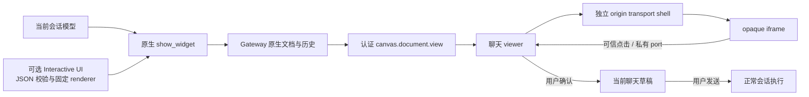

# 交互式回答

聊天可通过 OpenClaw 原生 `show_widget` 展示交互卡片。模型可使用原生 HTML；需要统一
表格、比较、图表、表单和分步解释时，可启用 Interactive UI 扩展。该功能借鉴
Intelligent UI 的呈现方式，使用本地 OpenClaw 合约，不接入 ChatGPT 私有界面服务。
真实模型效果与安装包的平台验收仍见 [待办清单](../../plans/interactive-answers-acceptance.md)。

## 入口与使用

在扩展设置中显式启用 **Interactive UI**。扩展默认关闭，配置同步保留用户明确的
开关；关闭不删除原生历史文档，也不自动重建其中的组件。模型只在实际工具 schema
公布对应类型时使用它，不靠提示词猜测工具是否可用。

| 标识                      | 用途                                                |
| ------------------------- | --------------------------------------------------- |
| 插件 `interactive-ui`     | 注册组件类型、只读资源与按需技能                    |
| 卡片 `interactive-answer` | 一个文档组合 table / compare / chart / form / steps |
| 卡片 `scenario-explorer`  | 固定的团队人数、专注时间、交付周期与成本测算        |

插件 ID 与卡片类型是独立注册项，原生记录为 `pluginId:kind`，允许两者同名；
重复的卡片类型或公共资源路径会被拒绝。两类公共资源分别是
`/__interactive_ui__/ui.js` 与 `/__interactive_ui__/scenario.js`。
原生历史文档不可变，类型和资源命名调整后应重新生成卡片，不自动改写旧历史。

按需技能指导模型选择合适的形式：简单问题仍用文字，数据不足时澄清或说明假设，
自由布局可用原生 HTML。插件不在每轮注入长提示，也不改变八个内置技能。
`widget_code` 必须是经过校验的 JSON 字符串；完整 schema 和实际工具 payload 只在
[插件说明](../../../openclaw-extensions/interactive-ui/README.md)及插件技能中维护。

## 当前交互

| 组件    | 本地行为与限制                                               |
| ------- | ------------------------------------------------------------ |
| table   | 全量搜索、稳定排序、每页五行；长值可查看完整行               |
| compare | 同一组指标下选择方案；选择不等于模型已有推荐依据             |
| chart   | 折线或柱状图、系列开关、同源数据表；保留负值、零线和空态     |
| form    | 文本、数字、选择和勾选输入；必填与范围校验，不计算任意表达式 |
| steps   | 可键盘展开的分步解释，同组一次展开一项                       |

一个文档最多八个组件，按钮切换当前面板时保留输入。搜索、排序、选择和表单值只
存在当前 iframe 内存；重载或重新挂载后恢复原文档默认值。完整选择可在卡片内
查看与复制，不声称跨重启保存。

固定测算明确使用示例假设：有效产能为人数 × 每日专注时间 × 82% × 协作折扣，
协作折扣为 `1 - 0.025 * (人数 - 1)`；周期向上取整，成本为周期 × 人数 × 每人日费。
它不考虑假期、依赖与并行限制，不能作为实际项目承诺；通用表单不是任意计算引擎。
固定组件使用本地 renderer，不请求外部服务；任意 HTML 仍沿用原生 CSP/media 规则。

卡片在消息区域水平居中，最大宽度 840 CSS 像素，窄窗口按可用宽度收缩。高度
跟随当前原生 sandbox 报告，并限制在 48–8000 像素；旧文档的尺寸事件不能改变新
卡片。应用不读取跨域 DOM 来猜宽度，组件内部的图表布局仍由对应文档负责。

## 继续分析与失败恢复

“继续分析当前选择”通过原生私有 prompt port 产生建议。表单无效时阻止继续并定位
错误字段；只读会话、转录修改或缺少当前草稿能力时禁用入口。通用组件摘要在 JSON
转义后限制为 3600 UTF-16 code units，为各组件保留基本状态，省略和截断明确标记；
完整交互值仍可本地复制。

宿主先展示建议，用户确认“加入草稿”后追加到当前输入框，保留已有文字和附件；
发送仍由用户操作。私有桥检查当前 frame、真实用户激活、可见性、焦点、会话身份、
长度和速率，拒绝 slash/执行前缀。隐藏、断线、切会话或卸载会撤销旧建议，不能将
旧卡片的内容带进新会话；草稿能力变化保留 iframe 和当前本地选择。

加载超时、资源失败、脚本错误或文档不可用提供手动重新加载及“请重新生成”建议。
重建建议只包含受验证身份和封闭 `load|runtime` 类别，依据原对话重新调用工具，
不转发 HTML、token、路径或原始日志，不自动 wake、发消息或修补原生文件。
原生 `UNAVAILABLE` 不能区分被淘汰和暂时失败，界面不猜测具体原因。
原生每会话保留 32 份文档，淘汰后历史 descriptor 可能仍在，重新加载不能找回
不存在的文档；重新生成会产生新的文档。

## 数据与权限所有权

只有真实成功的 `show_widget` Tool 结果可产生已验证的预览；原生 Tool Search 的核心
目录包装也按精确身份验证，按文档去重并保留执行记录。助手自己写出的 shortcode、
JSON、相对 URL 或普通 HTML 文件不能授予原生文档读取。读取绑定当前 Gateway client、
连接代际、sessionKey 和 docId，使用认证 RPC，不把凭据放入 iframe URL。

Main 保留产品配置与执行生命周期；当前用户发起的首条消息委托已绑定的 Renderer
发送，只有实际 viewer 连接才公告 `inline-widgets`。后台/headless 执行保留原路径，
不伪造 viewer capability；不确定的提交只恢复原生状态，不自动补发。

安装版页面由 Main 的本机只读 HTTP 静态宿主提供，使原生隔离页面能够验证 HTTP(S)
父来源。静态宿主限制入口、方法、Host、文件清单、realpath 与内容哈希，不能读取
配置、凭据或任意磁盘文件；主页面保留 contextIsolation/sandbox 与显式 preload。
工作区 `workspace.html` 同源且不继承 preload，沿用 dev 的窗口标题栏、主题、菜单
及 generation/frameName 校验。原生设备身份和界面偏好使用既有 Main KV，避免随机
端口导致重新配对或偏好丢失，不增加 transcript/document 缓存。

Gateway 拥有原生 HTML、文档保留及 transcript；Renderer 直接消费实时和历史投影。
外层独立 origin、内层 opaque sandbox，消息逐阶段检查 source/origin/renderId。
工作区组件以实际 ownerDocument/defaultView 处理样式、主题、激活与沙箱消息，
不借用主窗口激活，也不增加子文档 preload。该链路不授予 dashboard、MCP、tool
或 resource 执行权限，不新增产品数据库、Redux slice 或运行时补丁。

跨进程和窗口生命周期见 [进程模型](../../architecture/03-process-model.md)，
认证投影、私有桥和卸载约束见 [聊天渲染](../../architecture/15-chat-rendering.md)，
类型注册和启用管理见 [插件系统](../../architecture/07-plugin-system.md)。
这三篇维护架构契约，本页维护用户行为与限制；旧原型和阶段审查不作为独立现行入口。
