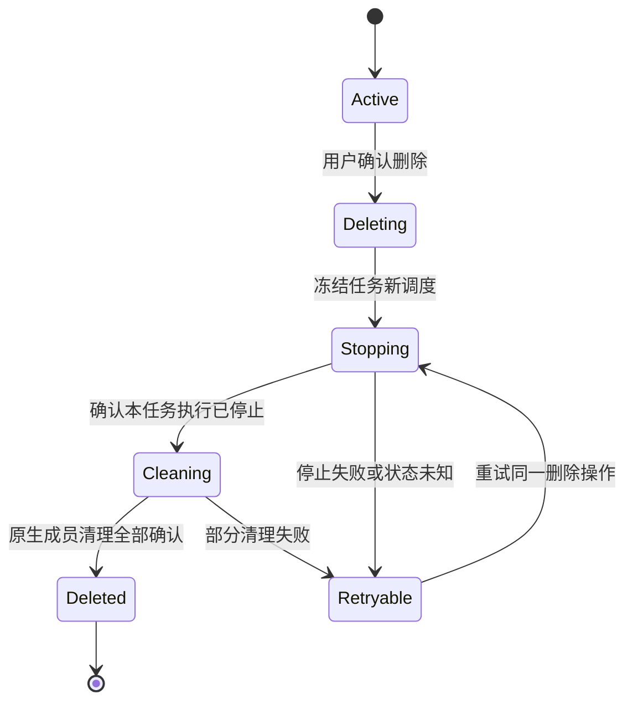

# 协作会话右键菜单与统计改造计划

> 历史实施记录（2026-09-19）：下文的手动成员/交接菜单描述当时阶段，当前用户会话固定 main，协作由模型准备成员。现行入口与容量见[协作机制](multi-agent-collaboration.md)。

状态：2026-09-19 已实施首期菜单、成员统计、主对话导出范围和整任务删除。完整协作导出及复制仍不提供。补充 task-scoped-agent-collaboration.md；本文对复制、导出及删除的分期决策优先于前文的初步建议。

## 1. 核实当前实现

CoworkSessionItem 的菜单包含批量操作、详情、置顶、重命名、复制会话 ID、导出、复制当前会话、协作成员、交接助手、移动分组、删除。当前没有独立的归档菜单，本次不新增。

CoworkSessionDetailsModal 按单会话读取消息统计、模型、目录、执行模式和运行状态。CoworkView 的导出直接使用主聊天组件 getExportSnapshot()，复制将 currentSession.id 交给 copySession。导出和复制的菜单禁用条件来自单个 isRuntimeRunning。这些路径不能仅换标题后宣称支持整个协作任务。

## 2. 默认范围与目标菜单

对用户仍称“会话”，不引入房间、锚点、内部 Session 等界面术语。列表的一行是用户会话；所有管理操作默认作用于整行代表的任务。仅导出在过渡期明确标为“导出主对话”，不得静默缩小范围。

目标菜单分三组，使用已有分隔方式，不新增多级菜单：

1. 会话详情；置顶/取消置顶；重命名；移动到分组（沿用现有子菜单）。
2. 导出主对话（过渡期）；复制当前会话（仅普通会话保留）；批量操作。
3. 删除。

复制 ID 移入详情中现有的 ID 区域。协作成员入口从右键移除，使用主会话已有“协作 · N”入口；不再提供手工编组弹窗。交接助手从 main 用户会话菜单移除，模型通过邀请助手完成分工。历史外部会话继续采用其现有能力，不假定它们支持此菜单全部动作。

## 3. 逐项决策

| 项目         | 决策                             | 难点与约束                                            |
| ------------ | -------------------------------- | ----------------------------------------------------- |
| 重命名       | 保留，改用户会话标题             | 不批量改助手名称或原生会话标识                        |
| 置顶         | 保留，仅列表记录                 | 内部会话不独立置顶                                    |
| 移动分组     | 保留，修改锚点分组               | 通过归属查询获得成员，不复制分组到成员                |
| 详情         | 保留，分概览和助手明细           | 元数据先显示，原生统计按需加载，部分失败不清空全部    |
| 复制 ID      | 移入详情                         | 区分产品会话 ID 和各助手原生 ID，不偷偷改变复制值含义 |
| 协作成员     | 移除重复入口                     | 协作页负责查看，参与者由模型决定                      |
| 交接助手     | main 用户会话移除                | 与 main 固定入口目标冲突，不能直接转移所有者          |
| 导出         | 首期明确“导出主对话”             | 完整协作导出需要另做快照和错误处理                    |
| 复制当前会话 | 协作会话隐藏，普通会话保留       | 不做只复制 main 却假称复制整个协作的半成品            |
| 批量操作     | 保留已支持的简单管理动作         | 批量删除复用逐任务删除服务，不直接循环删除锚点        |
| 删除         | 保留，但协作上线前完成整任务删除 | 涉及停止、原生清理和部分失败恢复                      |

菜单动作能力由同一份任务范围解析结果决定；禁用适用于“暂时忙碌”，隐藏适用于“不提供的功能”。不显示长期灰色的“即将支持”。所有关键限制在 Main 再检查，防止快捷键、旧渲染状态或 IPC 绕过。

## 4. 详情和统计口径

继续复用详情弹窗，单助手保持原布局；存在协作时显示任务概览和参与者明细。不增加新窗口或全套标签页。

概览：标题、创建时间、最近有效活动、任务状态、项目目录、参与者数量。目录显示任务资产目录，不混称为每个助手的身份 workspace。成员有不同执行目录或模式时，概览显示“因助手而异”，具体信息在成员行查看。

统计：累计输入/输出 Token、可用费用、工具调用次数；支持原生统计才显示，不为未知数编造零值。各模型计价不完整则显示已知费用，存在不同币种则分别列出，不直接相加。上下文占用率按助手当前模型展示，不能汇总百分比。

消息数标注“原生消息记录数”，不会被解释成人类对话轮数；真实用户输入仅统计主会话中可确认的人类输入，不能把 inter_session 输入当作用户发言。通信次数按可信投递身份去重，不按发送工具记录、接收输入、回复三份记录重复计数。

用量优先使用原生权威用量口径，避免把 sessions 累计值和同批 run 用量同时相加。原生只提供当前窗口统计时，明确显示统计范围，不宣称覆盖压缩或重置前的所有历史。Subagent 如有可证明的归属与用量，则作为独立明细计入一次；若主会话用量已包含它，不能再次累加。无可靠口径时标记范围受限，先不显示误导性的总数。

参与者表：助手名称、模型（发生切换时允许多个）、运行状态、累计用量。点击进入已有节点消息/详情视图。原生消息按需读取，不新增 Main 或 Redux transcript 缓存。

数据响应携带截至时间、任务范围版本和完整性（完整/部分/不可用）。轮询成功不更新“最近活动”；只用实际消息、执行和用户操作时间。刷新用量时保留已有结果并显示更新状态，不把暂时失败显示成零。

## 5. 运行状态和并发操作

统一计算 hasActiveWork，范围包括 main、成员活动执行、已接收的排队工作以及受本任务管理的后台回复。main 返回不代表任务空闲。是否存在执行与是否等待授权分开保存；可以显示“协作中 · 有助手等待授权”，避免互斥状态丢信息。

删除中具有最高的产品状态优先级；离线显示“状态待确认”，不能假定没有活动执行。全部执行静止只表示本轮结束，不能推导用户目标完成。详情和列表使用同一投影。

为导出/复制等需要稳定范围的操作，在 Main 解析成员并检查任务 scopeVersion；准备成员时也纳入范围。运行中禁用只是 UI 提示，最终检查不能依赖按钮状态。普通会话复制过程中若出现新成员准备，应明确失败并允许重试，不能生成混合范围副本。

## 6. 导出分两期

首期保留现有 JSON 格式，菜单/对话框改为“导出主对话”，文件内明确 scope=main、原生会话身份和截至时间。不包含其他助手历史；用户在保存前可见范围说明。这是只读功能，不要为了导出停止助手。先沿用保守规则，在任务活动或状态未知时禁用，避免输出看似最终却不完整的结果。

后续完整导出采用 versioned bundle：manifest、main、members、communications 元数据。可先用单个 JSON 的分区结构，不必引入 ZIP 或新格式工具。保留会话身份和时间，主对话与助手历史分开，不按时间硬拼成同一聊天。导出只包含可读消息数据及用户选择的已有原始字段，不包含运行凭证或 Agent 配置密钥。

导出在后台按原生分页读取，Renderer 直接消费原生历史的架构不变；Main 负责明确保存接口，流式写入机制如需新增另行设计，不建立持久正文缓存。每个会话记录读取边界和完整性；跨会话没有原生原子快照时明确是截至各自读取边界的快照，不能宣称全局事务一致。

成员读取失败默认不导出“成功的完整任务”。错误界面允许重试；若允许部分导出，必须由用户明确选择并在文件中列出缺失成员。空成员/无消息与读取失败严格区分。原始会话导出格式的消费者不能误读新 bundle。

## 7. 为什么暂不复制协作会话

复制多个 transcript 并不等于复制一个可继续工作的任务。旧消息中含有旧 sessionKey、投递 ID、工具结果和回复引用；原样复制可能让模型继续向旧任务发消息，替换正文又会篡改历史。活动执行和排队投递也不能克隆。

因此首期协作会话不提供复制。普通会话沿用原功能，但 Main 校验其没有房间/准备中的成员，不能仅检查可见人数。未来如需要另开分支，单独设计“以此为背景新建会话”：明确生成上下文摘要、新身份和新参与会话，标明来源且不伪装成完整历史克隆。本轮不新增这个按钮。

## 8. 删除是必须完成的高风险路径

只删除 main 会留下继续运行但用户找不到的成员，不能作为过渡实现。确认窗口沿用现有样式，说明删除本会话及 N 个关联助手会话；不会删除长期助手配置、其他任务或项目文件。

删除开始持久化操作身份、成员范围和 tombstone，阻止迟到事件/模型调用重新建成员。逐一停止精确归属的执行，绝不按 agentId 杀死该助手全部任务。原生会话删除按可重试步骤进行，原生已不存在视为该步骤完成。

原生 API 与产品 SQLite 无法跨系统事务提交：保留每个成员清理进度。部分失败时保留任务记录，显示“删除未完成，可重试”，不能宣布成功或恢复为正常任务。全部完成才隐藏任务并清理常规元数据，按现有 tombstone 生命周期阻止历史事件重新导入。重启继续恢复删除状态，不把残余成员当外部新会话展示。

批量删除以任务为单位去重，返回成功/失败任务集合，只重试失败项；部分成功不要回滚或重新删除其他任务。确认窗口一次说明任务及关联会话范围，不逐成员反复确认。

## 9. 实施分期与验收

P0：任务范围查询与能力判断；移除重复/冲突菜单；协作禁用复制；明确主对话导出；详情先显示基本归属和分项状态。同步所有菜单、快捷键、批量入口和 IPC 检查。不要仅改一个 React 组件。

P1（协作替换上线前必需）：整任务停止/删除与恢复，统一忙碌状态，统计聚合及部分失败；同步更新数据/进程/聊天架构文档。数据结构变化采用正式迁移，不修改旧 OpenClaw 运行时补丁形态。

P2：完整协作导出。协作复制不排入本阶段，除非产品明确需要任务分支。

验收：非当前会话右键动作准确定位；单会话功能不回归；main 空闲但成员忙碌时操作限制正确；新成员与操作竞争不遗漏；同一助手其他任务不受删除影响；删除中崩溃恢复；部分原生删除成功后可重试；用量不重复累计；部分统计不报零；复制 IPC 不能绕过协作限制；导出主对话明确范围；大历史分页和缺失历史处理；菜单、详情与列表状态一致。测试数据必须覆盖两项任务共享同一 Agent。
