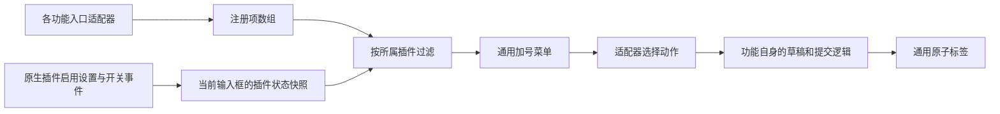

# 输入框功能菜单

消息输入框下方的“+”菜单是通用功能入口，Swarm 是当前第一个适配器。
菜单不持有插件业务参数、草稿或执行逻辑。主界面两种输入框布局共用同一组注册项，
没有可见功能时菜单自身隐藏加号。

## 接入契约

每个适配器提供 `ComposerFeatureRegistration`：稳定且唯一的 `id`、已翻译的名称、
图标、选择动作，以及可选的说明、选中/禁用状态和 `extensionId`。
注册顺序决定展示顺序，一个插件可以提供多个独立入口；应用内置功能可以省略
`extensionId`。名称和说明仍须提供中英文翻译。

`buildComposerFeatures` 只按所属插件是否已确认启用过滤注册项；未确认、关闭或
目录中缺失的插件都不展示。`disabled` 表示可见但当前不可操作，区别于插件关闭。
选择动作、默认参数、取消选择和发送前的权限核验由各功能适配器及其业务流程负责。
Swarm 的这些默认参数与展示定义放在 `swarmComposerFeature.tsx`。

新增功能时实现适配器，将其返回值加入 `CoworkPromptInput` 的注册项数组，并在该
功能自己的提交路径中处理业务参数。通用菜单、启用状态读取和过滤函数无需新增
插件分支。这里是明确接入的 Renderer 适配器契约，不执行外部插件提供的 UI 代码。
需要输入框标签的功能可使用 `useComposerFeatureDraft` 保存类型明确的选项对象；
它统一处理按聊天分隔、关闭后取消选择、发送快照核对和仅清理已接收的选择。

## 状态与交互

每个输入框通过 `useExtensionEnablement` 一次读取整个原生插件目录，并使用一个
开关事件订阅覆盖所有注册项。按插件 ID 合并在读取期间发生的开关，避免关闭
一个插件后被旧响应重新显示，也避免它的事件丢弃其他插件的目录结果。较旧的
目录请求不能覆盖较新的读取。窗口重新获得焦点时刷新，暂时读取失败保留已知
设置；初次读取失败不视为已启用。快照只保存启用元数据，不增加 Redux 状态或历史缓存。

Main 在启停尝试结束后重读实际插件目录并通知全部仍存在的窗口，安装和卸载也
走同一通知路径。即使操作因运行时重启失败而返回错误，已经保存的关闭状态仍
会移除入口；读取失败不伪造状态，不改变操作原有结果。通知读取串行，避免旧
目录响应晚于新响应到达。自定义导入和市场安装共用同一安装适配器。

关闭某插件时只移除属于它的菜单项，其他插件和内置功能仍可使用。被移除项若
正在获得键盘焦点，菜单将焦点移到剩余可用项；剩余项原有焦点继续保留。
全部入口消失时关闭菜单，恢复入口后不自动弹出。

`FeatureTextarea` 接收标签名称与适配器图标，不预设任何插件图标。原子标签的
删除、正文编辑、输入法与可访问性交互统一复用；标签不写入正文或原生聊天历史。
Swarm 关闭后清除自己的标签选择，保留正文、附件及引用，重新启用后需要重新选择。
关闭版本按插件 ID 单独递增；即使 React 合并快速关闭/开启事件，旧选择仍然失效。
取消、替换标签或切换聊天后，异步准备完成的旧发送必须再次核对当前选择；失败
不清理正文，已接受发送也只清理对应选项快照，不能删掉用户后来做的新选择。
通用显示过滤不能代替各功能在 Main/Gateway 的执行权限校验。

## 回归验证

覆盖多个插件独立开关、一个插件多个入口、内置入口、未知/缺失插件、在途目录
与开关竞态、目录响应顺序、失去/恢复入口后的菜单焦点，以及适配器图标和原子
标签的现有正文编辑行为。
另覆盖已保存但重启失败、安装/卸载、多窗口广播、快速开关合并更新、取消后
异步发送失效、聊天切换与旧发送清理，以及一个插件关闭时其他插件草稿不受影响。
