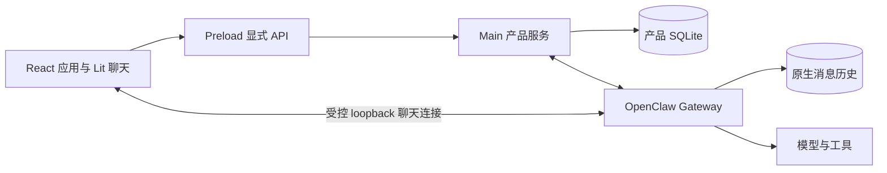

# 当前实现状态

核对日期：2026-09-24。应用 `v2026.8.27`，OpenClaw `v2026.9.2`。文件名保留旧版本号以维持已有链接；正文描述当前源码，不代表旧版本发布记录，也不代表本轮已完成真实模型或安装包验收。

## 1. 系统边界

JustDo 是本地优先的 Electron 桌面助手。Main 管理桌面生命周期、权限、配置、产品 SQLite 和 Gateway 子进程；OpenClaw 拥有执行、工具、任务、消息历史和 cron。配置远端模型时，请求仍会离开本机。

聊天控制器通过 preload 获取连接信息后直连 Gateway。这不允许普通 Renderer 代码访问 Node、SQLite 或任意本地文件。Main 与 Redux 均不持有第二份持久 transcript。

## 2. 已接入的产品流程

| 领域       | 当前行为                                                                          | 详细说明                                                                         |
| ---------- | --------------------------------------------------------------------------------- | -------------------------------------------------------------------------------- |
| 对话与计划 | 用户会话归属 main；支持附件、权限选择、计划审核、问答、停止、分组、搜索和原生历史 | [Cowork](../architecture/04-cowork-system.md)                                    |
| 持续目标   | Gateway 保存目标及预算；Main 协调自动续跑与用户干预                               | [Agent Engine](../architecture/05-agent-engine.md)                               |
| 聊天显示   | Lit 消费历史和实时 Thinking/Tool/Content，处理乐观消息、恢复和滚动                | [聊天渲染](../architecture/15-chat-rendering.md)                                 |
| 长期助手   | 设置中管理档案、独立模型与原生角色文件；普通用户输入仍交给 main                   | [助手管理](multi-agent.md)                                                       |
| 多助手协作 | 可选 agent-team 扩展默认关闭；启用后按任务准备成员，以原生 sessions_send 通信     | [协作机制](multi-agent-collaboration.md)                                         |
| 定时任务   | Gateway cron 执行；应用提供配置、手动运行、结果收件箱和未读状态                   | [定时任务](../architecture/08-scheduled-tasks.md)                                |
| 插件       | Skill、MCP、Hook、Extension 和 Marketplace 统一管理；市场框架默认无业务 provider  | [插件系统](../architecture/07-plugin-system.md)                                  |
| 浏览器     | 四种浏览器模式、嵌入式页面、扩展配对与侧栏对话；操作演示可编辑后作为附件发送      | [浏览器](browser-settings-design.md)、[操作演示](browser-operation-recording.md) |
| 模型与认证 | 语言及媒体模型分域管理；内置模型经短期 JWT、Team 授权和原生 SecretRef 接入        | [模型](model-management.md)、[认证](authentication-builtin-model-lifecycle.md)   |
| 语音       | 可选本地或在线 ASR/TTS；本地附件转录由独立扩展提供                                | [语音](local-tts.md)                                                             |
| 外部集成   | 外部 Agent 通过受管适配器接入；Multica 经本地认证桥调用应用运行时                 | [外部 Agent](external-agent-adapters.md)、[Multica](multica-integration.md)      |

Memory 从侧边栏轻量入口访问，通过 Gateway 搜索及受限文件接口查看记忆。Usage 展示 Gateway 用量投影。它们不新增 Redux transcript 或独立执行引擎。

## 3. 容易误读的状态

### 目标状态与运行阶段

`SessionGoalStatus` 保留六种原生值：`active`、`paused`、`blocked`、`usage_limited`、`budget_limited`、`complete`。预算受限不是 blocked 的兼容别名；恢复操作涉及原生预算窗口。Main 的 `GoalExecutionSnapshot` 另行记录续跑阶段，通过 `cowork_config` 的 `goalExecution:` 键持久化。它不能覆盖 Gateway 的目标内容、预算或状态。

### 助手、协作成员和子任务

长期助手是持久身份；成员是某个任务中的助手会话；Subagent 是原生委派执行。三者不能互换。协作最多 12 名成员，每用户轮次最多 16 次投递；失败尝试也占用预算。`accepted` 只表示原生接收，不能显示为业务完成。成员共用项目文件时，没有自动 worktree 或写冲突隔离。

禁用 agent-team 保留档案和历史，Runtime Services 继续提供回执读取，并阻止受管会话的 peer send。普通回合不自动注入助手名单或协作指令。助手删除保留身份行与角色文件，不调用会清除原生会话索引的 `agents.delete`。

### 权限与沙盒

ask/auto/full 映射原生 guarded/workspace/full。每次发送前必须核对原生 session mode/root；全局安全兜底不随单个会话提权。计划模式、跨会话可见性、插件开关及 Windows 命令沙盒是不同控制面，不能用其中一个代表其余全部。见[安全模型](../architecture/11-security-model.md)和[Windows 沙盒](../architecture/17-windows-native-sandbox.md)。

## 4. 可从代码复核的基线

| 项目          | 当前值                                                     | 事实来源                                            |
| ------------- | ---------------------------------------------------------- | --------------------------------------------------- |
| Electron      | lockfile 为 42.7.0；声明范围为 ^42.6.2                     | package.json、package-lock.json                     |
| Node          | 24.21.0；engine >=24.15.0 <25                              | .nvmrc、package.json                                |
| Vite 开发端口 | 43127，可由开发环境覆盖                                    | package.json、vite.config.ts                        |
| Redux         | model、cowork、skill、mcp、scheduledTask、agent            | src/renderer/store/index.ts                         |
| 内置 Skill    | 8 个，全部默认启用；包含 diagram-design                    | resources/builtin-skills.json                       |
| 核心产品表    | 20 张：SqliteStore 直接初始化 14 张，协作初始化器另建 6 张 | src/main/data/sqliteStore.ts、collaborationStore.ts |

完整表清单和数据保留语义见[数据存储](../architecture/10-data-storage.md)。浏览器导入数据库、Gateway transcript 和服务端活动记录不计入这 20 张表。

## 5. 开发与运行时

开发、打包和诊断步骤见[开发与排障](../development.md)。仅启动 Vite 不会装配 Gateway。运行时从锁定的 pristine OpenClaw 包构建，当前补丁清单以[版本目录 README](../../scripts/patches/v2026.9.2/README.md)为准；不要复制固定补丁数量到多个专题中。

当前代码中仍可观察到的构建限制：`.github/workflows/ci.yml` 使用 `npm install`，npm 缓存 key 仅依赖 package.json，skill job 还调用 package.json 未定义的 `build:skills`。lockfile 根版本已经与应用版本一致，不再列为缺口。文档更新不会修复这些工作流配置。

## 6. 验证范围

该页依据声明、注册入口、消费方和现有测试核对。旧审计中的“通过 N 项测试”只属于当时提交。本次文档修改运行的检查以本次交付说明为准，不继承历史验证结果。

新增执行能力需要分别验证正常路径、停止、重复调用、权限拒绝和重启；集成测试不能代替真实模型可用性或各平台安装验收。
