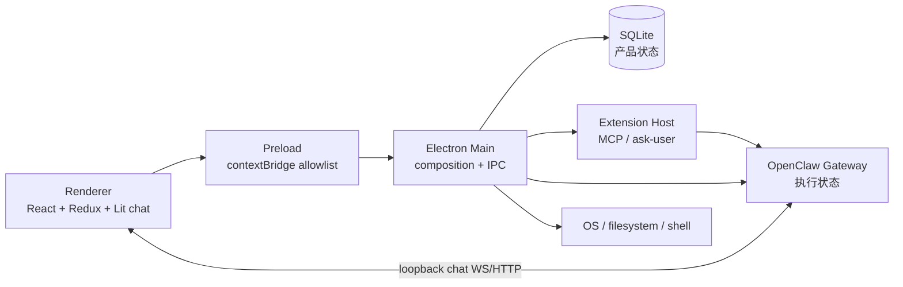
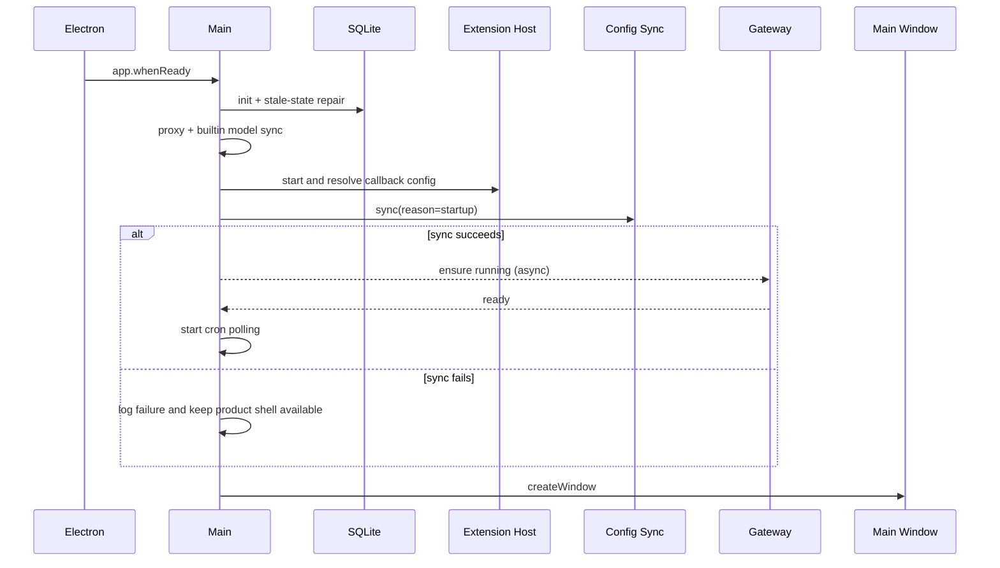
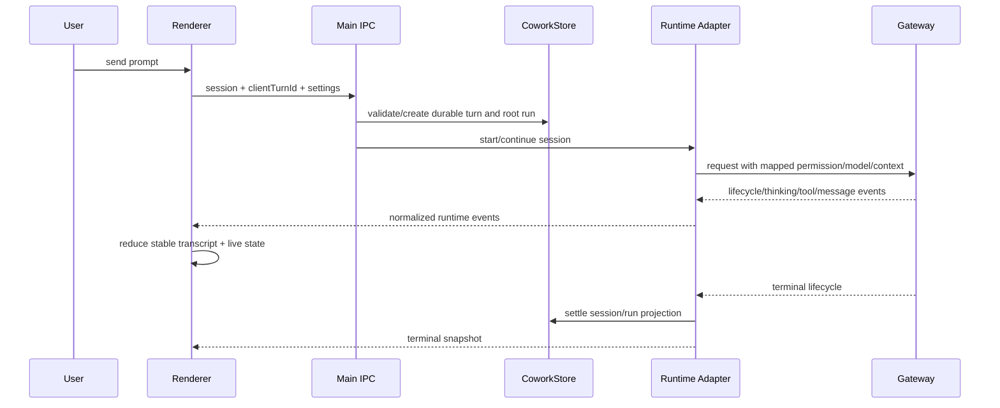

# JustDo v2026.8.12 当前实现状态

文件名保留 `v2026.8.10` 仅为历史链接兼容；本文内容已于 2026-08-22 按 `package.json.version=v2026.8.12` 和当前代码重写，不再描述旧版快照。

## 1. 产品边界

JustDo是Electron桌面产品层：UI、SQLite产品数据、权限、安全文件/网络入口、打包与OpenClaw生命周期。OpenClaw `v2026.7.1-2` 是唯一Agent engine，拥有run、session/history、tools、skills runtime和cron。Renderer是薄客户端，不实现第二套runtime。

## 2. 当前主要能力

### 2.1 Cowork

- 创建/继续/停止/删除、批量删除、pin、rename、group、cwd、agent/model/permission。
- `clientTurnId`幂等和 `cowork_session_runs` root run绑定/计时。
- Gateway session/runtime批量查询、重连恢复、历史reconciliation。
- attachments、ask-user wizard、exec/plugin approvals、文件预览/授权编辑和导出。
- subagent状态/抽屉/label与父会话running合并。

### 2.2 持续目标

Session goal当前实际呈现active/paused/blocked/complete；共享契约仍接受历史兼容值usage-limited/budget-limited，但读取时统一归一为blocked，不作为独立运行状态继续处理。Execution snapshot支持running/continuing/retrying/等待输入/确认。Main coordinator处理tool/lifecycle、managed subagent join、控制run、resume、完成反馈和重连恢复；UI提供状态卡和single-flight动作。

### 2.3 Chat

已采用单一transcript state、normalized agent reducer、stable identity history reconciliation、optimistic tail、有界750/250 history窗口、process summary、独立live thinking/tool、execution plan card、搜索/minimap和锚点滚动。

Markdown支持task list、KaTeX、highlight、Mermaid、CJK链接修正与stream稳定边界，统一DOMPurify清洗并有限额/cache。

### 2.4 Permissions

Ask/auto/full产品语义通过config sync映射并验证Gateway active policy；新turn fail closed。Exec/plugin approval分离，session grant终态清理。`action-approval`扩展处理文件写/cron产品policy，scheduler agent使用受管无人值守权限。

### 2.5 Scheduled Tasks

原生 `cron.*` job/run，at/every/cron、agentTurn/systemEvent、none/announce/webhook、main/isolated和channel/account。Agent-turn强制 `justdo-scheduler`，错误assignment会修复或禁用。

应用内Result Inbox已实现SQLite receipts、未读、分页、baseline、durable catch-up、reconcile、完整session查看和artifact清理后删除。

### 2.6 Plugins

Skill/MCP/Hook/Extension/Marketplace统一页面。8个内置Skill全部默认启用并禁用OpenClaw defaults。Skill状态来自Gateway；MCP/Hook有SQLite配置；Extension支持archive/目录import、progress、enable/config/delete和ask-user host。

Marketplace adapter支持四种kind、provider validation、聚合/detail/install事务，但默认没有注册provider，页面正确显示未配置。

### 2.7 Browser

isolated/user/extension三模式已实现。User模式有Chrome/remote debugging/port owner/endpoint诊断；Extension已打包，使用loopback token relay和用户可见tab group，支持配对、状态、连接测试与Unpair。当前tab group的命令级授权和Unpair清理并不完整，不能把它描述为已闭合的安全边界。

### 2.8 Models、Memory、Usage 与设置

自定义provider、模型发现/capability/default、qualified model ref和session patch。内置模型启动/手工refresh已实现；login/logout lifecycle已有但完整认证handler/UI尚未接入。

Memory支持overview/document/search/rebuild；Usage支持7/14/30日Gateway聚合/cache状态。设置还包括Agent runtime、proxy、system prompt replacement、外观/主题、快捷键、自动启动、防休眠、更新和日志导出。

### 2.9 Packaging

Node 24、Electron 42、Vite 8、Windows NSIS/macOS DMG/Linux AppImage+deb。OpenClaw按平台安装/bundle/patch/precompile/prune。Windows包含MinGit、便携Python与hashed requirements；better-sqlite3按Electron ABI重建；Windows update artifact有验证脚本。

## 3. 当前数据事实

Redux挂载6个slice：model、cowork、skill、mcp、scheduledTask、agent。

SQLite有11表：kv、cowork_sessions、cowork_messages、cowork_session_runs、cowork_config、agents、mcp_servers、openclaw_hooks、session_groups、scheduled_task_run_receipts、scheduled_task_result_cleanup。Gateway transcript/cron不属于SQLite权威。

## 4. 当前Runtime Patch

`scripts/patches/v2026.7.1-2/` 有连续001-040能力补丁，覆盖managed pip、thinking/history、cron默认delivery、Windows/Chrome MCP、tool schema、prompt replacement、goal clear、subagent/approval/request metadata、compaction/progress/recovery/identity等。它们是当前版本capability patch，不是旧 `v2026.6.11` migration。

## 5. 尚未完整交付/明确限制

- 完整用户认证UI与handler尚未接入；启动暂按BuiltinModelAccess.Enabled。
- Marketplace默认无provider，只有adapter/安装框架。
- SQLite/OpenClaw state未全库加密。
- Linux/Windows Main加入 `no-sandbox`；CSP `connect-src *`；`localfile://`没有内建allow-root/token。
- Windows updater配置 `verifyUpdateCodeSignature:false`。
- Extension配对token进入剪贴板；Chrome首次debugger确认不可自动绕过。扩展的CDP/close/activate命令缺少统一group membership校验，Unpair也不主动detach既有debugger attachment或清理group。
- CI workflow使用 `npm install` 和仅package.json cache key；skill job仍调用不存在的 `build:skills` script，且lockfile根版本停留在 `v2026.8.5`，构建一致性仍需修复。

## 6. 主要入口

| 领域        | 入口                                                    |
| ----------- | ------------------------------------------------------- |
| Composition | `src/main/main.ts`、`src/main/preload.ts`               |
| Runtime     | `src/main/openclaw/runtime/openclawEngineManager.ts`    |
| Adapter     | `src/main/engine/openclaw/openclawRuntimeAdapter.ts`    |
| Config      | `src/main/openclaw/config/openclawConfigSync*.ts`       |
| Cowork      | `src/main/ipc/cowork/`、`src/renderer/features/cowork/` |
| Chat        | `src/renderer/libs/openclaw-chat/`                      |
| Data        | `src/main/data/`                                        |
| Plugins     | `src/main/plugins/`、plugins UI                         |
| Cron        | `src/main/scheduler/`、scheduled-task IPC/UI            |
| Browser     | Browser shared/Main/settings/extension                  |
| Patch       | `scripts/patches/v2026.7.1-2/README.md`                 |

## 7. 验证基线

常规非平凡变更运行：

```bash
npm run lint
npm run build
npm test
```

Runtime变更还运行 `npm run openclaw:patches:verify` 和staging/freeze/prune相关测试；Windows发布验证exe/blockmap/latest.yml。本文是状态索引，详细不变量以architecture和对应feature文档为准。

## 8. 进程拓扑与状态权威

当前系统以 Main 作为 Electron/OS/SQLite 与产品命令边界，但聊天数据面存在一个受控直连：Renderer 通过 preload 取得 Main 管理的本地 Gateway port/token，再由集中式 chat controller 连接 loopback WebSocket/HTTP。它不是通用特权通道。



同一个概念可能同时存在“产品投影”和“执行事实”，修改代码前必须先判断权威来源：

| 数据                   | 权威来源                     | 本地投影或缓存                                                 | 不应做的事                           |
| ---------------------- | ---------------------------- | -------------------------------------------------------------- | ------------------------------------ |
| Cowork 会话元数据      | SQLite `cowork_sessions`     | Redux `cowork`                                                 | 只改 Redux 并假定已持久化            |
| 消息 transcript        | OpenClaw session history     | Renderer normalized transcript；SQLite 仅保留产品消息/兼容数据 | 把 SQLite 当成完整 Gateway history   |
| 当前 run/tool 生命周期 | Gateway WebSocket 事件       | Main router + Renderer live state                              | 仅凭最后一条消息判断是否仍在运行     |
| Session root run 计时  | SQLite `cowork_session_runs` | UI execution snapshot                                          | 用进程内计时器替代 durable receipt   |
| Cron job 与 run        | Gateway `cron.*`             | SQLite result receipts、Redux scheduled task                   | 从 result inbox 反推 cron job 配置   |
| Skill 可用/启用状态    | Gateway skill API            | Redux `skill`                                                  | 从本地 skill 目录推断最终状态        |
| MCP/Hook 产品配置      | SQLite                       | OpenClaw config projection                                     | 直接编辑生成后的 config 作为长期配置 |
| Agent 定义与绑定       | SQLite `agents`              | Redux `agent`、OpenClaw agent projection                       | 使用未限定 provider 的旧模型引用     |
| App 设置               | SQLite `kv.app_config` 等键  | Main 内存快照、Renderer state                                  | 在 Renderer 直接读取用户目录文件     |

## 9. 启动生命周期

`src/main/main.ts` 的启动顺序是有意安排的依赖链，不是可以任意交换的初始化列表：

1. 等待 `app.whenReady()`，启动 outbound-header 本地代理。
2. 内置模型配置启用时启动 customer registration；该服务失败不应替代核心应用启动。
3. 创建默认工作目录并注册 `localfile://` 协议。
4. 初始化 SQLite，重启上一次进程遗留的 open run 计时，并把残留 `running` session 归一为 `idle`。
5. 注入 store getter，恢复系统/自定义代理，再刷新内置模型。这里的顺序保证模型发现走用户已保存的代理。
6. 绑定 Cowork runtime 事件与 OpenClaw 状态转发，迁移空 agent model 和旧的非 qualified model ref。
7. 启动 Extension Host，取得本次进程动态 callback 地址；随后执行 startup config sync，避免 Gateway 使用上次进程留下的 callback 端口。
8. 仅当 config sync 成功时异步确保 Gateway 运行；成功后启动 cron polling。Gateway 启动失败会记录错误，但不会阻止主窗口创建。
9. 异步准备 Python runtime；失败记录到主日志，窗口仍可打开并显示相应能力不可用。
10. 注册 CSP、创建主窗口、安排自动更新检查，并绑定系统唤醒重连。
11. 初始化 auto-launch 默认标记，恢复 prevent-sleep，并监听 `app_config` 的语言、标题栏与代理变化。



关键故障边界：SQLite 初始化是核心边界；它失败会使 `initApp()` 失败。Gateway、Python runtime、cron polling 和 Extension Host 中的部分失败采用可诊断降级，以便用户仍能进入设置或导出日志。

## 10. 关闭生命周期

关闭由 `src/main/core/appShutdown.ts` 统一协调，`runAppCleanup` 保持以下依赖顺序：

1. 停止 customer registration，销毁 tray。
2. 停止 cron polling，阻止清理期间再派生计划任务工作。
3. 请求 Cowork router 停止全部 session。
4. 停止 Gateway，确保不再发出新的 tool call。
5. 停止 Extension Host，释放 MCP transport、stdio 子进程和本地 callback server。
6. 停止 outbound-header proxy。
7. 最后关闭 SQLite，让 WAL 落盘并释放文件锁。

安装器通过 `--justdo-*` 内部开关请求优雅退出时也进入同一清理链。自动更新安装同样先等待清理；安装失败路径会重新拉起应用。不要在新的 `before-quit` listener 中复制一套并行清理，否则容易出现 Gateway 已停但 session 未结算、或数据库先关闭导致清理写入失败。

## 11. Cowork 一次交互的真实路径



这里有四个不能破坏的不变量：

- `clientTurnId` 是提交幂等键，同一 key 不能跨 session 重用。
- root run receipt 在 SQLite 中负责耐久计时；应用重启会重置未关闭计时而不是计算离线时长。
- history reconciliation 按稳定 identity 合并，不能用数组下标或渲染文本作为消息身份。
- tool/approval/ask-user 是独立生命周期；“assistant 已有文本”不代表 run 已终止。

## 12. 配置变更与 Gateway 重启

`app_config` 变化并不一律重启 Gateway。语言变化只更新 Main i18n 与 tray；标题栏配置只更新窗口；代理签名变化才执行异步代理应用。如果 Gateway 正在运行，Main 会先断开 adapter 的旧 client，再重启 Gateway，最后重新连接 Cowork service。

这个“先 dispose client、再 restart”的顺序用于避免旧 WebSocket 异步关闭后污染新的 `gatewayReadyPromise`。若重连失败，代码会进一步停止 Gateway，避免 UI 误认为一个不可通信的进程仍然健康。任何新增的运行时配置都应明确属于：

- 热更新且不重启；
- config sync 后 Gateway reload；
- 必须显式 restart；
- 仅下次启动生效。

## 13. Renderer 当前状态模型

`src/renderer/store/index.ts` 只挂载六个 reducer：

| Slice           | 负责内容                                     | 主要异步边界                                   |
| --------------- | -------------------------------------------- | ---------------------------------------------- |
| `model`         | provider、模型列表、默认模型与 capability    | 模型发现、保存 provider、刷新 builtin          |
| `cowork`        | session 列表、选中项、运行投影和产品交互状态 | session CRUD、send/stop、history/runtime event |
| `skill`         | Gateway skill 状态和操作结果                 | list/toggle/import/remove                      |
| `mcp`           | MCP 产品配置和状态                           | SQLite CRUD、config sync、runtime status       |
| `scheduledTask` | job 列表、result inbox、未读与分页           | `cron.*`、receipt reconcile、artifact cleanup  |
| `agent`         | agent 定义、默认/绑定模型和管理 UI           | agent CRUD、model migration/projection         |

页面组件的局部 state、Lit chat 内部 reducer、以及 preload 事件订阅都不是第七个 Redux slice。新增跨页面共享状态时，应先判断它是否已有 Main/Gateway 权威，再决定做 cache、projection 还是真正的产品状态。

## 14. 安全与权限现状

### 14.1 已落实的边界

- Renderer 没有 Node/Electron 直接导入；特权操作通过 preload allowlist。
- Exec approval 与 plugin approval 分开建模，避免一个批准覆盖不同风险域。
- 新 turn 在 active Gateway policy 未验证时 fail closed。
- 用户导入的 skill/extension 有专门 extraction 与安装事务，不把 archive 路径当作可信目录。
- Extension relay 只监听 loopback，并使用单独 pairing token/secret。
- 日志过滤器压缩高频 Gateway stream，并避免把完整 native event 默认复制到主日志。

### 14.2 当前明确接受的风险

| 风险                    | 当前实现                             | 维护要求                                           |
| ----------------------- | ------------------------------------ | -------------------------------------------------- |
| 本地数据静态保护        | SQLite/OpenClaw state 未全库加密     | 不得把“local-first”等同于“encrypted at rest”       |
| Renderer 网络策略       | CSP `connect-src *`                  | 新增远程内容入口时单独评估来源与渲染清洗           |
| Local file protocol     | 无全局 allow-root/token              | 调用方必须维持最小路径授权，不扩大为任意文件浏览器 |
| Sandbox                 | Linux/Windows Main 添加 `no-sandbox` | 不得因此放宽 Renderer/preload 边界                 |
| Windows updater         | `verifyUpdateCodeSignature:false`    | 发布流程必须执行 artifact 校验并保护更新源         |
| Browser extension token | 配对阶段进入剪贴板                   | UI 应明确其短期敏感性，撤销后不得复用              |

## 15. 降级与恢复矩阵

| 故障                              | 用户可见结果                     | 自动恢复/下一步                              | 主要证据                                       |
| --------------------------------- | -------------------------------- | -------------------------------------------- | ---------------------------------------------- |
| SQLite 打不开                     | 应用初始化失败                   | 检查主日志、路径权限、原生模块 ABI           | `sqliteStore.ts`、main daily log               |
| Startup config sync 失败          | 窗口可开，Gateway 不自动启动     | 修复配置后手工刷新/重启                      | `[OpenClaw] Startup config sync failed`        |
| Gateway 启动失败                  | 产品壳和设置可用，Agent 不可执行 | runtime status、gateway log、native JSON log | `openclawEngineManager.ts`                     |
| Extension Host 无 callback config | ask-user/MCP 扩展能力不完整      | 检查 host startup error 后重启               | `openclawExtensionHostController.ts`           |
| Python runtime 准备失败           | Python 相关 skill/tool 不可用    | 检查 bundled runtime/requirements            | `[Main] initApp: ensurePythonRuntimeReady`     |
| 代理变化后重连失败                | Gateway 被主动停止               | 修复代理后重新启动 Gateway                   | proxy restart/reconnect 日志                   |
| 强制退出遗留 running              | 下次启动归一为 idle              | root run clock 从新进程启动点恢复            | `resetOpenSessionRuns`、`resetRunningSessions` |
| 系统睡眠导致 WS 断开              | 状态可能短暂离线                 | `powerMonitor.resume` 触发 adapter 重连      | runtime adapter resume path                    |

## 16. 代码与测试证据地图

本文是跨域快照，下面的入口用于验证“当前已实现”，而不是只验证类型存在：

| 结论                       | 实现入口                                                                    | 重点测试/校验                               |
| -------------------------- | --------------------------------------------------------------------------- | ------------------------------------------- |
| 启动和清理顺序             | `src/main/main.ts`、`src/main/core/appShutdown.ts`                          | `src/main/core/appShutdown.test.ts`         |
| SQLite schema 与恢复       | `src/main/data/sqliteStore.ts`、`coworkStore.ts`                            | 对应 `*.test.ts`，含 stale run/session 恢复 |
| Cowork 执行适配            | `src/main/engine/cowork/coworkEngineRouter.ts`、`openclawRuntimeAdapter.ts` | engine/router/IPC 测试                      |
| Config projection          | `src/main/openclaw/config/openclawConfigSync.ts`                            | `openclawConfigSync*.test.ts`               |
| Gateway 生命周期           | `src/main/openclaw/runtime/openclawEngineManager.ts`                        | runtime manager、reload monitor 测试        |
| Scheduled result reconcile | `src/main/scheduler/scheduledTaskResultSyncService.ts`                      | 同名测试和 result store 测试                |
| Chat reconciliation        | `src/renderer/libs/openclaw-chat/`                                          | reducer/history/renderer 相邻测试           |
| Browser modes              | `src/main/ipc/app/browser.ts`、`resources/browser-extension/`               | Main browser 与 extension test scripts      |
| Runtime patch 完整性       | `scripts/patches/v2026.7.1-2/`                                              | `npm run openclaw:patches:verify`           |
| 产品元数据                 | `src/shared/productMetadata.ts`、builder config                             | `npm run validate:product-metadata`         |

## 17. 变更影响检查表

跨域修改至少回答以下问题；无法回答时，说明设计还没有闭环：

- 权威状态在哪一层？是否新增了重复持久化或无法 reconcile 的副本？
- Main、preload、Renderer 类型和 IPC validation 是否同步？
- Gateway 尚未启动、正在重启、已断线时调用会怎样？
- 应用强制退出后是否会留下 `running`、pending approval 或临时文件？
- 新功能是否影响 ask/auto/full 权限映射或 unattended scheduler policy？
- 日志是否足以用 timestamp、run id、session id 关联，同时避免泄露 token/content？
- 旧用户的 SQLite/config/model reference 是否有兼容或迁移路径？
- 打包产物是否包含新增资源，且 host/runtime 与开发机路径无耦合？
- 是否更新本状态页对应的专题文档，而不是只增加一个文件路径？

## 18. 快照验收方法

确认本文仍然准确时，建议按以下顺序核验：

1. 读取 `package.json`、`.nvmrc`、`resources/builtin-skills.json` 和 patch README，核对版本与数量。
2. 检查 `src/renderer/store/index.ts` 和 `sqliteStore.ts`，核对挂载 reducer 与 schema。
3. 从 `main.ts` 顺序检查 startup/cleanup，不以旧流程图替代代码。
4. 对 Cowork、cron、plugin、browser、model 各抽一条 UI → preload → IPC → service → authority 的完整链路。
5. 运行 `git diff --check`；代码变更时再运行 lint、build、test 和对应 runtime/package 验证。
6. 对照“尚未完整交付”逐项确认没有把 adapter、接口或隐藏开关误写成已交付用户能力。

本文只在能够由当前代码、测试或打包配置证明时使用“已实现”。仅存在类型、未注册 provider、未挂载 reducer、未接入 UI 的能力必须明确标为基础设施或待交付状态。
