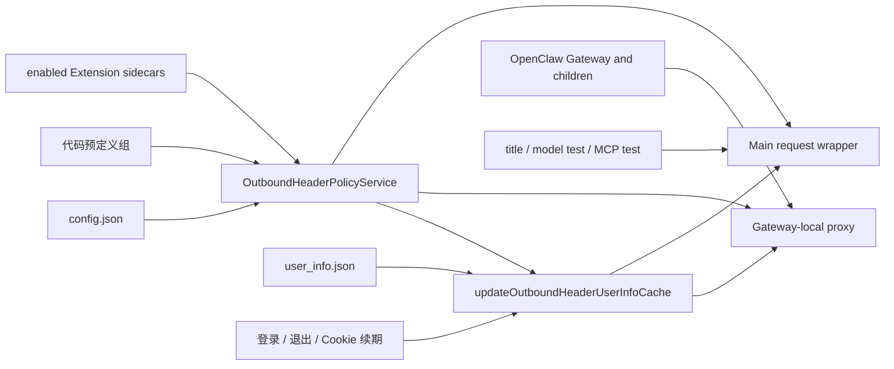

# Extension 出站请求头策略

## 1. 目标

Extension 可以随包声明自己的 HTTPS 请求头注入规则。用户安装并启用 Extension 后，
JustDo 自动让规则在两类请求中同时生效：

- OpenClaw Gateway 及其子进程：走 JustDo 为该 Gateway 单独启动的本地代理；
- JustDo Main 自己发出的标题生成、模型测试和 MCP 测试请求：在 Main 请求入口直接应用同一份策略。

保留现有手工 `config.json`，供开发者临时添加或覆盖请求头。Extension 只是增加声明来源，
不取代手工配置。

## 2. 设计结论

生效条件只有三项：Extension 已安装、已启用、声明文件合法。

本功能不增加独立的权限弹窗、审批令牌、授权记录、SQLite 表或 Renderer 状态。Extension 的
安装和启用已经是用户动作，不再为同一个动作叠加第二套授权协议。OpenClaw 自己已有的通用
Extension 能力审查保持原样，但与出站请求头声明无关。

Extension 根目录可选包含：

```text
outbound-header-policy.json
```

没有该文件的 Extension 行为不变。文件存在但无效时，该 Extension 的规则不生效并记录脱敏
诊断；不降级为不受约束的规则。

## 3. 声明格式

```json
{
  "schemaVersion": 1,
  "groups": [
    {
      "baseUrlWhitelist": ["https://api.example1.com/v1/"],
      "headerNames": ["X-Example1-Account"]
    }
  ]
}
```

约束：

- 仅支持 `schemaVersion: 1`；
- 仅支持绝对 `https://` URL；
- URL 路径末尾的 `/` 可省略，统一按 origin、端口和路径边界匹配；
- 禁止 localhost、loopback、链路本地地址和带用户名密码的 URL；
- 禁止 `Host`、`Connection`、`Content-Length`、`Proxy-Authorization` 等传输层头；
- 请求头值固定从 `user_info.json` 的同名 key 读取；
- 声明文件只描述“在哪里添加哪个头”，不保存密钥值。

## 4. 合并规则

`OutboundHeaderPolicyService` 每次 reconcile 都重新读取：

1. 代码中的默认策略；
2. 用户手工 `config.json`（缺失时自动创建空默认配置）；
3. 当前安装清单；
4. 每个已启用 Extension 的合法 sidecar；
5. `user_info.json` 中对应的值。

等价规则为：

```text
effective = manual.enabled
  ? builtIn.groups + manual.groups + enabledExtensions.validSidecarGroups
  : []
```

缺少 `config.json` 时创建空的 `DEFAULT_OUTBOUND_HEADER_POLICY_CONFIG`。无效文件（包括旧版无 `groups`
的格式）会重写为 `DEFAULT_OUTBOUND_HEADER_POLICY_CONFIG`，其 `groups` 为空。预定义组只存在于
代码中，不写入文件。旧版本写入的预定义组在合并时去重。
`config.json` 的全局 `enabled` 仍是总开关。同名头冲突和 URL 匹配继续沿用现有
代理语义。Extension 规则带 owner id 仅用于诊断，不单独持久化。

服务生成 canonical digest，用于判断有效策略是否变化以及是否需要刷新运行时。digest 不是
授权凭据，也不写入数据库。

## 5. 生命周期

### 启动

Main 在启动 Gateway 前 reconcile 策略。若存在有效规则，则确保本地代理已启动，并把代理环境
只注入到受管 Gateway 进程。Main 请求入口同时读取同一份已激活快照。

### 安装

安装前校验来源 sidecar，尽早拒绝无效包；安装成功后再从最终安装目录严格读取。最终安装目录是
运行时权威，合法内容自动进入 reconcile；若有效策略变化，刷新 Gateway 网络运行时。

本地安装和 Marketplace 安装遵守同一规则，不增加 Marketplace 专用审批分支。

### 启用与禁用

状态写入成功后 reconcile。只有有效策略 digest 变化时才额外刷新网络运行时；OpenClaw 返回的
常规 `restartRequired` 仍照常处理。

### 卸载

卸载成功后 reconcile，已不存在的 Extension 自然从有效策略中消失，无需删除授权记录。

## 6. 两条数据路径



代理只绑定 loopback，并只服务 JustDo 管理的 Gateway 环境。Main 请求不能绕到该代理里复用，
否则容易形成代理递归；它必须在请求封装层直接注入。

Renderer 的通用 fetch IPC 不获得注入能力。模型设置页必须声明受限的 discovery/test purpose，
Main 再校验 method、模型 endpoint、header 与 body，并重建固定的连接测试请求；标题生成和 MCP
探测使用各自的 Main 内部入口。

两条路径必须共享 URL 规范化、路径边界、头冲突和敏感信息脱敏规则，避免行为漂移。

## 7. 重定向与失败策略

标题生成、模型探测和 MCP 探测都拒绝自动重定向，避免任何已注入 Header 被带到第二个目标。

失败处理策略：

- 手工配置无法解析或结构非法：重写为空默认配置，继续合并代码预定义组和已启用扩展组；
- 导入来源的 sidecar 无效：导入失败；
- 已安装 Extension 的 sidecar 后续损坏：排除该 Extension 的全部规则；
- 已安装 Extension 清单无法可靠读取：不沿用可能过期的 Extension 贡献；
- 代理无法启动：不启动依赖代理注入的 Gateway generation。

日志只记录 Extension id、目标 origin、匹配结果和错误类别；不得记录请求头值、完整
credential 对象、URL query 或代理认证信息。

## 8. 代码边界

- `src/shared/openclaw/outboundHeaderPolicy.ts`：sidecar 类型和文件名；
- `src/main/plugins/extensions/extensionNetworkPolicyManifest.ts`：解析、规范化和校验；
- `src/main/core/network/outboundHeaderPolicyService.ts`：手工配置与 Extension 规则合并；
- `src/main/core/network/outboundHeaderProxy.ts`：Gateway/子进程数据面；
- `src/main/core/network/mainProcessFetch.ts`：Main 自有请求数据面；
- `src/main/plugins/extensions/openclawExtensionImportService.ts`：安装、启停、卸载后的 reconcile；
- `src/main/main.ts`：代理与 Gateway generation 生命周期。

Renderer、preload 和 SQLite 不承担本功能状态。

## 9. 验收

- 手工 `config.json` 单独使用时行为保持不变；
- 安装并启用带合法 sidecar 的 Extension 后，无额外弹窗即可对两条数据路径生效；
- 禁用或卸载 Extension 后规则立即从新 generation 消失；
- 无效 sidecar、危险 URL 和危险传输头被拒绝；
- Main 重定向不会把策略头带到不匹配目标；
- Gateway 子进程得到隔离的代理环境，其他进程不受影响；
- 日志和错误中不出现请求头值。

发布前除单元测试外，还需用真实 HTTPS echo 服务验证 Node、curl、内置 Python、OpenClaw 客户端
以及标题生成、模型测试、MCP 测试。mock 测试不能代替 packaged 环境的证书和代理兼容性验证。
