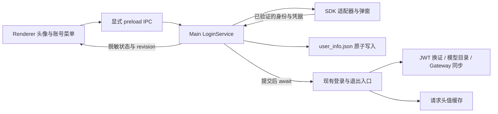

# 登录 SDK 接入模板

## 范围与当前行为

左侧窄导航栏底部提供账号头像入口，设置齿轮保留在其下方。收起主页聊天列表或切换功能页时，
头像仍可使用；账号菜单通过 Portal 展示在导航栏右侧，避免被聊天列表或外壳裁切。未登录时点击头像
直接调用 SDK 登录入口，不先展开账号菜单；取消或成功时保持菜单关闭，仅失败时展开单行错误提示。
登录成功或导入本地账号后，入口显示用户名首个可见字符的圆形徽标，按 grapheme 提取完整组合字符；
用户名为空时使用账号首字符，
不使用 SDK 的头像图片。已登录点击徽标打开账号菜单，可退出或重试服务更新。
登录弹窗由 SDK 适配器拥有。当前仓库没有真实登录 SDK，默认适配器明确返回不可用，
界面提示登录组件尚未接入；不生成临时账号、模拟凭据或自制登录表单。

模板已实现账号状态投影、可信 SDK 结果的提交、凭据原子写入、登录/退出后的服务更新、
取消与迟到结果保护、失败重试，以及 Cookie 更新与 mtoken 轮换的 Main 内部接入点。
真实登录 UI、身份服务、远端撤销和 Cookie 自动续期调度由后续开发者接入。

## 所有权与数据流



Main 是账号流程的权威。Renderer 只可查询状态、发起登录、退出和重试服务同步。
新接口只允许主应用窗口的 main frame；Browser guest、SDK 页面和其他窗口不获得账号 IPC。
登录凭据、SDK 原始结果、Cookie、JWT 和请求头值不进入 Renderer、Redux 或产品数据库。
Main 注入现有 `refreshAfterLogin`、`refreshAfterLogout` 和请求头值刷新回调；领域模块不反向导入 `main.ts`。

## 状态与失败语义

账号状态是 `signed-out`、`signed-in` 或 `local-credentials`。最后一个仅表示本地文件具备
mtoken 和账号，不宣称 SDK 已确认会话有效或模型服务已就绪。SDK 确认登录或恢复后才展示 `signed-in`。
操作状态与 `idle/pending/completed/failed` 服务同步状态单独维护；completed 仅表示现有入口正常返回。
模型凭据、目录与运行时可用性仍由已有模块判断。

登录取消不修改账号或文件。登录写入失败不执行登录刷新。登录已提交但换证/运行时同步失败时
保留账号与文件，提供重试。退出先删除整个登录文件，再更新请求头与模型状态；运行时清理失败
仍保持已退出，并允许重试清理。SDK 远端清理失败不恢复本地凭据。

多个登录点击共享一个弹窗；退出和应用销毁立即取消待提交登录。账号文件修改与服务回调使用
同一个串行队列。SDK 即使忽略 AbortSignal，旧结果也不能写入。替换账号先删除旧文件并完成
退出刷新，再写入新账号，避免继承旧目录和工具 Header。

## SDK 适配器合同

替换 `src/main/core/app/auth/loginSdkAdapter.ts` 的 `createLoginSdkAdapter`，保留以下边界：

- `available`：真实 SDK 是否已安装并配置。
- `login({ signal })`：用注入的 `getParentWindow()` 为 SDK 弹窗指定父窗口。
  用户关闭弹窗返回 canceled；完成可信身份验证后返回 authenticated 与 Main-only session。
  abort 时关闭弹窗、清除监听器，并拒绝后续回调。
- `restoreSession({ signal, profile })`：可选；使用 SDK 自己的会话验证能力确认身份。
  不可仅根据传入的显示资料返回 true。
- `logout({ signal })`：可选；清理 SDK 自己的会话/远端会话。本地凭据清理由产品负责。
- `refreshCredentials({ signal })`：可选；供后续 Main 续期协调器使用，不向 Renderer 开放。
- `dispose()`：可选；应用退出时取消 SDK 自己的续期任务并移除会话监听器。

SDK session 必须提供 `account` 与长期 `mtoken`，可提供 `displayName`、HTTP(S) `avatarUrl`、
`headerValues`（例如 `X-Cookie`）和 `cookieExpiresAt`（Unix 毫秒）。产品映射为
`X-User-Account`、`mtoken`、`userName`、`avatarUrl` 和对应 Header 字段，并记录 loginTime。
Header 值不允许控制字符；SDK 不能通过 headerValues 覆盖账号、mtoken、Authorization、派生 JWT 或显示/有效期元数据。
如果 SDK 只能在 Renderer 运行，后续开发者必须在 Main 交换或验证其结果；不得新增接受
`loggedIn: true` 或任意凭据对象即启用模型的接口。

SDK 登录需要设备标识时，应与模型换证共用 Main 的 `src/main/core/network/macAddress.ts`
导出的 `getMacAddress()`：返回去冒号的大写 MAC；没有可用 MAC 时处理失败，不生成 UUID，
不保存设备 ID 文件，也不在 Renderer 或 shared 中读取系统网卡。

## Cookie 与 mtoken 更新

Cookie 的半天有效期与 mtoken 的长期有效期独立；JWT 由已有模型凭据监控器续期。
每次异步续期开始前，Main 协调器从 LoginService 捕获 credential lease，完成后提交：

```ts
const lease = service.captureCredentialLease();
if (!lease || !adapter.refreshCredentials) return;
const update = await adapter.refreshCredentials({ signal });
await service.updateCredentials(lease, update);
```

Cookie 更新合并当前文件并保留 mtoken、账号和其他工具字段，原子写入后仅刷新请求头值缓存。
mtoken 改变则重新执行完整登录刷新以换取新 JWT。lease 同时绑定账号 generation、mtoken/账号身份
和完整文件内容的版本散列（仅 Main 可见）。退出、重新登录、Cookie 提交、mtoken 轮换或文件内容
被外部更新会使旧 lease 失效；每次续期须重新捕获，过时的结果不改文件或界面。
SDK 确认会话失效时可调用 `expireSession(lease)`；队列执行时会重新检查 lease 和磁盘版本后才删除
凭据，避免清理等待期间替换的文件。不能把一次网络失败当成退出。

后续续期调度必须先确认 SDK 是否自行自动续期。应用自己调度时，在 Main 根据 SDK/服务端提供的
过期时间提前刷新；登录后开始，退出/销毁时停止，恢复启动与休眠唤醒时检查。失败采用有界退避，
Cookie 真正过期后停止使用过期值；Cookie 过期不等同于 mtoken 或账号会话失效。
未配置 SDK 时不启动模拟定时器。当前接口不自动判断 Cookie 到期，也不能替身份服务获取新 Cookie。

## 手工凭据联调

无需为了手动导入新增开发入口。现有启动流程继续读取由 `resolveOutboundHeaderUserInfoPath()`
解析的文件、换取 JWT、发现模型、同步 Gateway 并启动模型凭据监控。账号模板在其后仅恢复显示，
不重复启动换证或轮询，也不以 SDK 可用性限制模型启动。

文件路径是 `<app.getPath('appData')>/<productName>/huawei/user_info.json`；Windows 默认
`%APPDATA%/<productName>/huawei/user_info.json`。隔离开发模式也使用这个固定产品路径，
产品数据库仍属于各自 userData；模型换证的 deviceId 每次由 Main 公共模块读取当前 MAC，
不读写 `model-device.json`。

联调步骤：配置真实的 tokenExchangeUrl、JWT 生命周期上限和内置模型 baseUrl；完全退出应用；
复制包含同一账号 mtoken、X-User-Account 和有效 Cookie 的文件；为需要 Header 的真实服务
配置 outbound-header-proxy/config.json；重新启动。分别验证目录出现和消息调用。
手动更新 Cookie 后完整重启以更新值缓存；设置页刷新模型不保证更新 Cookie。
这些配置修改需要重启 Electron 开发进程或重新构建安装包，文件中的真实凭据不能提交。

## 验收

自动测试覆盖 SDK 缺失、手工导入、取消、原子写入失败、登录后刷新失败与重试、退出清理失败、
账号替换、重复点击、迟到回调、Cookie 保留 mtoken、mtoken 轮换、过时 lease、应用销毁、
状态脱敏、IPC 来源限制和界面 revision 竞态。真实 SDK 接入后另验弹窗父子关系、远端身份验证、
abort 清理、会话恢复、过期时间与休眠唤醒调度。现阶段不承诺真实服务已联调。
