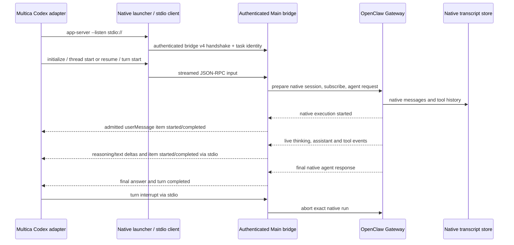

# Multica integration

JustDo exposes a local Codex-compatible app-server to Multica. The installed
Multica 0.6.1 adapter can consume tool activity and final answers without changes
to its code. OpenClaw remains the execution engine and transcript authority.
The previous external OpenClaw CLI command interface has been removed.

## Setup

Enable Multica integration in application settings and copy the displayed launcher
command. In Multica, create or edit a runtime with **Base protocol `codex`** and
that command, without extra arguments. Select this runtime for the Multica agent.
Keep the application running, including in its tray. Existing OpenClaw-provider
runtime profiles must be changed to Codex; old conversations are not migrated.
Start a new Multica conversation after switching protocols. For a Windows
development checkout, `npm run electron:dev` rebuilds the launcher automatically;
`npm run multica:dev-agent` can also rebuild it while the application is running.
Isolated development uses its own data directory and launcher. Packaged builds
generate the launcher during packaging.

Model discovery (`debug models` and `model/list`) lists enabled, configured chat
models with available provider credentials. Model IDs are provider-qualified
native catalog routes, and labels include the model and provider name. Assistant
names are not model IDs. New conversations use the `main` assistant and the
application's configured default unless Multica selects a model explicitly.
Refresh Multica's runtime model catalog and select a real model when an existing
agent still has a cached assistant ID such as `main` in its model setting.

Resume retains the existing assistant and confirmed model unless Multica selects
a different enabled model. The selection belongs to that connection until it
acquires the conversation's execution reservation. After native preparation,
the existing application model-mutation queue applies the choice and confirms
the Gateway's resolved identity before execution starts. Failed confirmation
does not launch a task; the application-wide default is not changed. Permissions,
skills and tools remain managed in the application. Unsupported execution
overrides and non-text inputs are rejected rather than silently discarded.
Multica's Codex reasoning controls and fast service tiers are not implemented.

## Flow and ownership

The Windows console launcher connects directly to the authenticated local named
pipe and flushes each input/output chunk. It does not launch an Electron GUI
subprocess: Electron's Windows entry closes stdin, which otherwise makes the
Codex initialize handshake exit before receiving input. POSIX launchers use
the application's stdio bridge entry. The authenticated bridge
uses a bounded newline frame buffer rather than a lifetime output cap, allowing
long conversations. Output is split into 64 KiB byte chunks and sent through a
FIFO queue capped at 64 MiB, including socket-buffered bytes. The queue admits
both native input-item notifications and waits for transport drain without
changing Codex JSON lines or UTF-8 bytes. Input EOF cancels the owned execution
immediately, independently of output drain. Disconnect and bridge shutdown abort
the owned turn.
Cancellation acknowledgement does not imply execution has settled: the turn's
terminal notification waits for native completion.

The native execution start publishes the accepted user input as a standard Codex
`userMessage` item exactly once. Multica's first-event watchdog otherwise stops a
turn after 60 seconds when the configured model is slow to return its first token.
The input item records real admission, without inventing model output or sending
periodic heartbeats. Multica's subsequent inactivity and execution timeouts still
apply. Preparation failure or cancellation before native start does not publish
an admitted input item.

Assistant text is streamed as `item/agentMessage/delta`. Each text segment keeps
one item ID through completion, so the final snapshot supplies only any missing
suffix in Multica. Tool boundaries complete preceding text as commentary; the
native final reply completes the last segment as `final_answer`. Provisional
native terminal-guard text remains buffered until commit and is discarded on
rollback. Thinking uses standard reasoning items and deltas.

Each turn owns a named native message subscription, so cleanup cannot remove
the browser extension's subscription. An uncertain transport outcome retains
the active-turn reservation until an authoritative native receipt is available.
Yielded runs wait for the session and its subagents to settle. Recovery reads
bounded history through the Gateway to locate the current continuation, then
checks its native run receipt; history alone never establishes success. These
recovery paths are covered by focused regression tests.

`cowork_external_sessions` stores only external/native identity and lifecycle
metadata. Scope includes the Multica server, workspace and agent. Resume checks
ownership, cwd, assistant availability and the surviving local conversation.
Deleted or mismatched conversations cannot be recreated through resume.

Multica checks for a local Codex rollout filename before permitting resume. The
adapter writes a single identity-only `session_meta` marker under the supplied
`CODEX_HOME/sessions` directory, which Multica may link to its per-chat store.
It contains no messages, tool results or usage counts. Native OpenClaw storage
continues to own the complete conversation. Local external conversations remain
read-only in the application.

## Boundaries

This is an application runtime, not a general Codex binary. Supported commands
are `--version`, `debug models [--bundled]` and `app-server --listen stdio://`.
The reported version is the actual application version.

Multica receives tool names, arguments, start/completion status and streamed
assistant text. Its current Codex adapter reduces MCP results to
status/duration/error. Reasoning events update its activity watchdog but are not
rendered by the installed 0.6.1 adapter. No fabricated reasoning or usage is sent.
Task-specific Codex MCP configuration and shell environment injection are not
implemented; configure execution tools in the application. Task credentials
are used for integration identity validation and are not copied into prompts or
the shared Gateway environment. This verification covers local tool tasks, not
Multica API tool calls from the executing model.

## Verification

On 2026-10-05, the installed Multica 0.6.1 daemon ran the production launcher,
bridge client/server, Codex session/backend and Gateway execution modules through
an isolated test host with its own product SQLite database. The host connected
to the user-started application's Gateway. The harness replaced application
startup and router preparation, not the stdio protocol or event projection.

Multica recorded `write` then `read` tool events before the final answer
`PRODUCTION VERIFIED maple-4816`. A subsequent task resumed the conversation,
read the same file and returned `PRODUCTION RESUMED maple-4816`. This validates
installed-adapter event ingestion; it is not a visual UI inspection or a packaged
installer test. See the exploration report for the earlier protocol investigation.

Cancellation was also verified: the adapter received the exact active-run abort
and native execution settled 245 ms later; Multica reported the task cancelled.

The initial isolated host did not cover the Windows Electron stdio entry. On
2026-10-08, a real development launcher exposed both stale generated launcher
paths and the Electron stdin EOF. The Windows launcher now uses the local pipe
directly; compiled-executable regression tests cover initialize before stdin EOF,
split UTF-8 input, environment filtering, model discovery and unexpected disconnect.
Multica's static GPT catalog is a discovery-failure fallback, not the application's
catalog. Refresh the Codex runtime's models after rebuilding a stale launcher.

The subsequent real Windows run initialized successfully but exposed the
60-second first-event watchdog: the native model request had not produced any
thinking, text or tool event when Multica closed the connection, which correctly
aborted the native run. The admission item and live text/reasoning projection
cover that protocol gap. Focused tests also cover snapshot-to-delta conversion,
stable final item identity, native guard rollback/token isolation and interrupted
partial output.

After restarting the actual development application on 2026-10-08, the installed
Multica daemon completed a 114-second task through the Windows launcher and
application bridge. It recorded `write`, a 75-second foreground `exec`, then
`read`, each with start/result events, before the single final text
`ACTUAL VERIFIED stream-6491`. Its first-item diagnostic recorded progress at
8.5 seconds, before the first tool event. A second task resumed the same thread
and directory, read the file and returned `ACTUAL RESUMED stream-6491` once.
These checks used Multica's stored task events and chat results, without a
replacement application host or changes to Multica.

For the subsequent reported display delay, the application emitted assistant
text at 23:42:15.319 and the installed Multica daemon recorded the text at
23:42:15.321. The local bridge added about 2 ms. Multica's cloud task-message
upload then hit its five-second HTTP deadline; its completion upload finished
later at 23:42:38.275. Local event receipt does not imply cloud persistence or
UI refresh. The bridge cannot remove downstream network/upload delays.

On 2026-10-09, after restarting the actual application, forced model discovery
through the installed Multica daemon returned `opencode/glm-5.3-flash` and
`opencode/mimo-v2.5-pro` with model/provider labels. The verification agent
explicitly selected the first model and returned `MODEL VERIFIED glm-5.3-flash`.
Changing its model and resuming the same thread returned
`MODEL RESUMED mimo-v2.5-pro`. Native Gateway run-start records confirmed both
models on the same native session, and Multica stored one text message for each
completed task. These checks verify model discovery, selection and switching;
neither changed the application-wide default.

Transport regression tests also exercise the real Codex session/progress path
over a local pipe with a 7 MiB escaped input. Both admission items arrive intact
in bounded frames, including Unicode. A separate paused-reader test confirms
stdin EOF cancels the native execution before the reader resumes.
