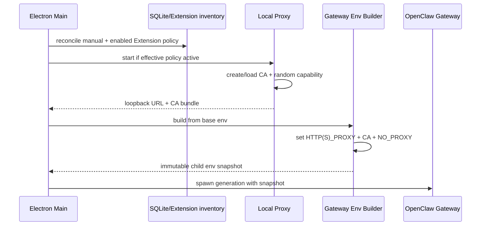
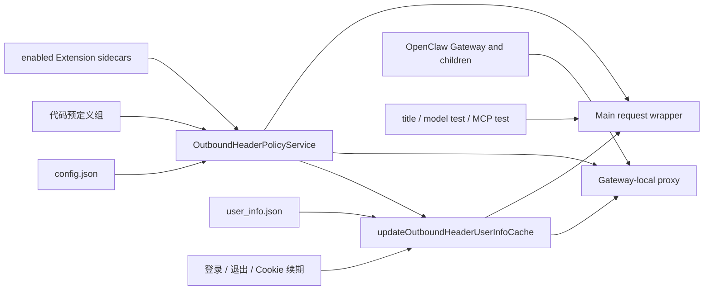

# 出站请求头：策略、代理与生命周期

本文是出站请求头的现行实现说明，统一维护 Extension 声明、手工策略、Main 注入与 Gateway 代理。配置与可分发样例见[接入指南](../../developer-integration/outbound-headers/README.md)，登录后的值刷新接口见[开发接口](../../developer-integration/outbound-header-user-info-refresh-api.md)。原审计基线为 OpenClaw v2026.9.2；本文的策略与生命周期已结合当前实现核对，打包客户端和企业代理组合仍须实际验收。

## 1. 功能目的

OpenClaw Gateway、其支持的 tool 子进程，以及显式 opt-in 的 OpenClaw one-shot CLI 访问指定
远端 URL 时，JustDo 可以注入一组共享校验 Header。当前 memory index CLI 会 opt-in，搜索使用 Gateway RPC，
使查询和重建索引产生的 embedding 请求与 Gateway 请求使用同一 URL policy。典型用途是让远端
服务识别来自本地 Agent 环境的授权请求。

真正的授权必须由远端服务验证 Header 并拒绝缺失/无效值。本地代理只是注入机制，不是防火墙，也不能约束主动忽略代理环境的网络程序。

明确不在数据面内：

- Electron Renderer 的普通网络请求；
- Electron Main 的更新、配置同步等请求；
- Gateway 进程树及显式 opt-in CLI 之外的其他程序；
- 不匹配 URL 白名单的请求 Header 注入。

Main 中少量确需相同 Header 的确定性调用（当前包括模型测试、会话标题生成与 MCP“测试”探测）应在调用点基于白名单显式注入，不得通过全局 `fetch` monkey patch。MCP 探测只为 probe transport 注入，普通 resource 读取不因此扩大策略范围；probe fetch 拒绝自动重定向，避免已注入 Header 被带到未重新匹配白名单的目标。
Renderer 的通用 fetch IPC 默认不注入；模型 discovery/test 必须携带受限 purpose，Main 校验 HTTP
method、允许的模型 endpoint、header 与 body，并重建固定的连接测试请求后才应用策略。

## 2. 安全不变量

1. 只有 Gateway generation 和显式 opt-in 的受管 CLI 获得本地 proxy URL、CA 和 capability。
2. 未认证的 loopback 客户端不能使用代理。
3. 未命中完整 URL 白名单时绝不注入业务 Header。
4. `Proxy-Authorization` 只用于本地/上游代理，不转发给目标服务。
5. Header 值、代理密码、capability 和 CA 私钥不进入日志。
6. Main/Renderer 的全局 `process.env` 和 Chromium 网络栈不被修改。
7. 并发请求使用独立 request context 与 headers。
8. 普通 loopback 保持 direct，不因 LiteLLM 或 Header Proxy 被整体劫持。

## 3. 当前组件

| 组件                | 代码                                                               | 职责                                                |
| ------------------- | ------------------------------------------------------------------ | --------------------------------------------------- |
| 配置解析            | `outboundHeaderPolicyConfig.ts` / `outboundHeaderPolicyService.ts` | 合并手工配置与已启用 Extension 声明                 |
| 本地代理            | `src/main/core/network/outboundHeaderProxy.ts`                     | 认证、CONNECT 判别、MITM/raw tunnel、注入           |
| OpenClaw 环境       | `src/main/core/network/gatewayNetworkEnvironment.ts`               | 为 Gateway/opt-in CLI 生成 proxy/CA/NO_PROXY env    |
| Embedding transport | `runtime-services` extension                                       | 让 guarded fetch 使用 eligible env proxy            |
| Manual reindex      | 原生 forced CLI rebuild intent                                     | 重建语义由原生运行时处理，不再依赖已退役的 009 补丁 |
| Runtime lifecycle   | `openclawEngineManager.ts` / `main.ts`                             | 先起代理、再 spawn Gateway；退出时反序停止          |
| 用户值来源          | outbound header user-info 文件/cache                               | 只按允许的 headerNames 读取值                       |

`OutboundHeaderProxy` 使用 `http-mitm-proxy`，并针对库的连接错误和内部行为做有限适配。依赖私有 hook 是维护风险，升级库时必须跑真实 TLS 集成测试。

策略文件使用 `groups` 数组表达多组映射；每组的 `baseUrlWhitelist[]` 只对应本组的
`headerNames[]`。请求只注入所有命中组的 Header；同一请求命中多组时按组顺序合并，并按
HTTP Header 大小写不敏感语义去重，保留最先出现的名称。
旧的顶层 `baseUrlWhitelist` / `headerNames` 格式不再接受。`config.json` 是永久支持的手工策略
入口；`overwrite` 仅作为废弃兼容字段解析，不再触发启动覆写。Extension 贡献来自各自根目录的
`outbound-header-policy.json`，在内存中合并，绝不写回手工文件。

## 4. 启动与环境隔离



策略未启用或白名单为空时 `start()` 返回 null。启用时代理绑定 loopback 随机端口，在用户数据目录创建 CA，并为当前 generation 生成 32 字节随机 base64url capability。新 CA 的 Subject 带有由公钥标识派生的唯一后缀，不再复用 `http-mitm-proxy` 默认的固定 `CN=NodeMITMProxyCA`；否则 Windows 系统证书库中残留的同名旧 CA 可能被 OpenSSL 选为错误签发者，导致 `CERT_SIGNATURE_FAILURE`。启动 preflight 会验证 CA 自签名、CA 与缓存站点证书有效期、公私钥和签发关系，发现旧固定 Subject、不完整文件、尚未生效或过期的证书、密钥不匹配或跨 CA 叶子证书时，只清理应用生成的 `certs/`、`keys/` 后重建，不修改系统证书库。Gateway proxy URL 使用 Basic auth 携带 capability。

环境只传给 Gateway/后代和显式 opt-in CLI，不写回 Main `process.env`。Memory search 走 Gateway
原生 RPC，memory index CLI 显式 opt-in，memory status 保持普通继承环境。CA bundle 通过 Node、Python 等常见环境变量进入受支持
客户端；OpenClaw embedding provider 由 `runtime-services` 让 guarded fetch 使用 eligible
env proxy。未配置代理、命中 `NO_PROXY` 或未命中 Header URL 白名单时，分别保持直连、bypass 或
不注入业务 Header。

手动“重建索引”通过 OpenClaw 原生 `force: true`、`reason: "cli"` 意图触发，缓存与重建由原生运行时处理。当前版本不再依赖旧 `009` 补丁；是否需要重建按真实原生回执判断，不从代理收到请求与否推断成功。补丁处置统一见[当前补丁总账](../../../scripts/patches/v2026.9.8/README.md)。

## 5. 请求处理

### 5.1 HTTP

明文 HTTP 请求必须提供本地 Proxy-Authorization。代理验证后移除凭证、解析绝对 URL、选择上游路径，再按完整 URL 匹配白名单。只有匹配时才复制业务 Header 到该请求的 upstream headers。

### 5.2 HTTPS CONNECT

CONNECT 首先验证 capability 和 `host:port`。连接建立后读取首个 tunnel 数据包，区分 HTTP/TLS：

- origin 是拦截候选时交给 MITM 路径；
- 非候选 origin 使用 raw tunnel，不生成站点证书、不解密内容；
- 解密后的 request authority 必须与 CONNECT authority 和 forwarding target 一致；
- 最终仍按 scheme/host/port/path 的完整 URL 判断是否注入。

选择性 MITM 最细只能在 CONNECT 阶段按 origin 决定。某 origin 只要存在任一白名单 path，该 origin 的其他 path 也会经过本地 TLS 解密，但不会注入 Header。这是 HTTPS 协议边界，不能声称做到同 origin 的 path 级“不解密”。

### 5.3 Raw tunnel

非候选 HTTPS 保持端到端 TLS，只由本地代理转发 socket。它可能经过配置的上游 HTTP proxy，但本地看不到请求 path 或 header。CONNECT 解析失败、authority 不合法或 capability 失效时 fail closed。

## 6. URL 与 Header 策略

每个分组都有独立的 base URL 白名单与 Header 名列表。白名单匹配必须规范化
scheme、hostname、port 和 path 边界，防止：

- `example.com.evil.test` 伪装 hostname；
- `/api2` 误匹配 `/api`；
- redirect 到不同 origin 后继续携带 Header；
- CONNECT host 与请求 Host 不一致；
- 用户 URL 凭证或 fragment 参与错误匹配。

本地 loopback URL 不能加入白名单，包括 `localhost`、`.localhost` 子域、任意
`127.x.x.x`、`0.0.0.0`、`::1` 和 IPv4-mapped IPv6 loopback 地址；这些条目会被忽略，
请求保持直连且不会注入 Header，以避免代理递归和扩大本地流量暴露面。

Header 名只需满足 HTTP field-name 语法，不强制 `X-` 前缀。Header 值在注入前检查 CR/LF 等不安全字符。已有同名 header 采用大小写不敏感替换，不能同时存在两个大小写变体。

默认构造的代理会在请求时读取当前配置和用户值，使已有 interception origin 内的 path/value 变化可反映；但 `start()` 固化的候选 origin、CA、capability 和 Gateway env 不会自动扩展到全新 origin。生产级配置变更仍应受控重启 Gateway generation 与 proxy，不能把局部动态读取当完整热重载。

## 7. 本地 Capability

代理监听 loopback 仍不能假定只有 JustDo 可访问。同一用户的其他进程可以连接本地端口，因此每个 HTTP 请求或 CONNECT 必须携带随机 capability。

- 验证使用 constant-time 比较；
- 认证后从 headers 中消费 Proxy-Authorization；
- CONNECT 与解密后的请求通过 WeakMap 绑定 capability；
- rotation 会销毁已认证 tunnel，生成新 capability；
- stop 清空 capability、policy、headers 和 socket 集合。

Capability 是 generation scoped bearer secret。不能写日志、配置文件或 Renderer 状态。

## 8. 上游代理与 NO_PROXY

Gateway 到本地代理是第一跳；本地代理到目标或企业代理是第二跳。`buildGatewayEnvironment` 会：

- 保存父环境的 NO_PROXY 供第二跳判断；
- 从 Gateway 第一跳环境移除会与远端白名单冲突的 bypass，使匹配请求确实到达本地代理；
- 重新加入应用定义的普通 bypass/loopback；
- 对冲突记录脱敏告警，不泄漏认证。

固定上游 HTTP/HTTPS proxy 可用于普通请求和 CONNECT。PAC 的有序多候选、显式 DIRECT fallback、SOCKS 与复杂认证不能被单个 URL 完整表达，当前不应宣称支持。固定代理失败时也不能静默直连，除非配置语义明确允许。

## 9. 并发模型

原生产问题是多个并发请求只有部分携带 Header。当前实现针对主要共享状态风险采取：

- active policy/header snapshot 为只读；
- 每次请求独立计算 URL、upstream route 和 headers；
- 首次 TLS 证书初始化由补丁/测试约束并发行为；
- capability 不在普通 request completion 时旋转；
- 代理/环境生命周期与 Gateway generation 绑定。

排查类似问题应按三层证据：

1. 三个客户端请求是否都遵循 proxy env；
2. 代理是否看到三个 request id 且匹配同一规范化 URL；
3. echo server 是否收到三个 Header。

不能仅看最终服务端结果就认定是 Header 对象竞态。

## 10. 可观测性

允许记录：request id、origin、matched、注入 header 数、route 类型、耗时和错误类别。禁止记录完整 URL query（可能含 token）、Header 值、Proxy-Authorization、上游密码、capability 与 CA 私钥。

当前匹配日志包含随机 request id、origin 和 injectedHeaderCount。生产诊断还应关联 Gateway generation，但不能通过把 secret 写入 correlation id 达成。

## 11. 生命周期与关闭顺序

启动顺序必须是代理 ready → 构建 Gateway env → spawn Gateway。关闭顺序必须让依赖方先停止：

1. 停止接收新的 Agent 工作；
2. 停止 Gateway 及其 tool 子进程；
3. drain/cancel 剩余连接；
4. 关闭本地代理和认证 socket；
5. 清理内存中的 capability/header snapshot。

当前 `main.ts` 的受控退出先停止相关 runtime，再 `outboundHeaderProxy.stop()`。若未来允许 proxy restart，必须创建新的 Gateway generation；已运行子进程不会自动读取新环境变量。

## 12. 已实现与未实现

已实现：

- Gateway generation 与显式 opt-in CLI 的环境隔离；
- loopback capability；
- candidate origin 的选择性 MITM；
- 非候选 HTTPS raw tunnel；
- 完整 URL 匹配后注入；
- CONNECT/forward authority 校验；
- 上游 HTTP proxy 与 NO_PROXY 二跳处理；
- loopback 白名单排除；
- Header 安全值检查和日志脱敏；
- capability rotation/stop socket 清理；
- 并发、环境和策略单元测试。

未完整实现或不保证：

- 任意客户端强制遵循 proxy/CA env；
- PAC 多候选、SOCKS 和所有企业代理组合；
- 新 interception origin 无重启热加入；
- path 级 HTTPS 不解密；
- 把代理当网络访问控制/防火墙；
- 所有平台打包环境的 curl/Python/Node/MCP 客户端兼容。

## 13. 测试矩阵

- policy：URL 规范化、host/path 边界、默认端口、redirect、非法 header；
- auth：HTTP/CONNECT 缺 capability、错误/过期 capability、rotation；
- TLS：候选 MITM、非候选 raw tunnel、authority mismatch、CA trust；
- concurrency：同 origin 首次 3/100 并发、不同 origin、慢请求与 stop；
- upstream：direct、固定 HTTP/HTTPS proxy、NO_PROXY 冲突、代理失败；
- scope：Main fetch 与 Renderer 不被注入，Gateway 子进程及 memory index CLI 被注入；
- clients：Node fetch/https、curl、bundled Python、OpenClaw network tool；
- secrets：日志和错误不含 Header 值、密码、capability。

真实 HTTPS echo server 的打包 E2E 是最终验收，mock `http-mitm-proxy` 只能证明控制流。

## 14. 维护结论

当前实现已经把 Header 注入从全局 Electron 网络副作用收敛到 Gateway generation 和显式 opt-in
CLI，并对非候选 HTTPS 保持 raw tunnel。最重要的剩余工作不是继续增加隐式兼容，而是维护受支持
客户端/上游代理矩阵、为配置变化执行明确 generation restart，并在升级 `http-mitm-proxy` 时验证
私有 hook 与并发证书行为。

## Extension 声明与策略合并

### 设计结论

生效条件只有三项：Extension 已安装、已启用、声明文件合法。

本功能不增加独立的权限弹窗、审批令牌、授权记录、SQLite 表或 Renderer 状态。Extension 的
安装和启用已经是用户动作，不再为同一个动作叠加第二套授权协议。OpenClaw 自己已有的通用
Extension 能力审查保持原样，但与出站请求头声明无关。

Extension 根目录可选包含：

```text
outbound-header-policy.json
```

没有该文件的 Extension 行为不变。文件存在但无效时，该 Extension 的规则不生效并记录脱敏
诊断；不降级为不受约束的规则。

### 声明格式

```json
{
  "schemaVersion": 1,
  "groups": [
    {
      "baseUrlWhitelist": ["https://api.example1.com/v1/"],
      "headerNames": ["X-Example1-Account"]
    }
  ]
}
```

约束：

- 仅支持 `schemaVersion: 1`；
- 仅支持绝对 `https://` URL；
- URL 路径末尾的 `/` 可省略，统一按 origin、端口和路径边界匹配；
- 禁止 localhost、loopback、链路本地地址和带用户名密码的 URL；
- 禁止 `Host`、`Connection`、`Content-Length`、`Proxy-Authorization` 等传输层头；
- 请求头值固定从 `user_info.json` 的同名 key 读取；
- 声明文件只描述“在哪里添加哪个头”，不保存密钥值。

### 合并规则

`OutboundHeaderPolicyService` 每次 reconcile 都重新读取：

1. 代码中的默认策略；
2. 用户手工 `config.json`（缺失时自动创建空默认配置）；
3. 当前安装清单；
4. 每个已启用 Extension 的合法 sidecar；
5. `user_info.json` 中对应的值。

等价规则为：

```text
effective = manual.enabled
  ? builtIn.groups + manual.groups + enabledExtensions.validSidecarGroups
  : []
```

缺少 `config.json` 时创建空的 `DEFAULT_OUTBOUND_HEADER_POLICY_CONFIG`。无效文件（包括旧版无 `groups`
的格式）会重写为 `DEFAULT_OUTBOUND_HEADER_POLICY_CONFIG`，其 `groups` 为空。预定义组只存在于
代码中，不写入文件。旧版本写入的预定义组在合并时去重。
`config.json` 的全局 `enabled` 仍是总开关。同名头冲突和 URL 匹配继续沿用现有
代理语义。Extension 规则带 owner id 仅用于诊断，不单独持久化。

服务生成 canonical digest，用于判断有效策略是否变化以及是否需要刷新运行时。digest 不是
授权凭据，也不写入数据库。

### 生命周期

#### 启动

Main 在启动 Gateway 前 reconcile 策略。若存在有效规则，则确保本地代理已启动，并把代理环境
只注入到受管 Gateway 进程。Main 请求入口同时读取同一份已激活快照。

#### 安装

安装前校验来源 sidecar，尽早拒绝无效包；安装成功后再从最终安装目录严格读取。最终安装目录是
运行时权威，合法内容自动进入 reconcile；若有效策略变化，刷新 Gateway 网络运行时。

本地安装和 Marketplace 安装遵守同一规则，不增加 Marketplace 专用审批分支。

#### 启用与禁用

状态写入成功后 reconcile。只有有效策略 digest 变化时才额外刷新网络运行时；OpenClaw 返回的
常规 `restartRequired` 仍照常处理。

#### 卸载

卸载成功后 reconcile，已不存在的 Extension 自然从有效策略中消失，无需删除授权记录。

### 两条数据路径



代理只绑定 loopback，并只服务 JustDo 管理的 Gateway 环境。Main 请求不能绕到该代理里复用，
否则容易形成代理递归；它必须在请求封装层直接注入。

Renderer 的通用 fetch IPC 不获得注入能力。模型设置页必须声明受限的 discovery/test purpose，
Main 再校验 method、模型 endpoint、header 与 body，并重建固定的连接测试请求；标题生成和 MCP
探测使用各自的 Main 内部入口。

两条路径必须共享 URL 规范化、路径边界、头冲突和敏感信息脱敏规则，避免行为漂移。

### 重定向与失败策略

标题生成、模型探测和 MCP 探测都拒绝自动重定向，避免任何已注入 Header 被带到第二个目标。

失败处理策略：

- 手工配置无法解析或结构非法：重写为空默认配置，继续合并代码预定义组和已启用扩展组；
- 导入来源的 sidecar 无效：导入失败；
- 已安装 Extension 的 sidecar 后续损坏：排除该 Extension 的全部规则；
- 已安装 Extension 清单无法可靠读取：不沿用可能过期的 Extension 贡献；
- 代理无法启动：不启动依赖代理注入的 Gateway generation。

日志只记录 Extension id、目标 origin、匹配结果和错误类别；不得记录请求头值、完整
credential 对象、URL query 或代理认证信息。

### 代码边界

- `src/shared/plugins/outboundHeaderPolicy.ts`：sidecar 类型和文件名；
- `src/main/plugins/extensions/extensionNetworkPolicyManifest.ts`：解析、规范化和校验；
- `src/main/core/network/outboundHeaderPolicyService.ts`：手工配置与 Extension 规则合并；
- `src/main/core/network/outboundHeaderProxy.ts`：Gateway/子进程数据面；
- `src/main/core/network/mainProcessFetch.ts`：Main 自有请求数据面；
- `src/main/plugins/extensions/openclawExtensionImportService.ts`：安装、启停、卸载后的 reconcile；
- `src/main/main.ts`：代理与 Gateway generation 生命周期。

Renderer、preload 和 SQLite 不承担本功能状态。

### 验收

- 手工 `config.json` 单独使用时行为保持不变；
- 安装并启用带合法 sidecar 的 Extension 后，无额外弹窗即可对两条数据路径生效；
- 禁用或卸载 Extension 后规则立即从新 generation 消失；
- 无效 sidecar、危险 URL 和危险传输头被拒绝；
- Main 重定向不会把策略头带到不匹配目标；
- Gateway 子进程得到隔离的代理环境，其他进程不受影响；
- 日志和错误中不出现请求头值。

发布前除单元测试外，还需用真实 HTTPS echo 服务验证 Node、curl、内置 Python、OpenClaw 客户端
以及标题生成、模型测试、MCP 测试。mock 测试不能代替 packaged 环境的证书和代理兼容性验证。
