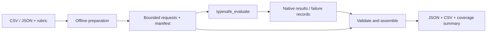
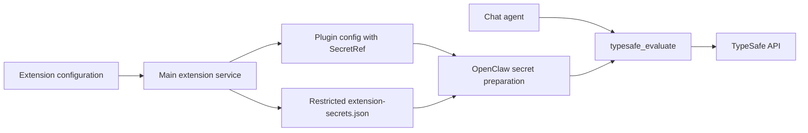

# Jev evaluations

The application bundles the upstream TypeSafe plugin as an optional extension.
The first integration exposes `typesafe_evaluate` to the existing chat agent;
the conversational model still controls when to call it. Jev supplies typed
classification, rubric scores, and Boolean probabilities, not chat responses.

## Setup and use

1. Open Plugins → Extensions → TypeSafe AI.
2. Enter the TypeSafe API key and save. An empty field preserves the saved key.
3. Enable the extension. Saving a credential does not enable it.
4. Ask the assistant to use Jev to classify supplied items, score alternatives
   against explicit criteria, or estimate whether a condition holds.

Hosted evaluation sends the supplied task evidence to TypeSafe and may incur
API charges. The bundled skill explains the input contract and limits. Results
and tool progress use the existing OpenClaw chat stream, with no transcript cache.
The default model is `jev-latest`; the tool supports an explicit `model` override,
including `jev-1.13.0`. Disabling the extension removes its runtime capability.

## Batch classification and scoring

The built-in `jev-batch-evaluate` skill provides the first concrete workflow.
It becomes eligible when TypeSafe is enabled and Python is available. For example:

> 用 Jev 分析 feedback.csv，只发送 text 列，保留 id。按故障、功能建议、使用咨询、其他分类，并按 0–3 级紧急程度评分，导出 CSV 和 JSON。

The assistant adapts the supplied labels and rubric, then uses the skill's
offline Python helper to prepare bounded requests. The native tool evaluates
each batch. The helper checks request hashes, record mappings, and complete typed
answer correspondence before producing `results.json`, `results.csv`, and
`summary.json`. Only selected evidence fields reach the provider; source IDs stay
in local mappings unless explicitly selected as evidence.

The summary distinguishes successful, missing, failed, and invalid batches.
Partial reports exit with code 2 and never fabricate answers. Completed batches
can be reused without another provider call. New output directories prevent
accidental overwrite. Selected labels, scores, and distributions are preserved;
review rules flag items without treating provider confidence as measured accuracy.
No rule means `not_assessed`, not approval. These are task artifacts, not a new
application database or automated task-routing service.

Runnable sample records, a rubric, and the full file contract live in
[`resources/skills/jev-batch-evaluate`](../../resources/skills/jev-batch-evaluate/SKILL.md).

## Ownership and credential lifecycle

The extension service reads bundled configuration hints as well as locally
installed extension hints. A field is stored as a SecretRef only when its
manifest declares the secret input and a structured reference schema. Existing
string-only plugin configuration remains supported.

Main stores these credentials separately in
`<OpenClaw state directory>/extension-secrets.json`, using the
`justdo-extension-secrets` file provider. It restricts the temporary file's
permissions before writing any credential, then publishes it atomically. The
configuration and renderer inventory contain no credential values. This is
filesystem access protection, not encryption at rest.

Changing credentials restarts an active Gateway through the existing restart
coordinator to refresh native prepared secrets, including rotations where the
reference itself is unchanged. Saving the same value is a no-op. Disabling the
plugin retains its credential for subsequent re-enablement.

If configuration publication or Gateway restart fails after rotation, a pending
refresh remains in the running application. Retrying the same key still refreshes
the Gateway; a new application process loads the saved key on startup.

Full, minimal, login, and logout synchronization preserve the explicit plugin
state, plugin settings, secret provider, and additional tool allowlist entries.
Existing nonempty `tools.allow` lists receive the optional tool directly;
otherwise synchronization uses `alsoAllow`, keeping empty allowlists unrestricted.
Explicit tool denies remain in force across full and authentication syncs.
The optional tool is admitted in both local and sandbox sessions; native plugin
disable and tool-deny policies still apply. Evaluation output does not grant
permission to perform actions.

## Packaging and verification

`openclaw-extensions/typesafe/UPSTREAM.md` records the reviewed upstream revision.
The local-extension pipeline installs its locked production dependency,
precompiles it against the host SDK, and preserves license files when pruning.
It does not depend on a future npm publication of `@openclaw/typesafe`.

Focused tests cover secret isolation and rotation, bundled credential editing,
default-off behavior, configuration persistence across lifecycle synchronization,
and optional tool admission. Real hosted validation requires an operator's API
key; synthetic credentials must never be sent to the public endpoint.

## Deferred work

This integration does not expose the separate global/per-assistant
`decisionModel` selector or introduce automatic business decision consumers.
Those should use Gateway `decisionModels` discovery and
`api.runtime.decisions.evaluate()` when added. Local Kev server setup is also
outside this UI flow; the upstream adapter remains unchanged.
