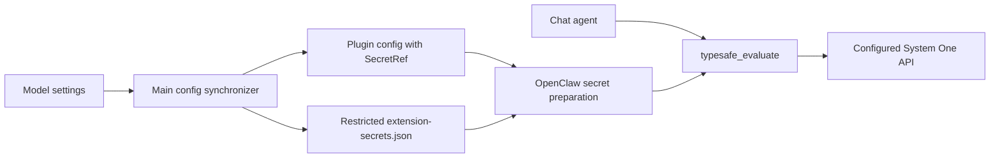

# Jev evaluations

The application bundles the upstream TypeSafe plugin as an optional extension.
The first integration exposes `typesafe_evaluate` to the existing chat agent;
the conversational model still controls when to call it. Jev supplies typed
classification, rubric scores, and Boolean probabilities, not chat responses.

## Setup and use

1. Open Settings → Models → Decision models and add a provider.
2. Enter the **URL and API Key**, both required. No account login or OAuth is offered.
   Hosted Jev uses `https://api.typesafe.ai/v1`; an intranet server might use
   `http://inference.corp:8009/v1`.
3. Detect models or add one manually when `/models` is unavailable, for example
   `jev-latest` for Jev or `kev-latest` for a deployed Kev server.
4. Select the default model and save. This enables TypeSafe and selects both
   the evaluation-tool default and native `agents.defaults.decisionModel`.
5. Ask the assistant to classify, score or estimate probabilities. The chat model
   decides when to call the evaluation tool; native decision consumers use the
   configured default. Saving a model does not create automatic business workflows.

The server must implement **TypeSafe System One**, not just OpenAI chat completions.
The API base is followed by `/systemone`; a full endpoint URL is normalized.
Requests go directly to the configured origin with Bearer auth, without redirects,
environment proxies or hosted fallback. Deploy self-hosted servers separately.
For a test server that ignores authentication, enter a nonempty test key; production
authentication must be enforced by the server or reverse proxy.

Once configured, this category owns TypeSafe settings and activation. Its extension
panel cannot independently edit or toggle it. Deleting all decision providers
disables TypeSafe and clears the native default. Users who have never configured
this category retain their existing extension settings. Provider import/export
includes decision models using the same credential encryption as other model types.

Evaluation sends task evidence to the selected service. Hosted Jev may incur API
charges. Results use the existing OpenClaw stream, without a transcript cache.

## Batch classification and scoring

The built-in `jev-batch-evaluate` skill provides the first concrete workflow.
It becomes eligible when TypeSafe is enabled and Python is available. For example:

> 用 Jev 分析 feedback.csv，只发送 text 列，保留 id。按故障、功能建议、使用咨询、其他分类，并按 0–3 级紧急程度评分，导出 CSV 和 JSON。

The assistant adapts the supplied labels and rubric, then uses the skill's
offline Python helper to prepare bounded requests. The native tool evaluates
each batch. The helper checks request hashes, record mappings, and complete typed
answer correspondence before producing `results.json`, `results.csv`, and
`summary.json`. Only selected evidence fields reach the provider; source IDs stay
in local mappings unless explicitly selected as evidence.


The summary distinguishes successful, missing, failed, and invalid batches.
Partial reports exit with code 2 and never fabricate answers. Completed batches
can be reused without another provider call. New output directories prevent
accidental overwrite. Selected labels, scores, and distributions are preserved;
review rules flag items without treating provider confidence as measured accuracy.
No rule means `not_assessed`, not approval. These are task artifacts, not a new
application database or automated task-routing service.

Runnable sample records, a rubric, and the full file contract live in
[`resources/skills/jev-batch-evaluate`](../../resources/skills/jev-batch-evaluate/SKILL.md).

## Ownership and credential lifecycle



The extension service reads bundled configuration hints as well as locally
installed extension hints. A field is stored as a SecretRef only when its
manifest declares the secret input and a structured reference schema. Existing
string-only plugin configuration remains supported.

Main stores these credentials separately in
`<OpenClaw state directory>/extension-secrets.json`, using the
`justdo-extension-secrets` file provider. It restricts the temporary file's
permissions before writing any credential, then publishes it atomically. The native
Gateway configuration and extension inventory contain no credential values.
Model settings persist credentials in the existing application config, just like
other model types; this application config is not an encrypted vault. This is
filesystem access protection, not encryption at rest.

Changing credentials in the extension dialog restarts an active Gateway through the existing restart
coordinator to refresh native prepared secrets, including rotations where the
reference itself is unchanged. Saving the same value is a no-op. Disabling the
plugin retains its credential for subsequent re-enablement.

If configuration publication or Gateway restart fails after rotation, a pending
refresh remains in the running application. Retrying the same key still refreshes
the Gateway; a new application process loads the saved key on startup.

Full, minimal, login and logout synchronization applies the settings selection
and preserves secret providers and additional tool policy. Model settings use
managed credential refresh (`secrets.reload` when only the key changed). Failed
runtime application triggers the existing app-config rollback flow.
Existing nonempty `tools.allow` lists receive the optional tool directly;
otherwise synchronization uses `alsoAllow`, keeping empty allowlists unrestricted.
Explicit tool denies remain in force across full and authentication syncs.
The optional tool is admitted in both local and sandbox sessions; native plugin
disable and tool-deny policies still apply. Evaluation output does not grant
permission to perform actions.

## Packaging and verification

`openclaw-extensions/typesafe/UPSTREAM.md` records the reviewed upstream revision.
The local-extension pipeline installs its locked production dependency,
precompiles it against the host SDK, and preserves license files when pruning.
It does not depend on a future npm publication of `@openclaw/typesafe`.

Focused tests cover secret isolation and rotation, bundled credential editing,
default-off behavior, configuration persistence across lifecycle synchronization,
and optional tool admission. Real hosted validation requires an operator's API
key; synthetic credentials must never be sent to the public endpoint.

The native adapter suite can be run offline against a prepared runtime:

```sh
npx vitest run --config scripts/openclaw/typesafe.vitest.config.mts
```

Set `OPENCLAW_RUNTIME` to use a different prepared SDK directory. It covers the
explicit endpoint, authentication failure without fallback, schema validation,
cancellation and existing upstream behavior; no real hosted key is used.

## Remaining scope

Per-assistant model selection, automatic business routing, model downloads and
server deployment are not added. Explicit native per-agent decision overrides
remain native-owned. Settings configures an already deployed System One service.

## Packaged Gateway credential identity

Gateway bundling preserves the native `secret-input-runtime` SDK state-owner modules as
external runtime modules. Both the Gateway and dynamically loaded plugins resolve
the same ESM instances for prepared secrets, config snapshots, auth revisions and
unavailable-owner state, including their configuration preparation scopes,
environment publication, auth ownership/read caches and error classes. Inlining
these owners into a second bundle can lose state, invalidate the wrong cache or
break native `instanceof` error classification. Inlining the prepared-secret owner silently
creates an empty SDK credential snapshot even when the file SecretRef is valid.
No upstream credential implementation or capability-scope checks are changed.

After preparing a pristine runtime with the current build recipe, run:

```sh
node scripts/test/verify-decision-secret-runtime.cjs vendor/openclaw-runtime/current
```

This starts an isolated packaged Gateway and local synthetic System One provider.
It invokes the actual plugin through `/tools/invoke`, rotates the file credential
with `secrets.reload`, verifies unavailable owners cannot make provider requests,
and verifies recovery. It does not invoke a conversational model or read user
credentials. Its first synthetic credential overlaps the selected model name to
cover short-key reflection false positives. The ordinary unit suite also reproduces
the old split-module failure and checks scopes, class identity and transitive
state sharing without changing native source bytes.

Response credential checks run after native schema validation. Answer labels and
score legends must match the request; the exact selected model is also an expected
echo. Short credentials overlapping those values or numeric results do not cause
false failures. An unexpected provider model name containing the credential is
still rejected, and provider error bodies are never returned to the agent.
